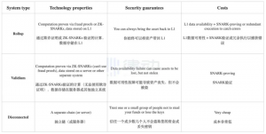
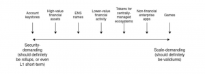
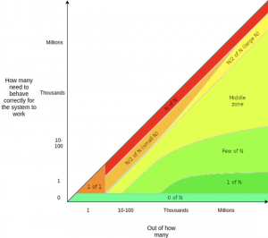

# Vitalik：信任模型

> 对于区块链应用来说，从来都不是完全的免信任化，但是某些应用确实比其他应用的免信任程度更高。

区块链应用最有价值的属性之一就是免信任 (trustlessness)，即应用能够以预期的方式保持运行而无需依赖特定参与者以特定形式行事，即使他们将来的相关利益可能产生变化并使其做出意料之外的举动。不同的系统采用的是不同的信任模型，为了更好地分析区块链协议，Vitalik 通过四个维度对不同系统的信任模型进行划分。

本课题旨在研究和评估不同信任模型的优势和适用场景，并将市面上常见系统的模型套用到 trust 模型评估系统中，分析各个系统的 trade-off 和原因。

## 一、什么是 trust 模型

对于区块链应用来说，从来都不是完全的免信任化（比如比特币需要相信至少一半算力的矿工是诚实的），但是某些应用确实比其他应用的免信任程度更高。如果我们想要朝着信任最小化的目标前进，就需要首先具备辨别信任程度的高低。

Vitalik 个人对 “信任” 的简单定义是：**信任就是对他人行为进行假设**，并在博客中将信任模型分解为以下几个维度：

- 你需要多少人按照你的预期行事？
- 模型基于的人数总量多大？
- 人们需要什么动机？他们需要是利他主义者，还是唯利是图者？他们需要避免协作吗？
- 如果违反了这些假设，系统会受到多严重的影响？

在疫情爆发前，你走在街上不会因为防止有人突然捅你一刀而刻意跟他人保持两米的距离，这就是一种信任：一是信任人们很少会失心疯，二是法制系统的维护者有很强的动机约束这种行为。

当你运行其他人写的一段代码时，你信任他们在编写代码时是诚实的 (无论是出于他们自己的良知或是维持声誉的经济利益)，或者至少存在足够多的人对代码进行检查以找到漏洞。

不亲自种粮食也是另一种信任，相信会有足够多的人为了获取收益耕种粮食并出售给你。你可以信任不同规模的群体，信任的类型也不尽相同。

Vitalik 在最新文章博客文章《Different types of layer 2s》中指出，Layer2 项目之间正在朝着更加异构的趋势发展，并且预测这种趋势会继续进行下去。文章提出了两个维度去看待 Layer2 项目：「取款回以太坊的安全性」维度，以及「无需信任地读取以太坊」维度，本质上也是出自对信任模型的考量。其中，「取款回以太坊的安全性」维度说的是，Rollup、validiums 和独立系统之间，由于不同技术的选择造成了不同的成本和安全性。

其次，技术与技术之间的杂交，造就了不同的技术光谱（例如，在 rollup 和 validium 之间的光谱）。每条光谱存在着更多的中间选项，项目会根据数据成本和自身需求，去进行选择处在光谱的什么位置。

## 二、模型的几种分类

### 1、信任范围

现在，我们先关注前两点进行拆分（需要多少人按照你的预期行事、模型基于的人数总量多大），可以得到下面有一个图表。绿色越深，表示该模型越健康。让我们对这几个种类进行详细分析：

- 1 of 1：整个系统只有一个参与者。如果这名参与者按照你预期的那样行事，系统就会 (才会) 正常运行。这就是传统的 “中心化” 模型，也是我们要超越的模型。
- N of N：“反乌托邦” 世界。系统中的所有参与者都要按照预期行事，系统才能正常运行，如果其中任何人失败，我们没有补救措施。
- N/2 of N：这是区块链的运作方式，如果大部分矿工 (或 PoS 验证者) 是诚实的，区块链就能正常运作。要注意的是，N 值越大，N/2 就越有价值。相比只由少量矿工/验证者控制的区块链，矿工/验证者广泛分布的网络更有意义。尽管如此，由于 51% 攻击的可能性，我们还是想在这种程度的安全性上更进一步。
- Few of N：在众多参与者中，只要有固定数量的小部分参与者按照预期行事，系统就能正常运行。数据可用性采样就当属其中。
- 1 of N：有很多参与者，只要其中至少有一个按照预期行事，系统就能正常运作。任何基于欺诈证明的系统都属于这一类，信任设置也是如此，尽管在这种情况下 N 值通常较小。请注意，我们确实希望 N 值尽可能大！
- 0 of N：系统无需依赖外部参与者即可正常运行。亲自验证区块就归为这一类。

尽管除 “0 of N” 之外的模型都有一定 “信任” 程度，但是这些模型之间存在巨大差异！相信特定的某个人 (或组织) 会按照预期行事，与相信随便一个人都会按照预期形式，是完全不同的情况。相比 “N/2 of N” 和 “1 of 1”，“1 of N” 与 “0 of N” 更相似。可能有人会觉得 “1 of N” 模型与 “1 of 1” 模型很像，因为这两种模型都依赖一名参与者，但实际上这两者十分迥异：在 “1 of N” 系统中，如果该名参与者突然消失或者黑化，大可以重新换一个参与者，但在 “1 of 1” 系统中我们别无他选。

### 2、激励模式

如果从激励部分去看，要促使参与者遵循预期，你所信任的参与者需要非常利他主义、轻微利他主义，还是说足够理性。我们可以得到：

- 默认情况下，“欺诈证明” (fraud proofs) 需要参与者具有轻微利他主义倾向，但其程度取决于计算的复杂性 (详见 “验证者困境”)，并且存在很多方式改进过程，使其更加理性。
- PoS 是基于负向激励（惩罚）的系统，比特币的 PoW 是基于正向激励（奖励）的系统。以太坊 PoS 使用两个关键要素来确保交易和出块正确：
  - 第一个要素是时不时地制作特殊的 “检查点区块（checkpoint blocks）”，其目的是向网络中的每一个人保证这个系统在不同时间的 “真相”。创建一个检查点需要以 “押金（stake）” 计算的 2/3 的多数同意，这样就能保证在该时间点，绝大多数的 “验证者（validator）” 都认可一个事实。
  - 第二个要素是惩罚给网络增加不确定性的用户，也就是所谓的 “罚没（slashing）”。举个例子，如果一个验证者创建了一条分叉链，或者给一条更老的分叉链投票（类似于 51% 攻击），那么 TA 的押金就会被罚没。验证者也会因为不活跃而被惩罚，但力度不会那么大。

### 3、故障后果

另一个重要的区别在于，如果你的信任假设被打破，对系统的破坏有多大？在区块链上，最常见的两种故障类型是活性故障（liveness failure）和安全性故障（safety failure）。活性故障就是你暂时无法进行操作（例如，提币、将交易打包进区块、读取链上数据）。安全性故障就是出现了系统想要预防的情况（例如，无效块被添加到区块链上）。

#### 3.1 活性故障

对于以太坊来说，PoS 升级后区块能够确认最终性，且一旦网络出现 Liveness failure 的情况（超过 4 个 epoch 而没有最终确定），可以启用 Inactivity leak 的紧急协议，为链恢复「最终性」创造所需的条件。

- 最终性需要以太币质押总量的 2/3 多数就 target&source 达成一致。如果占验证者总数超过 1/3 的验证者离线或未能提交正确的证明，则 2/3 的绝对多数不可能达成 finality。
- Inactivity leak 通过让不活跃验证者的权益金逐渐流失，直到他们控制的权益少于总权益的 1/3，从而允许剩余的活跃验证者可以确定链的最终性。无论不活跃验证者池有多大，剩余的活跃验证者最终将控制超过 2/3 的权益。

#### 3.2 安全性故障

对于安全性来说，当网络出现巨大故障时，是否可以采取分叉或回滚方式进行恢复，是比较重要的考量方式。对于 rollup 来说，从「无需信任地读取以太坊」维度，指的是「系统读取以太坊区块链的能力」和「系统在以太坊发生回滚时进行回滚的能力」，构成了选择 Layer2 的另一个维度。

- 系统读取以太坊区块链的能力：读取的是 finality 的区块，还是最新的区块；以及读取区块数据的速度。但存在一个问题，当以太坊发生 51% 攻击同一高度出现两个区块时，无法确定此时应该读哪一个区块。（因此需要考察回滚能力）
- 系统在以太坊发生回滚时进行回滚的能力：以太坊区块链发生回滚，顶层链本身是否发生回滚。

## 三、常见技术的 trust 假设

以下列举了一些区块链 layer 2 协议所采用的信任模型。我用 “small N” 来指代 layer 2 系统本身的参与者集合，“big N” 来指代区块链底层的参与者。我的假设是 layer 2 的社区总是小于底层区块链。另外，我使用的 “活性故障” 一词特指代币长时间无法提出的情况。无法使用系统但是能够几乎即时提款的情况不算作活性故障。

- Channels (包括状态通道、闪电网络等)：使用 “1 of 1” 信任模型来确保活性 (你的对手方可以暂时冻结你的资金，不过你可以通过将资金分散在多个通道中减少风险)，使用 “N/2 of big N” 模型来确保安全性 (有可能在 51% 攻击中失去资金)。
- Plasma (中心化运营者)：使用 “1 of 1” 信任模型来确保活性 (运营者可以暂时冻结你的资金)，“N/2 of big N” 模型来确保安全性 (有可能在 51% 攻击中失去资金)。
- Plasma（半去中心化运营方，如 DPOS）：使用 “N/2 of small N” 信任模型来确保活性，“N/2 of big N” 模型来确保安全性。
- Optimistic rollup：使用 “1 of 1” 或 “N/2 of small N” 信任模型来确保活性 (取决于运营者的类型)，“N/2 of big N” 模型来确保安全性。
- ZK rollup：使用 “1 of small N” 信任模型来确保活性 (如果运营者未能打包你的交易，你可以提款，如果运营者没有立即打包你的取款交易，就无法打包更多交易包，你可以在 rollup 系统中任何一个全节点的帮助下自行提款)；不存在安全故障风险。

## 总结

如果我们想要朝着信任最小化的目标前进，就需要首先具备辨别信任程度的高低。如果有人说某个系统 “依赖于信任机制”，那我们可以刨根问底！他们的意思是 “1 of 1” 模型、“1 of N” 模型还是 “N/2 of N” 模型？该系统需要参与者是利他主义还是理性主义？如果是利他主义，参与者的代价有多大？如果违反了假设，需要等待多久才能取回自己的资金？几个小时？几天？还是永远被冻结？明白这些问题后，我们可能对于是否采用该系统会有截然不同的答案。

## 原文参考

- 文中提及 Vitalik 原文：<https://vitalik.ca/general/2020/08/20/trust.html>
- 文中参考（保留原文给出的方向）：
  - <https://foresightnews.pro/article/detail/16210>
  - <https://hackmd.io/@vbuterin/zk_slides_20221010#/>
  - <https://twitter.com/whiskoy_eth/status/1719669296526475505>
  - <https://threadreaderapp.com/thread/1579764717975138305.html>
