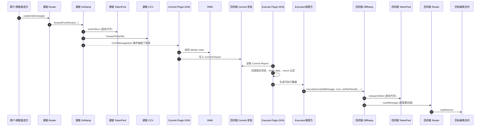
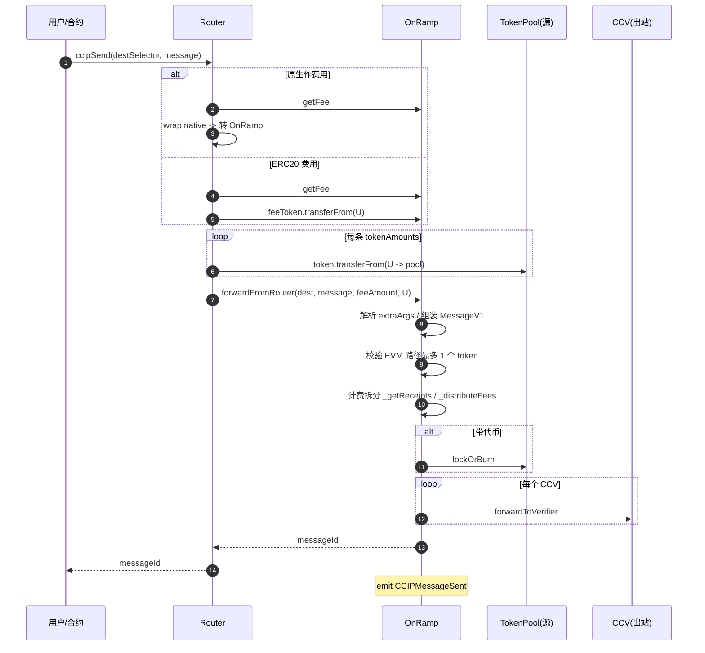
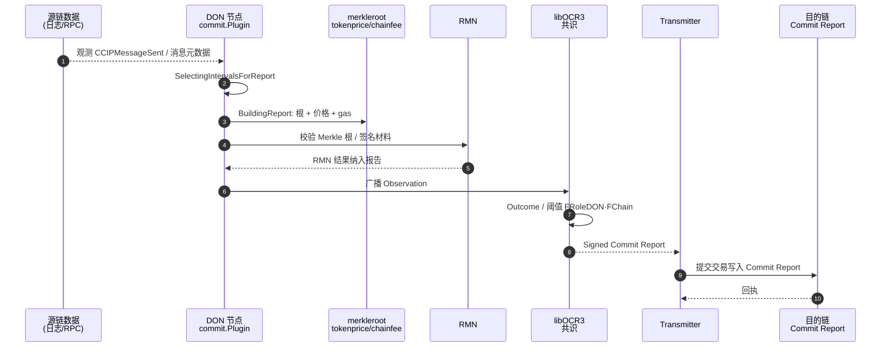
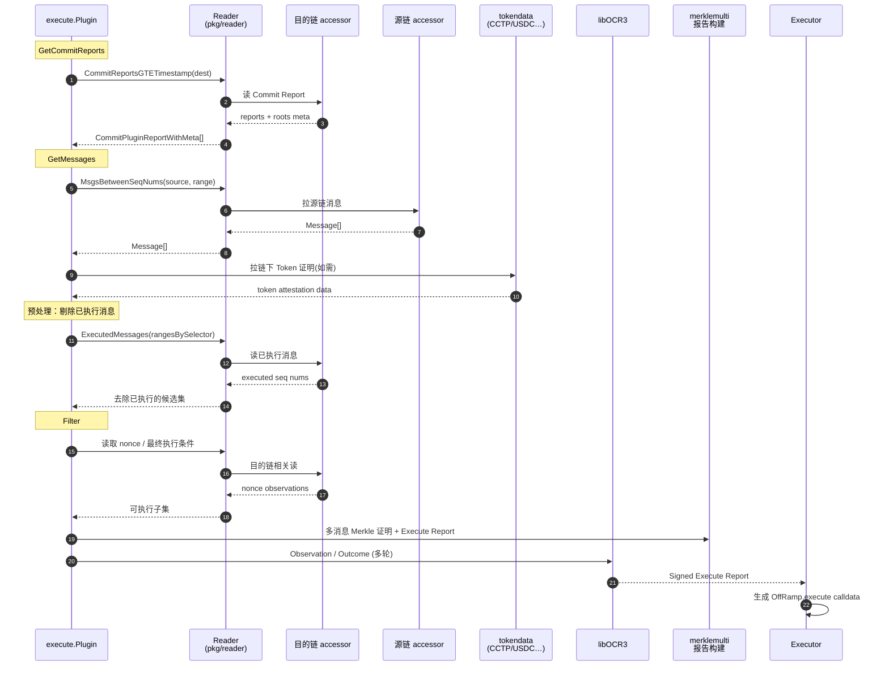
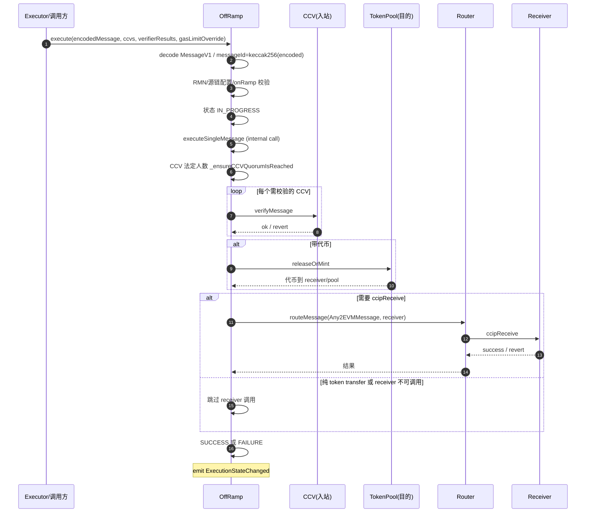

# CCIP 跨链消息四阶段说明

本文档描述 Chainlink CCIP 跨链消息从源链发送到目的链执行完毕的 **四个主要阶段**，每阶段包含 **ASCII 调用链** 与 **Mermaid 时序图**。

> 范围说明：本文以当前仓库中的 **EVM 主路径** 为准，重点覆盖 `Router`、`OnRamp`、`OffRamp`、`commit` 与 `execute` 插件。不同链族（如 Solana、Sui）在地址编码、执行参数和链特有数据上可能存在差异。

> 实现与术语依据本仓库：`docs/ccip_protocol.md`、`commit/README.md`、`execute/README.md`，以及 `chains/evm/contracts` 中 `Router` / `OnRamp` / `OffRamp`，`pkg/reader` 中的链上读接口。

## 目录

- [总览](#总览)
- [阶段 1：源链发送（T1）](#阶段-1源链发送t1)
- [阶段 2：Commit（T2）](#阶段-2committ2)
- [阶段 3：Execute（T3）](#阶段-3executet3)
- [阶段 4：目的链执行（T4）](#阶段-4目的链执行t4)

---

## 总览

| 阶段 | 名称 | 发生位置 | 摘要 |
|------|------|-----------|------|
| T1 | 源链发送 | 源链 EVM | 用户经 `Router` → `OnRamp`：计费、代币 lock/burn、CCV 出站、`CCIPMessageSent` |
| T2 | Commit | DON 链下 → 目的链 | Commit 插件共识 Merkle 根、RMN、价格等，写入目的链 **Commit Report** |
| T3 | Execute | DON 链下 | Execute 插件读 Commit、回源链拉消息与 Token 证明、过滤后组 Execute 报告 |
| T4 | 目的链执行 | 目的链 EVM | `OffRamp.execute` → CCV 校验 → release/mint → `Router.routeMessage` → `ccipReceive` |

**骨架记忆**：发送 → Commit 上链 → Execute 准备 → OffRamp 执行。

### 端到端总览图



---

## 阶段 1：源链发送（T1）

用户在源链发起跨链消息：`Router.ccipSend` 归集费用与代币后调用 `OnRamp.forwardFromRouter`，完成计费、代币池 lock/burn、各 CCV 的 `forwardToVerifier`，最终发出 `CCIPMessageSent`。

说明：

- `Router` 在转发代币时会遍历 `message.tokenAmounts`。
- 但当前 EVM `OnRamp` 实现要求 **每条消息最多只能带 1 个 token**；若 `tokenAmounts.length > 1`，`OnRamp` 会回滚。
- `CCIPMessageSent` 里的 `verifierBlobs` 是给链下 verifier 使用的中间材料，**不等于** 目的链执行时 `OffRamp.execute` 的 `verifierResults`。

### 关键源码路径

- `chains/evm/contracts/Router.sol`
  - `ccipSend(...)`
- `chains/evm/contracts/onRamp/OnRamp.sol`
  - `forwardFromRouter(...)`
  - `_lockOrBurnSingleToken(...)`
  - `_getReceipts(...)`
  - `_distributeFees(...)`
- `chains/evm/contracts/libraries/Client.sol`
  - `Client.EVM2AnyMessage`
- `chains/evm/contracts/libraries/MessageV1Codec.sol`
  - `MessageV1`
  - `_encodeMessageV1(...)`

### 调用链（ASCII）

```
User (EOA/合约)
  |  [可选] IERC20.approve(Router, amount)  // 费用币、过桥代币
  v
Router.ccipSend(destinationChainSelector, message)
  |  if message.feeToken == address(0):
  |       getFee(OnRamp) -> wrap native -> transfer wrapped native to OnRamp
  |  else:
  |       getFee(OnRamp) -> feeToken.transferFrom(user, OnRamp, fee)
  |  for i in tokenAmounts:
  |       token.transferFrom(user, sourcePool, amount)
  v
IEVM2AnyOnRampClient(OnRamp).forwardFromRouter(
    destinationChainSelector, message, feeTokenAmount, originalSender)
  |  OnRamp: RMN.isCursed(dest) ?
  |  OnRamp: _parseExtraArgsWithDefaults(...)
  |  OnRamp: 构造 MessageV1（含 seq、路由、CCV 列表等）
  |  OnRamp: 约束 EVM 路径最多 1 个 token
  |  OnRamp: _getReceipts / _distributeFees
  |  if tokenAmounts.length > 0:
  |       OnRamp: _lockOrBurnSingleToken -> TokenPool.lockOrBurn
  |  for each CCV:
  |       Resolver.getOutboundImplementation(...)
  |       ICrossChainVerifierV1.forwardToVerifier(...)
  v
emit CCIPMessageSent(destChainSelector, sender, messageId, encodedMessage, receipts, verifierBlobs)
return messageId -> Router -> User
```

### 时序图（Mermaid）



---

## 阶段 2：Commit（T2）

DON 上 **Commit 插件**（OCR3）观测源链消息，为各源链区间计算 **Merkle 根**，整合 **RMN** 校验与价格等数据，经 **libOCR3** 共识后由 Transmitter 将 **Commit Report** 写入目的链。链上读接口见 `pkg/reader` 中 `CommitReportsGTETimestamp`（经 `destChainAccessor`）。

说明：

- Commit report 主要承载的是 **消息元数据、区间与 Merkle 根**，而不是完整消息体。
- 完整消息与部分链下 token 证明会在 Execute 阶段的 `GetMessages` 中重新拉取。

### 关键源码路径

- `commit/README.md`
  - Commit 插件三阶段状态机
- `docs/ccip_protocol.md`
  - Commit / Execute 总体协议说明
- `commit/plugin.go`
  - Commit 插件入口
- `commit/merkleroot/`
  - Merkle root 相关逻辑
- `commit/merkleroot/rmn/`
  - RMN 交互与签名控制
- `commit/tokenprice/`
  - 价格更新相关逻辑
- `commit/chainfee/`
  - 链费用观测逻辑
- `pkg/types/ccipocr3/plugin_commit_types.go`
  - Commit report 类型别名入口
- `pkg/chainaccessor/default_accessor.go`
  - 目的链 Commit report 事件解析为 `CommitPluginReportWithMeta`

### 调用链（ASCII）

```
源链索引 / 节点 RPC / 日志
  v
各 DON 节点: commit.Plugin (OCR3)
  |-- State: SelectingIntervalsForReport
  |       -> 选定各源链消息序号区间 (intervals)
  |-- State: BuildingReport
  |       -> commit/merkleroot: 按区间算 Merkle 根
  |       -> commit/tokenprice: 代币价格观测
  |       -> commit/chainfee: gas / 费用相关观测
  |       -> commit/merkleroot/rmn: 向 RMN 查询/聚合签名
  |       -> commit/internal/builder: 组装 CommitPluginReport
  |-- State: WaitingForReportTransmission
  |       -> 确认目的链已接受上一笔再推进
  v
libOCR3: Observation -> Outcome -> SignedReport
  v
OCR Transmitter (链上提交者)
  v
目的链: Commit Report 写入
  (具体合约由 chain accessor 抽象；读侧: CommitReportsGTETimestamp)
```

### 时序图（Mermaid）



---

## 阶段 3：Execute（T3）

**Execute 插件**按状态机多轮运行：先在目的链读取 Commit，再在源链拉取区间内消息与链下 Token 证明，并结合目的链上的执行状态剔除已执行消息；随后在 `Filter` 阶段基于 **nonce** 等最终条件筛选可执行消息，构造 **merklemulti** 证明与 Execute 报告，OCR 共识后由 Executor 等生成 `OffRamp.execute` 的调用参数。

说明：

- `ExecutedMessages` 查询用于在报告选择前剔除已执行消息，这一步是 execute 插件的预处理。
- `Filter` 阶段本身的核心 observation 是 **nonce** 等最终执行条件，而不是 `ExecutedMessages` 本身。

### 关键源码路径

- `execute/README.md`
  - `GetCommitReports` / `GetMessages` / `Filter`
- `execute/plugin.go`
  - 已执行消息剔除
  - 各阶段串联
- `execute/outcome.go`
  - `Filter` 阶段按 nonce 做最终筛选
- `execute/report/`
  - Execute report builder
- `execute/tokendata/`
  - CCTP / USDC / LBTC 等链下 token data
- `pkg/reader/ccip.go`
  - `CommitReportsGTETimestamp(...)`
  - `MsgsBetweenSeqNums(...)`
  - `ExecutedMessages(...)`
- `pkg/types/ccipocr3/plugin_execute_types.go`
  - Execute report 类型别名入口

### 调用链（ASCII）

```
execute.Plugin (OCR3, 多轮状态机)
  |
  |-- Round 状态 GetCommitReports
  |       CCIPReader.CommitReportsGTETimestamp(ctx, dest, ts, confidence, limit)
  |            -> destChainAccessor.CommitReportsGTETimestamp
  |            <- []CommitPluginReportWithMeta
  |
  |-- Round 状态 GetMessages
  |       for each source in report:
  |            CCIPReader.MsgsBetweenSeqNums(source, seqNumRange)
  |            -> sourceChainAccessor.MsgsBetweenSeqNums(dest, range)
  |            <- []Message
  |       execute/tokendata/* : CCTP / USDC / LBTC 等 observer
  |
  |-- 预处理：剔除已执行消息
  |       CCIPReader.ExecutedMessages(rangesBySelector, confidence)
  |       -> destChainAccessor.ExecutedMessages(...)
  |       <- 已执行消息集合
  |
  |-- Round 状态 Filter
  |       目的链读数：nonce、执行顺序、是否可执行
  |       过滤未就绪消息
  |
  v
merklemulti: 为待执行消息构造证明
  v
execute/report: 组装 Execute Plugin Report
  v
libOCR3: 多轮 Observation -> Outcome -> SignedReport
  v
Executor / 运营服务: 解码报告 -> 构造 calldata
  (每消息: OffRamp.execute(encodedMessage, ccvs, verifierResults, gasLimitOverride))
```

### 时序图（Mermaid）



---

## 阶段 4：目的链执行（T4）

任意调用方（Executor、自动化或 EOA）调用 `OffRamp.execute`；合约解码消息、校验 RMN/配置/CCV 法定人数，完成 release/mint，并在满足条件时经 `Router.routeMessage` 调用接收方 `ccipReceive`。本仓库 EVM 中 `messageId = keccak256(encodedMessage)`。

说明：

- 并不是所有消息都会进入 `ccipReceive`。
- 以下情况会跳过 receiver 调用：
  - 纯 token transfer，且消息数据为空、gas limit 为 0；
  - receiver 不是合约；
  - receiver 是合约但不支持 `IAny2EVMMessageReceiver`。

### 关键源码路径

- `chains/evm/contracts/offRamp/OffRamp.sol`
  - `execute(...)`
  - `executeSingleMessage(...)`
  - `_ensureCCVQuorumIsReached(...)`
  - `_releaseOrMintSingleToken(...)`
  - `_callReceiver(...)`
  - `_isTokenOnlyTransfer(...)`
- `chains/evm/contracts/Router.sol`
  - `routeMessage(...)`
- `chains/evm/contracts/libraries/Client.sol`
  - `Client.Any2EVMMessage`

### 调用链（ASCII）

```
Executor / 任意调用方 (EOA、自动化服务)
  v
OffRamp.execute(encodedMessage, ccvs, verifierResults, gasLimitOverride)
  |-- MessageV1Codec._decodeMessageV1(encodedMessage)
  |-- messageId = keccak256(encodedMessage)
  |-- checks: RMN curse, source enabled, onRamp allowlist, offRamp==this, destSelector
  |-- s_executionStates[messageId]: UNTOUCHED | FAILURE 才继续
  |-- s_executionStates[messageId] = IN_PROGRESS
  v
OffRamp._callWithGasBuffer( executeSingleMessage(...) )
  v
OffRamp.executeSingleMessage (only self)
  |-- _ensureCCVQuorumIsReached(receiver, pool, lane CCVs)
  |-- for each CCV: Resolver.getInboundImplementation
  |       ICrossChainVerifierV1.verifyMessage(message, messageId, verifierResults[i])
  |-- if token: _releaseOrMintSingleToken -> TokenPool.releaseOrMint
  |-- if 需要 receiver 回调:
  |       _callReceiver -> Router.routeMessage(Any2EVMMessage, gas, receiver)
  v
Router.routeMessage
  |-- onlyOffRamp
  |-- CallWithExactGas -> receiver.ccipReceive(Any2EVMMessage)
  v
s_executionStates[messageId] = SUCCESS | FAILURE
emit ExecutionStateChanged
```

### 时序图（Mermaid）



---

## 常见误解

### 1. `messageId` 是什么时候确定的？

- 在当前 EVM 主路径里，`messageId` 在源链 `OnRamp.forwardFromRouter(...)` 中生成。
- 生成方式是：先把 `MessageV1` 编码成 `encodedMessage`，然后计算 `keccak256(encodedMessage)`。
- 到了目的链，`OffRamp.execute(...)` 会再次对传入的 `encodedMessage` 做同样的哈希，得到相同的 `messageId`。

### 2. `verifierBlobs` 和 `verifierResults` 是同一份数据吗？

- **不是。**
- `verifierBlobs` 出现在源链 `CCIPMessageSent` 事件里，是 `OnRamp` 调用各个 CCV 的 `forwardToVerifier(...)` 返回的链下辅助材料。
- `verifierResults` 出现在目的链 `OffRamp.execute(...)` 调用参数里，是执行方最终提交给目的链 CCV 的验证输入。
- 二者可能相关，但协议上 **不要求逐字节相等**，也不保证 1:1 原样透传。

### 3. `CommitReport` 里是不是有完整消息？

- **不是。**
- Commit report 主要包含：
  - `BlessedMerkleRoots`
  - `UnblessedMerkleRoots`
  - `PriceUpdates`
  - 以及链上元数据如 `Timestamp`、`BlockNum`
- 完整消息体不是在 Commit 阶段共识里传播的，而是在 Execute 的 `GetMessages` 阶段按区间从源链重新读取。

### 4. `messageId` 和 Commit report 是什么关系？

- `messageId` 是 **单条消息** 的唯一标识，来自 `encodedMessage` 哈希。
- `CommitReport` 不是消息本身，而是把某个区间里的多条消息聚合成 **Merkle root**。
- 执行阶段会根据 Commit report 给出的区间和根，回源链找到消息，再构造证明，最后在目的链执行单条 `encodedMessage`。

### 5. 是不是所有消息都会触发 `ccipReceive`？

- **不是。**
- 纯 token transfer 或 receiver 不满足调用条件时，`OffRamp` 只做 token release/mint，不会走 `Router.routeMessage -> ccipReceive`。

---

## 具体示例：源链发送 `HelloWorld`

下面给出一个简化但贴近真实实现的例子：源链用户发送一个 **不带代币** 的 `"HelloWorld"` 消息到目标链。

假设：

- 源链：Chain A，`sourceChainSelector = 1001`
- 目标链：Chain B，`destChainSelector = 2002`
- 源链用户地址：`0xSender`
- 目标链接收合约地址：`0xReceiver`
- 不传 token，`tokenAmounts = []`
- 使用 ERC20 费用币 `0xFeeToken`
- `gasLimit = 200_000`

### 阶段 1：用户构造并发送 `EVM2AnyMessage`

此阶段的核心输入结构是 `Client.EVM2AnyMessage`。

```solidity
Client.EVM2AnyMessage({
  receiver: abi.encode(0xReceiver),
  data: bytes("HelloWorld"),
  tokenAmounts: new Client.EVMTokenAmount[](0),
  feeToken: 0xFeeToken,
  extraArgs: ExtraArgsCodec._encodeGenericExtraArgsV3({
    ccvs: [0xUserCCV],
    ccvArgs: [hex"01"],
    blockConfirmations: 0,
    gasLimit: 200000,
    executor: address(0),
    executorArgs: "",
    tokenReceiver: "",
    tokenArgs: ""
  })
})
```

`Router.ccipSend(...)` 收费后，进入 `OnRamp.forwardFromRouter(...)`。在这个阶段，数据会被转换成 `MessageV1Codec.MessageV1`。

### 阶段 1 输出：源链 `MessageV1`

```text
MessageV1 {
  sourceChainSelector: 1001,
  destChainSelector: 2002,
  messageNumber: 42,                  // 该 lane 上新的序号
  executionGasLimit: <由 receipts 计算>,
  ccipReceiveGasLimit: 200000,
  finality: 0,
  ccvAndExecutorHash: keccak256(...),
  onRampAddress: abi.encode(sourceOnRamp),
  offRampAddress: rawBytes(destOffRamp),
  sender: abi.encode(0xSender),
  receiver: rawBytes(0xReceiver),
  destBlob: "",
  tokenTransfer: [],
  data: bytes("HelloWorld")
}
```

接着：

1. `MessageV1` 被编码成 `encodedMessage`
2. `messageId = keccak256(encodedMessage)`
3. 源链发出 `CCIPMessageSent`

这时链下系统能看到的典型事件形态可以简化理解为：

```text
CCIPMessageSent {
  destChainSelector: 2002,
  sender: 0xSender,
  messageId: 0x...abc,
  feeToken: 0xFeeToken,
  tokenAmountBeforeTokenPoolFees: 0,
  encodedMessage: 0x...,
  receipts: [...],
  verifierBlobs: [...]
}
```

### 阶段 2：Commit 插件把消息聚合进 Commit report

Commit 插件不会把 `"HelloWorld"` 原文直接放进 report，而是把它所在的消息区间聚合成 Merkle root。

假设这条消息位于区间 `[42, 42]`，那么目标链上被读取出来的 commit report 结构可简化为：

```text
CommitPluginReportWithMeta {
  Report: CommitPluginReport {
    BlessedMerkleRoots: [
      {
        ChainSel: 1001,
        OnRampAddress: <source onRamp>,
        SeqNumsRange: [42, 42],
        MerkleRoot: 0xroot...
      }
    ],
    UnblessedMerkleRoots: [],
    PriceUpdates: { ... }
  },
  Timestamp: <commit block timestamp>,
  BlockNum: <commit block number>
}
```

这一阶段处理的是：

- 消息区间
- Merkle root
- 价格更新
- RMN 祝福 / 未祝福状态

而不是完整的 `HelloWorld` 文本。

### 阶段 3：Execute 插件重新拉取消息并构造执行报告

Execute 插件先读到上面的 commit report，再按区间 `[42, 42]` 回源链读取完整消息。

此时它处理的消息数据可简化为：

```text
CommitData {
  SourceChain: 1001,
  SequenceNumberRange: [42, 42],
  Timestamp: <from commit report>,
  BlockNum: <from commit report>,
  Messages: [
    {
      Header: {
        SequenceNumber: 42,
        MessageID: 0x...abc
      },
      EncodedMessage: 0x...,   // 对应 MessageV1 编码
      Data: "HelloWorld"
    }
  ],
  TokenData: []
}
```

随后在 execute 的 `Filter` 阶段：

- 检查该消息是否已执行
- 检查 ordered execution 所需 nonce 等条件
- 选择这条消息进入本次执行批次

最终构造的执行输入可简化理解为：

```text
Execute batch item {
  encodedMessage: 0x...,          // 还是那份 MessageV1 编码
  ccvs: [0xDestVerifier],
  verifierResults: [0x...],
  gasLimitOverride: 0
}
```

### 阶段 4：目标链 `OffRamp.execute(...)`

执行方调用：

```solidity
offRamp.execute(
  encodedMessage,
  ccvs,
  verifierResults,
  0
);
```

`OffRamp` 处理过程如下：

1. `decodeMessageV1(encodedMessage)`
2. 重新计算 `messageId = keccak256(encodedMessage)`，得到同一个 `0x...abc`
3. 校验：
   - 源链 lane 是否启用
   - `onRampAddress` 是否在 allowlist
   - `offRampAddress` 是否就是当前合约
   - CCV 法定人数是否满足
4. 因为 `tokenTransfer = []`，所以不会走 `releaseOrMint`
5. 因为这是一条普通消息，不是 token-only transfer，所以会进入：
   - `Router.routeMessage(...)`
   - `receiver.ccipReceive(Any2EVMMessage)`

此时传给目标接收合约的结构是 `Client.Any2EVMMessage`：

```solidity
Client.Any2EVMMessage({
  messageId: 0x...abc,
  sourceChainSelector: 1001,
  sender: abi.encode(0xSender),
  data: bytes("HelloWorld"),
  destTokenAmounts: []
})
```

目标链应用侧看到的，就是来自源链发送方 `0xSender` 的 `"HelloWorld"` 数据载荷。

### 这个示例在四阶段中的对应关系

| 阶段 | 处理者 | 处理的核心数据结构 |
|------|--------|-------------------|
| T1 源链发送 | `Router` / `OnRamp` | `Client.EVM2AnyMessage` → `MessageV1` → `CCIPMessageSent` |
| T2 Commit | `commit.Plugin` | `CommitPluginReport` / `CommitPluginReportWithMeta` |
| T3 Execute | `execute.Plugin` | `CommitData`、源链消息、nonce observations、execute report |
| T4 目标链执行 | `OffRamp` / `Router` / receiver | `encodedMessage` → `MessageV1` → `Client.Any2EVMMessage` |

---

## 相关代码与文档路径

| 内容 | 路径 |
|------|------|
| 协议总述 | `docs/ccip_protocol.md` |
| Commit 插件状态机 | `commit/README.md` |
| Execute 插件状态机 | `execute/README.md` |
| 共识与 Role DON | `docs/consensus.md` |
| Router / OnRamp / OffRamp | `chains/evm/contracts/Router.sol`, `onRamp/OnRamp.sol`, `offRamp/OffRamp.sol` |
| 链上读接口 | `pkg/reader/ccip.go`, `pkg/reader/ccip_interface.go` |
