# LayerZero v2 协议概述与架构（出版版）

- 作者：Roman Yarlykov
- 译写整理：AI 辅助整理
- 原文发布日期：2024 年 11 月 28 日
- 原文地址：<https://metalamp.io/magazine/article/overview-and-architecture-of-the-layerzero-v2-protocol>


## 摘要

LayerZero v2 不是一条独立区块链，也不是传统意义上的跨链桥。更准确地说，它是一套面向跨链消息传递的数据传输协议。它不仅负责把消息从源链送到目标链，还定义了消息在传输过程中的验证、计费与执行机制。

LayerZero v2 的设计重点有三点。第一，它把“消息通道本身的可靠性”视为协议内建能力，而不是完全交给外部验证者来保证。第二，它把验证层与执行层明确拆开，从而降低安全关键代码的复杂度。第三，它允许每个应用按需组合自己的安全栈，而不是被迫接受统一的单体安全模型。

本文在原文基础上进行了正式化整理，重点介绍 LayerZero v2 的基本原则、核心模块、消息路径、安全栈设计、Gas 计价方式，以及协议提供的主要设计模式。

## 1. LayerZero 是什么

LayerZero 是一个不可变、抗审查、无许可的协议。它允许任意区块链用户将消息发送到受支持的目标网络，并在目标网络上完成验证与执行。

从定位上看，LayerZero 不是“桥”本身，而是跨链消息传递的底层协议。它试图解决的问题，不是单纯把资产从一条链搬到另一条链，而是建立一条具备统一语义、可定制安全性的跨链通信通道。

LayerZero Labs CEO Brian Pellegrino 曾强调，LayerZero 不应被理解为一种跨链消息标准，而更应被理解为一种数据传输协议。消息只是数据的载体；协议真正提供的是一整套关于“如何传输、如何验证、如何执行”的基础设施。

从更广义的互操作性问题出发，LayerZero v2 给出的回答是：通过统一消息语义、模块化安全栈，以及验证与执行分层，将跨链通信做成一套可复用、可扩展的通用能力。

这里所谓互操作性（interoperability），是指一个系统在接口开放的前提下，能够与其他系统交互并协同运行，而不需要额外的访问限制或实现限制。

> 进一步阅读：[Omnichain vs Multichain vs CrossChain: What Are They?](https://hackernoon.com/omnichain-vs-multichain-vs-crosschain-what-are-they)

简单区分几个常见概念：

- `cross-chain` 关注两条链之间如何通过桥来交互。
- `multichain` 指同一个应用部署在多条链上。
- `omnichain` 更强调在更底层建立统一的消息语义和交互抽象，使不同链上的应用能在同一套机制下通信。

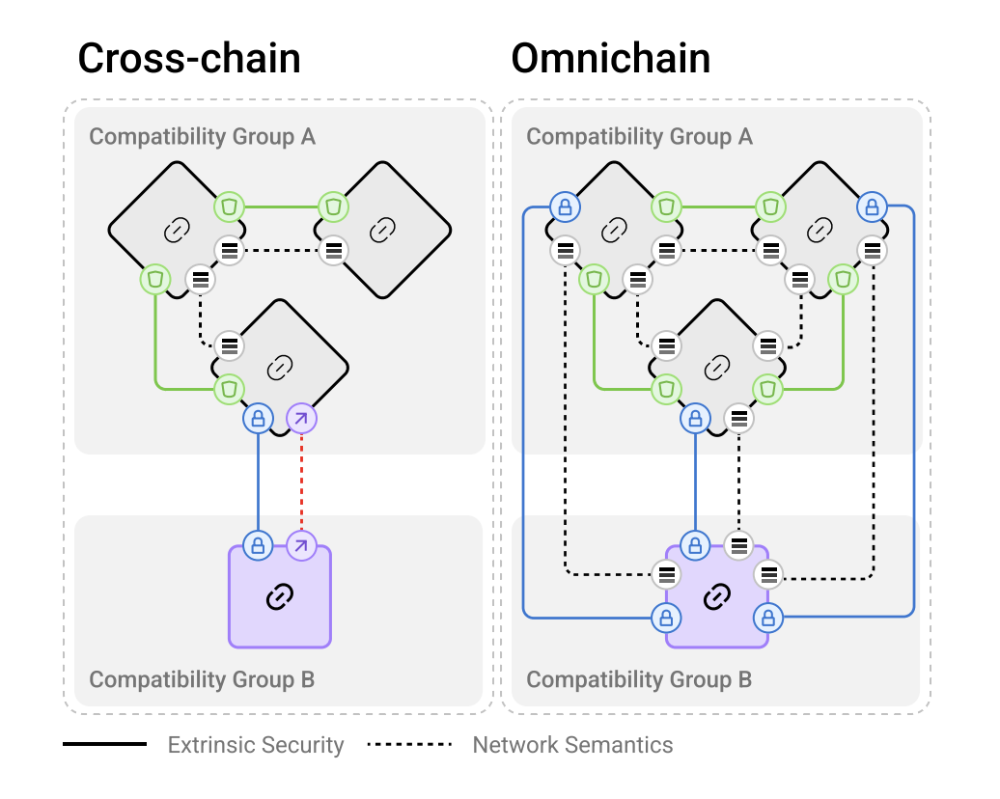

*图 1：Cross-chain 与 Omnichain 的区别。来源：LayerZero v2 白皮书。*

在 cross-chain 模式下，链与链之间通常通过一座座独立的桥分别连接。每新增一条链，连接关系和安全集成复杂度都会随之上升。而在 omnichain 模式下，链之间通过统一语义互通，消息接口可以标准化，但每条连接的安全配置仍然可以单独调整。

## 2. 核心原则

LayerZero v2 的设计建立在两个核心原则之上：安全性与通用语义。

### 2.1 安全性

LayerZero 将安全拆分为两层：内部安全（internal security）和外部安全（external security）。

内部安全关注的是消息通道本身必须满足哪些不变量。原文强调了三个关键性质：

1. `Lossless`：消息在传输过程中不能丢失、不能被篡改。
2. `Exactly-once`：同一条消息只能被处理一次，不能被重放。
3. `Eventual delivery`：即使中途出现临时故障，消息最终仍应送达。

外部安全则主要指签名算法、验证网络、验证逻辑等内容。与内部安全不同，外部安全是可以按应用需求灵活组合和替换的。

从协议完整性的角度，LayerZero 进一步把问题拆成两类：传输通道的完整性，以及消息数据本身的完整性。这两类问题都同时涉及正确性（validity）与活性（liveness）。内部安全负责前者，外部安全负责后者。

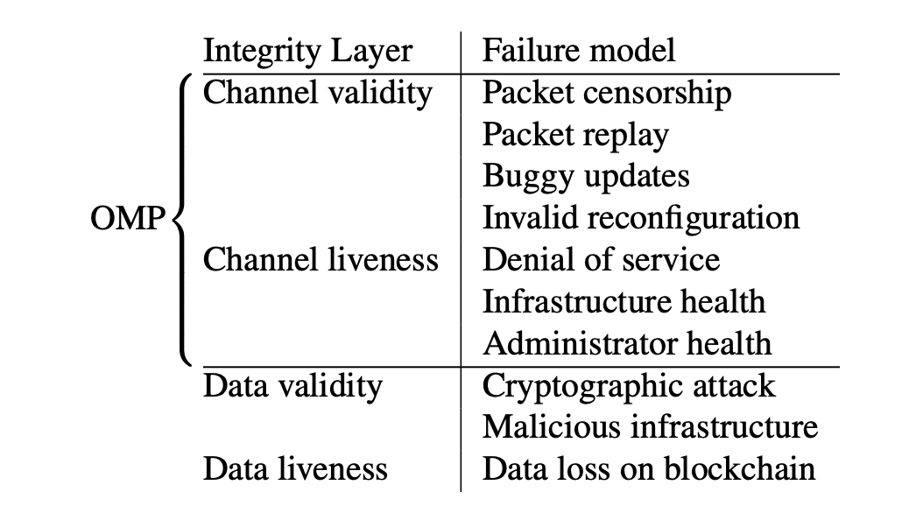

*图 2：协议完整性的关键维度。来源：LayerZero v2 白皮书。*

这些机制共同构成一个模块化安全栈。每个 OApp 都可以单独配置自己的安全栈，而无需依赖整套协议共享同一种安全模型。

LayerZero 在实现上采用“不可变代码”的策略。模块不会被原地修改，版本升级通过发布新模块完成，旧版本继续存在。这种做法的目的，是把升级影响尽量限定在单个应用自己的配置范围内，降低系统性风险。

### 2.2 通用语义

如果一套协议想支持任意区块链，就不能建立在某条链特有的执行语义之上。换句话说，协议底层必须足够通用，才能让跨链交互在不同链上保持一致。

LayerZero 所说的通用语义，主要包含两层含义：

- **执行语义**：OApp 的业务逻辑应尽量不依赖底层链的特殊行为。
- **接口统一**：不同链之间应采用统一的消息发送接口，而不是每接入一条链就重新适配一套交互逻辑。

缺少统一接口和统一语义，会显著抬高多链应用的开发成本。LayerZero 的重要价值之一，就是尽可能把这些分散的链差异收敛到一套统一抽象之中。

## 3. 总体架构

LayerZero 的目标可以概括为一句话：把一条消息可靠地从一条链送到另一条链。消息本身由两部分组成，一部分是待传输的数据负载（payload），另一部分是与之对应的路由信息。

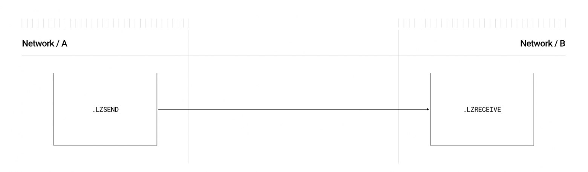

*图 3：消息传输的高层示意图。来源：LayerZero 文档。*

### 3.1 Endpoint

整个流程从源链上的 OApp 开始，到目标链上的 OApp 结束。对于 OApp 来说，最直接的交互对象是智能合约 [Endpoint](https://github.com/LayerZero-Labs/LayerZero-v2/blob/main/packages/layerzero-v2/evm/protocol/contracts/EndpointV2.sol)。

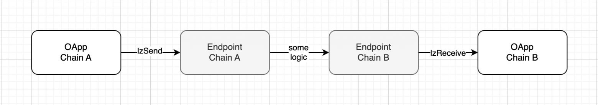

*图 4：与 Endpoint 的交互方式。*

Endpoint 负责处理入站和出站消息。消息在传输过程中会被封装为 packet。一个 packet 分为两部分：

- `header`：路由信息与服务字段
- `body`：真正的消息内容

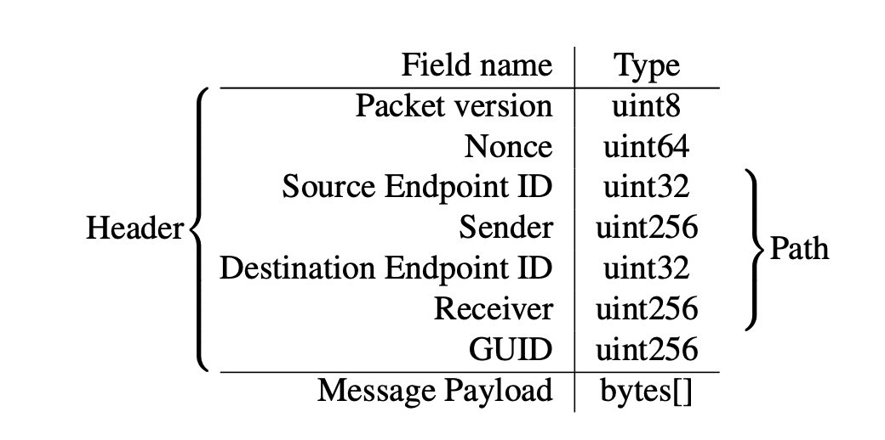

*图 5：Packet 结构。来源：LayerZero v2 白皮书。*

Endpoint 的主要职责包括：

1. 收取消息发送费用，支持链原生币或 `lzToken`
2. 构造 packet，包括分配 `nonce`、生成 `GUID`、完成序列化
3. 发出 `PacketSent` 事件
4. 校验入站 packet
5. 调用 `lzReceive` 完成目标链投递
6. 维护消息通道的正确处理与活性

`GUID` 的计算方式如下：

```solidity
struct Packet {
    uint64 nonce; // 唯一交易序号，严格递增
    uint32 srcEid; // 源网络标识
    address sender; // 发送方地址
    uint32 dstEid; // 目标网络标识
    bytes32 receiver; // 接收方地址
    bytes32 guid; // GUID
    bytes message; // 消息体
}
```

其中，`GUID = keccak256(nonce, srcId, sender, dstId, receiver)`。这里的 `srcId` 与 `dstId` 使用的是网络标识符，因为并不是所有区块链都具备统一意义上的 `chainId`。

### 3.2 无损消息通道

Endpoint 的关键职责之一，是保证消息通道本身可靠。为此，消息通道不仅要做到无损传输，还要满足 [`MessagingChannel`](https://github.com/LayerZero-Labs/LayerZero-v2/blob/7aebbd7c79b2dc818f7bb054aed2405ca076b9d6/packages/layerzero-v2/evm/protocol/contracts/MessagingChannel.sol) 定义的顺序约束。

每条消息都有一个唯一且递增的 `nonce`。LayerZero 允许消息乱序投递，但不允许破坏“更早的消息必须最终被处理到”的基本约束。这里引入了 `lazyInboundNonce`，表示“截至当前，所有更早消息都已被处理或显式跳过”的最大 nonce。

只有当 `lazyInboundNonce` 与当前 nonce 之间的所有 packet 都完成验证后，当前 packet 才允许执行。

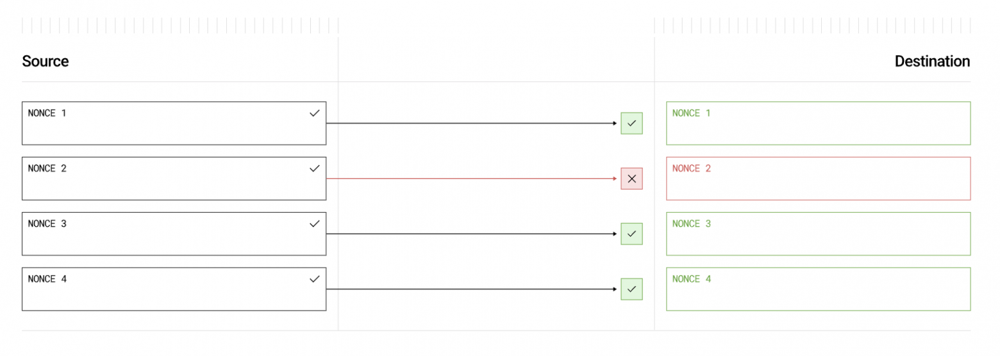

*图 6：乱序 packet 投递。来源：LayerZero v2 白皮书。*

在这一机制下，验证顺序与执行顺序并不完全相同。只要一条 packet 已经完成验证，它就可能在更早的某条 packet 执行失败后继续执行。必要时，系统也可以配置为严格顺序执行。

围绕 nonce 管理，协议还提供了 `skip`、`clear`、`nilify`、`burn` 等函数，用于跳过、作废或清理异常消息。

### 3.3 MessageLib

[MessageLib](https://github.com/LayerZero-Labs/LayerZero-v2/blob/main/packages/layerzero-v2/evm/messagelib/contracts/SendLibBaseE2.sol) 是 LayerZero 外部安全的核心组件。每个 OApp 都需要指定自己使用的消息库。如果没有显式配置，则会使用默认库，例如 ULN。

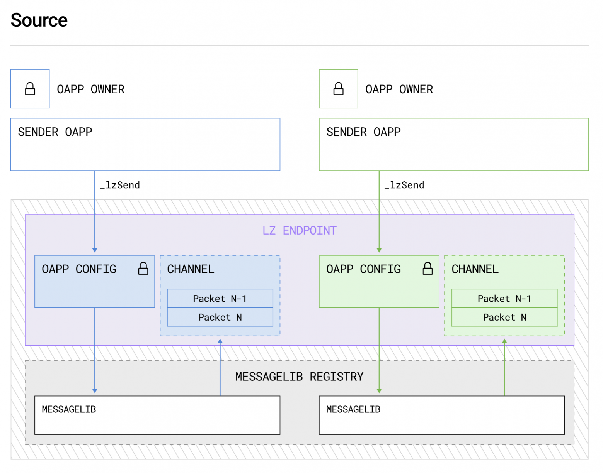

*图 7：通过 MessageLib 处理消息的流程。来源：LayerZero 文档。*

每个 `MessageLib` 都可以拥有自己的验证逻辑，只要遵守协议接口 [`ISendLib`](https://github.com/LayerZero-Labs/LayerZero-v2/blob/main/packages/layerzero-v2/evm/protocol/contracts/interfaces/ISendLib.sol)。这使得 LayerZero 不必依赖单一验证机制。

`MessageLib` 的核心职责，是在消息发送和接收过程中，检查 packet 是否满足 OApp 配置的外部安全要求。

那些不属于安全关键路径的能力，则由 executor 承担。这种拆分的直接结果，是 `MessageLib` 可以保持足够精简，而协议又能通过 executor 扩展更多功能。

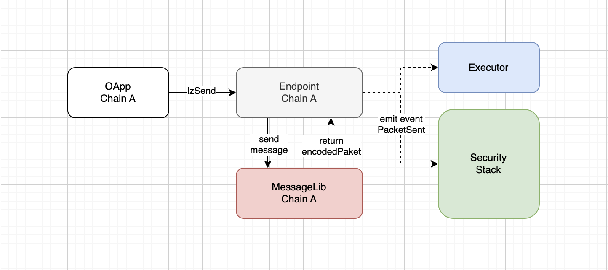

*图 8：源网络中的 MessageLib 交互。*

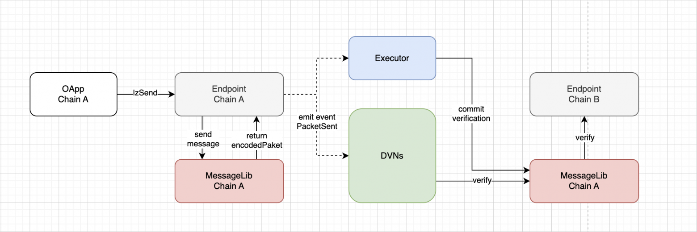

*图 9：目标网络中的 MessageLib 交互。*

### 3.4 库版本与迁移

一旦某个库被加入 `MessageLib Registry`，任何人都不能修改或删除它，包括 LayerZero 管理员。注册表采用 append-only 模式，只允许新增库和新增版本。

每个 `MessageLib` 都有唯一 ID 和版本号，格式为 `major.minor`。只有当两个 Endpoint 使用相同主版本的 `MessageLib` 时，消息才能在它们之间传输。

- 主版本决定 packet 编码与解码的兼容性
- 次版本用于 bug 修复和不破坏兼容性的更新

LayerZero 还把 packet 版本与特定 `MessageLib` 版本绑定起来，使 DVN 在目标链验证 packet 时，可以明确应该调用哪个版本的消息库。

当前 ULN 的版本如下：

```solidity
function version() external pure override returns (uint64 major, uint8 minor, uint8 endpointVersion) {
    return (3, 0, 2);
}
```

不同主版本之间的迁移采用渐进式策略，以降低升级风险，并支持异步迁移流程。

## 4. 安全栈

LayerZero 的安全栈由 DVN、`MessageLib` 和 OApp 配置共同组成。其中，DVN 是最关键的部分。

### 4.1 DVN

DVN（Decentralized Verifier Networks，去中心化验证网络）可以理解为一组验证者组成的网络。它们通过分布式共识，从源链读取 packet 哈希，并对其进行确认。

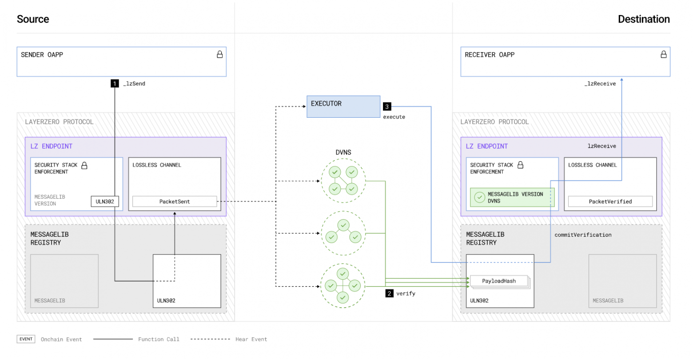

*图 10：DVN 参与的 packet 发送流程。来源：LayerZero 文档。*

每个 OApp 都可以自己定义安全栈。这个安全栈可以包含：

- 若干必选 DVN
- 若干可选 DVN
- 一个可选阈值

只有当所有必选 DVN 都确认 `payloadHash`，且可选 DVN 达到设定阈值后，这条 packet 才会被视为验证通过。

DVN 可以包含链上组件、链下组件，或者两者混合。其实现方式也可以结合 ZKP、侧链或原生区块链等不同路线，因此具备较高灵活性。

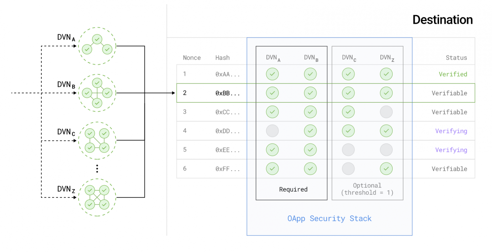

*图 11：DVN 验证 packet 的过程。来源：LayerZero 文档。*

这种设计的一个重要优点在于：即便现有 DVN 因软件故障、安全事件或治理问题失效，OApp 开发者仍可以自行部署新的 DVN，继续维持系统运行。

### 4.2 Ultra Light Node

**Ultra Light Node（ULN）** 是 LayerZero 每次部署都会自带的基础消息库，也是默认的 `MessageLib`。ULN 采用可定制的双层仲裁系统，最多支持 `254` 个 DVN。

ULN 只实现验证所需的最小功能集，因此适配范围很广。对于使用 ULN 的 OApp，其安全栈通常包含必选 DVN、可选 DVN 与阈值 `OptionalThreshold`。

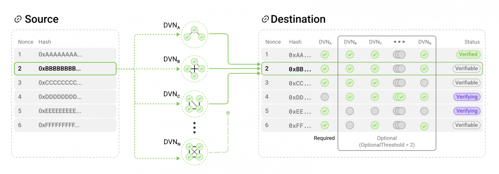

*图 12：ULN 中 DVN 工作示例。来源：白皮书。*

一条 packet 想通过验证，必须满足：

- 所有必选 DVN 都签署 payload hash
- 可选 DVN 中至少有 `OptionalThreshold` 个签署

原文示例中，`DVN_A` 具有否决权，而 `DVN_B`、`DVN_C` 等则构成可选验证者集合。

### 4.3 Executor

LayerZero 把验证和执行拆开，部分原因就在于控制安全关键代码的复杂度。凡是不属于安全关键路径的逻辑，都被放入独立组件，即 **executor**。

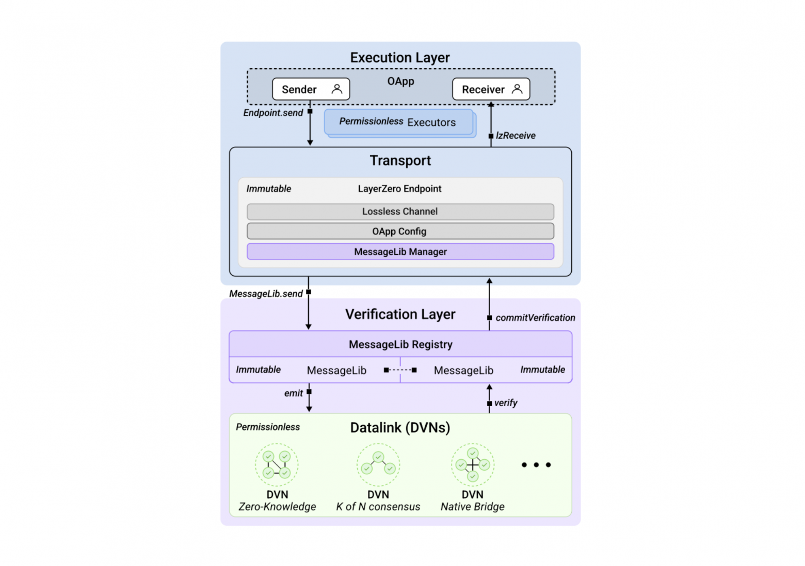

*图 13：执行层与安全层分离。来源：白皮书。*

这种设计有两个直接效果：

1. 安全关键代码更少，扩展功能时不必频繁改动验证层
2. 即便 executor 出现故障，也不会破坏消息通道的验证正确性

当 OApp 发送消息时，会把外部执行者（如 executor、DVN）及其参数编码到 `Message Options` 中，由 `MessageLib` 解析。executor 会在 packet 验证完成之后再执行对应动作。

一旦安全栈完成验证，任何愿意支付 gas 的参与者都可以在无额外权限的前提下执行消息。这意味着当 executor 故障时，最终用户甚至可以手动推动流程恢复。

## 5. 消息的完整路径

把上述模块放到一条完整路径里，消息处理流程如下：

1. 源链上的 OApp 调用 Endpoint 的 `lzSend`
2. Endpoint 构造 packet，分配 nonce 和 GUID，并把 packet 发送给配置好的 `MessageLib`
3. 消息库计算费用并返回 Endpoint，随后 Endpoint 触发 `PacketSent`
4. DVN 监听该事件，在目标链上验证 packet
5. 验证通过后，Executor 调用 `commitVerification`
6. Endpoint 在目标链校验 nonce
7. Executor 调用 `lzReceive` 完成消息投递
8. 若存在 `lzCompose` 配置，则继续执行后续组合调用

```solidity
event PacketSent(bytes encodedPayload, bytes options, address sendLibrary);
```

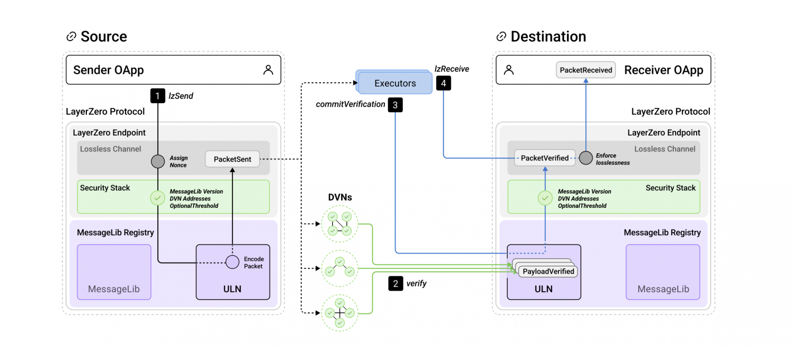

*图 14：从源链到目标链的 packet 投递流程。来源：白皮书。*

## 6. Gas 计价

跨链消息的 Gas 估算一直是复杂环节。LayerZero 把成本大致拆成四类：

1. 源链上的初始交易成本
2. 安全栈（DVN）的服务费用
3. Executor 的服务费用
4. 目标链的实际执行成本，以及必要时购买目标链原生代币的费用

最难估的是最后一项。源链无法直接知道目标链当时的状态，因此难以准确模拟目标链交易的真实 Gas 消耗。再加上不同链的原生代币与 Gas Price 不同，计价会进一步复杂化。

因此，开发者需要在发送消息之前预估目标链上 `_lzReceive` 可能消耗的 Gas，并把这个值编码进 options。若还涉及 `lzCompose`，则需要分别配置额外 Gas。

```solidity
// addExecutorLzReceiveOption(GAS_LIMIT, MSG_VALUE)
bytes memory options = OptionsBuilder.newOptions().addExecutorLzReceiveOption(50000, 0);
```

Endpoint 提供了 `quote` 接口，用于估算发送成本：

```solidity
function quote(MessagingParams calldata _params, address _sender) external view returns (MessagingFee memory);
```

其返回值中既可能包含原生币费用，也可能包含 `lzToken` 费用。

```solidity
struct MessagingParams {
    uint32 dstEid;
    bytes32 receiver;
    bytes message;
    bytes options;
    bool payInLzToken;
}

struct MessagingFee {
    uint256 nativeFee;
    uint256 lzTokenFee;
}
```

原文还给出了一个从 Ethereum 发送消息到 Polygon 的估算案例：


*图 15：Gas 计算示例。*

作者实际测试时，消息从 Arbitrum 发往 Polygon 的费用大致如下：

- Arbitrum 上的交易手续费：`$0.009`
- 预付给 Polygon 的 Gas：`$0.0555`
- 两个 DVN 的服务费：`$0.0025`
- Polygon 执行交易本身的成本：约 `$0.001`
- 其余部分归 Executor：约 `$0.053`

对应总成本约为 `$0.0645`。

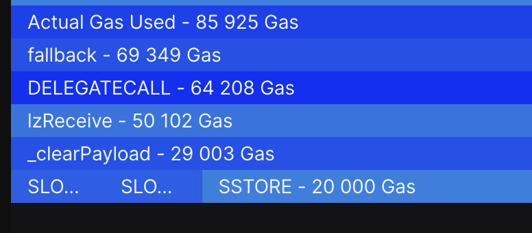

*图 16：Tenderly 面板示例。来源：dashboard.tenderly.co。*

## 7. 协议能力与设计模式

LayerZero 默认提供三类核心 OApp 标准：

1. **OApp**：统一的跨链消息收发接口
2. **OFT**：面向 ERC20 的全链代币标准
3. **ONFT**：面向 ERC721 的全链 NFT 标准

其中，OFT 支持将同一个代币供应量在不同链之间迁移。默认方案采用 `burn/mint`；对于已有代币，也可通过 `OFTAdapter` 采用 `lock/mint` 与 `burn/unlock` 方案。

在此基础上，LayerZero 还提供了几种典型设计模式：

### 7.1 ABA

`ABA` 是指消息从链 `A` 发到链 `B`，再从 `B` 返回 `A`。它常用于条件式执行、跨链认证和跨链取数。

### 7.2 Batch Send

`Batch Send` 是把一条消息同时发往多个目标链。

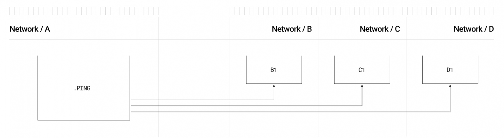

*图 17：单个 packet 发送到多个网络的流程。来源：LayerZero 文档。*

### 7.3 Composed

`Composed` 模式通过 `lzReceive` 与 `lzCompose` 的组合，支持把一条跨链消息拆成多步交易，尤其适合不支持 EVM 式多调用语义的链。

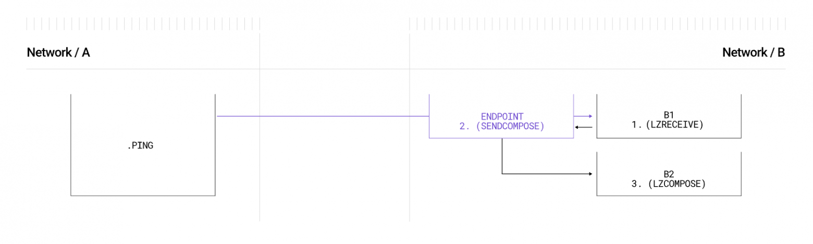

*图 18：`lzReceive` 与 `lzCompose` 的顺序调用。来源：LayerZero 文档。*

### 7.4 Composed ABA

`Composed ABA` 是多种模式的组合，可形成 `A -> B1 -> B2 -> A` 或 `A -> B1 -> B2 -> C` 等更复杂的调用路径。

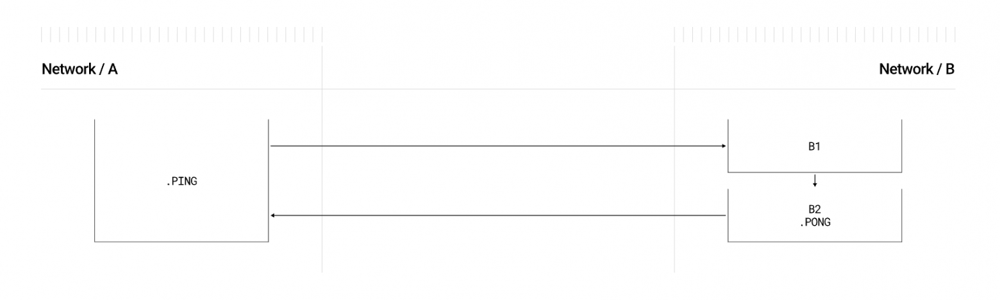

*图 19：Composed ABA 执行示意图。来源：LayerZero 文档。*

### 7.5 Message Ordering 与 Rate Limit

- `Message Ordering`：允许在不破坏验证顺序的前提下异步执行，必要时可切换为严格顺序模式
- `Rate Limit`：对消息或代币传输流量做限制

### 7.6 Token Bridging

若目标是构建经典的代币桥，通常更推荐直接使用 OFT 或 ONFT 标准，而不是从零设计跨链代币传输逻辑。

## 8. 结语

LayerZero v2 的核心价值，不在于“它是不是桥”，而在于它试图把跨链消息传递做成一套通用基础设施。它通过内建消息通道约束、模块化安全栈，以及验证与执行分层，为应用提供了一条可配置、可扩展、相对稳健的跨链通信路径。

这套设计并不轻量。灵活性越高，配置与工程复杂度通常也越高。对于大型全链应用来说，如何选择 DVN、如何设置阈值、如何处理执行恢复，都会成为真正的系统设计问题。

但如果只是从协议能力本身出发，LayerZero v2 已经提供了一套足够完整的模块化框架：可以传消息，可以传代币，可以组合执行，也可以自定义安全模型。它更像跨链世界的一层通用消息总线，而不是一个单用途产品。

## 参考资料

- [Whitepaper: LayerZero v2](https://layerzero.network/publications/LayerZero_Whitepaper_V2.1.0.pdf)
- [Docs: LayerZero v2](https://docs.layerzero.network/v2)
- [Github: LayerZero v2](https://github.com/LayerZero-Labs/LayerZero-v2)
- [Article: Omnichain vs Multichain vs CrossChain: What Are They?](https://hackernoon.com/omnichain-vs-multichain-vs-crosschain-what-are-they)
- [Video: Intro to LayerZero V2 & Omnichain Apps for Beginners](https://www.youtube.com/watch?v=W0J_Jz76apE)
