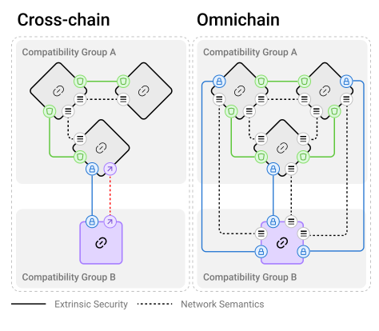
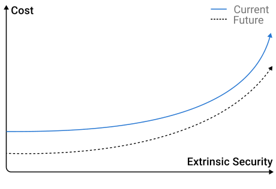
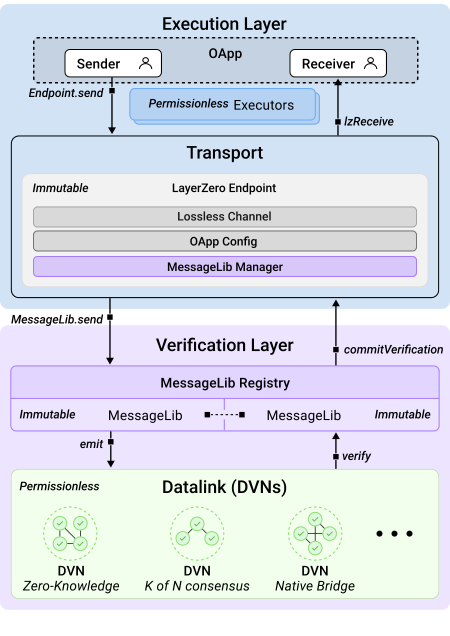
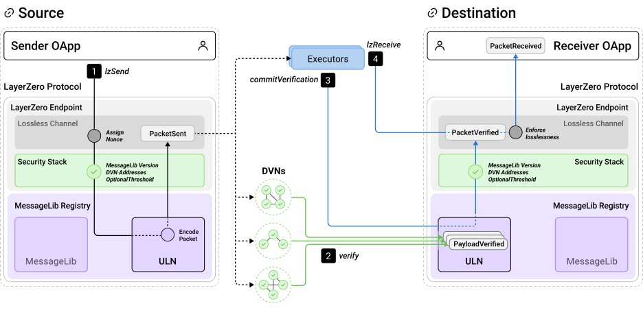
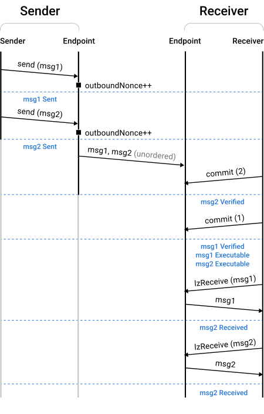
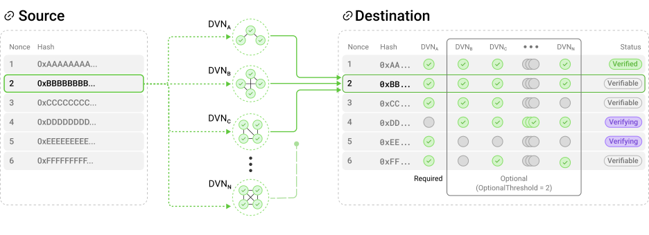
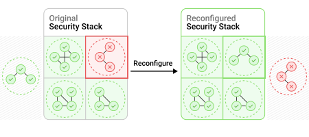
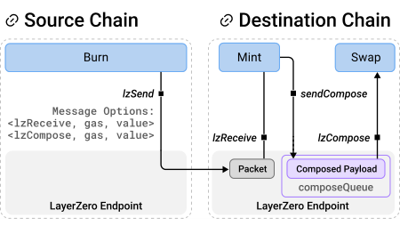
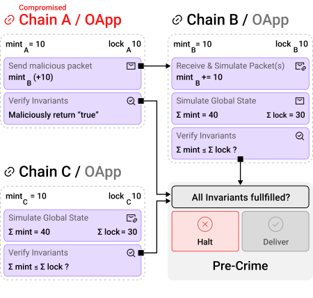

# LayerZero 白皮书中文译文

> 说明：本译文基于你提供的 PDF 文档整理。文件下载名包含 `V2.1.0`，但正文首页标注为 `Version 1.1: Fix typos. (2024-01-23)`。以下以 PDF 实际正文内容为准进行翻译。

## 标题与摘要

## LayerZero

Ryan Zarick、Bryan Pellegrino、Isaac Zhang、Thomas Kim、Caleb Banister

LayerZero Labs

## 摘要

本文提出首个同时具备内在安全性与语义通用性的全链互操作协议：`LayerZero`。LayerZero 通过不可变的 Endpoint、只追加的验证模块，以及完全可配置的验证基础设施，提供实现全链互操作所必需的安全性、可配置性与可扩展性。LayerZero 通过一种新的、最小信任的模块化安全框架，严格保证协议安全性与成本由应用独占控制。该框架被设计为可普遍支持所有区块链与各种使用场景。构建在 LayerZero 之上的全链应用（`OApps`）能够借助其通用网络语义，实现无摩擦、链无关的区块链互操作。

## 1. 引言

随着区块链生态的多样性不断提升，区块链互操作性已成为持续扩大的挑战。应用希望覆盖越来越多的链上用户，因此连接彼此割裂的区块链版图的重要性也在不断增强。

我们提出 `LayerZero`，这是首个实现全连接网状网络的全链消息协议（`OMP, Omnichain Messaging Protocol`），能够扩展到所有区块链与各种使用场景。与其他跨链消息服务的单体式安全模型不同，LayerZero 采用一种全新的模块化安全模型，并通过不可变方式实现安全性。该方法同时仍可扩展，以支持新的功能与验证算法。

LayerZero 将对审查、重放攻击、拒绝服务以及原地代码修改的内生防护，设计进不可变的 Endpoint 中。安全性的其他非基础性外部要素，例如签名方案，则被隔离进彼此独立且不可变的模块。作为一个协议，LayerZero 不依赖任何特定基础设施或区块链；除 Endpoint 之外的所有组件都可以被构建在 LayerZero 上的应用替换与配置。

图 1 展示了全链全连接网状网络。每条链都与其他所有链直接连接。虽然不同链对之间的外在安全性可能不同，但“最终、无损、恰好一次”的数据包交付保证应当一致，且永不改变。

LayerZero 的网络信道语义，包括执行特性、配置语义、抗审查能力以及失败模型，都是通用的。这些通用语义使应用开发者能够更容易地设计安全、链无关的全链应用（OApps）。

本文其余部分组织如下：第 2 节解释 LayerZero 协议背后的基本原则；第 3 节描述协议设计，并强调各组件如何围绕安全性构建；第 4 节展示 LayerZero 如何轻松扩展，以区块链无关的方式支持多种附加特性。

### 图 1

全链全连接网状网络对所有已连接链提供通用网络语义，而每条连接链路的安全性则可按需专门配置。

### 表 1

我们将协议完整性划分为四项属性：

| 完整性层 | 失败模型 |
| --- | --- |
| 信道有效性 | 数据包审查、数据包重放、错误更新、无效重配置 |
| 信道活性 | 拒绝服务、基础设施故障、管理员故障 |
| 数据有效性 | 密码学攻击、恶意基础设施 |
| 数据活性 | 区块链上的数据丢失 |

其中，数据活性依赖底层区块链，OMP 本身无法保证。

## 2. 原则

OMP 的职责可以浓缩为两个要求：`内在安全性` 与 `通用语义`。现有消息服务往往未能满足其中一项或两项，因此普遍存在两个根本缺陷：`单体式安全` 与 `过度特化`。本节剩余部分将从跨链消息范式出发，说明安全与语义分别意味着什么，分析现有跨链消息系统为何未达到这些目标，并概述 LayerZero 如何从底层开始设计，以克服这些问题。

## 2.1 安全性

OMP 的首要且最重要要求是安全。我们将安全划分为 `内在安全性` 与 `外在安全性`。虽然所有消息系统都会实现某种外在安全性，但很少有系统真正提供内在安全性。

内在安全性，是指协议层面关于交付的基本不变量：无损（抗审查）、恰好一次（无重放）、最终可达（活性）。外在安全性则涵盖其他所有安全属性，例如签名与验证算法。

多数现有消息服务对安全性采取临时拼凑式做法：为了适配不断加入网络的新链，它们持续更新一个单体的端到端安全模型。随着技术演进，这些服务不可避免地需要对共享安全模型进行强制性的原地更新，因此无法为 OApps 提供长期稳定的安全不变量。为了在 LayerZero 中提供长期安全不变量，我们选择将安全性模块化，并对所有模块实施严格不可变约束。

表 1 展示了我们如何将协议完整性划分为信道完整性与数据完整性，这两个完整性层又分别细分为有效性与活性属性。更正式地说，本文将内在安全性定义为覆盖信道有效性与信道活性；将外在安全性定义为覆盖数据有效性。文中把外在安全配置称为 `Security Stack`（安全栈）。

单体共享安全系统会强制所有应用使用同一套安全栈，而隔离式安全系统则允许每个 OApp 使用不同的安全栈。

内在安全性可以也应当基于第一性原理被普遍保障。相比之下，跨区块链的最优、无信任通信本身是不可能的；同时，验证算法和区块链设计在不断演进，因此外在安全性必须具备可扩展与可配置特性。即使在诸如 L1-L2 Rollup 这样的特殊场景中，这一点仍成立：硬分叉的可能性要求 L2 合约可升级，从而使 L2 合约所有者天然成为被信任实体。

对任何稍具复杂性的代码而言，形式化验证其外在安全性都不现实，因为它依赖多层执行环境，并且密码学算法本身建立在某些 NP 问题的计算不可解性之上。因此，衡量安全性最现实的标准是经济标准：一个不可升级智能合约的安全性，与它保障了多少资产、以及保障了多长时间直接相关。

由此，外在安全隔离的意义很明确：OMP 必须保证应用能够无限期访问那些已被长期验证、具备外在安全性的代码，同时仍允许协议维护者扩展协议。由于无信任通信本身不可能，外在安全性始终处于一个不断变化的安全-成本帕累托前沿之上，因此理应根据不同 OApp 的需求进行定制。

为了提供内在安全性，OMP 必须保证：只有当 OApp 所有者主动选择时，OApp 的安全栈才会发生变化。这意味着，任何允许原地升级代码的系统，都不可能具备真正的内在安全性。可替换现有代码意味着：已被广泛验证的外在安全代码可能被永久废弃，也可能被新的脆弱代码替代。当前原地安全升级的做法通常依赖仔细测试和审计，但历史已经表明，这一流程并非万无一失，严重漏洞仍可能被忽视。为了保证长期安全不变量，OMP 的架构必须将每个 OApp 的安全栈与软件更新、以及其他 OApp 的配置完全隔离。

### 图 2

外在安全性与成本之间存在一个不断随技术进步而变化的帕累托前沿。

## 2.2 通用语义

OMP 的第二项要求是通用语义，也就是能够将网络原语扩展并适配到所有新增使用场景和所有区块链。

执行语义，也就是功能逻辑，应同时满足 `链无关` 与 `足够表达力` 两个条件，以支持 OApp 所需的任意功能。我们在设计 LayerZero 时的一个关键洞察是：功能逻辑（执行）可以与安全性（验证）完全隔离。这不仅简化了协议开发，也使得在设计和实现执行特性时，无需担忧其对协议安全性的影响。

通用语义的另一面，是 OMP 的接口与网络语义对所有现有及未来区块链都具备通用兼容性。语义统一的重要性怎么强调都不过分，因为如果网络中每接入一条新链都需要额外承担显著的工程成本去适配不同接口和不同网络一致性模型，OApps 就无法真正扩展。实际中，OMP 必须无论源链与目标链的特性如何，都提供统一接口、统一传输语义以及统一执行行为。

## 3. 核心协议设计

我们将 LayerZero 划分为四个组件（见图 3）：

1. 一个不可变的 `Endpoint`，负责实现抗审查能力。
2. 一个只追加的链上验证模块集合，即 `MessageLib Registry`。
3. 一个无许可的 `Decentralized Verifier Networks (DVNs)` 集合，用于跨链验证数据。
4. 一组无许可执行器，用于在跨链消息验证上下文之外、隔离地执行功能逻辑。

将这些组件联系在一起的是 `OApp Security Stack`，它定义协议的外在安全配置，并且只能由 OApp 所有者修改。

LayerZero 中的消息由 `payload`（负载）和 `path`（路由信息）构成。消息在跨网状网络传输前会被序列化为 `packet`（数据包）。在目标链上，数据包会先由验证层验证，然后再被提交进无损信道。之后，数据包被从信道中读取，并通过在目标 OApp 合约上执行 `lzReceive` 回调完成投递。

LayerZero Endpoint 通过两项机制保证信道有效性：`OApp 独占的安全栈所有权` 与 `不可变信道`。该信道实现抗审查、恰好一次交付以及有保证的活性。Endpoint 的不可变性保证任何外部实体或组织都无法强行改变某个 OApp 安全栈的安全特征。

各个独立不可变的 MessageLib 共同组成 MessageLib Registry。每个 MessageLib 都是一个具备外在安全性的接口，在允许消息提交到 Endpoint 之前，先验证数据包的数据完整性。由于已有 MessageLib 不可被修改，整个 Registry 因而是只追加的，而每个安全栈恰好指定一个 MessageLib。安全栈所有权语义配合 MessageLib 不可变性，使应用理论上能够永远使用同一套安全栈。

每个 DVN 都是一个验证器聚合体，这些验证器共同验证两条独立区块链之间共享数据的完整性。DVN 既可以包含链下组件，也可以包含链上组件；每个安全栈理论上可以包含无限多个 DVN。DVN 的底层结构可以采用任意验证机制，包括但不限于零知识证明、侧链、K-of-N 共识与原生桥。为行文简洁起见，本文将 MessageLib、DVNs 及其他超参数的抽象组合统称为 `Security Stack`，并假设其序列化形式被写入每条链。

信道活性（最终交付）依靠 `无许可执行` 与 `安全栈重配置` 来保障。假设源链与目标链本身具备活性，则 LayerZero 的信道活性只有在以下两种情况下才会被暂时破坏：

1. 安全栈中的 DVNs 发生故障。
2. 被配置的执行器停止投递消息。

如果配置中的 DVNs 停止验证消息导致数量过多，OApp 可以通过将安全栈重配置为其他 DVNs 来恢复活性。数据包交付（执行）是无许可的，因此任何愿意支付执行 gas 的主体都可以投递数据包，从而恢复信道活性。

LayerZero 组件之间的交互被尽量最小化并标准化，以减少软件 bug 面（见图 3）。LayerZero 的模块化与可配置性也使协议能够快速在新链上进行原型实现。举例来说，可以先用一个简单白名单作为 MessageLib 的占位实现，以并行开发与测试所有组件，加快网状网络向新链扩张。

### 图 3

LayerZero 被分为执行层与验证层。验证层安全地在区块链之间传输数据，执行层则解释这些数据，从而形成一个安全、抗审查的消息信道。

## 3.0.1 LayerZero 数据包传输

在逐一详细介绍各组件之前，我们先以图 4 给出 LayerZero 数据包传输流程的概览。

LayerZero 网状网络，是由协议管理员在每条已接入区块链上部署一个 LayerZero Endpoint 而形成的。在本例中，OApp 通过 LayerZero 网状网络，将一条 LayerZero 消息从源链上的发送合约发送到目标链上的接收合约。为便于说明，此处使用的 MessageLib 是 `Ultra Light Node (ULN)`。

在初始设置阶段，OApp 会在源链和目标链上的 LayerZero Endpoint 中配置自己的安全栈。安全栈中配置的 MessageLib 版本，决定了数据包版本。

在步骤 1 中，发送方在源链的 LayerZero Endpoint 上调用 `lzSend`，指定消息负载与路径。该路径关联到一条独立的、抗审查的信道，并由以下元素组成：

1. 发送应用地址
2. 源 Endpoint ID
3. 接收应用地址
4. 目标 Endpoint ID

随后，源 Endpoint 会为该数据包分配一个无空洞、严格单调递增的 `nonce`。该 nonce 与 path 拼接后再进行哈希，得到数据包的全局唯一标识符 `GUID`。链下和链上工作者（如执行器、DVNs）都会用这个 GUID 来跟踪 LayerZero 消息状态并触发动作。

源 Endpoint 接着读取 OApp 的安全栈，以确定应使用哪个源 MessageLib（此处为 ULN）来编码数据包。源 MessageLib 会根据已配置的安全栈处理数据包，向配置的 DVNs 支付费用，使它们在目标 MessageLib 上验证消息；也可选择性支付给执行器，触发链下动作。这些 DVN 与执行器的标识符，以及相关参数，会由 MessageLib 序列化进一个非结构化字节数组，称为 `Message Options`。ULN 编码完成并将数据包返回给 Endpoint 后，Endpoint 发出该数据包事件，从而结束发送交易。

在步骤 2 中，配置好的 DVNs 会各自独立地在目标 MessageLib 上验证数据包；对于 ULN 来说，这等价于存储该数据包负载的哈希。当达到验证阈值后，某个工作者（如执行器、DVN 或用户）会在步骤 3 中把数据包提交给 Endpoint。Endpoint 会检查这次负载验证是否符合 OApp 所配置的安全栈；若符合，就将其提交进无损信道。

最后，在步骤 4 中，执行器对已提交消息调用 `lzReceive`，在目标 OApp 上执行对应逻辑。如果信道无法保证无损且恰好一次交付，步骤 4 会回滚，以阻止审查行为。

### 图 4

使用 LayerZero 发送消息的步骤示意图。

### 表 2

LayerZero 数据包由头部和主体组成。头部包含数据包版本与路径；主体由实际消息负载构成。数据包通过其全局唯一标识符 `GUID` 进行识别。

| 字段名 | 类型 |
| --- | --- |
| Packet version | `uint8` |
| Nonce | `uint64` |
| Source Endpoint ID | `uint32` |
| Sender | `uint256` |
| Destination Endpoint ID | `uint32` |
| Receiver | `uint256` |
| GUID | `uint256` |
| Message Payload | `bytes[]` |

## 3.1 LayerZero Endpoint

LayerZero Endpoint 以不可变、开源智能合约的形式实现，并可在每条链上部署一个或多个实例。它提供面向应用的稳定接口（见表 3），提供具备恰好一次保证交付的无损网络信道抽象，并负责管理 OApp 的安全栈。

LayerZero Endpoint 的不可变性，通过强制执行 `更新隔离`、`配置所有权` 与 `信道完整性`，从而保证长期的信道有效性。安全栈是 LayerZero 信道活性保证的关键，因为它调节 OApps 与无许可 DVN 集合之间的信任-成本关系。

OApps 调用 Endpoint 的 `send` 来排队发送消息，参数包括路径（表 2）、消息负载，以及一个可选字节数组 `Message Options`，其中序列化了由 MessageLib 解释的参数。Message Options 被刻意设计为非结构化格式，以增强可扩展性，详见第 4 节。

与 `send` 对应的是 `lzReceive`，它在目标链上执行，用于消费具有指定 GUID 的消息。在目标链上，Endpoint 负责处理 `lzReceive` 与 `getInboundNonce` 调用，通过强制无损且恰好一次交付来保护消息信道完整性。

`lzReceive` 会把已验证消息的负载交给 OApp，但前提是该消息能够被无损交付。`getInboundNonce` 返回当前可无损交付的最大 nonce，即：在此前所有 nonce 对应消息都已经被验证、跳过或交付的前提下，所能得到的最大 nonce。

为处理误发送消息或恶意数据包，OApps 可以：

1. 调用 `clear`，跳过某个已经验证的数据包的投递。
2. 调用 `skip`，同时跳过某个 nonce 的验证与投递。

除 `clear` 和 `skip` 外，Endpoint 还提供两个便捷函数：`nilify` 与 `burn`。

`nilify` 会使一个已验证的数据包失效，阻止其执行，直到 MessageLib 再次提交一个新的数据包。这个函数可用于主动使来自被攻陷 DVNs 的恶意数据包失效。

`burn` 则允许 OApps 在不知道数据包完整内容时清除一个数据包。如果某个有问题的安全栈向 Endpoint 提交了无效哈希，或 OApp 需要清除一个已被 nilify 的 nonce，这个函数会很有用。

### 表 3

LayerZero 核心消息 API：

- `send`
  参数：`path`、`payload`、`Message Options`
  描述：通过 LayerZero 发送消息。
- `getInboundNonce`
  参数：`path`
  描述：返回此前所有前序消息都已收到时的最大 nonce。
- `skip`
  参数：`path`、`nonce`
  描述：由接收方调用，跳过某个 nonce 的验证与投递；该 nonce 必须等于当前入站 nonce + 1。
- `clear`
  参数：`path`、`guid`、`message`
  描述：由接收方调用，跳过一个已被验证的 nonce。
- `lzReceive`
  参数：`path`、`nonce`、`GUID`、`message`、`extraData`
  描述：由执行器调用，从信道接收消息。
- `nilify`
  参数：`path`、`nonce`、`payloadHash`
  描述：使某条消息在某条信道上失效。
- `burn`
  参数：`path`、`nonce`、`payloadHash`
  描述：在某条信道上烧毁某条消息。

## 3.1.1 乱序下的无损交付

我们为 LayerZero 的消息信道设定了两项不可妥协的一致性要求：`无损交付` 与 `恰好一次交付`。抗审查信道必须是无损的；而恰好一次交付则是防止重放攻击所必需的。这两项要求都对网络完整性至关重要，并且只要底层区块链本身没有故障，协议就能保证它们成立。

LayerZero 中的信道必须按路径隔离，因为如果两个不同 OApp 共用一条无损信道，就必须在信道有效性或活性之间牺牲其一。恶意应用只需拒绝验证数据包，就能轻易破坏共享信道的活性；而如果允许其他应用强制跳过恶意 OApp 的数据包，又会构成审查。

每条信道都维护一个逻辑时钟，其实现是无空洞、严格单调递增的正整数 `nonce`。每条通过该信道发送的消息都会被分配且只会被分配一个 nonce。在目标 Endpoint 上，每个 nonce 只映射到一个已验证的负载哈希，而信道会强制要求：每次交付的负载都必须匹配对应 nonce 的已验证哈希。LayerZero 保证：某个数据包被交付，意味着该信道上所有更小 nonce 的数据包都已经被交付、可交付，或已被跳过。

设在某条信道上，两条消息 `m_k` 与 `m_{k+1}` 分别被赋予 nonce `k` 与 `k+1`。无空洞 nonce 保证：不可能存在一条 `m_j`，满足 `m_k -> m_j` 且 `m_j -> m_{k+1}`。更直观地说，在 `k` 和 `k+1` 之间不可能存在另一个 nonce。这是实现无损性的最弱、也因此最灵活的条件。如果需要，也可以在这一抽象之上额外施加更强条件，例如严格顺序交付。

抗审查是通过以下规则实现的：如果所有前序 nonce 未被提交或跳过，则后续 nonce 不允许被交付。举例来说，nonce 为 `N` 的数据包只有在 `1 ... N-1` 的所有数据包都已提交或被接收方显式跳过时，才能被交付。我们将当前最大可执行 nonce 称为 `inbound nonce`。

无损与恰好一次交付，当然也可以通过严格按序验证和执行来实现。但强制交付顺序会在某些区块链上引入人为吞吐限制，并使链下基础设施更加复杂。LayerZero 放宽了这一顺序约束，实现了 `乱序交付`，在保持信道完整性的同时，不增加任何额外的链上计算开销。

在链上高效实现一个不可审查、无损、恰好一次、且支持乱序交付的信道，唯一可行的方法，是追踪 `最高已交付 nonce`，我们称之为 `lazy inbound nonce`（惰性入站 nonce）。惰性入站 nonce 初始为 0。只有当从惰性入站 nonce 直到目标 nonce 之间的所有数据包都已完成验证时，该目标数据包才可执行。每当某个数据包被交付或跳过时，惰性入站 nonce 就被更新为当前值与该数据包 nonce 的最大值。

理论上，另一种也可能高效实现无损与恰好一次交付的算法，是在验证阶段而不是执行阶段更新惰性入站 nonce。但它在实践中不可行，因为一次提交可能导致惰性入站 nonce 跨越任意大的范围。比如，如果 nonce 2 到 1000 都已经提交，而 nonce 1 最后才提交，那么 nonce 1 的提交必须遍历 1000 个 nonce 才能更新惰性入站 nonce。一旦该遍历超出底层区块链的计算限制，对应信道将永久失去活性。

相比之下，在执行阶段更新惰性入站 nonce 也可能触发计算限制，但由于执行可以无许可重试，因此只需从更低 nonce 重新尝试即可成功。如果出现一段连续的不可交付消息，也就是那些执行时始终会回滚的消息，并且它们的长度超过底层链的迭代上限，信道活性可能临时受损。但这种情况可以通过 OApp 所有者调用 `clear` 来跳过这些不可交付数据包，从而轻松修复。

为了强制实现恰好一次交付，每个数据包在成功接收后都会被标记。在 LayerZero 中，这通过在数据包交付后，从无损信道中删除其已验证哈希来实现，同时禁止再次验证小于或等于惰性入站 nonce 的数据包。

图 5 用一个简化视角展示了 LayerZero 数据包的生命周期。在该例中，OApp 异步地从源链向目标链发送两条消息，每个数据包可以处于三种状态之一：`Sent`、`Verified` 或 `Received`。源 Endpoint 在为数据包分配 nonce 后，它进入 `Sent` 状态；随后由请求的 DVNs 在目标 MessageLib 上进行验证。执行器再调用 `commitVerification` 后，数据包进入 `Verified` 状态。最后，当一个数据包及其所有前序数据包都已提交时，执行器调用 `lzReceive` 进行交付；若交易未回滚，则该数据包进入 `Received` 状态。如果存在未提交的前序 nonce，无损信道会回滚以防止审查。

### 图 5

一个数据包在源链事务递增 nonce 后进入 `Sent` 状态；在被提交到 Endpoint 后进入 `Verified` 状态；在完成投递（执行）后进入 `Received` 状态。

## 3.2 MessageLib

MessageLib Registry 是一组 MessageLib 的集合。每个 MessageLib 都负责在源链上安全地发出数据包，并在目标链上的对应 MessageLib 上验证它们。每个独立的 MessageLib 都实现外在安全性，因此必须适应底层环境变化，也因此不可能让整个 MessageLib Registry 设计成完全不可变。

MessageLib 的职责是：验证每个数据包的负载哈希，并在满足外在安全要求（例如达到 DVN 阈值）后，把已验证的负载哈希提交给 Endpoint。

为了在支持外在安全扩展性的同时保护现有 OApps 不受原地更新影响，我们把 MessageLib Registry 设计成一个 `只追加的不可变库注册表`。每个库都可以实现任意验证机制，只要符合协议接口即可。这种设计避免了多数消息服务容易落入的“验证机制锁定”陷阱，并确保 LayerZero 在各种场景下都能扩展采用更安全、更高效的验证算法。

这种设计一开始看似有些违反直觉，因为它禁止原地软件更新，似乎也就让协议管理员无法修复软件缺陷。然而，赋予单一实体原地修复问题的权力，也等于赋予其引入新漏洞的能力。这样一来，任何长期协议安全不变量都会失效，因为恶意修改代码就可能轻易破坏这些不变量。我们之所以坚持让 MessageLib 保持不可变，是因为虽然这提高了引入新代码与修复 bug 的门槛，但它对实现 LayerZero 的内在安全性至关重要。

我们认为，这种只追加设计是在不牺牲可扩展性的前提下实现内在安全性的唯一方式。理论上，一个完全无 bug、完全优化、且不可升级的 MessageLib 可以提供端到端的内在安全，但即便在这种不现实的理想情况下，协议仍然必须适应执行环境变化（如 opcode 的增删）、共识机制变化（如验证者选举协议）以及应用对验证算法偏好的变化。这些现实因素都要求协议能够更新。

任何允许原地修改 MessageLib 的方案，本质上都不具备内在安全性。此时，OApps 实际上是在信任协议管理员的开发者、审计者或治理结构，而没有任何现实方法能够保证更新后的代码安全性至少不低于既有 MessageLib。因此，OMP 一方面必须允许扩展，另一方面又必须保证新增代码不会影响旧版本的外在安全性。于是，唯一能同时满足这两点、并提供内在安全更新的设计，就是把新版本代码追加进一个不可变的库版本注册表中。

每个 MessageLib 独立运行，负责以下任务：

1. 从 Endpoint 接收消息。
2. 编码并发出数据包，向 DVNs 和执行器支付必要费用。
3. 在目标链上验证数据包。
4. 将已验证消息提交至目标 Endpoint。

其他所有任务都由执行器负责。这样既缩小了 MessageLib 的代码体积，也使得通过新增执行器来扩展特性变得简单。任何人，包括 LayerZero 管理员，都无权修改或移除已经加入 MessageLib Registry 的库。

需要注意的是：`无损性` 是由不可变 Endpoint（执行层）保证的，而不是由 MessageLib（验证层）保证的。正如第 3.2.1 节所述，MessageLib 可以乱序、带空洞地把已验证数据包哈希提交进 Endpoint；但若已验证序列中存在空洞，这些数据包依然不能从无损信道中被消费。

## 3.2.1 Ultra Light Node

`Ultra Light Node (ULN)` 是每个 LayerZero 部署默认包含的基础 MessageLib，支持通过可配置的双层法定人数语义组合最多 254 个 DVN。ULN 实现了任何验证算法所必需的最小基础特性集合，因此能与所有区块链普遍兼容。

每个使用 ULN 的 OApp 安全栈包含：

1. 一组必选 DVNs
2. 一组可选 DVNs
3. 一个可选阈值 `OptionalThreshold`

设必选 DVN 数量为 `X`。则某个数据包只有在 `全部 X 个必选 DVN` 都签署了对应负载哈希，且 `至少 OptionalThreshold 个可选 DVN` 也完成签署后，才可以被交付。ULN 聚合到足够的 DVN 签名后，对应数据包才可以被提交至 Endpoint。

这种必选 DVN 模型使 OApps 能够为验证层的外在安全性设定一个下界，因为没有最安全那组必选 DVN 的签名，消息就无法被验证。这种设计将外在安全性的主体交给 DVNs，同时仍然在链上强制执行安全栈。

图 6 给出了 ULN 验证语义的一个例子：安全栈包含一个必选 DVN（DVN A）以及若干可选 DVNs（DVN B、DVN C ...），并且 `OptionalThreshold = 1`。这意味着 DVN A 拥有“否决权”，并且必须再至少有一个可选 DVN 一起验证，数据包才能被提交。图中 nonce 1 已经被提交到消息信道；nonce 2、3、6 已满足安全栈要求，因此具备“可提交”状态，但只有在执行器调用 `commitVerification` 后才会真正提交；nonce 4 和 5 则分别因为未满足必选验证器集合或未满足可选阈值而无法提交。

这种可组合的验证原语让 OApps 能在成本与安全之间进行权衡，轻松实现 DVN 集的客户端多样性，并以极低工程成本升级外在安全性，因为无需扩展链上代码。客户端多样性的重要性不容低估，因为即便某个 DVN 没有被攻破，也可能因为自身代码缺陷而出问题。

### 图 6

ULN 在链上强制执行已配置的必选 DVNs、可选 DVNs 及 `OptionalThreshold`。验证过程既不是无损的，也不要求顺序；只要满足安全栈，消息即可被提交到信道。

## 3.2.2 MessageLib 版本与迁移

每个 MessageLib 都通过唯一 ID 加语义化版本号（`major.minor`）来标识。只有当两个 Endpoint 都实现了 `major` 版本相同的 MessageLib 时，消息才可在两者之间发送。

其中：

1. `major` 版本决定数据包序列化与反序列化兼容性。
2. `minor` 版本保留给 bug 修复与其他非破坏性变更。

每条 LayerZero 消息的数据包版本都映射到一个 MessageLib 版本，DVNs 会据此识别应将数据包验证提交到目标链上的哪个 MessageLib。

每个 OApp 安全栈都会为其跨越的每条链指定 `sendLibrary` 与 `receiveLibrary`：

1. `sendLibrary`：发送消息时所用库的 ID 与版本。
2. `receiveLibrary`：接收消息时所用库的 ID 与版本。

这种可配置性使 OApps 能基于自身需求定制安全栈的成本与安全属性。

为了快速原型开发，LayerZero 实现了一个可选加入机制，使 OApps 可以懒加载地使用由 LayerZero 管理员选择并维护的默认安全栈。但对于生产应用，强烈建议 OApp 所有者显式设置自己的安全栈。若 OApp 尚未显式设置某路径上的安全栈，也未加入默认安全栈，则该路径上的消息无法接收。

由于异步网络上无法实现原子协同事务，OApp 在重配置安全栈时必须使用在线迁移协议。

如果升级到 `major` 相同、`minor` 不同的 MessageLib，例如 `1.1 -> 1.2`，只需把 `sendLibrary` 和/或 `receiveLibrary` 设置为新版本即可。

如果迁移发生在不同的 `major` 版本之间，例如 `1.2 -> 2.0`，流程则更复杂：

1. OApp 先为旧的 `receiveLibrary (1.2)` 设置一个宽限期。在该期间内，即使 `sendLibrary` 已切换到 `2.0`，`receiveLibrary 1.2` 仍可继续接收消息。
2. 然后，OApp 把 `sendLibrary` 切换到新版本 `2.0`。
3. 从此刻起，新消息将携带新的数据包版本，但在宽限期结束前，`receiveLibrary 1.2` 和 `2.0` 都可以验证消息。
4. 宽限期结束后，只允许 `2.0` 验证消息。

如果宽限期结束时，所有 `1.2` 版本的在途消息还没有全部提交至目标 Endpoint，消息投递会暂时中断。此时，OApp 必须重新把 `receiveLibrary` 切回旧版本 `1.2`，先提交完所有在途消息，再重新切换到 `2.0`。

借助这一机制，LayerZero 实现了既具内在安全性、又平滑无摩擦的 MessageLib 在线迁移。

## 3.3 Decentralized Verifier Network

LayerZero 的数据链路设计基于一个基本观察：在不假设同步性的前提下连接两条区块链，必然需要通过一个或多个第三方完成通信。

DVN 可能包含链下组件，因此不可能长期保证其不可变性与可用性。由此可知，`许可式` 验证模型天然无法为信道活性提供强保证。因此，LayerZero 采用了 `无许可、可配置` 的验证模型：任何人都可以运行自己的 DVN，并无许可地接入 LayerZero。

顾名思义，Decentralized Verifier Network 是由一组验证器在内部组成的网络，这些验证器通过分布式共识，安全可靠地从源链读取数据包哈希。这种设计的重要意义在于：即便在单个 DVN 内部，也可以实现客户端多样性，从而降低单个有缺陷验证器导致协议中断或错误的概率。

这种模型克服了其他消息服务的两个明显缺陷：`共享安全` 与 `有限容错`。

现有跨链消息服务通常提供一套共享的安全配置，所有客户端都必须共用。这有两个问题：

1. 若协议指定的验证器集合被攻破或发生故障，OApps 毫无补救手段。
2. 大多数 OApps 被迫在“过于昂贵”与“风险过高”的安全配置之间二选一，而无法针对具体任务做优化。

而 `有限容错` 是所有采用许可式验证模型的消息服务的共同问题：只要这组有限规模、被许可的运维组织整体失效，整个协议就会发生永久、不可恢复的故障。

通过 DVN 的无许可运行机制，LayerZero 理论上可以提供几乎无界的容错能力。即使现有所有 DVNs 都因为软件缺陷、安全事件、自然灾害或治理/运维问题而失去活性，OApp 开发者仍然可以自行运行 DVN，使协议继续运转。OApps 还可以通过重配置安全栈，把流量无缝切换到新的 DVNs，从而在链下基础设施被攻陷时恢复运行。

### 图 7

OApps 可以轻松通过重配置安全栈，将有问题的 DVNs 排除在外。

## 3.4 Executors

实现和更新具备外在安全性的代码，需要严格的安全测试与审计，因此成本极高。这与我们希望 LayerZero 能轻松扩展、支持各种全链应用需求的目标存在冲突。

LayerZero 的解决方案是：`将验证与执行分离`。所有非安全关键的代码都被抽离到执行器中。执行器是无许可的，并且与数据包验证作用域隔离。

这种在 MessageLib 与执行器之间拆分“安全关键代码”和“功能代码”的设计有两大好处：

1. 开发者可以使用、实现、组合各种功能扩展，而不必担心安全性；Endpoint 会阻止执行器投递未验证或非无损的消息，从而把数据包执行与验证完全隔离。
2. 它将 LayerZero 中的安全性与活性解耦，保证有缺陷的执行器无法单方面阻止消息交付。由于验证层与执行层被明确隔离，应用也更容易定位错误究竟来自哪一层。

当 OApp 发送一条 LayerZero 消息时，它会通过名为 `Message Options` 的字节数组指定所有链下工作者（例如执行器、DVNs）及其参数，这些内容由 MessageLib 解释。执行器在等待安全栈完成验证后，才会根据 Message Options 中编码的指令执行相应动作。

我们特意没有为 Message Options 规定严格结构，因为过于受限的 API 只会限制未来链上与链下工作者的能力。从协议层视角来看，我们的首要目标是提供尽可能高的扩展性，而不是去设计一个只适合当前应用需求的专用接口。

执行器与验证相关代码的隔离，间接提升了信道有效性；执行的无许可性，则直接提升了信道活性。这种设计减少了 MessageLib 的代码规模，从而降低向安全关键代码中引入攻击面的风险。

此外，执行器的无许可运行还保证：一旦执行器失效，信道活性仍可以恢复；整个协议的活性也不再依赖任何单一组织或实体。只要某条消息已被安全栈验证，任何愿意支付 gas 成本的人都可以无许可地执行它。理论上，这甚至允许终端用户在执行器故障后手动触发 OApp 恢复。

## 4. 扩展

本节通过几个例子说明 LayerZero 的灵活性，以及协议如何通过新增执行特性得到扩展。

## 4.1 Message Options

虽然并不存在一种统一标准来规定如何把参数序列化进 Message Options，但我们并不期望开发者为每个 MessageLib 都编写专门的 Message Options 支持代码。为了解决这个问题，LayerZero 目前定义了三种标准化的 Message Options 格式，以便在不同库版本之间保持向后兼容。

类型 1 和类型 2，分别用于为单个执行器设置常见功能参数；而类型 3 则编码一个 `(workerID, option)` 元组列表，以支持向任意数量的工作者传递任意数量的参数。需要强调的是，任何由执行器投递的消息，在此之前都已经被验证层验证过，因此无论有多少执行器执行任意动作，都不会破坏消息完整性。

### 表 4

Message Options 以一个魔数起始，用于标识选项类型，后面跟随该类型特定参数：

| 类型 | 结构 |
| --- | --- |
| Execution gas | `[TYPE 1, executionGas]` |
| Gas and native drop | `[TYPE 2, executionGas, nativedropAmount, receiverAddress]` |
| Composite | `[TYPE 3, [workerID, opType, length, command], ...]` |

其中，类型 1 和类型 2 分别用于设置执行 gas 限额，以及在全链交易中额外发送原生 gas 代币；类型 3 则可为任意链下工作者嵌入参数。

## 4.2 语义统一的组合

LayerZero 为跨链组合定义了一个普遍标准化接口：`lzCompose`。

对于只熟悉 EVM 的开发者来说，把目标链上的投递交易与其他合约组合，似乎只是一个很简单的操作，因为 EVM 原生支持任意运行时调度。然而，即便是现有的 MoveVM 类区块链，也并不原生支持这一特性，因此 EVM 风格的运行时调度组合语义并不具备通用性。

在进行合约组合时，接收方首先会把一个组合负载存储进 Endpoint（`sendCompose`），随后再从账本中取出该负载，并通过调用 `lzCompose` 把它传给被组合回调。虽然在 EVM 链上，这种设计表面上看起来没有那么高效，但它统一了所有区块链上的组合语义。

`lzCompose` 提供了一种语义通用的标准组合原语，并继承了 LayerZero 消息那种 `恰好一次、无损执行` 的语义。这使得 OApps 可以定义一套统一的应用架构，并把它扩展到所有现有与未来区块链。

图 8 展示了一个例子：通过 `lzCompose` 在单次 LayerZero 交易中完成代币跨链与交换。

`lzCompose` 还是定义 `数据有效性闭包` 与 `信道活性闭包` 的强大工具，它能把每个被组合合约与其他合约可能发生的完整性违规隔离开来。一旦数据通过 `lzCompose` 存储起来，其活性与完整性就被“闭包化”了，意味着组合合约中的错误只会在这个闭包内部导致活性或数据有效性问题，而不会扩散。把组合合约的故障限制在闭包范围内，也显著简化了对重入等攻击面的分析。

`lzCompose` 另一个重要优点，是为复杂多跳全链交易中的深层调用栈提供统一接口，便于追踪与分析，从而帮助 OApp 开发者调试可能非常复杂的全链代码。

### 图 8

`lzCompose` 使链无关组合成为可能，并提供活性与安全性的闭包性质。

## 4.3 应用层安全

虽然无法通过 Message Options 接口把验证范围扩展到额外数据，但 OApps 可以用它来检测并过滤那些“虽然通过验证，但仍然恶意”的消息，例如会触发 OApp 级错误的异常消息。

为此，LayerZero 提出了新的链下应用层安全机制：`Pre-Crime`。它在已有 LayerZero 协议之上增加一层面向应用的、特定于数据包的过滤能力。

Pre-Crime 允许任意一个 OApp 对等体子集，也就是某些或全部 OApp 合约，在模拟数据包交付结果之后，对应用安全不变量进行检查。某个链下工作者会汇总这些不变量检查结果；若任一对等体报告不变量被破坏，就会阻止对应数据包的交付。

图 9 展示了一个三链代币桥场景中的例子：系统检查所有链上的总代币发行量。OApp 通过 Message Options 编码 DVN 地址和 Pre-Crime 所需参数，并指定如下不变量：

`所有链上的总代币铸造量 Σ mint <= 总锁仓流动性 Σ lock`

初始状态下：

`mintA = mintB = mintC = 10`

`lockA = lockB = lockC = 10`

随后，链 A 被攻陷，试图在没有额外锁定资产的情况下，在链 B 上额外铸造 10 个代币。Pre-Crime 通过检查所有链上的代币计数检测到了这一点，从而把安全破坏隔离在单条链（链 A）上。必要时，接收方随后可以调用 `skip` 跳过该 nonce。

需要强调的是，Pre-Crime 并不会为协议本身增加新的安全性，也无法保护数据完整性，例如面对恶意 DVN 或区块链层故障时无能为力。

Pre-Crime 与 `lzCompose` 只是 LayerZero 所支持执行特性的两个示例。Message Options 的灵活性，以及验证与执行之间的分离，使 LayerZero 能够扩展支持多种多样的执行特性。

### 图 9

Pre-Crime 通过检查 OApp 指定的不变量，来拒绝恶意或格式错误的消息。

## 5. 结论

本文介绍了 LayerZero 协议的设计与实现。LayerZero 通过提供具备通用语义的内在安全跨链消息机制，构建了一个全连接的全链网状网络，能够连接兼容组内外的所有区块链。

通过把内在安全性与外在安全性分离，LayerZero 保证了信道完整性的长期稳定，并为 OApps 提供贯穿整个网状网络的通用网络语义。LayerZero 的通用网络语义与内在安全保证，使安全的链无关互操作成为可能。

其创新的链上验证模块 `MessageLib`，以一种内在安全的方式实现了可扩展的外在安全性。每个 OApp 都独占修改其安全栈的权限，而安全栈定义了自身消息信道的外在安全性（MessageLib、DVNs）。现有 MessageLib 的不可变性确保了任何实体，包括协议管理员，都无法单方面破坏 OApp 的安全性。

LayerZero 把执行特性与数据包验证隔离开来，因此能够在不影响安全性的前提下，几乎无限制地增加新特性。同时，执行与验证的分离也降低了工程成本、减少了攻击面，并提升了整体协议活性。

这些组件共同组成了一个高度可扩展的协议，为现有与未来区块链提供通用消息语义。LayerZero 为当前零散、临时拼凑的跨链消息服务格局带来一致性与简洁性，也为未来全连接的全链网状网络奠定了基础。

## 参考文献

1. BEHNKE, R. 《Explained: The Nomad Hack (August 2022)》  
   <https://www.halborn.com/blog/post/explained-the-nomad-hack-august-2022>
2. GMYTRASIEWICZ, P. J., AND DURFEE, E. H. 《Decision-theoretic recursive modeling and the coordinated attack problem》. In Proceedings of the First International Conference on Artificial Intelligence Planning Systems, 1992.
3. HACXYK. 《Wormhole $10m bounty》  
   <https://twitter.com/Hacxyk/status/1529389391818510337>
4. THORCHAIN. 《Post-mortem: Eth router exploits 1 & 2, and premature return to trading incident》  
   <https://medium.com/thorchain/post-mortem-eth-router-exploits-1-2-and-premature-return-to-trading-incident-2908928c5fb>
5. ZAMYATIN, A. 等. 《SoK: Communication Across Distributed Ledgers》  
   <https://eprint.iacr.org/2019/1128>
6. ZARICK, R., PELLEGRINO, B., AND BANISTER, C. 《LayerZero: Trustless Omnichain Interoperability Protocol》  
   <https://layerzero.network/pdf/LayerZero_Whitepaper_Release.pdf>
