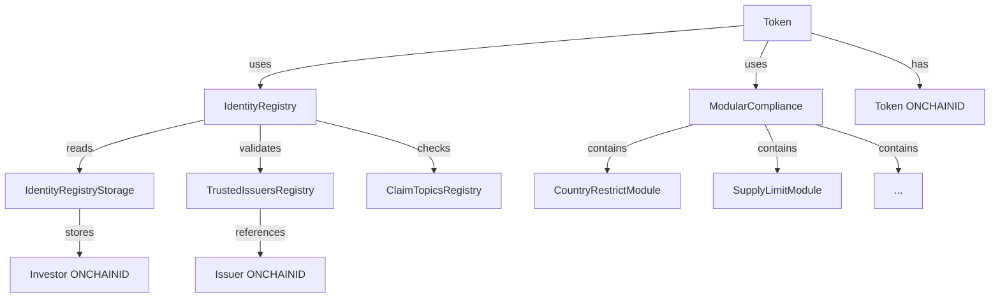

# ERC-3643 代码完整解析文档

## 目录

1. [项目架构总览](#一项目架构总览)
2. [Token 合约详解](#二token-合约详解)
3. [Identity Registry 合约详解](#三identity-registry-合约详解)
4. [Modular Compliance 合约详解](#四modular-compliance-合约详解)
5. [ONCHAINID (ERC-734/735) 合约详解](#五onchainid-erc-734735-合约详解)
6. [辅助合约详解](#六辅助合约详解)
7. [工厂与代理模式](#七工厂与代理模式)
8. [完整交互流程代码追踪](#八完整交互流程代码追踪)
9. [安全机制与最佳实践](#九安全机制与最佳实践)
10. [测试与部署指南](#十测试与部署指南)

---

## 一、项目架构总览

### 1.1 代码仓库结构

```
T-REX/
├── contracts/
│   ├── token/
│   │   ├── Token.sol                    # 主代币合约
│   │   └── IToken.sol                   # 代币接口
│   ├── registry/
│   │   ├── IdentityRegistry.sol         # 身份注册表
│   │   ├── IdentityRegistryStorage.sol  # 身份存储
│   │   ├── TrustedIssuersRegistry.sol   # 受信任签发者注册表
│   │   ├── ClaimTopicsRegistry.sol      # 声明主题注册表
│   │   └── interfaces/                  # 注册表接口
│   ├── compliance/
│   │   ├── ModularCompliance.sol        # 模块化合规
│   │   └── modular/
│   │       ├── modules/                 # 合规模块
│   │       │   ├── CountryRestrictModule.sol
│   │       │   ├── SupplyLimitModule.sol
│   │       │   └── ...
│   │       └── IModule.sol              # 模块接口
│   ├── roles/
│   │   ├── AgentRole.sol                # 代理角色
│   │   ├── OwnerRoles.sol               # 所有者角色
│   │   └── ...
│   ├── proxy/
│   │   ├── authority/
│   │   │   └── ITREXImplementationAuthority.sol
│   │   └── ...
│   └── factory/
│       └── ITREXFactory.sol             # 工厂接口
├── @onchain-id/solidity/
│   └── contracts/
│       ├── Identity.sol                 # ONCHAINID 实现
│       ├── IIdentity.sol                # 身份接口
│       ├── IERC734.sol                  # 密钥管理接口
│       └── IERC735.sol                  # 声明管理接口
└── test/
    └── ...
```

### 1.2 继承关系图

```
Token
  ├─ IToken (interface)
  ├─ ERC20 (OpenZeppelin)
  ├─ Ownable (OpenZeppelin)
  └─ AgentRole

IdentityRegistry
  ├─ IIdentityRegistry (interface)
  ├─ Ownable
  └─ AgentRole

ModularCompliance
  ├─ IModularCompliance (interface)
  └─ Ownable

Identity (ONCHAINID)
  ├─ ERC734 (密钥管理)
  └─ ERC735 (声明管理)
```

### 1.3 核心依赖关系



---

## 二、Token 合约详解

### 2.1 合约声明与继承

```solidity
// SPDX-License-Identifier: GPL-3.0
pragma solidity 0.8.17;

import "@openzeppelin/contracts/token/ERC20/ERC20.sol";
import "@openzeppelin/contracts/access/Ownable.sol";
import "./IToken.sol";
import "../registry/interface/IIdentityRegistry.sol";
import "../compliance/modular/IModularCompliance.sol";
import "../roles/AgentRole.sol";

contract Token is IToken, ERC20, Ownable, AgentRole {
    // ...
}
```

**继承说明**：
- `IToken`：定义 T-REX 特定功能接口
- `ERC20`：标准 ERC-20 实现（来自 OpenZeppelin）
- `Ownable`：所有权管理（来自 OpenZeppelin）
- `AgentRole`：代理角色管理（T-REX 自定义）

---

### 2.2 状态变量

```solidity
contract Token is IToken, ERC20, Ownable, AgentRole {
    /// @dev 关联的身份注册表
    IIdentityRegistry private _identityRegistry;
    
    /// @dev 关联的合规合约
    IModularCompliance private _compliance;
    
    /// @dev 代币的链上身份（ONCHAINID）
    address private _tokenOID;
    
    /// @dev 冻结的代币余额映射
    mapping(address => uint256) private _frozen;
    
    /// @dev 代币名称
    string private _tokenName;
    
    /// @dev 代币符号
    string private _tokenSymbol;
    
    /// @dev 代币小数位
    uint8 private _tokenDecimals;
    
    /// @dev 代币版本号
    string private constant TOKEN_VERSION = "4.0.0";
```

**关键设计点**：
1. **分离关注点**：身份验证和合规检查通过外部合约处理
2. **冻结机制**：独立的 `_frozen` 映射，不影响总供应量
3. **版本控制**：便于升级管理

---

### 2.3 构造函数

```solidity
/**
 * @dev 构造函数
 * @param _identityRegistry_ 身份注册表地址
 * @param _compliance_ 合规合约地址
 * @param _name 代币名称
 * @param _symbol 代币符号
 * @param _decimals 代币小数位
 * @param _onchainID 代币 ONCHAINID 地址
 */
constructor(
    address _identityRegistry_,
    address _compliance_,
    string memory _name,
    string memory _symbol,
    uint8 _decimals,
    address _onchainID
) ERC20(_name, _symbol) {
    require(_identityRegistry_ != address(0), "invalid argument - zero address");
    require(_compliance_ != address(0), "invalid argument - zero address");
    require(_onchainID != address(0), "invalid argument - zero address");
    require(
        keccak256(abi.encode(_name)) == keccak256(abi.encode(IToken(address(0)).name())),
        "invalid argument - name"
    );
    require(
        keccak256(abi.encode(_symbol)) == keccak256(abi.encode(IToken(address(0)).symbol())),
        "invalid argument - symbol"
    );
    
    _tokenName = _name;
    _tokenSymbol = _symbol;
    _tokenDecimals = _decimals;
    _tokenOID = _onchainID;
    _identityRegistry = IIdentityRegistry(_identityRegistry_);
    _compliance = IModularCompliance(_compliance_);
    
    emit UpdatedTokenInformation(_name, _symbol, _decimals, TOKEN_VERSION, _onchainID);
}
```

**验证逻辑**：
1. 检查地址非零
2. 验证名称和符号的有效性
3. 初始化所有状态变量
4. 发出初始化事件

---

### 2.4 核心转账逻辑

#### 2.4.1 transfer 函数

```solidity
/**
 * @dev 转账代币
 * @param _to 接收方地址
 * @param _amount 转账数量
 */
function transfer(address _to, uint256 _amount) 
    public 
    override 
    whenNotPaused 
    returns (bool) 
{
    // 检查发送方是否有足够的未冻结余额
    require(
        balanceOf(msg.sender) - _frozen[msg.sender] >= _amount,
        "Insufficient Balance"
    );
    
    // 执行合规检查
    if (_tokenOID != address(0)) {
        require(
            _compliance.canTransfer(msg.sender, _to, _amount),
            "Transfer not compliant"
        );
    }
    
    // 执行实际转账
    _transfer(msg.sender, _to, _amount);
    
    // 更新合规状态
    _compliance.transferred(msg.sender, _to, _amount);
    
    return true;
}
```

**执行流程**：
1. **余额检查**：`balanceOf(sender) - frozen[sender] >= amount`
2. **合规检查**：调用 `compliance.canTransfer()`
3. **执行转账**：调用内部 `_transfer()` 函数
4. **状态更新**：通知合规合约更新状态

---

#### 2.4.2 内部 _transfer 函数重写

```solidity
/**
 * @dev 重写 ERC20 的 _transfer 函数，添加身份验证
 * @param _from 发送方
 * @param _to 接收方
 * @param _amount 转账数量
 */
function _transfer(
    address _from,
    address _to,
    uint256 _amount
) internal override {
    // 验证接收方身份
    require(
        _identityRegistry.isVerified(_to),
        "Transfer not allowed - Receiver not verified"
    );
    
    // 调用父合约的 _transfer（ERC20 标准实现）
    super._transfer(_from, _to, _amount);
}
```

**关键点**：
- 在标准 ERC-20 转账之前插入身份验证
- 确保所有转账路径（transfer、transferFrom）都受保护
- 利用 Solidity 的函数重写机制

---

#### 2.4.3 transferFrom 函数

```solidity
/**
 * @dev 从他人账户转账代币（需授权）
 * @param _from 发送方地址
 * @param _to 接收方地址
 * @param _amount 转账数量
 */
function transferFrom(
    address _from,
    address _to,
    uint256 _amount
) public override whenNotPaused returns (bool) {
    // 检查发送方未冻结余额
    require(
        balanceOf(_from) - _frozen[_from] >= _amount,
        "Insufficient Balance"
    );
    
    // 执行合规检查
    if (_tokenOID != address(0)) {
        require(
            _compliance.canTransfer(_from, _to, _amount),
            "Transfer not compliant"
        );
    }
    
    // 调用父合约的 transferFrom（处理授权逻辑）
    _transfer(_from, _to, _amount);
    
    // 减少授权额度
    uint256 currentAllowance = allowance(_from, msg.sender);
    require(currentAllowance >= _amount, "ERC20: transfer amount exceeds allowance");
    _approve(_from, msg.sender, currentAllowance - _amount);
    
    // 更新合规状态
    _compliance.transferred(_from, _to, _amount);
    
    return true;
}
```

---

### 2.5 铸造与销毁功能

#### 2.5.1 mint 函数

```solidity
/**
 * @dev 铸造新代币（仅限 Agent）
 * @param _to 接收方地址
 * @param _amount 铸造数量
 */
function mint(address _to, uint256 _amount) 
    public 
    onlyAgent 
{
    // 验证接收方身份
    require(
        _identityRegistry.isVerified(_to),
        "Identity is not verified."
    );
    
    // 合规检查
    require(
        _compliance.canTransfer(address(0), _to, _amount),
        "Compliance not followed"
    );
    
    // 执行铸造
    _mint(_to, _amount);
    
    // 更新合规状态
    _compliance.created(_to, _amount);
    
    emit Minted(_to, _amount);
}
```

**安全机制**：
1. **权限控制**：只有 Agent 角色可以铸造
2. **身份验证**：接收方必须通过 KYC
3. **合规检查**：确保不违反供应量限制等规则
4. **状态同步**：通知合规合约更新投资者计数等状态

---

#### 2.5.2 burn 函数

```solidity
/**
 * @dev 销毁代币（仅限 Agent）
 * @param _from 持有者地址
 * @param _amount 销毁数量
 */
function burn(address _from, uint256 _amount) 
    public 
    onlyAgent 
{
    // 检查余额（包括冻结部分）
    require(
        balanceOf(_from) >= _amount,
        "cannot burn more than balance"
    );
    
    // 如果冻结余额大于销毁量，先解冻
    if (_frozen[_from] > 0) {
        uint256 freeBalance = balanceOf(_from) - _frozen[_from];
        if (freeBalance < _amount) {
            uint256 tokensToUnfreeze = _amount - freeBalance;
            _frozen[_from] = _frozen[_from] - tokensToUnfreeze;
            emit TokensUnfrozen(_from, tokensToUnfreeze);
        }
    }
    
    // 执行销毁
    _burn(_from, _amount);
    
    // 更新合规状态
    _compliance.destroyed(_from, _amount);
    
    emit Burned(_from, _amount);
}
```

**逻辑亮点**：
- 自动处理冻结代币的解冻
- 支持强制销毁（监管要求）
- 通知合规合约更新状态

---

### 2.6 冻结与解冻机制

#### 2.6.1 freezePartialTokens 函数

```solidity
/**
 * @dev 部分冻结用户代币（仅限 Agent）
 * @param _userAddress 用户地址
 * @param _amount 冻结数量
 */
function freezePartialTokens(address _userAddress, uint256 _amount) 
    public 
    onlyAgent 
{
    uint256 balance = balanceOf(_userAddress);
    require(balance >= _frozen[_userAddress] + _amount, "Amount exceeds available balance");
    
    _frozen[_userAddress] = _frozen[_userAddress] + _amount;
    
    emit TokensFrozen(_userAddress, _amount);
}
```

---

#### 2.6.2 unfreezePartialTokens 函数

```solidity
/**
 * @dev 部分解冻用户代币（仅限 Agent）
 * @param _userAddress 用户地址
 * @param _amount 解冻数量
 */
function unfreezePartialTokens(address _userAddress, uint256 _amount) 
    public 
    onlyAgent 
{
    require(_frozen[_userAddress] >= _amount, "Amount should be less than or equal to frozen tokens");
    
    _frozen[_userAddress] = _frozen[_userAddress] - _amount;
    
    emit TokensUnfrozen(_userAddress, _amount);
}
```

**应用场景**：
1. **监管要求**：冻结可疑账户的资产
2. **争议解决**：在法律纠纷期间锁定资产
3. **锁定期实施**：员工代币 vesting
4. **合规处罚**：违反发行条款的惩罚

---

### 2.7 强制转账（恢复功能）

```solidity
/**
 * @dev 强制转账（用于地址恢复，仅限 Agent）
 * @param _from 原地址
 * @param _to 新地址
 * @param _amount 转账数量
 */
function forcedTransfer(
    address _from,
    address _to,
    uint256 _amount
) public onlyAgent returns (bool) {
    // 验证新地址身份
    require(
        _identityRegistry.isVerified(_to),
        "Transfer not allowed - Receiver not verified"
    );
    
    // 获取原地址的 ONCHAINID
    address _fromIdentity = _identityRegistry.identity(_from);
    
    // 验证新地址绑定的是同一个 ONCHAINID
    require(
        _fromIdentity == _identityRegistry.identity(_to),
        "Incorrect identity on destination address"
    );
    
    // 检查余额
    uint256 freeBalance = balanceOf(_from) - _frozen[_from];
    require(freeBalance >= _amount, "Insufficient Balance");
    
    // 合规检查
    if (_tokenOID != address(0)) {
        require(
            _compliance.canTransfer(_from, _to, _amount),
            "Transfer not compliant"
        );
    }
    
    // 执行转账
    _transfer(_from, _to, _amount);
    
    // 更新合规状态
    _compliance.transferred(_from, _to, _amount);
    
    return true;
}
```

**安全保障**：
1. **ONCHAINID 验证**：确保是同一身份的不同钱包
2. **权限控制**：只有 Agent 可以执行
3. **合规检查**：仍需通过所有合规规则
4. **余额检查**：不能转移冻结的代币

**使用场景**：
```
用户丢失私钥
    ↓
向 Agent 证明身份（链下 KYC）
    ↓
Agent 验证身份一致性
    ↓
将旧钱包的代币转移到新钱包
    ↓
用户重新获得资产控制权
```

---

### 2.8 批量操作函数

```solidity
/**
 * @dev 批量铸造（仅限 Agent）
 * @param _toList 接收方地址数组
 * @param _amounts 铸造数量数组
 */
function batchMint(address[] calldata _toList, uint256[] calldata _amounts) 
    external 
    onlyAgent 
{
    require(_toList.length == _amounts.length, "Array length mismatch");
    
    for (uint256 i = 0; i < _toList.length; i++) {
        mint(_toList[i], _amounts[i]);
    }
}

/**
 * @dev 批量销毁（仅限 Agent）
 * @param _fromList 持有者地址数组
 * @param _amounts 销毁数量数组
 */
function batchBurn(address[] calldata _fromList, uint256[] calldata _amounts) 
    external 
    onlyAgent 
{
    require(_fromList.length == _amounts.length, "Array length mismatch");
    
    for (uint256 i = 0; i < _fromList.length; i++) {
        burn(_fromList[i], _amounts[i]);
    }
}

/**
 * @dev 批量冻结（仅限 Agent）
 * @param _userAddresses 用户地址数组
 * @param _amounts 冻结数量数组
 */
function batchFreezePartialTokens(
    address[] calldata _userAddresses,
    uint256[] calldata _amounts
) external onlyAgent {
    require(_userAddresses.length == _amounts.length, "Array length mismatch");
    
    for (uint256 i = 0; i < _userAddresses.length; i++) {
        freezePartialTokens(_userAddresses[i], _amounts[i]);
    }
}
```

**设计优势**：
- 减少 Gas 成本（批量操作）
- 提高操作效率（一次交易完成多个操作）
- 简化管理流程（如批量空投）

---

### 2.9 查询函数

```solidity
/**
 * @dev 获取身份注册表地址
 */
function identityRegistry() external view returns (IIdentityRegistry) {
    return _identityRegistry;
}

/**
 * @dev 获取合规合约地址
 */
function compliance() external view returns (IModularCompliance) {
    return _compliance;
}

/**
 * @dev 获取代币 ONCHAINID
 */
function onchainID() external view returns (address) {
    return _tokenOID;
}

/**
 * @dev 获取冻结余额
 * @param _userAddress 用户地址
 */
function getFrozenTokens(address _userAddress) external view returns (uint256) {
    return _frozen[_userAddress];
}

/**
 * @dev 获取版本号
 */
function version() external pure returns (string memory) {
    return TOKEN_VERSION;
}
```

---

### 2.10 设置函数（仅限 Owner）

```solidity
/**
 * @dev 设置身份注册表（仅限 Owner）
 * @param _identityRegistry_ 新的身份注册表地址
 */
function setIdentityRegistry(address _identityRegistry_) 
    external 
    onlyOwner 
{
    require(_identityRegistry_ != address(0), "invalid argument - zero address");
    _identityRegistry = IIdentityRegistry(_identityRegistry_);
    emit IdentityRegistryAdded(_identityRegistry_);
}

/**
 * @dev 设置合规合约（仅限 Owner）
 * @param _compliance_ 新的合规合约地址
 */
function setCompliance(address _compliance_) 
    external 
    onlyOwner 
{
    require(_compliance_ != address(0), "invalid argument - zero address");
    _compliance = IModularCompliance(_compliance_);
    emit ComplianceAdded(_compliance_);
}

/**
 * @dev 设置代币 ONCHAINID（仅限 Owner）
 * @param _onchainID 新的 ONCHAINID 地址
 */
function setOnchainID(address _onchainID) 
    external 
    onlyOwner 
{
    require(_onchainID != address(0), "invalid argument - zero address");
    _tokenOID = _onchainID;
    emit OnchainIDUpdated(_onchainID);
}
```

---

## 三、Identity Registry 合约详解

### 3.1 合约声明与状态变量

```solidity
// SPDX-License-Identifier: GPL-3.0
pragma solidity 0.8.17;

import "./interface/IIdentityRegistry.sol";
import "./interface/IIdentityRegistryStorage.sol";
import "./interface/ITrustedIssuersRegistry.sol";
import "./interface/IClaimTopicsRegistry.sol";
import "../roles/AgentRole.sol";

contract IdentityRegistry is IIdentityRegistry, AgentRole {
    /// @dev 身份存储合约
    IIdentityRegistryStorage private _identityStorage;
    
    /// @dev 受信任签发者注册表
    ITrustedIssuersRegistry private _trustedIssuersRegistry;
    
    /// @dev 声明主题注册表
    IClaimTopicsRegistry private _claimTopicsRegistry;
    
    /// @dev 代币工厂合约地址（用于权限控制）
    address private _tokenFactory;
```

---

### 3.2 核心验证函数：isVerified

```solidity
/**
 * @dev 验证地址是否通过身份验证
 * @param _userAddress 待验证的地址
 * @return true 如果验证通过，否则 false
 */
function isVerified(address _userAddress) 
    external 
    view 
    override 
    returns (bool) 
{
    // 1. 检查地址是否已注册
    if (_identityStorage.storedIdentity(_userAddress) == address(0)) {
        return false;
    }
    
    // 2. 获取用户的 ONCHAINID
    address userIdentity = _identityStorage.storedIdentity(_userAddress);
    
    // 3. 获取必需的声明主题
    uint256[] memory claimTopics = _claimTopicsRegistry.getClaimTopics();
    
    if (claimTopics.length == 0) {
        return true; // 如果没有必需主题，直接通过
    }
    
    // 4. 遍历每个必需主题
    for (uint256 i = 0; i < claimTopics.length; i++) {
        // 5. 从 ONCHAINID 获取该主题的声明 ID 列表
        IIdentity identity = IIdentity(userIdentity);
        bytes32[] memory claimIds = identity.getClaimIdsByTopic(claimTopics[i]);
        
        if (claimIds.length == 0) {
            return false; // 缺少必需的声明主题
        }
        
        // 6. 检查是否有至少一个有效声明
        bool validClaimFound = false;
        
        for (uint256 j = 0; j < claimIds.length; j++) {
            // 7. 获取声明详情
            (
                uint256 claimTopic,
                uint256 scheme,
                address issuer,
                bytes memory signature,
                bytes memory data,
                string memory uri
            ) = identity.getClaim(claimIds[j]);
            
            // 8. 检查签发者是否可信
            if (!_trustedIssuersRegistry.isTrustedIssuer(issuer)) {
                continue; // 签发者不可信，检查下一个声明
            }
            
            // 9. 检查签发者是否授权该主题
            if (!_trustedIssuersRegistry.hasClaimTopic(issuer, claimTopic)) {
                continue; // 签发者未授权该主题
            }
            
            // 10. 验证声明签名
            if (!_verifyClaimSignature(userIdentity, claimTopic, signature, data, issuer)) {
                continue; // 签名无效
            }
            
            // 找到有效声明
            validClaimFound = true;
            break;
        }
        
        if (!validClaimFound) {
            return false; // 该主题没有有效声明
        }
    }
    
    // 11. 所有主题都有有效声明
    return true;
}
```

**验证流程可视化**：
```
输入：用户地址
    ↓
步骤 1：检查是否注册 → 否 → 返回 false
    ↓ 是
步骤 2：获取 ONCHAINID
    ↓
步骤 3：获取必需主题列表 [1, 2, 3]
    ↓
步骤 4：遍历每个主题
    ↓
    主题 1:
        ↓
        步骤 5：获取声明 ID 列表 → 为空 → 返回 false
        ↓ 有声明
        步骤 6-10：检查每个声明
            ├─ 签发者可信？
            ├─ 签发者授权？
            └─ 签名有效？
        ↓
        找到有效声明 → 继续下一个主题
    ↓
    主题 2:
        ↓
        ... 重复步骤 5-10 ...
    ↓
    主题 3:
        ↓
        ... 重复步骤 5-10 ...
    ↓
步骤 11：所有主题验证通过 → 返回 true
```

---

### 3.3 声明签名验证（内部函数）

```solidity
/**
 * @dev 验证声明签名（内部函数）
 * @param _userIdentity 用户 ONCHAINID 地址
 * @param _claimTopic 声明主题
 * @param _signature 声明签名
 * @param _data 声明数据
 * @param _issuer 签发者地址
 * @return true 如果签名有效
 */
function _verifyClaimSignature(
    address _userIdentity,
    uint256 _claimTopic,
    bytes memory _signature,
    bytes memory _data,
    address _issuer
) private view returns (bool) {
    // 1. 重构签名消息
    bytes32 dataHash = keccak256(abi.encode(_userIdentity, _claimTopic, _data));
    
    // 2. 添加以太坊签名前缀
    bytes32 prefixedHash = keccak256(
        abi.encodePacked("\x19Ethereum Signed Message:\n32", dataHash)
    );
    
    // 3. 恢复签名者地址
    address recovered = _recoverSigner(prefixedHash, _signature);
    
    // 4. 检查签发者类型
    if (_isContract(_issuer)) {
        // 如果签发者是身份合约（ONCHAINID）
        IIdentity issuerIdentity = IIdentity(_issuer);
        
        // 检查恢复的地址是否是签发者的 EXECUTION 密钥
        bytes32 key = keccak256(abi.encode(recovered));
        return issuerIdentity.keyHasPurpose(key, 2); // 2 = EXECUTION purpose
    } else {
        // 如果签发者是 EOA，直接对比地址
        return recovered == _issuer;
    }
}

/**
 * @dev 从签名恢复签名者地址
 * @param _hash 消息哈希
 * @param _signature 签名
 * @return 签名者地址
 */
function _recoverSigner(bytes32 _hash, bytes memory _signature) 
    private 
    pure 
    returns (address) 
{
    require(_signature.length == 65, "Invalid signature length");
    
    bytes32 r;
    bytes32 s;
    uint8 v;
    
    // 分离签名的 r, s, v 组件
    assembly {
        r := mload(add(_signature, 32))
        s := mload(add(_signature, 64))
        v := byte(0, mload(add(_signature, 96)))
    }
    
    // 修正 v 值（某些钱包返回 0/1 而不是 27/28）
    if (v < 27) {
        v += 27;
    }
    
    require(v == 27 || v == 28, "Invalid signature version");
    
    return ecrecover(_hash, v, r, s);
}

/**
 * @dev 检查地址是否为合约
 * @param _addr 待检查地址
 * @return true 如果是合约
 */
function _isContract(address _addr) private view returns (bool) {
    uint256 size;
    assembly {
        size := extcodesize(_addr)
    }
    return size > 0;
}
```

**签名验证原理**：
```
声明签发过程（链下）：
    message = keccak256(userOID + topic + data)
    prefixedMessage = "\x19Ethereum Signed Message:\n32" + message
    signature = sign(prefixedMessage, issuerPrivateKey)

声明验证过程（链上）：
    dataHash = keccak256(userOID + topic + data)
    prefixedHash = "\x19Ethereum Signed Message:\n32" + dataHash
    recoveredAddress = ecrecover(prefixedHash, signature)
    
    if issuer is ONCHAINID:
        check recoveredAddress is EXECUTION key in issuer
    else:
        check recoveredAddress == issuer
```

---

### 3.4 身份注册函数

```solidity
/**
 * @dev 注册单个身份（仅限 Agent）
 * @param _userAddress 用户钱包地址
 * @param _identity 用户 ONCHAINID 地址
 * @param _country 用户国家代码（ISO-3166）
 */
function registerIdentity(
    address _userAddress,
    IIdentity _identity,
    uint16 _country
) public override onlyAgent {
    // 验证参数
    require(_userAddress != address(0), "invalid argument - zero address");
    require(address(_identity) != address(0), "invalid argument - zero address");
    
    // 检查地址是否已注册
    require(
        _identityStorage.storedIdentity(_userAddress) == address(0),
        "identity contract already exists"
    );
    
    // 存储身份映射
    _identityStorage.addIdentityToStorage(_userAddress, address(_identity), _country);
    
    emit IdentityRegistered(_userAddress, address(_identity));
}

/**
 * @dev 批量注册身份（仅限 Agent）
 * @param _userAddresses 用户地址数组
 * @param _identities 用户 ONCHAINID 数组
 * @param _countries 用户国家代码数组
 */
function batchRegisterIdentity(
    address[] calldata _userAddresses,
    IIdentity[] calldata _identities,
    uint16[] calldata _countries
) external override onlyAgent {
    require(
        _userAddresses.length == _identities.length &&
        _userAddresses.length == _countries.length,
        "Array length mismatch"
    );
    
    for (uint256 i = 0; i < _userAddresses.length; i++) {
        registerIdentity(_userAddresses[i], _identities[i], _countries[i]);
    }
}
```

---

### 3.5 身份更新与删除

```solidity
/**
 * @dev 更新用户的 ONCHAINID（仅限 Agent）
 * @param _userAddress 用户地址
 * @param _identity 新的 ONCHAINID 地址
 */
function updateIdentity(address _userAddress, IIdentity _identity) 
    external 
    override 
    onlyAgent 
{
    require(_userAddress != address(0), "invalid argument - zero address");
    require(address(_identity) != address(0), "invalid argument - zero address");
    
    // 检查原身份是否存在
    address oldIdentity = _identityStorage.storedIdentity(_userAddress);
    require(oldIdentity != address(0), "identity not found");
    
    // 更新身份
    _identityStorage.modifyStoredIdentity(_userAddress, address(_identity));
    
    emit IdentityUpdated(oldIdentity, address(_identity));
}

/**
 * @dev 更新用户国家代码（仅限 Agent）
 * @param _userAddress 用户地址
 * @param _country 新的国家代码
 */
function updateCountry(address _userAddress, uint16 _country) 
    external 
    override 
    onlyAgent 
{
    require(_userAddress != address(0), "invalid argument - zero address");
    
    // 检查身份是否存在
    require(
        _identityStorage.storedIdentity(_userAddress) != address(0),
        "identity not found"
    );
    
    uint16 oldCountry = _identityStorage.storedInvestorCountry(_userAddress);
    _identityStorage.modifyStoredInvestorCountry(_userAddress, _country);
    
    emit CountryUpdated(_userAddress, oldCountry, _country);
}

/**
 * @dev 删除身份（仅限 Agent）
 * @param _userAddress 用户地址
 */
function deleteIdentity(address _userAddress) 
    external 
    override 
    onlyAgent 
{
    require(_userAddress != address(0), "invalid argument - zero address");
    
    address identity = _identityStorage.storedIdentity(_userAddress);
    require(identity != address(0), "identity not found");
    
    _identityStorage.removeIdentityFromStorage(_userAddress);
    
    emit IdentityRemoved(_userAddress, identity);
}
```

---

### 3.6 查询与设置函数

```solidity
/**
 * @dev 查询用户的 ONCHAINID
 * @param _userAddress 用户地址
 * @return ONCHAINID 地址
 */
function identity(address _userAddress) 
    external 
    view 
    override 
    returns (IIdentity) 
{
    return IIdentity(_identityStorage.storedIdentity(_userAddress));
}

/**
 * @dev 查询用户国家代码
 * @param _userAddress 用户地址
 * @return 国家代码
 */
function investorCountry(address _userAddress) 
    external 
    view 
    override 
    returns (uint16) 
{
    return _identityStorage.storedInvestorCountry(_userAddress);
}

/**
 * @dev 设置身份存储合约（仅限 Owner）
 * @param _identityStorage_ 新的存储合约地址
 */
function setIdentityRegistryStorage(address _identityStorage_) 
    external 
    override 
    onlyOwner 
{
    require(_identityStorage_ != address(0), "invalid argument - zero address");
    _identityStorage = IIdentityRegistryStorage(_identityStorage_);
    emit IdentityStorageSet(_identityStorage_);
}

/**
 * @dev 设置受信任签发者注册表（仅限 Owner）
 * @param _trustedIssuersRegistry_ 新的注册表地址
 */
function setTrustedIssuersRegistry(address _trustedIssuersRegistry_) 
    external 
    override 
    onlyOwner 
{
    require(_trustedIssuersRegistry_ != address(0), "invalid argument - zero address");
    _trustedIssuersRegistry = ITrustedIssuersRegistry(_trustedIssuersRegistry_);
    emit TrustedIssuersRegistrySet(_trustedIssuersRegistry_);
}

/**
 * @dev 设置声明主题注册表（仅限 Owner）
 * @param _claimTopicsRegistry_ 新的注册表地址
 */
function setClaimTopicsRegistry(address _claimTopicsRegistry_) 
    external 
    override 
    onlyOwner 
{
    require(_claimTopicsRegistry_ != address(0), "invalid argument - zero address");
    _claimTopicsRegistry = IClaimTopicsRegistry(_claimTopicsRegistry_);
    emit ClaimTopicsRegistrySet(_claimTopicsRegistry_);
}
```

---

## 四、Modular Compliance 合约详解

### 4.1 合约声明与状态变量

```solidity
// SPDX-License-Identifier: GPL-3.0
pragma solidity 0.8.17;

import "./IModularCompliance.sol";
import "../token/IToken.sol";
import "./modular/IModule.sol";

contract ModularCompliance is IModularCompliance, Ownable {
    /// @dev 合规模块数组
    IModule[] private _modules;
    
    /// @dev 绑定的代币合约地址
    IToken private _tokenBound;
    
    /// @dev 模块是否已绑定的映射
    mapping(address => bool) private _moduleBound;
    
    /// @dev 最大模块数量限制（防止 gas 超限）
    uint256 private constant MAX_MODULES = 25;
```

---

### 4.2 核心验证函数：canTransfer

```solidity
/**
 * @dev 检查转账是否符合所有合规规则
 * @param _from 发送方地址
 * @param _to 接收方地址
 * @param _value 转账数量
 * @return true 如果符合所有规则
 */
function canTransfer(
    address _from,
    address _to,
    uint256 _value
) external view override returns (bool) {
    // 检查是否有模块
    if (_modules.length == 0) {
        return true; // 没有模块，默认允许
    }
    
    // 遍历所有模块
    for (uint256 i = 0; i < _modules.length; i++) {
        // 调用每个模块的 moduleCheck
        if (!_modules[i].moduleCheck(_from, _to, _value, address(this))) {
            return false; // 任何一个模块不通过，拒绝转账
        }
    }
    
    return true; // 所有模块都通过
}
```

**设计特点**：
- **短路评估**：任何模块失败立即返回 false
- **Gas 优化**：使用 view 函数，不消耗 gas（除非在交易中调用）
- **灵活扩展**：支持动态添加/移除模块

---

### 4.3 状态更新函数

```solidity
/**
 * @dev 转账完成后调用（用于更新合规状态）
 * @param _from 发送方地址
 * @param _to 接收方地址
 * @param _value 转账数量
 */
function transferred(
    address _from,
    address _to,
    uint256 _value
) external override onlyToken {
    // 通知所有模块更新状态
    for (uint256 i = 0; i < _modules.length; i++) {
        _modules[i].moduleTransferAction(_from, _to, _value);
    }
}

/**
 * @dev 铸造完成后调用（用于更新合规状态）
 * @param _to 接收方地址
 * @param _value 铸造数量
 */
function created(address _to, uint256 _value) 
    external 
    override 
    onlyToken 
{
    // 通知所有模块更新状态
    for (uint256 i = 0; i < _modules.length; i++) {
        _modules[i].moduleMintAction(_to, _value);
    }
}

/**
 * @dev 销毁完成后调用（用于更新合规状态）
 * @param _from 销毁来源地址
 * @param _value 销毁数量
 */
function destroyed(address _from, uint256 _value) 
    external 
    override 
    onlyToken 
{
    // 通知所有模块更新状态
    for (uint256 i = 0; i < _modules.length; i++) {
        _modules[i].moduleBurnAction(_from, _value);
    }
}
```

**修饰符**：
```solidity
modifier onlyToken() {
    require(msg.sender == address(_tokenBound), "only bound token can call");
    _;
}
```

---

### 4.4 模块管理函数

```solidity
/**
 * @dev 添加合规模块（仅限 Owner）
 * @param _module 模块合约地址
 */
function addModule(address _module) 
    external 
    override 
    onlyOwner 
{
    require(_module != address(0), "invalid argument - zero address");
    require(_modules.length < MAX_MODULES, "cannot add more modules");
    require(!_moduleBound[_module], "module already bound");
    
    // 检查模块是否兼容
    IModule module = IModule(_module);
    require(
        !module.isPlugAndPlay() || address(_tokenBound) == address(0),
        "cannot add plug and play module after binding"
    );
    
    // 添加模块
    _modules.push(module);
    _moduleBound[_module] = true;
    
    emit ModuleAdded(_module);
}

/**
 * @dev 移除合规模块（仅限 Owner）
 * @param _module 模块合约地址
 */
function removeModule(address _module) 
    external 
    override 
    onlyOwner 
{
    require(_module != address(0), "invalid argument - zero address");
    require(_moduleBound[_module], "module not bound");
    
    // 查找并移除模块
    uint256 length = _modules.length;
    for (uint256 i = 0; i < length; i++) {
        if (address(_modules[i]) == _module) {
            // 将最后一个元素移到当前位置（高效删除）
            _modules[i] = _modules[length - 1];
            _modules.pop();
            break;
        }
    }
    
    _moduleBound[_module] = false;
    
    emit ModuleRemoved(_module);
}
```

**数组删除优化**：
```
原数组：[A, B, C, D, E]
删除 B：
    1. 将最后元素 E 移到 B 的位置
       [A, E, C, D, E]
    2. 删除最后元素
       [A, E, C, D]
    
优势：O(1) 时间复杂度（不需要移动后续所有元素）
注意：不保持原有顺序
```

---

### 4.5 代币绑定函数

```solidity
/**
 * @dev 绑定代币合约（仅限 Owner）
 * @param _token 代币合约地址
 */
function bindToken(address _token) 
    external 
    override 
    onlyOwner 
{
    require(_token != address(0), "invalid argument - zero address");
    require(address(_tokenBound) == address(0), "token already bound");
    
    _tokenBound = IToken(_token);
    
    emit TokenBound(_token);
}

/**
 * @dev 解绑代币合约（仅限 Owner）
 */
function unbindToken() 
    external 
    override 
    onlyOwner 
{
    require(address(_tokenBound) != address(0), "token not bound");
    
    address previousToken = address(_tokenBound);
    _tokenBound = IToken(address(0));
    
    emit TokenUnbound(previousToken);
}
```

---

### 4.6 查询函数

```solidity
/**
 * @dev 获取所有模块地址
 * @return 模块地址数组
 */
function getModules() external view override returns (address[] memory) {
    address[] memory modules = new address[](_modules.length);
    for (uint256 i = 0; i < _modules.length; i++) {
        modules[i] = address(_modules[i]);
    }
    return modules;
}

/**
 * @dev 检查模块是否已绑定
 * @param _module 模块地址
 * @return true 如果已绑定
 */
function isModuleBound(address _module) 
    external 
    view 
    override 
    returns (bool) 
{
    return _moduleBound[_module];
}

/**
 * @dev 获取绑定的代币合约
 * @return 代币合约地址
 */
function getTokenBound() external view override returns (address) {
    return address(_tokenBound);
}
```

---

### 4.7 合规模块接口（IModule）

```solidity
// SPDX-License-Identifier: GPL-3.0
pragma solidity 0.8.17;

interface IModule {
    /**
     * @dev 检查转账是否符合此模块的规则
     * @param _from 发送方
     * @param _to 接收方
     * @param _value 转账数量
     * @param _compliance 合规合约地址
     * @return true 如果符合规则
     */
    function moduleCheck(
        address _from,
        address _to,
        uint256 _value,
        address _compliance
    ) external view returns (bool);
    
    /**
     * @dev 转账完成后的动作（更新模块状态）
     * @param _from 发送方
     * @param _to 接收方
     * @param _value 转账数量
     */
    function moduleTransferAction(
        address _from,
        address _to,
        uint256 _value
    ) external;
    
    /**
     * @dev 铸造完成后的动作
     * @param _to 接收方
     * @param _value 铸造数量
     */
    function moduleMintAction(address _to, uint256 _value) external;
    
    /**
     * @dev 销毁完成后的动作
     * @param _from 销毁来源
     * @param _value 销毁数量
     */
    function moduleBurnAction(address _from, uint256 _value) external;
    
    /**
     * @dev 检查模块是否为即插即用型
     * @return true 如果是即插即用模块
     */
    function isPlugAndPlay() external view returns (bool);
    
    /**
     * @dev 获取模块名称
     * @return 模块名称
     */
    function name() external view returns (string memory);
}
```

---

### 4.8 示例合规模块：国家限制模块

```solidity
// SPDX-License-Identifier: GPL-3.0
pragma solidity 0.8.17;

import "../IModule.sol";
import "../../../token/IToken.sol";
import "../../../registry/interface/IIdentityRegistry.sol";

/**
 * @dev 国家限制模块
 * 限制特定国家的投资者持有代币
 */
contract CountryRestrictModule is IModule, Ownable {
    /// @dev 模块绑定的合规合约
    address private _compliance;
    
    /// @dev 限制的国家列表（国家代码 => 是否限制）
    mapping(uint16 => bool) private _restrictedCountries;
    
    /**
     * @dev 构造函数
     * @param _compliance_ 合规合约地址
     */
    constructor(address _compliance_) {
        _compliance = _compliance_;
    }
    
    /**
     * @dev 添加限制国家（仅限 Owner）
     * @param _country 国家代码（ISO-3166）
     */
    function addCountryRestriction(uint16 _country) external onlyOwner {
        _restrictedCountries[_country] = true;
        emit CountryRestricted(_country);
    }
    
    /**
     * @dev 移除限制国家（仅限 Owner）
     * @param _country 国家代码
     */
    function removeCountryRestriction(uint16 _country) external onlyOwner {
        _restrictedCountries[_country] = false;
        emit CountryUnrestricted(_country);
    }
    
    /**
     * @dev 检查转账是否符合国家限制
     */
    function moduleCheck(
        address _from,
        address _to,
        uint256 _value,
        address _compliance
    ) external view override returns (bool) {
        require(_compliance == _compliance, "module not bound to this compliance");
        
        // 获取代币合约
        IModularCompliance compliance = IModularCompliance(_compliance);
        IToken token = IToken(compliance.getTokenBound());
        
        // 获取身份注册表
        IIdentityRegistry identityRegistry = token.identityRegistry();
        
        // 获取接收方国家代码
        uint16 receiverCountry = identityRegistry.investorCountry(_to);
        
        // 检查国家是否受限
        if (_restrictedCountries[receiverCountry]) {
            return false; // 该国家被限制
        }
        
        return true;
    }
    
    /**
     * @dev 转账完成后无需额外动作
     */
    function moduleTransferAction(
        address _from,
        address _to,
        uint256 _value
    ) external override {}
    
    /**
     * @dev 铸造完成后无需额外动作
     */
    function moduleMintAction(address _to, uint256 _value) external override {}
    
    /**
     * @dev 销毁完成后无需额外动作
     */
    function moduleBurnAction(address _from, uint256 _value) external override {}
    
    /**
     * @dev 即插即用模块（可以随时添加/移除）
     */
    function isPlugAndPlay() external pure override returns (bool) {
        return true;
    }
    
    /**
     * @dev 模块名称
     */
    function name() external pure override returns (string memory) {
        return "CountryRestrictModule";
    }
    
    event CountryRestricted(uint16 indexed country);
    event CountryUnrestricted(uint16 indexed country);
}
```

---

### 4.9 示例合规模块：供应量限制模块

```solidity
// SPDX-License-Identifier: GPL-3.0
pragma solidity 0.8.17;

import "../IModule.sol";
import "../../../token/IToken.sol";

/**
 * @dev 供应量限制模块
 * 限制代币的最大供应量
 */
contract SupplyLimitModule is IModule, Ownable {
    /// @dev 模块绑定的合规合约
    address private _compliance;
    
    /// @dev 最大供应量
    uint256 private _maxSupply;
    
    /**
     * @dev 构造函数
     * @param _compliance_ 合规合约地址
     * @param _maxSupply_ 最大供应量
     */
    constructor(address _compliance_, uint256 _maxSupply_) {
        _compliance = _compliance_;
        _maxSupply = _maxSupply_;
    }
    
    /**
     * @dev 设置最大供应量（仅限 Owner）
     * @param _newMax 新的最大供应量
     */
    function setMaxSupply(uint256 _newMax) external onlyOwner {
        _maxSupply = _newMax;
        emit MaxSupplyUpdated(_newMax);
    }
    
    /**
     * @dev 检查铸造后是否超过供应量上限
     */
    function moduleCheck(
        address _from,
        address _to,
        uint256 _value,
        address _compliance
    ) external view override returns (bool) {
        require(_compliance == _compliance, "module not bound to this compliance");
        
        // 获取代币合约
        IModularCompliance compliance = IModularCompliance(_compliance);
        IToken token = IToken(compliance.getTokenBound());
        
        // 只检查铸造操作（_from == address(0)）
        if (_from == address(0)) {
            uint256 currentSupply = token.totalSupply();
            
            // 检查铸造后是否超过上限
            if (currentSupply + _value > _maxSupply) {
                return false; // 超过供应量上限
            }
        }
        
        return true;
    }
    
    function moduleTransferAction(
        address _from,
        address _to,
        uint256 _value
    ) external override {}
    
    function moduleMintAction(address _to, uint256 _value) external override {}
    
    function moduleBurnAction(address _from, uint256 _value) external override {}
    
    /**
     * @dev 非即插即用模块（必须在代币绑定前添加）
     */
    function isPlugAndPlay() external pure override returns (bool) {
        return false;
    }
    
    function name() external pure override returns (string memory) {
        return "SupplyLimitModule";
    }
    
    event MaxSupplyUpdated(uint256 indexed newMax);
}
```

---

### 4.10 示例合规模块：最大持有量模块

```solidity
// SPDX-License-Identifier: GPL-3.0
pragma solidity 0.8.17;

import "../IModule.sol";
import "../../../token/IToken.sol";

/**
 * @dev 最大持有量模块
 * 限制单个投资者的最大持有量（按百分比）
 */
contract MaxBalanceModule is IModule, Ownable {
    /// @dev 模块绑定的合规合约
    address private _compliance;
    
    /// @dev 最大持有百分比（基数 10000，即 100% = 10000）
    uint256 private _maxBalancePercentage;
    
    /**
     * @dev 构造函数
     * @param _compliance_ 合规合约地址
     * @param _maxPercentage 最大持有百分比（例如 1000 = 10%）
     */
    constructor(address _compliance_, uint256 _maxPercentage) {
        _compliance = _compliance_;
        _maxBalancePercentage = _maxPercentage;
    }
    
    /**
     * @dev 设置最大持有百分比（仅限 Owner）
     * @param _newPercentage 新的百分比
     */
    function setMaxBalancePercentage(uint256 _newPercentage) external onlyOwner {
        require(_newPercentage <= 10000, "percentage cannot exceed 100%");
        _maxBalancePercentage = _newPercentage;
        emit MaxBalancePercentageUpdated(_newPercentage);
    }
    
    /**
     * @dev 检查转账后接收方持有量是否超限
     */
    function moduleCheck(
        address _from,
        address _to,
        uint256 _value,