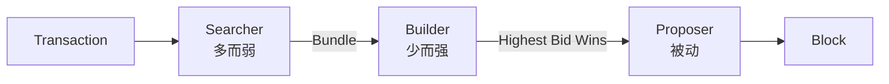
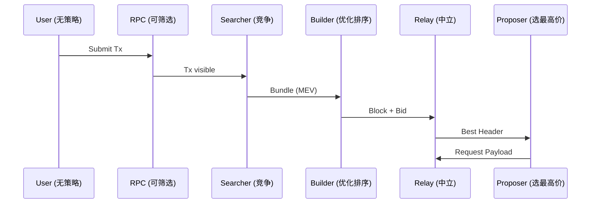

# Ethereum PBS（Proposer-Builder Separation）技术文档

> 本文档系统性描述以太坊当前（MEV-Boost 阶段）PBS 的**架构、角色、交易流、集中度结构、协作关系与经济博弈**，并通过 **Mermaid 图示直接体现产业结构**。

---

## 1. 背景与设计动机

PBS 的核心目标并非消除 MEV，而是：

> **将排序权从“技术特权”转化为“可拍卖的经济权力”**

---

## 2. PBS 角色结构、集中度与协作关系（重点）

### 2.1 产业角色与数量级总览

| 角色 | 数量级 | 集中度 | 产业属性 |
|---|---|---|---|
| User / Wallet | 数百万 | 极低 | MEV 价值来源 |
| RPC | 数十 | 中 | Orderflow 闸门 |
| Searcher | 数百–上千 | 低 | MEV 发现 |
| Builder | < 10 | **极高** | 排序 / 区块工厂 |
| Relay | 少数 | 高 | 拍卖与信任中介 |
| Proposer | 数十万 | 随机 | MEV 租金终点 |

---

### 2.2 PBS 产业结构图（**集中度 + 协作关系 + 博弈**）

> ✅ **这张图本身就是一页“研究结论”**

```mermaid
flowchart LR
    %% ===== 上游：极度分散 =====
    U["User / Wallet<br/>(Millions)<br/>极度分散"]
    RPC["RPC<br/>(Dozens)<br/>中度集中"]

    %% ===== 中游：高度集中（沙漏腰部）=====
    S["Searcher<br/>(100s–1000s)<br/>高度竞争"]
    B["Builder<br/>(&lt;10)<br/>高度集中<br/>排序权核心"]
    R["Relay<br/>(Few)<br/>寡头"]

    %% ===== 下游：数量大但权力被动 =====
    P["Proposer / Validator<br/>(100k&#43;)<br/>随机、被动"]
    C["Ethereum Chain"]

    %% ===== 技术 / 数据流 =====
    U --> RPC
    RPC -->|"Public Tx"| S
    RPC -->|"Private Flow"| B
    S -->|"Bundles"| B
    B -->|"Block &#43; Bid"| R
    R -->|"Best Header"| P
    P --> C

    %% ===== 利益 / 博弈关系（虚线）=====
    U -. "MEV 损失" .-> S
    S -. "竞价压缩" .-> B
    B -. "Bid 租金" .-> P
    RPC -. "Orderflow 定价权" .-> B
```

---

### 2.3 如何从图中“读出 PBS 的本质”

#### ✅ 集中度结构（沙漏型）
- **上游（用户 / Searcher）**：极度分散
- **中游（Builder / Relay）**：高度集中
- **下游（Proposer）**：数量大，但**策略权为零**

> **权力不在数量，而在“排序控制点”**

---

#### ✅ 协作关系
- RPC ↔ Builder：**战略级绑定**
- Searcher ↔ Builder：**完全竞争**
- Builder ↔ Proposer：**纯价格关系（Bid）**

---

#### ✅ 利益流向
\[
\text{User Loss}
\rightarrow \text{Searcher}
\rightarrow \text{Builder}
\rightarrow \text{Proposer}
\]

---

## 3. 单笔交易在 PBS 中的流线与时序（增强版）

### 3.1 交易视角流线图（含角色权力提示）

> **交易的命运并不掌握在用户手中，而在 Builder 的排序函数中**

---

### 3.2 交易时序图（含角色策略空间）

---

## 4. 核心结论（图示背后的真相）

> **PBS 的权力核心不是 Proposer，而是 Builder。**  
> **PBS 的入口不是协议，而是 RPC / Orderflow。**

- Builder 是排序权的事实垄断者
- RPC 决定谁有资格参与博弈
- Searcher 只是消耗品
- Proposer 是 MEV 的“收益终点”

---

## 5. 一句话总结（可以直接引用）

> **以太坊 PBS 是一个“上游分散、中游垄断、下游金融化”的 MEV 产业系统。**

---

