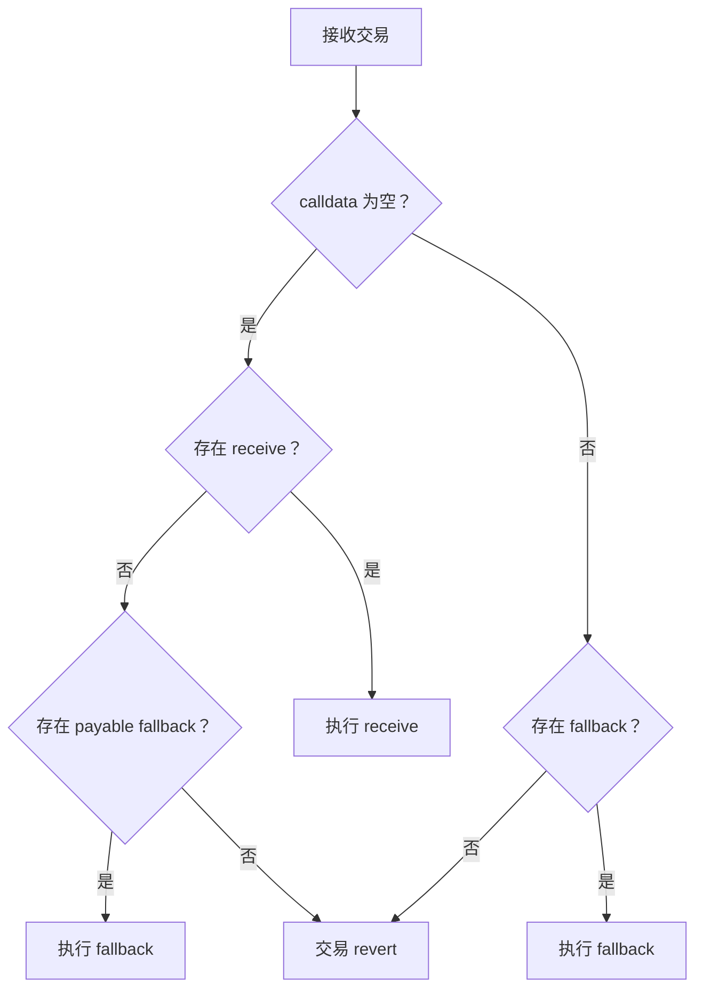

# Solidity Fallback 与 Receive 函数笔记

> **Solidity 版本**：0.8+  
> **核心作用**：处理合约接收 Ether 和未定义函数调用的特殊函数

---

## 一、核心概念对比

| 特性                | Receive 函数                          | Fallback 函数                         |
|---------------------|---------------------------------------|---------------------------------------|
| **触发条件**        | 纯 Ether 转账（无 calldata）          | 1. 调用不存在的函数；2. 无 Receive 时接收 Ether |
| **语法**            | `receive() external payable`         | `fallback() external [payable]`       |
| **参数/返回值**     | 无参数，无返回值                      | 无参数，无返回值                      |
| **Gas 限制**        | `transfer/send` 仅 2300 gas           | 同左，但 `call` 无限制                |
| **优先级**          | 高于 Fallback（纯转账场景）           | 低于 Receive（纯转账场景）            |
| **必须 payable**    | ✅ 是（否则无法接收 Ether）            | ⚠️ 仅当需要接收 Ether 时需要          |

---

## 二、Receive 函数详解

### 触发场景

- 直接向合约发送 Ether（`address(contract).transfer(1 ether)`）
- 交易的 `calldata` 为空（无函数调用数据）

### 语法规范

```solidity
receive() external payable {
    // 仅处理纯 Ether 接收
    emit Received(msg.sender, msg.value);
}
```

### 关键规则

1. **必须**标记为 `external payable`
2. 通过 `transfer()`/`send()` 触发时仅有 **2300 gas**（仅够：
   - 记录事件（`emit`）
   - 简单状态检查
   - ❌ 禁止：外部调用、复杂计算、存储修改
3. 优先级高于 Fallback 函数

---

## 三、Fallback 函数详解

### Fallback 触发场景

1. 调用合约中未定义的函数：`contract.unknownFunction()`
2. 向合约发送 Ether 且：
   - 未定义 Receive 函数，或
   - calldata 非空（即使有 Receive 函数）

### Fallback 语法规范

```solidity
// 处理未知函数调用（不可接收 Ether）
fallback() external {
    revert("Function not exists");
}

// 处理未知调用 + 接收 Ether
fallback() external payable {
    if(msg.data.length == 0) {
        handleEther(); // 处理转账
    } else {
        handleUnknownCall(); // 处理未知函数
    }
}
```

### Fallback 关键规则

1. **必须**标记为 `external`
2. 仅当需要接收 Ether 时才需 `payable`
3. 可通过 `msg.data` 区分调用类型：
   - `msg.data.length == 0` → 纯 Ether 转账
   - `msg.data.length > 0` → 未知函数调用

---

## 四、执行优先级流程图



> **关键结论**：  
>
> 1. 纯转账 → 优先 `receive()` → 其次 `payable fallback()`  
> 2. 未知函数调用 → 直接执行 `fallback()`（无论是否 payable）

---

## 五、安全注意事项 ⚠️

### 高风险场景

1. **重入攻击**  

   ```solidity
   // 危险示例：在 receive 中先转账后更新状态
   receive() external payable {
       (bool success,) = msg.sender.call{value: msg.value}("");
       require(success);
       balances[msg.sender] += msg.value; // 状态更新在转账后
   }
   ```

   **防御**：遵循 [Checks-Effects-Interactions 模式](https://docs.soliditylang.org/en/latest/security-considerations.html#use-the-checks-effects-interactions-pattern)

2. **Gas 耗尽**  
   - 2300 gas 限制内禁止：
     - 修改 storage 变量
     - 调用其他合约
     - 循环操作

3. **意外接收 Ether**  

   ```solidity
   // 安全实践：显式拒绝不需要的转账
   receive() external payable {
       revert("Direct transfers forbidden");
   }
   ```

---

## 六、历史版本演进

| Solidity 版本 | 处理方式                                                                 |
|---------------|--------------------------------------------------------------------------|
| < 0.6.0       | 仅 `function() external payable` 同时处理转账和未知调用                  |
| ≥ 0.6.0       | 拆分为 `receive()`（纯转账）和 `fallback()`（未知调用/备用转账处理）      |
| ≥ 0.8.0       | 未定义 payable 函数时，直接转账自动 revert（更安全的默认行为）           |

---

## 七、最佳实践清单 ✅

1. **最小化设计**  
   - 仅当需要接收 Ether 时才实现 `receive()`
   - 仅当需要代理调用/升级功能时才实现 `fallback()`

2. **拒绝意外转账**  

   ```solidity
   // 无需接收 Ether 的合约
   fallback() external { revert("No fallback"); }
   receive() external payable { revert("No receive"); }
   ```

3. **Gas 安全操作**  

   ```solidity
   receive() external payable {
       emit DepositReceived(msg.sender, msg.value); // 仅记录事件
   }
   ```

4. **显式错误信息**  

   ```solidity
   fallback() external {
       revert("Function selector not recognized: 0x" + msg.sig);
   }
   ```

5. **避免复杂逻辑**  
   - 所有状态修改应在普通函数中完成
   - Fallback/Receive 仅作路由或记录

> **官方文档**：[Special Functions](https://docs.soliditylang.org/en/latest/contracts.html#special-functions)  
> **审计重点**：所有 payable 函数 + 2300 gas 限制内的操作
