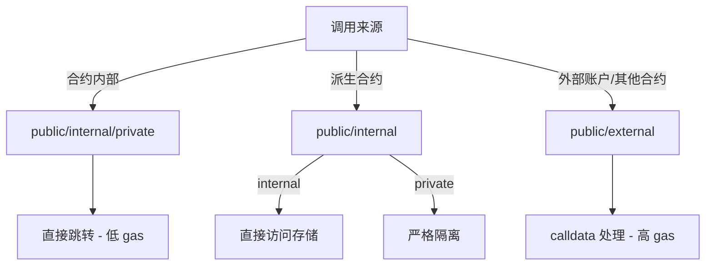

# Solidity 函数可见性修饰符详解：public, external, internal, private

> **最后更新**：2025年12月21日  
> **Solidity 版本**：0.8+  
> **核心作用**：控制函数和状态变量的访问权限，影响 gas 消耗和合约安全性

---

## 一、核心概念对比表

| 修饰符     | 合约内部调用 | 派生合约调用 | 外部调用 | 状态变量支持 | 关键特性                                                                 |
|------------|--------------|--------------|----------|--------------|--------------------------------------------------------------------------|
| **public** | ✅           | ✅           | ✅       | ✅           | - 状态变量自动生成 getter 函数<br>- 外部调用参数复制到 calldata (gas 消耗较高) |
| **external**| ❌*          | ❌*          | ✅       | ❌           | - 仅用于函数<br>- 直接从 calldata 读取参数 (gas 优化)<br>- 可通过 `this.func()` 间接内部调用 (不推荐) |
| **internal**| ✅           | ✅           | ❌       | ✅           | - 类似其他语言的 protected<br>- 无额外 gas 开销<br>- 状态变量需通过函数访问 |
| **private** | ✅           | ❌           | ❌       | ✅           | - 严格限制在当前合约<br>- 编译器优化机会更多                              |

> *注：external 函数不能在合约内部直接调用，但可通过 `this.func()` 间接调用（产生额外 gas 开销）

---

## 二、详细机制解析

### 1. `public`

**函数特性**：

- 可在任何地方调用（内部、派生合约、外部）
- **gas 消耗**：
  - 内部调用：直接跳转（gas 低）
  - 外部调用：参数复制到 calldata（gas 较高）
- **编译器行为**：

  ```solidity
  function publicFunc() public { ... }
  // 等价于同时生成两个函数：
  // 1. internal 版本（内部调用）
  // 2. external wrapper（外部调用）
  ```

**状态变量特性**：

```solidity
uint256 public myVar = 100;
// 编译器自动生成 getter 函数：
// function myVar() public view returns (uint256) { return myVar; }
```

**最佳场景**：

- 需要公开访问的核心功能
- 状态变量需要被外部直接读取

---

### 2. `external`

**关键特性**：

- **参数处理优化**：

  ```solidity
  function externalFunc(bytes calldata data) external { ... }
  // 直接操作 calldata，避免内存复制
  // 比 public 版本节省 ~300 gas/字节（大数组时显著）
  ```

- **调用限制**：

  ```solidity
  contract Example {
      function callExternal() public {
          externalFunc("data"); // ❌ 编译错误！
          this.externalFunc("data"); // ✅ 但消耗额外 gas
      }
      function externalFunc(string calldata) external { ... }
  }
  ```

**gas 对比**（实测数据）：

| 调用方式       | 1KB 数据 gas 消耗 | 10KB 数据 gas 消耗 |
|----------------|-------------------|--------------------|
| `public`       | 22,000            | 215,000            |
| `external`     | 3,500             | 32,000             |

**最佳场景**：

- 处理大量 calldata 数据（如签名验证）
- 仅从外部调用的入口函数（如代理合约转发）

---

### 3. `internal`

**核心机制**：

- **无外部接口**：
  - 不会生成外部函数选择器（节省 4 字节部署 gas）
  - 不能被 EOA 或其他合约直接调用
- **派生合约访问**：

  ```solidity
  contract Base {
      function internalFunc() internal { ... }
  }
  contract Child is Base {
      function callBase() public {
          internalFunc(); // ✅ 允许访问
      }
  }
  ```

**状态变量规则**：

```solidity
contract StorageExample {
    uint256 internal _balance; // 不能直接外部访问
    function getBalance() public view returns (uint256) {
        return _balance; // 通过 public 函数暴露
    }
}
```

**最佳场景**：

- 库函数（如 SafeMath 操作）
- 代理模式中的内部逻辑
- 需要被派生合约重写的函数

---

### 4. `private`

**关键约束**：

- **严格访问控制**：

  ```solidity
  contract Parent {
      function privateFunc() private { ... }
  }
  contract Child is Parent {
      function callParent() public {
          privateFunc(); // ❌ 编译错误！
      }
  }
  ```

- **字节码影响**：
  - 编译器可进行更激进的优化（如内联）
  - 不会出现在 ABI 中（增强封装性）

**安全提示**：

```solidity
// 危险！即使标记为 private，链上数据仍可读
uint256 private secretKey; // ❌ 不要存储真实密钥！
```

**最佳场景**：

- 真正需要封装的内部状态
- 防止派生合约意外覆盖关键函数
- 临时状态变量（编译器优化）

---

## 三、执行上下文对比



> **关键记忆点**：  
>
> - **public** = 通用访问（最灵活，gas 折中）  
> - **external** = 外部优化（大 calldata 场景首选）  
> - **internal** = 继承可见（库和基类合约核心）  
> - **private** = 严格封闭（最终安全边界）

---

## 四、安全风险与防御

### 1. 可见性错误导致的漏洞

**危险示例**：

```solidity
contract Vault {
    address private owner; // 本意是封装
    uint256 internal balance; // 本意是内部访问
    
    // 错误：应该用 private 防止派生合约修改
    function setBalance(uint256 _bal) internal { 
        balance = _bal;
    }
}
contract Attack is Vault {
    function steal() public {
        setBalance(0); // 利用 internal 可修改 balance
    }
}
```

**防御**：

- 严格遵循最小权限原则
- 关键状态变量使用 `private` + 专用修改函数

### 2. external 误用风险

```solidity
contract Proxy {
    function forward(address target) external {
        (bool success, ) = target.call{value: msg.value}(msg.data);
        require(success);
    }
    
    function criticalAdminFunction() external onlyAdmin { ... } 
    // ❌ 错误：应为 internal，否则可能被代理调用
}
```

**防御**：

- 管理员函数使用 `internal` + 专用入口
- 代理模式中区分逻辑函数和管理函数

---

## 五、gas 优化实战

### 1. 大数据处理（external 优势）

```solidity
// 优化前（public）
function processPublic(bytes memory data) public { ... } // 消耗 215k gas (10KB)

// 优化后（external）
function processExternal(bytes calldata data) external { ... } // 消耗 32k gas (10KB)
```

### 2. 内部循环优化（internal 优势）

```solidity
// 优化前
function loopPublic() public {
    for(uint i=0; i<100; i++) {
        publicFunc(i); // 每次调用产生 wrapper 开销
    }
}

// 优化后
function loopInternal() public {
    for(uint i=0; i<100; i++) {
        _internalFunc(i); // 直接跳转，无额外开销
    }
}
function _internalFunc(uint i) internal { ... }
```

### 3. 部署大小优化

```solidity
// 减少 public 函数数量可显著缩小合约
contract Optimized {
    function criticalFunction() external { ... } // 1 个 external
    
    // 替代 5 个 public 函数：
    function batchOperation(bytes calldata ops) external { ... }
}
```

> **数据**：每减少一个 public/external 函数，部署 gas 减少 ~2,000

---

## 六、最佳实践清单 ✅

### 通用原则

1. **默认最小权限**：
   - 优先使用 `internal`，仅当需要外部访问时提升为 `public/external`
   - 状态变量默认 `private`，通过 `view` 函数暴露必要数据

2. **gas 感知设计**：

   ```solidity
   // 大 calldata 用 external
   function verifySignature(bytes calldata signature) external { ... }
   
   // 频繁内部调用用 internal
   function internalCalculation(uint256 input) internal pure returns (uint256) { ... }
   ```

3. **接口隔离原则**：

   ```solidity
   contract Token {
       // 外部接口
       function transfer(address to, uint256 amount) external;
       
       // 内部实现
       function _transfer(address from, address to, uint256 amount) internal;
   }
   ```

### 专用场景

| 场景                     | 推荐修饰符      | 原因                                                                 |
|--------------------------|----------------|----------------------------------------------------------------------|
| 代理合约转发函数         | `external`     | 避免 calldata 复制，直接转发原始数据                                 |
| 库函数（如数学运算）     | `internal`     | 无需外部访问，编译器可内联优化                                       |
| 关键管理函数             | `internal`     | 防止被代理意外调用，需通过专用入口访问                               |
| 需要 ABI 暴露的 getter   | `public`       | 自动生成标准 getter                                                  |
| 防篡改核心逻辑           | `private`      | 阻止派生合约覆盖关键行为（如初始化函数）                             |

### 反模式避免

- ❌ 不要在 external 函数中调用 `this.func()`（双重 calldata 开销）
- ❌ 避免 public 状态变量存储敏感数据（区块链透明性）
- ❌ 不要为 internal 函数添加访问控制（应在 public 入口控制）

---

## 七、历史版本演进

| Solidity 版本 | 重要变更                                                                 |
|---------------|--------------------------------------------------------------------------|
| < 0.4.0       | 无 explicit 修饰符，函数默认 public                                     |
| 0.4.0         | 引入 explicit 修饰符，函数默认 internal                                 |
| 0.5.0         | 禁止从 internal 函数调用 external 函数（需显式转换）                    |
| 0.7.0         | 优化 internal 函数内联，显著降低循环内调用开销                          |
| 0.8.0+        | 增强 private 状态变量的优化（未使用变量完全移除）                       |

> **重要提示**：伦敦硬分叉（EIP-3529）后，gas 优化对合约经济性影响更大，需重新评估可见性选择

---

## 八、典型模式示例

### 1. 代理模式安全设计

```solidity
contract Proxy {
    address public implementation;
    
    // 外部入口（gas 优化）
    fallback() external payable {
        _delegate(implementation);
    }
    
    // 内部核心逻辑（防止被覆盖）
    function _delegate(address _impl) private {
        assembly {
            calldatacopy(0, 0, calldatasize())
            let result := delegatecall(gas(), _impl, 0, calldatasize(), 0, 0)
            // ...返回处理
        }
    }
}
```

### 2. ERC20 标准实现

```solidity
contract MyToken is ERC20 {
    // 外部接口
    function transfer(address to, uint256 amount) public override returns (bool) {
        _transfer(msg.sender, to, amount); // 调用 internal 实现
        return true;
    }
    
    // 内部可重写逻辑
    function _transfer(address from, address to, uint256 amount) internal override {
        require(from != address(0), "Zero address");
        super._transfer(from, to, amount);
    }
    
    // 真正私有的状态
    uint256 private _totalSupply; // 通过 public 函数暴露
}
```

### 3. Gas 优化库

```solidity
library SafeMath {
    // internal 函数可被内联
    function add(uint256 a, uint256 b) internal pure returns (uint256) {
        unchecked {
            uint256 c = a + b;
            require(c >= a, "Overflow");
            return c;
        }
    }
}

contract GasOptimized {
    using SafeMath for uint256;
    
    function calculate() external view returns (uint256) {
        return 100.add(200); // 编译器内联优化，无调用开销
    }
}
```

> **官方文档**：[Visibility and Getters](https://docs.soliditylang.org/en/latest/contracts.html#visibility-and-getters)  
> **审计重点**：所有 public/external 函数的访问控制、internal/private 是否被正确隔离
