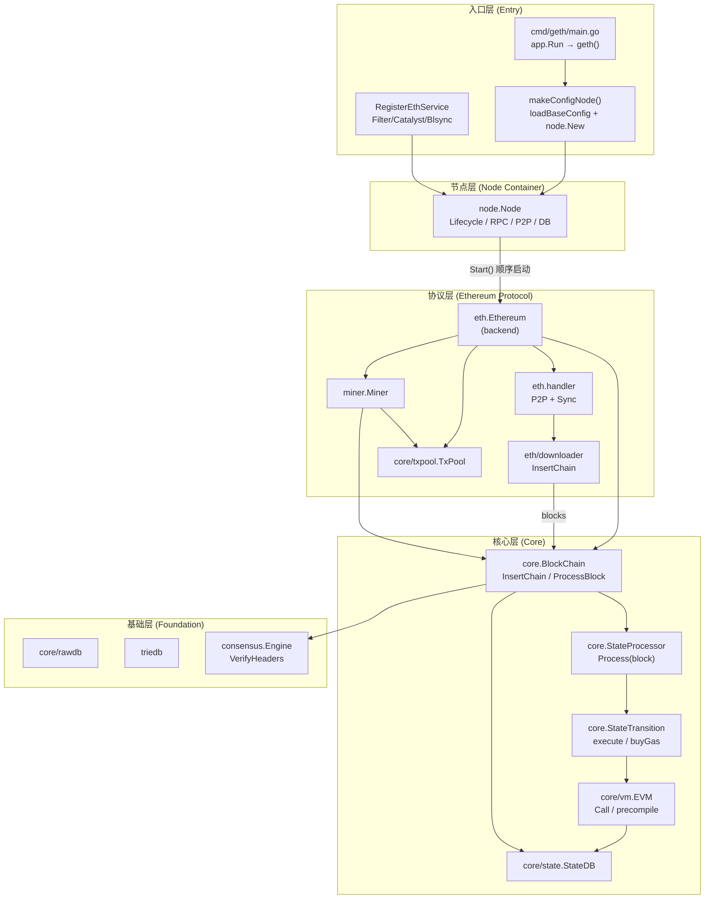
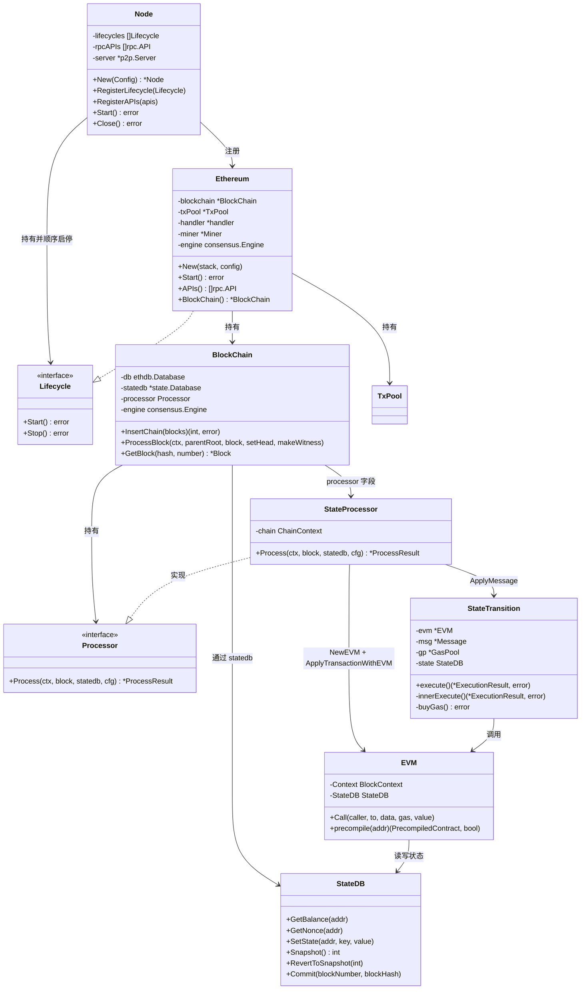
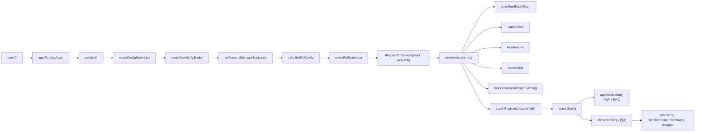
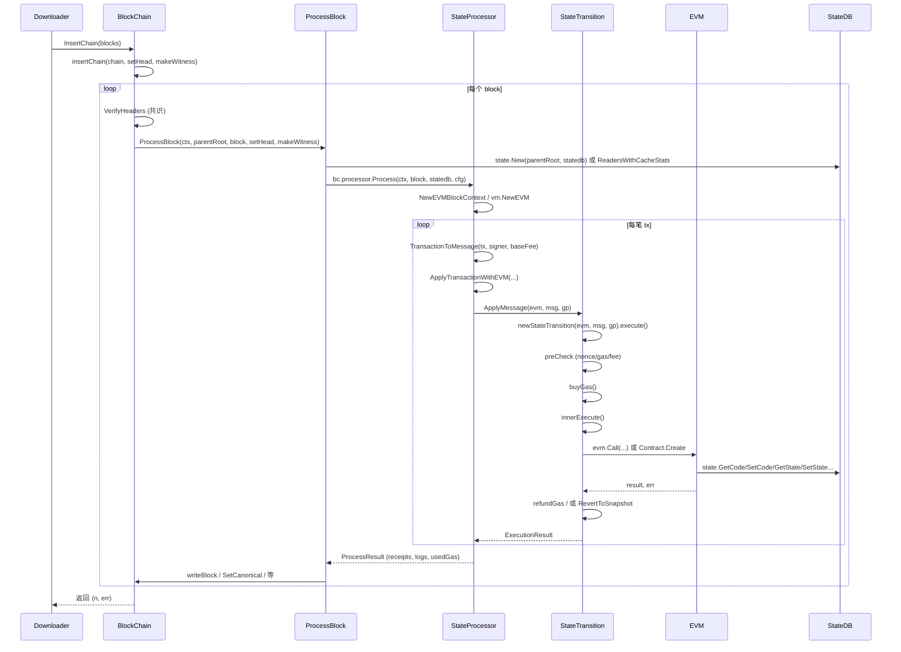
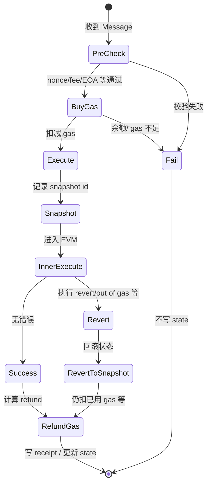

# op-geth 架构深度分析报告

**代码引用说明**：本文中的代码引用统一指向提交 `d0734fd5f44234cde3b0a7c4beb1256fc6feedef` 的 GitHub 永久链接，仓库地址为 [ethereum-optimism/op-geth](https://github.com/ethereum-optimism/op-geth)；带行号时统一使用 `blob/<commit>/<path>#Lx-Ly` 格式。

> 从造车、发动、上路到引擎细节 —— 一份面向人类的执行层源码认知地图

---

## 1. 图纸与架构（车是怎么造出来的）

### 1.1 核心定位

**op-geth** 是 Optimism 生态中的**执行层客户端**：在兼容以太坊协议与 EVM 的前提下，承担 L2 链的区块执行、状态推进、交易池与 P2P 同步；同时通过 Bedrock/Canyon/Ecotone/Fjord 等 fork、L1 成本与 Operator 成本、Interop/Supervisor 等扩展，将「车」造得既能跑以太坊规则，又能跑 OP Stack 的 Rollup 规则。

用一句话概括：**把 Geth 这辆「以太坊执行引擎」改造成既能跑 L1 又能跑 L2 的「通用执行车」，并接上 OP 的链配置、费用模型与互操作接口。**

---

### 1.2 模块职责表

| 目录/包               | 职责简述                                                                                                   |
| ------------------ | ------------------------------------------------------------------------------------------------------ |
| **cmd/geth**       | CLI 入口：解析参数、构建 `Node`、注册 Eth 服务与 Catalyst/Blsync 等，执行 `stack.Start()`。                                 |
| **node**           | 节点容器：生命周期（Lifecycle）、RPC/HTTP/WS/IPC、P2P Server、数据库与目录锁，**不关心具体协议**。                                   |
| **eth**            | 以太坊协议实现：BlockChain、TxPool、Handler、Downloader、Miner、GasOracle、APIBackend；注册为 Node 的 Lifecycle 与 API。    |
| **core**           | 链与执行核心：BlockChain（插入/重组）、StateProcessor、StateDB、StateTransition、GasPool、类型（Block/Transaction/Receipt）。 |
| **core/vm**        | EVM 运行时：EVM、BlockContext/TxContext、解释器、预编译、L1CostFunc/OperatorCostFunc 等 Rollup 上下文。                   |
| **core/state**     | 世界状态：StateDB 缓存、账户/存储/代码、Journal、Snapshot、Trie 读写与提交。                                                  |
| **core/txpool**    | 交易池：LegacyPool/BlobPool、Rollup 成本、入池校验、与 Handler 的广播/订阅。                                               |
| **consensus**      | 共识接口与实现：Beacon（PoS）、Engine 的 VerifyHeaders/Finalize 等；OP 链沿用 Beacon 做块头校验。                             |
| **params**         | 链参数：ChainConfig、Optimism fork 时间戳（Canyon/Ecotone/Fjord/…）、OptimismConfig。                              |
| **eth/downloader** | 区块同步：从对等节点拉取区块并调用 `BlockChain.InsertChain`。                                                            |
| **miner**          | 出块：从 TxPool 取交易、构建区块、执行、考虑 DA footprint 与 conditional 等 OP 扩展。                                         |

---

### 1.3 宏观架构图

---

### 1.4 静态结构图（核心类/接口与依赖）

---

## 2. 初始化与生命周期起点（车是怎么发动的）

### 2.1 部署/启动流程

启动链路的本质是：**先造好「车架」（Node）和「发动机总成」（Ethereum），再按注册顺序点火（Lifecycle.Start），最后打开网络与 RPC 门。**

**关键代码锚点：**

- **入口**：[cmd/geth/main.go:323-392](https://github.com/ethereum-optimism/op-geth/blob/d0734fd5f44234cde3b0a7c4beb1256fc6feedef/cmd/geth/main.go#L323-L392) → `app.Action = geth`，`main()` 中 `app.Run(os.Args)`。
- **造节点**：`makeConfigNode(ctx)`（[cmd/geth/config.go:164-224](https://github.com/ethereum-optimism/op-geth/blob/d0734fd5f44234cde3b0a7c4beb1256fc6feedef/cmd/geth/config.go#L164-L224)）→ [node/node.go:79-166](https://github.com/ethereum-optimism/op-geth/blob/d0734fd5f44234cde3b0a7c4beb1256fc6feedef/node/node.go#L79-L166) 中的 `node.New(&cfg.Node)`，得到空的 `stack`。
- **造引擎**：`makeFullNode(ctx)` 内 [cmd/utils/flags.go:2421-2429](https://github.com/ethereum-optimism/op-geth/blob/d0734fd5f44234cde3b0a7c4beb1256fc6feedef/cmd/utils/flags.go#L2421-L2429) `RegisterEthService(stack, &cfg.Eth)` → `eth.New(stack, cfg)`（[eth/backend.go:146-554](https://github.com/ethereum-optimism/op-geth/blob/d0734fd5f44234cde3b0a7c4beb1256fc6feedef/eth/backend.go#L146-L554)）。  
在 `eth.New` 中：打开 chainDb、`LoadChainConfig`、`CreateConsensusEngine`、`core.NewBlockChain`、`txpool.New`、`newHandler`、`miner.New`，最后 `stack.RegisterAPIs(eth.APIs())`、`stack.RegisterLifecycle(eth)`。
- **点火**：`stack.Start()`（[node/node.go:166-250](https://github.com/ethereum-optimism/op-geth/blob/d0734fd5f44234cde3b0a7c4beb1256fc6feedef/node/node.go#L166-L250)）→ `openEndpoints()`（P2P + RPC）→ 按注册顺序对每个 `lifecycle` 调用 `lifecycle.Start()`；Ethereum 的 `Start()` 里启动 `handler`、`dropper`、`filterMaps` 等。

---

### 2.2 状态基线（初始化完成后）

| 对象             | 状态含义                                                                                           |
| -------------- | ---------------------------------------------------------------------------------------------- |
| **Node**       | `state == runningState`；P2P Server 在跑；HTTP/WS/IPC 已监听；所有已注册的 Lifecycle 已执行 `Start()`。          |
| **Ethereum**   | BlockChain 已挂上 DB 与 genesis；TxPool 已就绪；Handler 在跑并可与 Downloader 协同同步；Miner 可被 Engine API 驱动出块。 |
| **BlockChain** | 当前头块、current block、finalized/safe 等从 DB 读出；`statedb`（state.Database）指向链上 state trie。           |
| **StateDB**    | 基于某 parent root 的 StateDB 仅在「执行某区块/某笔交易」时按需创建；基线是「链上已提交的 state root + 内存缓存」。                   |

也就是说：**初始化完成后，车架和发动机都在转，但「路」（链数据）可以还是空的，由后续的同步或 Engine API 写入区块再推进状态。**

---

## 3. 核心主线执行（车怎么跑）

### 3.1 主线识别

两条最核心的主线：

1. **区块同步并写入链**：Downloader 拉块 → `BlockChain.InsertChain` → `insertChain` → 逐块 `ProcessBlock` → 写库并可能更新 head。
2. **单块执行**：`ProcessBlock` → `StateProcessor.Process` → 逐笔交易 `ApplyMessage`（StateTransition）→ EVM 执行 → 写 receipt/state。

下面用时序图把「单块执行」这条主线画到「可落库」为止。

---

### 3.2 时序图：从 InsertChain 到 EVM 执行

**关键函数锚点：**

- [core/blockchain.go:1804-2086](https://github.com/ethereum-optimism/op-geth/blob/d0734fd5f44234cde3b0a7c4beb1256fc6feedef/core/blockchain.go#L1804-L2086)：`InsertChain` → `insertChain`；`ProcessBlock` 内 `bc.processor.Process(...)`。
- [core/state_processor.go:62-163](https://github.com/ethereum-optimism/op-geth/blob/d0734fd5f44234cde3b0a7c4beb1256fc6feedef/core/state_processor.go#L62-L163)：`Process` 内对每笔 tx 调 `ApplyTransactionWithEVM`，内部再调 `ApplyMessage`。
- [core/state_transition.go:223-507](https://github.com/ethereum-optimism/op-geth/blob/d0734fd5f44234cde3b0a7c4beb1256fc6feedef/core/state_transition.go#L223-L507)：`ApplyMessage` → `newStateTransition(evm, msg, gp).execute()` → `innerExecute()`；`innerExecute` 里调 `evm.Call` / 合约创建。
- [core/vm/evm.go:55-255](https://github.com/ethereum-optimism/op-geth/blob/d0734fd5f44234cde3b0a7c4beb1256fc6feedef/core/vm/evm.go#L55-L255)：`Call`、合约执行、预编译；状态读写通过 `StateDB` 接口。

---

### 3.3 状态流转：块/交易执行中的可回滚

执行单笔交易时，通过 StateDB 的 Snapshot/RevertToSnapshot 做「可回滚的状态子块」：先快照，执行，出错则回滚并扣 gas（或按 OP 规则处理 deposit 失败等）。

**代码锚点**：[core/state_transition.go:468-507](https://github.com/ethereum-optimism/op-geth/blob/d0734fd5f44234cde3b0a7c4beb1256fc6feedef/core/state_transition.go#L468-L507) 中 `execute()` 内 `snap := st.state.Snapshot()`，`st.innerExecute()` 失败时 `st.state.RevertToSnapshot(snap)`；deposit 失败分支也有单独回滚逻辑。

---

## 4. 引擎细节拆解（打开引擎盖）

### 4.1 子系统一：区块插入与重组（InsertChain / insertChain）

**作用**：保证「只接受有序、已验证、可连上当前链的区块」，并在存在分叉时通过 TD 等规则决定是否重组。

**核心逻辑概览：**

1. **预检**：链在内存中连续（number、parentHash 逐块校验）；`chainmu` 加锁，防止并发插块。
2. **并行恢复发件人**：`SenderCacher().RecoverFromBlocks(...)`，为后续校验与执行做准备。
3. **并行头验证**：`bc.engine.VerifyHeaders(bc, headers)`，共识层先对头做校验。
4. **迭代插入**：用 `insertIterator` 按验证结果与「是否已知块」决定是跳过、写已知块、走侧链、还是真正执行。
5. **单块执行**：对需要执行的块调用 `ProcessBlock(ctx, parent.Root, block, setHead, makeWitness)`；内部用 parent 的 state root 建 StateDB，再交给 `bc.processor.Process`。
6. **写库与 head**：根据 `ProcessBlock` 返回的 status（CanonStatTy / SideStatTy）写 block/body/receipts、更新 canonical hash、可能移动 head；若为侧链则只写块数据不挪 head。

**关键代码**：[core/blockchain.go:1843-2086](https://github.com/ethereum-optimism/op-geth/blob/d0734fd5f44234cde3b0a7c4beb1256fc6feedef/core/blockchain.go#L1843-L2086) 中 `insertChain`、`ProcessBlock`；侧链与重组在 `insertSideChain`、`reorg` 等中完成。

---

### 4.2 子系统二：StateTransition 与 EVM 的边界（费用与执行分离）

**作用**：把「谁付钱、付多少、是否允许执行」和「在 EVM 里怎么执行」严格分开，避免在 EVM 内部散落共识规则。

**分层要点：**

| 层级                       | 职责                                                                                                  | 典型逻辑                                                        |
| ------------------------ | --------------------------------------------------------------------------------------------------- | ----------------------------------------------------------- |
| **StateTransition（共识层）** | nonce、gas 上限、fee cap、EOA、blob 费用、SetCode 等校验；`buyGas` 扣费；mint（OP deposit）；deposit 失败时的回滚与 nonce 递增。 | `preCheck()`、`buyGas()`、`execute()` 内对 `IsDepositTx` 的错误处理。 |
| **EVM**                  | 仅做「在给定 gas 和 state 下执行调用」：执行 opcode、预编译、L1CostFunc/OperatorCostFunc 的调用（若在 Context 中提供）。            | `Call`、`Contract.Run`、预编译查找；不关心「这笔 tx 是否允许被包含」。             |

这样设计的好处：**共识规则变更（例如新的 fee 规则、OP 的 L1 成本）主要改 StateTransition 或 Context，而不必改 EVM 解释器核心。**

**代码锚点**：[core/state_transition.go:223-507](https://github.com/ethereum-optimism/op-geth/blob/d0734fd5f44234cde3b0a7c4beb1256fc6feedef/core/state_transition.go#L223-L507) 的 `ApplyMessage`、`preCheck`、`buyGas`、`execute`/`innerExecute`；[core/vm/evm.go:55-71](https://github.com/ethereum-optimism/op-geth/blob/d0734fd5f44234cde3b0a7c4beb1256fc6feedef/core/vm/evm.go#L55-L71) 的 `BlockContext.L1CostFunc` / `OperatorCostFunc`（OP 扩展）。

---

### 4.3 子系统三：OP Stack 在 txpool 与费用上的延伸

**作用**：在保持「一个通用 TxPool 接口」的前提下，让 L2 交易带上前缀成本（L1 数据费、Operator 费等），并在入池与排序时考虑进去。

**要点：**

- **Rollup 成本**：[core/txpool/rollup.go:37-48](https://github.com/ethereum-optimism/op-geth/blob/d0734fd5f44234cde3b0a7c4beb1256fc6feedef/core/txpool/rollup.go#L37-L48) 定义 `RollupCostFunc`、`TotalTxCost(tx, rollupCostFn)`；总成本 = 执行成本 + rollup 成本（若 `rollupCostFn` 非 nil）。  
这样 LegacyPool 等可以在排序/驱逐时按「总成本」而不仅是 gas price 来决策。
- **交易类型**：[core/types/transaction.go:806-810](https://github.com/ethereum-optimism/op-geth/blob/d0734fd5f44234cde3b0a7c4beb1256fc6feedef/core/types/transaction.go#L806-L810) 中 `TxByNonce`；OP 的 deposit/system tx 通过 `IsSystemTx`、`IsDepositTx` 等在 StateTransition 里分支。
- **链配置**：[params/config_op.go:8-93](https://github.com/ethereum-optimism/op-geth/blob/d0734fd5f44234cde3b0a7c4beb1256fc6feedef/params/config_op.go#L8-L93) 中 Bedrock/Canyon/Ecotone/Fjord/… 的 fork 时间戳与 `opCheckCompatible`、`OptimismConfig`（EIP-1559 参数等），保证全链路按 OP 规则开关特性。

**代码锚点**：[core/txpool/rollup.go:37-48](https://github.com/ethereum-optimism/op-geth/blob/d0734fd5f44234cde3b0a7c4beb1256fc6feedef/core/txpool/rollup.go#L37-L48) 的 `TotalTxCost`；[core/types/transaction.go:806-810](https://github.com/ethereum-optimism/op-geth/blob/d0734fd5f44234cde3b0a7c4beb1256fc6feedef/core/types/transaction.go#L806-L810) 的 `TxByNonce`；[params/config_op.go:8-93](https://github.com/ethereum-optimism/op-geth/blob/d0734fd5f44234cde3b0a7c4beb1256fc6feedef/params/config_op.go#L8-L93) 的 `opCheckCompatible`、`OptimismConfig`。

---

## 5. 扩展面与周边生态（可加装的配件）

### 5.1 扩展机制概览

| 机制                   | 说明                                             | 接入方式                                                                           |
| -------------------- | ---------------------------------------------- | ------------------------------------------------------------------------------ |
| **Lifecycle**        | 与 Node 同进程启停的服务；先注册再 `Start()`，关闭时逆序 `Stop()`。 | `stack.RegisterLifecycle(impl)`，实现 `Start()/Stop()`。                           |
| **RPC API**          | 对外暴露的 JSON-RPC 命名空间。                           | `stack.RegisterAPIs([]rpc.API{{Namespace, Service}})`。                         |
| **Protocol**         | P2P 子协议。                                       | `stack.RegisterProtocols(protocols)`。                                          |
| **HTTP Handler**     | 自定义 HTTP 路径。                                   | `stack.RegisterHandler(name, path, handler)`。                                  |
| **Tracer**           | 执行追踪。                                          | `vm.Config.Tracer`；或通过 `eth.APIs()` 里注册的 tracer API 动态挂。                       |
| **IngressFilter**    | 交易入池前过滤（如 OP Interop）。                         | `txpool.New(..., poolFilters)`，filter 实现 `txpool.IngressFilter`。               |
| **Consensus Engine** | 可插拔共识。                                         | `ethconfig.CreateConsensusEngine(chainConfig, chainDb)` 返回 `consensus.Engine`。 |

### 5.2 安全接入要点

- **Lifecycle**：只在 Node 未启动时注册（`state == initializingState`）；不要在 `Start()` 里阻塞过久，避免拖慢整节点启动。
- **API**：通过 `Authenticated: true` 区分需认证的 API；敏感操作（如 Engine API）应配合 JWT 等，由上层部署保证。
- **IngressFilter**：过滤逻辑应是只读或轻量；避免在 filter 里做重 IO 或不可控 RPC，以免拖慢入池路径。
- **Tracer**：执行期每步都可能回调，实现要高效；避免在 tracer 里做网络或重计算。

---

## 6. 安全防撞与最佳实践（防撞测试）

### 6.1 风险矩阵

| 风险点            | 边界/场景                    | 应对策略（源码中的体现）                                                             |
| -------------- | ------------------------ | ------------------------------------------------------------------------ |
| **并发插块**       | 多协程同时调 `InsertChain`     | `chainmu` 互斥；`insertChain` 内持锁执行整条链。                                     |
| **状态写坏**       | 单笔 tx 执行失败               | StateDB `Snapshot`/`RevertToSnapshot`；deposit 失败单独回滚并递增 nonce。           |
| **重组导致一致性问题**  | 新 head 与已对外提供的 block 不一致 | 通过 ChainHeadEvent 等通知订阅方；业务层需能处理「之前给的 block 被重组掉」。                       |
| **未验证块驱动状态**   | 先写库再验证                   | 流程上先 `VerifyHeaders`、再 `ProcessBlock`；ProcessBlock 内执行失败则整块不写 canonical。 |
| **RPC 暴露敏感接口** | Engine API、Admin 等       | 通过 HTTP 鉴权、`Authenticated`、以及部署侧 JWT/白名单 控制。                             |
| **交易池 DoS**    | 大量低质量 tx 占满池子            | TxPool 有 price limit、account 上限、Rollup 总成本驱逐；IngressFilter 可再拦一层。        |
| **共识分叉配置错误**   | 链配置与真实 fork 不一致          | `params` 里 fork 时间戳/块高；`opCheckCompatible` 在配置变更时做兼容性检查。                 |

### 6.2 安全哲学（可复用的设计模式）

- **锁与生命周期**：Node 的 `state`（initializing / running / closed）与 `startStopLock` 保证「注册只在构造阶段、启停单线程」；Ethereum 的 handler、txpool 等再在各自边界内用更细的锁。
- **状态不可变 + 快照回滚**：StateDB 的修改先写 journal，提交前可随时 `RevertToSnapshot`，避免「执行到一半出错却留下一半脏状态」。
- **执行与校验分离**：校验（nonce、fee、EOA、gas cap）在 StateTransition；EVM 只负责「在给定上下文中执行」，减少在解释器里写死共识规则。
- **接口边界**：BlockChain 通过 `Processor` 接口调用执行器，便于测试或替换实现；共识通过 `consensus.Engine` 抽象，便于插 OP Beacon 等。

---

## 附录：关键文件与函数速查

| 功能        | 文件                                                                                                                                                                                                                                                                                                              | 函数/要点                                                         |
| --------- | --------------------------------------------------------------------------------------------------------------------------------------------------------------------------------------------------------------------------------------------------------------------------------------------------------------- | ------------------------------------------------------------- |
| 进程入口      | [cmd/geth/main.go:323-392](https://github.com/ethereum-optimism/op-geth/blob/d0734fd5f44234cde3b0a7c4beb1256fc6feedef/cmd/geth/main.go#L323-L392)                                                                                                                                                               | `main` → `app.Run` → `geth`                                   |
| 节点与配置     | [cmd/geth/config.go:164-224](https://github.com/ethereum-optimism/op-geth/blob/d0734fd5f44234cde3b0a7c4beb1256fc6feedef/cmd/geth/config.go#L164-L224)、[cmd/utils/flags.go:2421-2429](https://github.com/ethereum-optimism/op-geth/blob/d0734fd5f44234cde3b0a7c4beb1256fc6feedef/cmd/utils/flags.go#L2421-L2429) | `makeConfigNode`、`makeFullNode`、`RegisterEthService`          |
| 协议服务构造    | [eth/backend.go:146-554](https://github.com/ethereum-optimism/op-geth/blob/d0734fd5f44234cde3b0a7c4beb1256fc6feedef/eth/backend.go#L146-L554)                                                                                                                                                                   | `eth.New`、`Ethereum.Start`、`APIs()`                           |
| 节点生命周期    | [node/node.go:79-166](https://github.com/ethereum-optimism/op-geth/blob/d0734fd5f44234cde3b0a7c4beb1256fc6feedef/node/node.go#L79-L166)、[node/node.go:557-582](https://github.com/ethereum-optimism/op-geth/blob/d0734fd5f44234cde3b0a7c4beb1256fc6feedef/node/node.go#L557-L582)                               | `New`、`Start`、`RegisterLifecycle`、`RegisterAPIs`              |
| 块插入       | [core/blockchain.go:1804-2086](https://github.com/ethereum-optimism/op-geth/blob/d0734fd5f44234cde3b0a7c4beb1256fc6feedef/core/blockchain.go#L1804-L2086)                                                                                                                                                       | `InsertChain`、`insertChain`、`ProcessBlock`                    |
| 块内执行      | [core/state_processor.go:62-163](https://github.com/ethereum-optimism/op-geth/blob/d0734fd5f44234cde3b0a7c4beb1256fc6feedef/core/state_processor.go#L62-L163)                                                                                                                                                   | `Process`、`ApplyTransactionWithEVM`                           |
| 单笔交易状态迁移  | [core/state_transition.go:223-507](https://github.com/ethereum-optimism/op-geth/blob/d0734fd5f44234cde3b0a7c4beb1256fc6feedef/core/state_transition.go#L223-L507)                                                                                                                                               | `ApplyMessage`、`execute`、`innerExecute`、`buyGas`、`preCheck`   |
| EVM 执行    | [core/vm/evm.go:55-255](https://github.com/ethereum-optimism/op-geth/blob/d0734fd5f44234cde3b0a7c4beb1256fc6feedef/core/vm/evm.go#L55-L255)                                                                                                                                                                     | `Call`、`BlockContext`/`TxContext`、L1CostFunc/OperatorCostFunc |
| 状态缓存      | [core/state/statedb.go:78-1438](https://github.com/ethereum-optimism/op-geth/blob/d0734fd5f44234cde3b0a7c4beb1256fc6feedef/core/state/statedb.go#L78-L1438)                                                                                                                                                     | StateDB、Snapshot、RevertToSnapshot、Commit                      |
| Rollup 成本 | [core/txpool/rollup.go:37-48](https://github.com/ethereum-optimism/op-geth/blob/d0734fd5f44234cde3b0a7c4beb1256fc6feedef/core/txpool/rollup.go#L37-L48)                                                                                                                                                         | `RollupCostFunc`、`TotalTxCost`                                |
| OP 链配置    | [params/config_op.go:8-93](https://github.com/ethereum-optimism/op-geth/blob/d0734fd5f44234cde3b0a7c4beb1256fc6feedef/params/config_op.go#L8-L93)                                                                                                                                                               | `opCheckCompatible`、Optimism fork 时间戳、`OptimismConfig`        |

---

*报告基于当前 op-geth 代码库的阅读与调用链梳理整理，适合作为「从造车到上路」的认知地图与二次深入阅读的锚点。*

---

## 7. 延伸阅读

- [OP_GETH_ENGINE_API_BLOCK_BUILDING.md](https://github.com/ethereum-optimism/op-geth/blob/d0734fd5f44234cde3b0a7c4beb1256fc6feedef/docs/OP_GETH_ENGINE_API_BLOCK_BUILDING.md)：聚焦 `ForkchoiceUpdated` / `GetPayload` / `NewPayload` 的闭环。
- [OP_GETH_JOVIAN_BLOCK_BUILDING.md](https://github.com/ethereum-optimism/op-geth/blob/d0734fd5f44234cde3b0a7c4beb1256fc6feedef/docs/OP_GETH_JOVIAN_BLOCK_BUILDING.md)：聚焦 Jovian 特有字段、额外校验与 DA 相关行为。
- [OP_GETH_TX_ORDERING.md](https://github.com/ethereum-optimism/op-geth/blob/d0734fd5f44234cde3b0a7c4beb1256fc6feedef/docs/OP_GETH_TX_ORDERING.md)：聚焦区块构建时交易挑选与排序的源码路径。

