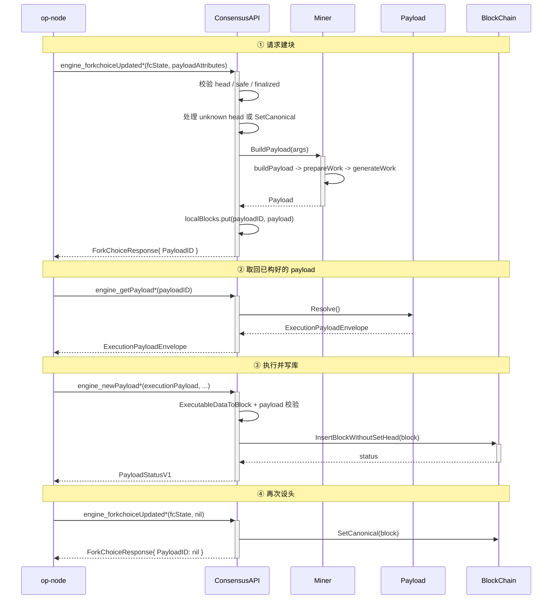
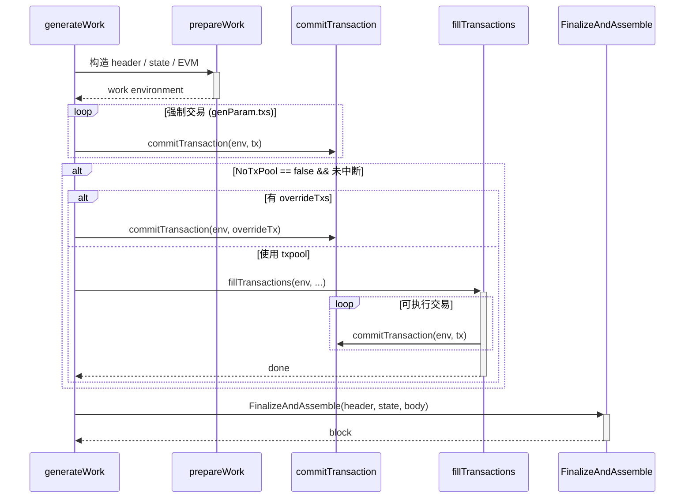
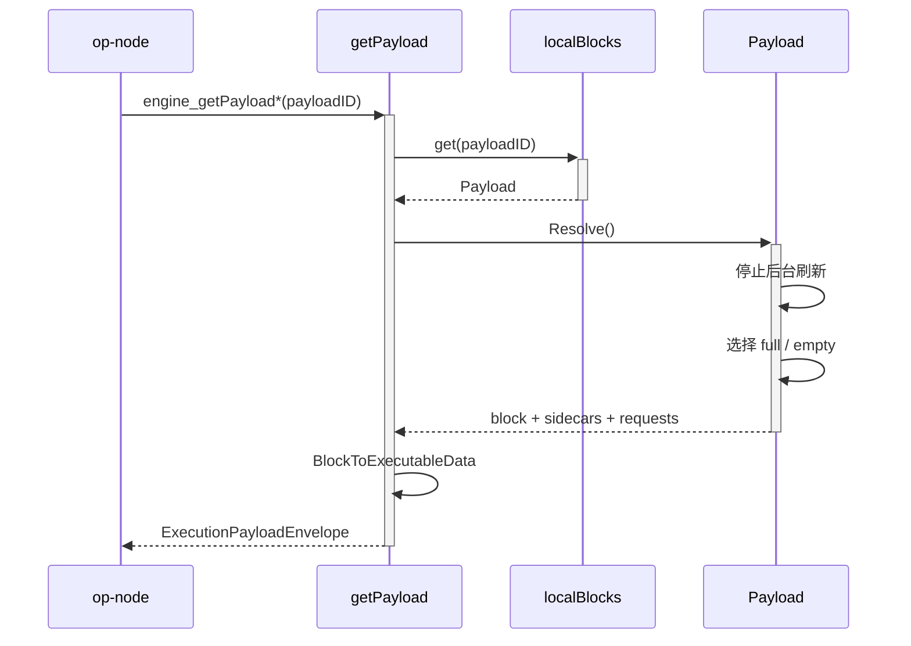
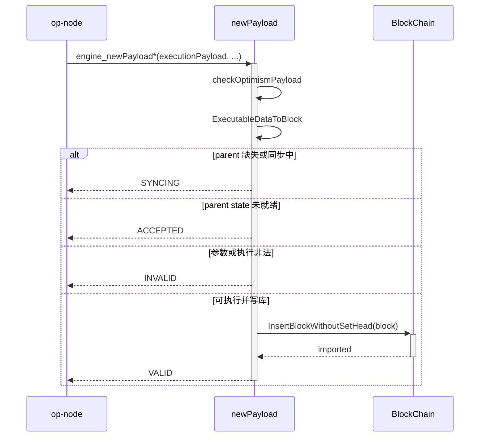
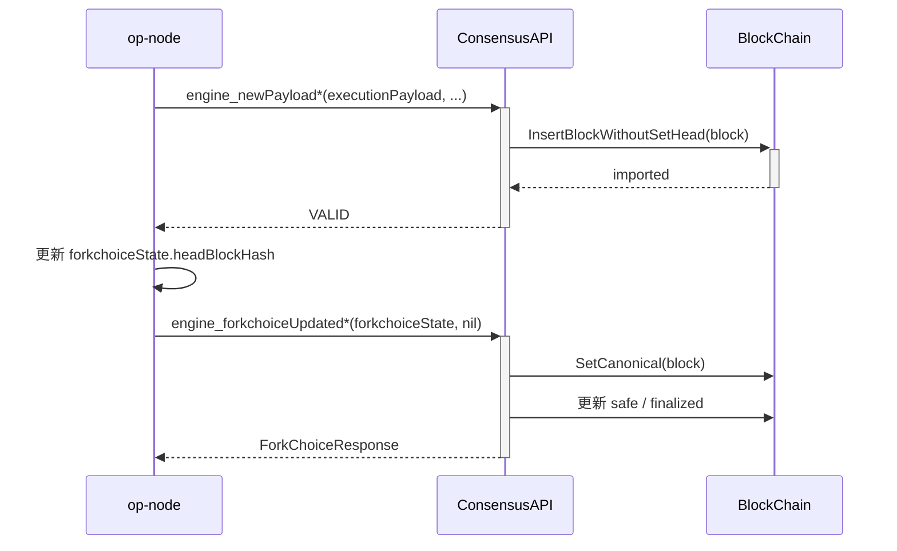

# op-geth 构建区块的过程

本文档的重点不是解释 Engine API 版本号怎么对应，而是回答一个更直接的问题：

**在 Jovian 相关路径下，op-node 发起一次建块请求之后，op-geth 是如何把一个区块真正构出来、返回出去、执行落库，并最终设成 canonical head 的？**

为避免版本号喧宾夺主，正文主线统一围绕“构建区块过程”展开。版本差异只在后文用一小节简述。

## TL;DR

- 一轮完整闭环可以先记成：`ForkchoiceUpdated(带 payloadAttributes) -> BuildPayload -> GetPayload -> NewPayload -> ForkchoiceUpdated(nil)`
- 真正把候选区块构出来的是 `BuildPayload -> generateWork`，不是 `GetPayload`
- `GetPayload` 只是按 `payloadID` 从 `localBlocks` 中取出当前最优结果，并导出为 `ExecutionPayloadEnvelope`
- `NewPayload` 负责把 payload 转成区块、再次执行校验并写库，但不会直接把它设成 canonical head
- 最后一次 `ForkchoiceUpdated(nil)` 才负责把新块设为 canonical head
- Jovian 路径最值得额外关注的增量语义主要是：`minBaseFee`、Jovian `extraData`、DA footprint 与首笔 L1 attributes deposit transaction
- 如果链已进入 Amsterdam，则主流程不变，但接口版本会切换到 `ForkchoiceUpdatedV4 -> GetPayloadV6 -> NewPayloadV5`，并额外要求 `slotNumber`

如果必须给一个具体路径作为例子，本文默认以 **Prague-era Jovian** 为例：

- `engine_forkchoiceUpdatedV3`
- `engine_getPayloadV4`
- `engine_newPayloadV4`

如果链已经进入 Amsterdam，则主线过程本身不变，只需要把方法名替换成：

- `engine_forkchoiceUpdatedV4`
- `engine_getPayloadV6`
- `engine_newPayloadV5`

Jovian 自己的关键影响主要有四个：

- `minBaseFee`
- Jovian 格式的 `extraData`
- DA footprint 复用 `blobGasUsed`
- 首笔 L1 attributes deposit transaction 的校验

## 目录

- [op-geth 构建区块的过程](#op-geth-构建区块的过程)
  - [目录](#目录)
  - [1. 阅读前提](#1-阅读前提)
    - [1.1 本文关注的问题](#11-本文关注的问题)
    - [1.2 阅读范围与默认假设](#12-阅读范围与默认假设)
  - [2. 接口版本映射](#2-接口版本映射)
    - [2.1 执行层 fork 与 Engine API 版本对应关系](#21-执行层-fork-与-engine-api-版本对应关系)
    - [2.2 Jovian 前提下的常见接口路径](#22-jovian-前提下的常见接口路径)
  - [3. 核心数据结构](#3-核心数据结构)
  - [4. 区块构建总览](#4-区块构建总览)
    - [4.1 调用链：这一段谁调用谁](#41-调用链这一段谁调用谁)
    - [4.2 时序图：这一段先后顺序](#42-时序图这一段先后顺序)
    - [4.3 阅读结论：看完这张图要记住什么](#43-阅读结论看完这张图要记住什么)
  - [5. 区块构建核心流程](#5-区块构建核心流程)
    - [5.1 ForkchoiceUpdated：触发区块构建与链头准备](#51-forkchoiceupdated触发区块构建与链头准备)
      - [5.1.1 op-node 提交什么](#511-op-node-提交什么)
      - [5.1.2 op-geth 收到后先做什么](#512-op-geth-收到后先做什么)
      - [5.1.3 什么时候真正开始建块](#513-什么时候真正开始建块)
    - [5.2 BuildPayload：构建参数与执行上下文](#52-buildpayload构建参数与执行上下文)
      - [5.2.1 `BuildPayloadArgs` 里放了什么](#521-buildpayloadargs-里放了什么)
      - [5.2.2 `payloadID` 是怎么来的](#522-payloadid-是怎么来的)
      - [5.2.3 `localBlocks` 里到底存的是什么](#523-localblocks-里到底存的是什么)
    - [5.3 Miner / Worker：执行环境准备](#53-miner--worker执行环境准备)
      - [5.3.1 `BuildPayload` 先分两条路](#531-buildpayload-先分两条路)
      - [路径 A：`NoTxPool == true`](#路径-anotxpool--true)
      - [路径 B：使用 txpool](#路径-b使用-txpool)
      - [5.3.2 `prepareWork` 在做什么](#532-preparework-在做什么)
      - [5.3.3 Jovian 在 `prepareWork` 阶段加了什么限制](#533-jovian-在-preparework-阶段加了什么限制)
      - [5.3.4 调用链：这一段谁调用谁](#534-调用链这一段谁调用谁)
      - [5.3.5 时序图：这一段先后顺序](#535-时序图这一段先后顺序)
      - [5.3.6 阅读结论：看完这张图要记住什么](#536-阅读结论看完这张图要记住什么)
    - [5.4 `generateWork`：交易装载与区块定型](#54-generatework交易装载与区块定型)
      - [5.4.1 `generateWork` 的主流程](#541-generatework-的主流程)
      - [5.4.2 强制交易先执行](#542-强制交易先执行)
      - [5.4.3 `NoTxPool` 和 txpool 路径的区别](#543-notxpool-和-txpool-路径的区别)
      - [`NoTxPool == true`](#notxpool--true)
      - [使用 txpool](#使用-txpool)
      - [5.4.4 `commitTransaction` 真正做了什么](#544-committransaction-真正做了什么)
      - [5.4.5 调用链：这一段谁调用谁](#545-调用链这一段谁调用谁)
      - [5.4.6 时序图：这一段先后顺序](#546-时序图这一段先后顺序)
      - [5.4.7 `FinalizeAndAssemble` 在哪里定型区块](#547-finalizeandassemble-在哪里定型区块)
    - [5.5 `GetPayload`：payload 导出](#55-getpayloadpayload-导出)
      - [5.5.1 `GetPayload` 不是重新建块](#551-getpayload-不是重新建块)
      - [5.5.2 `Resolve()` 为什么重要](#552-resolve-为什么重要)
      - [5.5.3 调用链：这一段谁调用谁](#553-调用链这一段谁调用谁)
      - [5.5.4 时序图：这一段先后顺序](#554-时序图这一段先后顺序)
      - [5.5.5 阅读结论：看完这张图要记住什么](#555-阅读结论看完这张图要记住什么)
    - [5.6 `NewPayload`：执行校验与写库](#56-newpayload执行校验与写库)
      - [5.6.1 `NewPayload` 的职责](#561-newpayload-的职责)
      - [5.6.2 进入 `newPayload(...)` 后的关键步骤](#562-进入-newpayload-后的关键步骤)
      - [5.6.3 区块最终是在哪个流程被执行的](#563-区块最终是在哪个流程被执行的)
      - [5.6.4 为什么会返回不同状态](#564-为什么会返回不同状态)
      - [5.6.5 Jovian 在执行阶段增加了什么](#565-jovian-在执行阶段增加了什么)
      - [5.6.6 调用链：这一段谁调用谁](#566-调用链这一段谁调用谁)
      - [5.6.7 时序图：这一段先后顺序](#567-时序图这一段先后顺序)
      - [5.6.8 阅读结论：看完这张图要记住什么](#568-阅读结论看完这张图要记住什么)
    - [5.7 `ForkchoiceUpdated(nil)`：canonical head 更新](#57-forkchoiceupdatednilcanonical-head-更新)
      - [5.7.1 调用链：这一段谁调用谁](#571-调用链这一段谁调用谁)
      - [5.7.2 时序图：这一段先后顺序](#572-时序图这一段先后顺序)
      - [5.7.3 阅读结论：看完这张图要记住什么](#573-阅读结论看完这张图要记住什么)
  - [6. Jovian 与 OP Stack 扩展语义](#6-jovian-与-op-stack-扩展语义)
    - [6.1 强制交易与 `noTxPool`](#61-强制交易与-notxpool)
    - [6.2 `minBaseFee` 约束](#62-minbasefee-约束)
    - [6.3 `extraData` 编码](#63-extradata-编码)
    - [6.4 DA footprint 与 `blobGasUsed` 复用](#64-da-footprint-与-blobgasused-复用)
    - [6.5 Amsterdam 下的 `slotNumber`](#65-amsterdam-下的-slotnumber)
  - [7. 代码入口索引](#7-代码入口索引)
  - [8. 常见问题与边界情况](#8-常见问题与边界情况)
    - [为什么 `GetPayload` 不是重新建块？](#为什么-getpayload-不是重新建块)
    - [为什么 `NewPayload` 不设头？](#为什么-newpayload-不设头)
    - [为什么一次闭环里有两次 `ForkchoiceUpdated`？](#为什么一次闭环里有两次-forkchoiceupdated)
    - [如果某一步失败了会怎样？](#如果某一步失败了会怎样)
    - [为什么 `NoTxPool` 需要特别强调？](#为什么-notxpool-需要特别强调)
  - [9. 延伸阅读](#9-延伸阅读)

---

## 1. 阅读前提

### 1.1 本文关注的问题

这篇文档聚焦 `op-node -> op-geth` 这一段执行层建块闭环，目标是讲清楚：

1. 谁触发建块
2. 谁真正把区块构出来
3. 谁把区块写进链里
4. 谁把新块设成 canonical head

### 1.2 阅读范围与默认假设

正文默认假设：

- op-node 已经准备好一轮新的 `forkchoiceState`
- `payloadAttributes` 合法
- 当前节点处于可正常推进的一般路径上

不作为主线展开的内容有：

- 各 Engine API 版本号的详细演进史
- 每个 fork 的完整接口矩阵
- 更底层的交易排序策略
- `witness` 参数（与 Verkle 树无状态验证相关，在 `buildPayload` 和 `generateWork` 签名中出现，但与 Jovian 建块主线无直接关系，本文不展开）

这些内容只做补充说明，避免打断读者理解“构建区块过程”的主线。

---

## 2. 接口版本映射

这一节只保留最小必要信息，帮助你在进入主流程前先把方法名对应关系记住。

Jovian 不是 Engine API 的版本名；实际使用哪个方法版本，取决于同时生效的 EL fork。

这里需要先明确区分 3 个容易混在一起的概念：

- **Ethereum / EL fork**
  - 指执行层（Execution Layer）的分叉语义，例如 `Paris`、`Shanghai`、`Cancun`、`Prague`、`Osaka`、`Amsterdam`
  - 它决定当前执行层处于哪套协议规则下，也决定 `Engine API` 该使用哪个版本
- **Optimism fork**
  - 指 OP Stack / Optimism 自己的升级语义，例如 `Bedrock`、`Ecotone`、`Holocene`、`Isthmus`、`Jovian`
  - 它不直接决定 `engine_forkchoiceUpdatedV* / engine_getPayloadV* / engine_newPayloadV*` 的版本号
  - 它主要决定的是 OP 专属字段和校验语义，例如 `minBaseFee`、Jovian `extraData`、DA footprint、L1 attributes deposit transaction 等
- **Engine API 版本**
  - 指 JSON-RPC 方法名上的版本后缀，例如 `ForkchoiceUpdatedV3`、`GetPayloadV6`、`NewPayloadV5`
  - 它是执行层对外暴露的接口版本，不等同于 `Jovian` 这类 OP fork 名称

因此，这一节里的 “Fork 与 Engine API 版本对应关系” 主要是在说：

- **执行层 fork（Ethereum / EL fork）如何映射到 Engine API 版本**

而本文讨论 `Jovian` 时，关注的是另一层含义：

- **在既定 Engine API 版本之上，op-geth 额外施加哪些 Optimism / OP Stack 规则**

可以把这两层关系记成一句话：

- **EL fork 决定接口版本，Optimism fork 决定 OP 扩展语义**

本文中提到的 `ForkchoiceUpdated 版本`、`GetPayload 版本`、`NewPayload 版本`，指的都是对应 Engine API JSON-RPC 方法名上的版本后缀，例如：

- `engine_forkchoiceUpdatedV4`
- `engine_getPayloadV6`
- `engine_newPayloadV5`

### 2.1 执行层 fork 与 Engine API 版本对应关系

这一张表只描述 **执行层 fork（EL fork）与 Engine API 版本** 的对应关系，不描述 Optimism / OP Stack fork 的版本映射。

需要特别注意：

- **EL fork 与 OP fork 不是一一对应关系**
- 实际运行时，op-geth 会同时受到两层规则约束
  - 第一层：由 **EL fork** 决定使用哪一组 `ForkchoiceUpdated / GetPayload / NewPayload` 接口版本
  - 第二层：由 **OP fork** 决定这些接口承载的 payload 还需要满足哪些 OP 专属字段和校验语义

例如，链可能同时处于：

- **Amsterdam（EL fork）+ Jovian（OP fork）**

此时：

- 接口版本上应走 `ForkchoiceUpdatedV4 -> GetPayloadV6 -> NewPayloadV5`
- 同时 payload 语义上还要额外满足 Jovian 的 OP 扩展规则，例如 `minBaseFee`、Jovian `extraData`、DA footprint 与首笔 L1 attributes deposit transaction 等要求

| 执行层 fork（EL fork） | ForkchoiceUpdated 版本 | GetPayload 版本 | NewPayload 版本 | 备注 |
| --- | --- | --- | --- | --- |
| Paris / Shanghai | `ForkchoiceUpdatedV1` / `V2` | `GetPayloadV1` / `V2` | `NewPayloadV1` / `V2` | 早期路径，接口基本接近同号演进 |
| Cancun | `ForkchoiceUpdatedV3` | `GetPayloadV3` | `NewPayloadV3` | `PayloadV3 + Cancun` |
| Prague | `ForkchoiceUpdatedV3` | `GetPayloadV4` | `NewPayloadV4` | 仍是 `PayloadV3`，但 fork 已切到 Prague |
| Osaka / BPO* | `ForkchoiceUpdatedV3` | `GetPayloadV5` | `NewPayloadV4` | `GetPayload` 升到 V5，`NewPayload` 仍是 V4 |
| Amsterdam | `ForkchoiceUpdatedV4` | `GetPayloadV6` | `NewPayloadV5` | `PayloadV4`，额外要求 `slotNumber` |

### 2.2 Jovian 前提下的常见接口路径

下面这张表不是在给 `Jovian` 自己做版本映射，而是在“链已处于 Jovian 相关语义”这一前提下，再按同时生效的执行层 fork 区分应使用的 Engine API 路径。

| 路径阶段 | Prague-era Jovian 示例 | Amsterdam-era 示例 |
| --- | --- | --- |
| 触发建块 | `engine_forkchoiceUpdatedV3` | `engine_forkchoiceUpdatedV4` |
| 取 payload | `engine_getPayloadV4` | `engine_getPayloadV6` |
| 提交 payload | `engine_newPayloadV4` | `engine_newPayloadV5` |

例如：

- 如果链处于 **Amsterdam + Jovian**，那么接口版本上应走 `ForkchoiceUpdatedV4 -> GetPayloadV6 -> NewPayloadV5`
- 与此同时，在这些接口承载的 payload 语义上，还要额外满足 Jovian 的 OP 扩展规则，例如 `minBaseFee`、Jovian `extraData`、DA footprint 与首笔 L1 attributes deposit transaction 等要求

你在读正文前，只需要先记住 4 件事：

- **Jovian 不是接口版本名**
- **主流程不变**
- 变化主要体现在**接口名**和**必填字段**
- Amsterdam 下额外要注意 `slotNumber`

---

## 3. 核心数据结构

在阅读主线前，先了解几个反复出现的数据结构，有助于后续理解：

| 数据结构 | 定义位置 | 简要说明 |
| --- | --- | --- |
| `BuildPayloadArgs` | `miner/payload_building.go` | 从 Engine API 入参到 miner 的桥梁，封装了建块所需的全部参数（parent、timestamp、transactions、NoTxPool、MinBaseFee 等） |
| `Payload` | `miner/payload_building.go` | 管理一次建块任务的生命周期对象，内部持有 `empty` 和 `full` 两个版本的区块，以及 interrupt/stop 控制信号 |
| `payloadID` | `miner/payload_building.go` | 由 `BuildPayloadArgs.Id()` 对建块参数做哈希得到的 8 字节标识符，用于在 `localBlocks` 中索引对应的 `Payload` |
| `ExecutionPayloadEnvelope` | `beacon/engine/types.go` | `GetPayload` 返回给 op-node 的信封结构，包含 `ExecutionPayload`、`BlockValue`、sidecars 等 |
| `PayloadStatusV1` | `beacon/engine/types.go` | `NewPayload` 返回的状态结构，包含 `Status`（VALID/INVALID/SYNCING/ACCEPTED）和可选的 `LatestValidHash` |

---

## 4. 区块构建总览

从读者视角看，一轮完整闭环可以先记成 5 步：

1. `ForkchoiceUpdated(带 payloadAttributes)`：执行层更新 head，并启动建块
2. `BuildPayload`：miner / worker 真正准备 header、state、EVM，并执行交易来构块
3. `GetPayload`：把已经构好的 payload 取出来返回给 op-node
4. `NewPayload`：把选中的 payload 执行并写入数据库，但不设 canonical head
5. `ForkchoiceUpdated(不带 payloadAttributes)`：把刚插入的块设成 canonical head

对应关系可以简化成：

```text
FCU(带 attributes)
  -> BuildPayload
  -> GetPayload
  -> NewPayload
  -> FCU(nil)
```

> **步数说明**：总览把闭环简化成 5 步便于记忆。后文会把主线细化到 `5.1-5.7` 各节展开，其中 `ForkchoiceUpdated`、`BuildPayload / Miner / Worker`、`generateWork`、`GetPayload`、`NewPayload` 和最后一次 `ForkchoiceUpdated(nil)` 会分别拆开说明。

### 4.1 调用链：这一段谁调用谁

这一小节回答：从这一段的入口到出口，核心函数是如何一层层串起来的。

```text
op-node
  → engine_forkchoiceUpdated*(forkchoiceState, payloadAttributes)
    → ConsensusAPI.ForkchoiceUpdated*
    → forkchoiceUpdated(...)
      → 校验 / 处理 unknown head / SetCanonical / 更新 safe/finalized
      → 组装 BuildPayloadArgs
      → Miner.BuildPayload(args)
        → buildPayload(args)
          → generateWork(...)
            → prepareWork(...)
            → 执行强制交易 + 可选 fillTransactions
            → engine.FinalizeAndAssemble(...)
      → localBlocks.put(payloadID, payload)

op-node
  → engine_getPayload*(payloadID)
    → ConsensusAPI.GetPayload*
    → getPayload(...)
      → localBlocks.get(payloadID, full)
        → Payload.Resolve() / ResolveFull()
        → BlockToExecutableData(...)
        → 返回 ExecutionPayloadEnvelope

op-node
  → engine_newPayload*(executionPayload, ...)
    → ConsensusAPI.NewPayload*
    → newPayload(...)
      → checkOptimismPayload(...)
      → ExecutableDataToBlock(...)
      → InsertBlockWithoutSetHead(...)

op-node
  → engine_forkchoiceUpdated*(forkchoiceState, nil)
    → forkchoiceUpdated(...)
      → SetCanonical(block)
```

源码入口：点击查看对应函数

入口函数：

- [`ForkchoiceUpdatedV3`](https://github.com/ethereum-optimism/op-geth/blob/d0734fd5f44234cde3b0a7c4beb1256fc6feedef/eth/catalyst/api.go#L164)
- [`ForkchoiceUpdatedV4`](https://github.com/ethereum-optimism/op-geth/blob/d0734fd5f44234cde3b0a7c4beb1256fc6feedef/eth/catalyst/api.go#L183)
- [`GetPayloadV4`](https://github.com/ethereum-optimism/op-geth/blob/d0734fd5f44234cde3b0a7c4beb1256fc6feedef/eth/catalyst/api.go#L420)
- [`GetPayloadV5`](https://github.com/ethereum-optimism/op-geth/blob/d0734fd5f44234cde3b0a7c4beb1256fc6feedef/eth/catalyst/api.go#L430)
- [`GetPayloadV6`](https://github.com/ethereum-optimism/op-geth/blob/d0734fd5f44234cde3b0a7c4beb1256fc6feedef/eth/catalyst/api.go#L446)
- [`NewPayloadV4`](https://github.com/ethereum-optimism/op-geth/blob/d0734fd5f44234cde3b0a7c4beb1256fc6feedef/eth/catalyst/api.go#L617)
- [`NewPayloadV5`](https://github.com/ethereum-optimism/op-geth/blob/d0734fd5f44234cde3b0a7c4beb1256fc6feedef/eth/catalyst/api.go#L644)

共享逻辑：

- [`forkchoiceUpdated`](https://github.com/ethereum-optimism/op-geth/blob/d0734fd5f44234cde3b0a7c4beb1256fc6feedef/eth/catalyst/api.go#L204)
- [`getPayload`](https://github.com/ethereum-optimism/op-geth/blob/d0734fd5f44234cde3b0a7c4beb1256fc6feedef/eth/catalyst/api.go#L457)
- [`newPayload`](https://github.com/ethereum-optimism/op-geth/blob/d0734fd5f44234cde3b0a7c4beb1256fc6feedef/eth/catalyst/api.go#L672)

真正执行的核心函数：

- [`BuildPayload`](https://github.com/ethereum-optimism/op-geth/blob/d0734fd5f44234cde3b0a7c4beb1256fc6feedef/miner/miner.go#L250)
- [`buildPayload`](https://github.com/ethereum-optimism/op-geth/blob/d0734fd5f44234cde3b0a7c4beb1256fc6feedef/miner/payload_building.go#L288)
- [`prepareWork`](https://github.com/ethereum-optimism/op-geth/blob/d0734fd5f44234cde3b0a7c4beb1256fc6feedef/miner/worker.go#L330)
- [`generateWork`](https://github.com/ethereum-optimism/op-geth/blob/d0734fd5f44234cde3b0a7c4beb1256fc6feedef/miner/worker.go#L190)
- [`payloadQueue.get`](https://github.com/ethereum-optimism/op-geth/blob/d0734fd5f44234cde3b0a7c4beb1256fc6feedef/eth/catalyst/queue.go#L77)
- [`Payload.Resolve`](https://github.com/ethereum-optimism/op-geth/blob/d0734fd5f44234cde3b0a7c4beb1256fc6feedef/miner/payload_building.go#L198)
- [`InsertBlockWithoutSetHead`](https://github.com/ethereum-optimism/op-geth/blob/d0734fd5f44234cde3b0a7c4beb1256fc6feedef/core/blockchain.go#L2671)
- [`SetCanonical`](https://github.com/ethereum-optimism/op-geth/blob/d0734fd5f44234cde3b0a7c4beb1256fc6feedef/core/blockchain.go#L2686)

### 4.2 时序图：这一段先后顺序

这一小节回答：这几个参与方在这一段里，调用顺序和职责切换是怎样发生的。



### 4.3 阅读结论：看完这张图要记住什么

这一小节回答：如果只记住最关键的 2 到 3 个点，应该记住什么。

- 一轮闭环不是 3 步，而是 `FCU(带 attributes) -> BuildPayload -> GetPayload -> NewPayload -> FCU(nil)` 这条 5 段式主线，其中真正的构块工作发生在第一次 `FCU` 触发的 `BuildPayload` 内部。
- `GetPayload` 只负责把已构好的 payload 取出来返回给 op-node，不会重新执行 `prepareWork`、`generateWork` 或重新装载交易。
- `NewPayload` 负责执行并写库，但不负责设 canonical head；真正切头发生在最后那次 `ForkchoiceUpdated(..., nil)`。

---

## 5. 区块构建核心流程

### 5.1 ForkchoiceUpdated：触发区块构建与链头准备

#### 5.1.1 op-node 提交什么

op-node 发起建块时，核心会传两部分：

- `forkchoiceState`
  - `headBlockHash`
  - `safeBlockHash`
  - `finalizedBlockHash`
- `payloadAttributes`
  - 时间戳、fee recipient、withdrawals、beacon root
  - OP 扩展字段，如 `transactions`、`noTxPool`、`gasLimit`
  - Jovian 关心的 `minBaseFee`
  - Amsterdam 路径下额外的 `slotNumber`

在 OP 常见场景中：

- op-node 通常直接下发 `transactions`
- 同时设置 `noTxPool = true`

这意味着建块时不会从 txpool 再挑交易，而是直接基于 op-node 给出的交易列表构块。

#### 5.1.2 op-geth 收到后先做什么

`ForkchoiceUpdated*` 进入共享逻辑后，先做的不是建块，而是**校验和链头处理**：

1. 检查 `headBlockHash` 是否为空
2. 检查本地是否已经知道这个 head
3. 若 head 未知：
   - 先查 `remoteBlocks`
   - 没有的话尝试从 downloader 拉 header
   - 失败则返回 `SYNCING`
4. 若 head 已知但不在 canonical 上：
   - 调用 `SetCanonical(block)`
5. 更新 finalized / safe 指针

只有完成这一步，执行层才有了一个明确的“接下来基于哪个 parent 建块”的上下文。

#### 5.1.3 什么时候真正开始建块

只有在 `payloadAttributes != nil` 时，`forkchoiceUpdated(...)` 才会继续：

- 把 `payloadAttributes.Transactions` 解码成交易对象
- 组装 `miner.BuildPayloadArgs`
- 计算 `payloadID = args.Id()`
- 检查 `localBlocks` 里是否已经有相同 payload
- 如果没有，调用 `Miner.BuildPayload`

所以从职责上讲：

- `ForkchoiceUpdated` 负责“决定 head 并触发建块”
- `BuildPayload` 才负责“真正把块构出来”

---

### 5.2 BuildPayload：构建参数与执行上下文

#### 5.2.1 `BuildPayloadArgs` 里放了什么

`BuildPayloadArgs` 是从 Engine API 入参到 miner 的桥梁。它里面不只是基础字段，还包括 OP / Jovian 的扩展信息，例如：

- `Parent`
- `Timestamp`
- `FeeRecipient`
- `Random`
- `Withdrawals`
- `BeaconRoot`
- `Transactions`
- `NoTxPool`
- `GasLimit`
- `EIP1559Params`
- `MinBaseFee`
- `SlotNum`

也就是说，**payload 的语义在进入 miner 之前就已经被完整固定下来了**。

#### 5.2.2 `payloadID` 是怎么来的

`payloadID` 并不是一个随手生成的随机值，而是对建块参数做摘要得到的。

它会把这些信息纳入哈希：

- 父块
- 时间戳
- `Random`（prevRandao）
- fee recipient
- withdrawals
- beacon root
- `SlotNum`
- `NoTxPool`
- 交易列表哈希
- `GasLimit`
- `EIP1559Params`
- `MinBaseFee`

这意味着：

- 不同建块参数会自然得到不同 `payloadID`
- Jovian 与非 Jovian 的 payload，会因为 `MinBaseFee` 等字段不同而区分开

#### 5.2.3 `localBlocks` 里到底存的是什么

`localBlocks` 缓存的不是一份静态 JSON，而是一个 `Payload` 对象。

这个对象内部会保存：

- 当前 `payloadID`
- `empty` 版本
- `full` 版本
- 相关 sidecars
- requests
- witness
- interrupt / stop 信号

因此 `GetPayload` 取回的也不是“重新算出来的结果”，而是从这里拿到当前构建状态，再经过 `Resolve()` 封装出来的返回值。

---

### 5.3 Miner / Worker：执行环境准备

这一节是全文重点。因为“区块真正是怎么被造出来的”，核心不在 `ConsensusAPI`，而在：

- `miner.BuildPayload`
- `buildPayload`
- `prepareWork`
- `generateWork`

#### 5.3.1 `BuildPayload` 先分两条路

进入 `buildPayload(args, witness)` 后，首先会分成两条路径：

#### 路径 A：`NoTxPool == true`

这是 OP 常见路径。

特点：

- 不从 txpool 取交易
- 只基于 `args.Transactions` 等显式输入构块
- 直接同步调用一次 `generateWork`
- 得到结果后立即把它当作 `full` payload
- 不再启动后台刷新循环

这就是为什么文档要反复强调：

**`NoTxPool` 路径是同步构建，不是后台持续刷新。**

#### 路径 B：使用 txpool

特点：

- 会先校验参数
- 创建 `Payload`
- 启动 goroutine
- 周期性调用 `generateWork`
- 如果新一轮结果手续费更高，就更新 `full`

这条路径更像“持续改进当前 payload 质量”的 builder。

#### 5.3.2 `prepareWork` 在做什么

`generateWork` 的第一步是 `prepareWork`。它负责把“建块输入”变成一个可执行的构块环境。

它主要做这些事情：

1. 选 parent
   - 默认取当前头
   - 若显式指定 `parentHash`，就用指定 parent
2. 计算时间戳
   - 若给定时间戳不合法且不是强制时间，就自动推进到 `parent.Time + 1`
3. 构造临时 header
   - parent hash
   - block number
   - gas limit
   - time
   - coinbase
4. 写入共识与分叉相关字段
   - London base fee
   - OP gas limit
   - Holocene / Jovian extra data
   - Cancun `BlobGasUsed` / `ExcessBlobGas`
   - Amsterdam `SlotNumber`
5. 打开 parent state，构造新的 `environment`
6. 把 beacon root / Prague parent-hash 等信息注入 EVM 环境

#### 5.3.3 Jovian 在 `prepareWork` 阶段加了什么限制

Jovian 相关校验主要在这里开始变“硬”起来：

- 若 `IsJovian(header.Time)` 且 `minBaseFee == nil`
  - 直接报错 `missing minBaseFee`
- 若 `IsJovian(parent.Time)`
  - 首笔强制交易必须是 L1 attributes deposit transaction
  - 并从其数据里提取 `DAFootprintGasScalar`

同时，`header.Extra` 的编码沿用了 Holocene 引入的机制（`IsHolocene` 分支），Jovian 为该编码增加了 `minBaseFee` 作为额外输入参数：

- `minBaseFee` 会作为参数传入 Holocene extra data 编码逻辑，写入 `header.Extra`

#### 5.3.4 调用链：这一段谁调用谁

这一小节回答：从开始建块到 payload 放入缓存，中间到底经过了哪些关键函数。

这里的“关键建块路径”指的是：**从 `forkchoiceUpdated` 决定开始建块，到 `generateWork` 真正产出 block，再把 payload 放进 `localBlocks`** 这一段。

```text
engine_forkchoiceUpdated*(..., payloadAttributes)
  → ConsensusAPI.ForkchoiceUpdated*
  → forkchoiceUpdated(update, payloadAttributes, payloadVersion, ...)
    → checkOptimismPayloadAttributes(...)
    → 解码 payloadAttributes.Transactions
    → BuildPayloadArgs{
         Parent, Timestamp, FeeRecipient, Random,
         Withdrawals, BeaconRoot, Transactions,
         NoTxPool, GasLimit, EIP1559Params,
         MinBaseFee, SlotNum
       }
    → args.Id() -> payloadID
    → Miner.BuildPayload(args)
      → buildPayload(args)
        → NoTxPool ?
          → generateWork(emptyParams)
        → else
          → validateParams(fullParams)
          → 后台 goroutine 循环 generateWork(fullParams)
        (generateWork 内部)
        → prepareWork(...)
          → 选 parent / 构造 header / 打开 state / 初始化 EVM
        → 执行强制交易
        → fillTransactions / overrideTxs
        → 生成 requests
        → engine.FinalizeAndAssemble(...)
        → newPayloadResult{block, receipts, requests, ...}
      → Payload
    → localBlocks.put(payloadID, payload)
```

源码入口：点击查看对应函数

入口函数：

- [`forkchoiceUpdated`](https://github.com/ethereum-optimism/op-geth/blob/d0734fd5f44234cde3b0a7c4beb1256fc6feedef/eth/catalyst/api.go#L204)

共享逻辑：

- [`forkchoiceUpdated`](https://github.com/ethereum-optimism/op-geth/blob/d0734fd5f44234cde3b0a7c4beb1256fc6feedef/eth/catalyst/api.go#L204)
- [`checkOptimismPayloadAttributes`](https://github.com/ethereum-optimism/op-geth/blob/d0734fd5f44234cde3b0a7c4beb1256fc6feedef/eth/catalyst/api_optimism.go#L40)
- [`BuildPayloadArgs.Id`](https://github.com/ethereum-optimism/op-geth/blob/d0734fd5f44234cde3b0a7c4beb1256fc6feedef/miner/payload_building.go#L66)

真正执行的核心函数：

- [`BuildPayload`](https://github.com/ethereum-optimism/op-geth/blob/d0734fd5f44234cde3b0a7c4beb1256fc6feedef/miner/miner.go#L250)
- [`buildPayload`](https://github.com/ethereum-optimism/op-geth/blob/d0734fd5f44234cde3b0a7c4beb1256fc6feedef/miner/payload_building.go#L288)
- [`prepareWork`](https://github.com/ethereum-optimism/op-geth/blob/d0734fd5f44234cde3b0a7c4beb1256fc6feedef/miner/worker.go#L330)
- [`generateWork`](https://github.com/ethereum-optimism/op-geth/blob/d0734fd5f44234cde3b0a7c4beb1256fc6feedef/miner/worker.go#L190)
- [`FinalizeAndAssemble`](https://github.com/ethereum-optimism/op-geth/blob/d0734fd5f44234cde3b0a7c4beb1256fc6feedef/miner/worker.go#L303)

#### 5.3.5 时序图：这一段先后顺序

这一小节回答：关键建块路径里，`forkchoiceUpdated`、miner、worker 和 `localBlocks` 的先后协作顺序是什么。

```mermaid
sequenceDiagram
    participant API as forkchoiceUpdated
    participant Miner as Miner.BuildPayload
    participant PB as buildPayload
    participant Worker as prepareWork / generateWork
    participant LC as localBlocks

    API->>API: 解码 payloadAttributes\n组装 BuildPayloadArgs
    API->>API: args.Id() -> payloadID
    API->>+Miner: BuildPayload(args)
    Miner->>+PB: buildPayload(args)
    alt NoTxPool == true
        PB->>+Worker: generateWork(emptyParams)
        Worker->>Worker: prepareWork
        Worker->>Worker: 强制交易 + FinalizeAndAssemble
        Worker-->>-PB: newPayloadResult
        PB-->>-Miner: Payload(full=该次 generateWork 结果)
    else 使用 txpool
        PB->>PB: validateParams(fullParams)
        PB->>+Worker: 后台循环 generateWork(fullParams)
        Worker->>Worker: prepareWork
        Worker->>Worker: 强制交易 + fillTransactions
        Worker->>Worker: FinalizeAndAssemble
        Worker-->>-PB: update full payload
        PB-->>-Miner: Payload
    end
    Miner-->>-API: Payload
    API->>LC: put(payloadID, payload)
```

#### 5.3.6 阅读结论：看完这张图要记住什么

这一小节回答：看完关键建块路径后，最容易混淆、但也最应该记住的点是什么。

- `forkchoiceUpdated(...)` 的职责是“决定基于哪个 head 建块并触发建块”，而真正把区块做出来的是后面的 `BuildPayload -> buildPayload -> generateWork`。
- `BuildPayloadArgs` 在进入 miner 前就已经把 `Transactions`、`NoTxPool`、`GasLimit`、`MinBaseFee`、`SlotNum` 等语义固定下来，因此后续 builder 主要是在执行既定输入。
- OP 常见的 `NoTxPool == true` 路径是同步建块：通常只跑一轮 `generateWork`，直接得到 payload，而不是像 txpool 路径那样后台循环刷新。

---

### 5.4 `generateWork`：交易装载与区块定型

#### 5.4.1 `generateWork` 的主流程

`generateWork` 的执行顺序可以简化成：

```text
prepareWork
  -> 执行强制交易
  -> 可选地从 overrideTxs 或 txpool 继续填充交易
  -> 生成 requests
  -> FinalizeAndAssemble
```

#### 5.4.2 强制交易先执行

`genParam.txs` 中的交易会先按顺序执行。

在 OP / Jovian 路径下，这非常重要，因为：

- 首笔通常就是 L1 attributes deposit
- 它不走 txpool 排序逻辑
- 它决定了后续 DA footprint 相关的上下文

所以从语义上说，Jovian 区块不是“先从 mempool 选交易，再补 OP 特殊交易”，而是：

**先执行强制交易，再决定还能装哪些普通交易。**

#### 5.4.3 `NoTxPool` 和 txpool 路径的区别

#### `NoTxPool == true`

- 不会进入 `fillTransactions`
- 强制交易执行完后，就直接进入封块阶段

#### 使用 txpool

- 若有 `overrideTxs`，优先执行 override 列表（`overrideTxs` 是一个可选的外部注入交易列表，主要用于测试场景，允许绕过 txpool 排序直接指定交易）
- 否则调用 `fillTransactions`
- `fillTransactions` 内部会不断：
  - 取可执行交易
  - 调用 `commitTransaction`
  - 根据 gas / blob / 条件约束决定是否继续

#### 5.4.4 `commitTransaction` 真正做了什么

`commitTransaction` 是单笔交易进入区块的入口。

它会处理：

- interop failsafe
- blob tx 分支
- conditional transaction 校验
- `applyTransaction`

成功后才会把交易和 receipt 追加到当前 environment：

- `env.txs`
- `env.receipts`
- `env.size`
- `env.tcount`

#### 5.4.5 调用链：这一段谁调用谁

```text
generateWork(genParam, witness)
  → prepareWork(genParam, witness)
  → 遍历 genParam.txs（强制交易）
    → commitTransaction(env, tx)
  → 如果 !genParam.noTxPool && !interrupt:
    → 若有 overrideTxs: commitTransaction(env, overrideTx)
    → 否则: fillTransactions(env, ...)
      → 从 txpool 取交易
      → commitTransaction(env, tx)
  → 生成 requests (Prague / Isthmus)
  → engine.FinalizeAndAssemble(chain, header, state, body)
  → newPayloadResult{block, fees, sidecars, receipts, requests, witness}
```

#### 5.4.6 时序图：这一段先后顺序



#### 5.4.7 `FinalizeAndAssemble` 在哪里定型区块

当交易装载结束后，`generateWork` 会：

- 组装 `types.Body`
- 处理 Prague / Isthmus requests
- 写入 `RequestsHash`
- 最后调用 `engine.FinalizeAndAssemble(...)`

这一步会产出真正的：

- block
- fees
- sidecars
- receipts
- requests

从这个时刻开始，才可以说“一个完整 payload 已经构出来了”。

---

### 5.5 `GetPayload`：payload 导出

#### 5.5.1 `GetPayload` 不是重新建块

`GetPayload*` 做的事情很简单：

1. `getPayload(...)` 调用 `localBlocks.get(payloadID, full)`
2. `localBlocks.get(...)` 在队列内部找到对应 `Payload`
3. 由它内部调用 `Payload.Resolve()` / `ResolveFull()`
4. 在内部完成 `BlockToExecutableData(...)` 封装并返回 `ExecutionPayloadEnvelope`

也就是说：

- `GetPayload` 不会重新跑一遍 `prepareWork`
- 不会重新执行交易
- 它只是把已有的构建结果“取出来”

#### 5.5.2 `Resolve()` 为什么重要

`Payload.Resolve()` 会做两件事：

1. 中断仍在进行中的 payload 更新
2. 返回当前可用的最佳结果
   - 有 `full` 就返回 `full`
   - 否则在允许时退化为 `empty`

所以 `GetPayload` 本质上是：

**把当前这份 payload builder 已经算到的最好结果导出出来。**

#### 5.5.3 调用链：这一段谁调用谁

这一小节回答：`GetPayload` 这一段从 RPC 入口到结果返回，中间经过了哪些函数。

```text
engine_getPayload*(payloadID)
  → ConsensusAPI.GetPayload*
  → getPayload(...)
    → localBlocks.get(payloadID, full)
      → 取出 Payload
      → Payload.Resolve() / ResolveFull()
        → 中断后台更新（如果仍在刷新）
        → 优先返回 full
        → 必要时退化为 empty
      → BlockToExecutableData(...)
      → 组装 ExecutionPayloadEnvelope
    → 返回给 op-node
```

源码入口：点击查看对应函数

入口函数：

- [`GetPayloadV4`](https://github.com/ethereum-optimism/op-geth/blob/d0734fd5f44234cde3b0a7c4beb1256fc6feedef/eth/catalyst/api.go#L420)
- [`GetPayloadV5`](https://github.com/ethereum-optimism/op-geth/blob/d0734fd5f44234cde3b0a7c4beb1256fc6feedef/eth/catalyst/api.go#L430)
- [`GetPayloadV6`](https://github.com/ethereum-optimism/op-geth/blob/d0734fd5f44234cde3b0a7c4beb1256fc6feedef/eth/catalyst/api.go#L446)

共享逻辑：

- [`getPayload`](https://github.com/ethereum-optimism/op-geth/blob/d0734fd5f44234cde3b0a7c4beb1256fc6feedef/eth/catalyst/api.go#L457)

真正执行的核心函数：

- [`payloadQueue.get`](https://github.com/ethereum-optimism/op-geth/blob/d0734fd5f44234cde3b0a7c4beb1256fc6feedef/eth/catalyst/queue.go#L77)
- [`Payload.Resolve`](https://github.com/ethereum-optimism/op-geth/blob/d0734fd5f44234cde3b0a7c4beb1256fc6feedef/miner/payload_building.go#L198)

#### 5.5.4 时序图：这一段先后顺序

这一小节回答：`GetPayload` 这一段里，op-node、API、`localBlocks` 和 `Payload` 之间是按什么顺序交互的。



#### 5.5.5 阅读结论：看完这张图要记住什么

这一小节回答：为什么 `GetPayload` 看起来简单，但在理解整个闭环时又非常关键。

- `GetPayload` 的核心不是“重新建块”，而是“按 `payloadID` 从 `localBlocks` 中取出现成的 `Payload`”。
- `Payload.Resolve()` 的作用是停止仍在进行中的刷新，并返回当前可用的最佳结果，通常优先返回 `full`，必要时才退化为 `empty`。
- 真正复杂的工作已经在前面的 `BuildPayload / generateWork` 中完成，所以 `GetPayload` 更像导出结果，而不是计算结果。

---

### 5.6 `NewPayload`：执行校验与写库

#### 5.6.1 `NewPayload` 的职责

`NewPayload*` 收到的是 `ExecutableData` 形式的 payload。它的核心职责是：

1. 把 payload 转成 `Block`
2. 做基础校验与 OP / Jovian 校验
3. 执行区块
4. 写入数据库

但它**不负责设 canonical head**。

#### 5.6.2 进入 `newPayload(...)` 后的关键步骤

共享逻辑大致是：

1. `checkOptimismPayload(...)`
2. `ExecutableDataToBlock(...)`
3. 看这块是否已知
4. 看 parent 是否存在、state 是否可用
5. 调用 `InsertBlockWithoutSetHead(...)`

#### 5.6.3 区块最终是在哪个流程被执行的

这里有一个非常容易混淆的点：

- 在 `BuildPayload / generateWork` 阶段，交易其实已经先执行过一遍，用来把候选 payload 构出来
- 但**区块最终作为真实区块被导入、校验并写库**，发生在 `NewPayload` 流程里

也就是说，应该把这两次执行区分开：

1. **构建时执行**
   - 发生在 `generateWork(...)`
   - 目的：生成候选区块、收集 receipts、计算 fees、产出可供 `GetPayload` 导出的结果
2. **最终执行**
   - 发生在 `newPayload(...) -> InsertBlockWithoutSetHead(...)`
   - 目的：按区块导入流程重新执行并校验整块，然后写入数据库

真正的最终执行链路可以概括成：

```text
engine_newPayload*(executionPayload, ...)
  → newPayload(...)
    → ExecutableDataToBlock(...)
    → InsertBlockWithoutSetHead(block)
      → insertChain(...)
        → StateProcessor.Process(...)
          → ApplyTransactionWithEVM(...)
```

所以如果问题是“区块最终在哪一步被执行”，答案应是：

- **在 `NewPayload` 触发的导入流程中，被 `StateProcessor.Process(...)` 逐笔执行**

而 `generateWork(...)` 里的执行，更准确地说是：

- **为了构建候选 payload 预先执行一遍**

这也是为什么文档里要把：

- `GetPayload` 理解为“导出结果”
- `NewPayload` 理解为“最终执行并写库”

两者严格分开。

#### 5.6.4 为什么会返回不同状态

`newPayload(...)` 不是简单的“成功 / 失败”二值接口，而是会根据当前链状态返回：

- `VALID`
  - 成功执行并写库
- `INVALID`
  - 参数或执行结果不合法
- `SYNCING`
  - parent 缺失，或当前同步状态不允许继续
- `ACCEPTED`
  - parent 块存在，但 parent state 还不可用（例如节点正在同步历史状态，parent 的 state trie 尚未完整构建；执行层能看到 parent block header，但无法基于其 state 执行新块）

这几个状态对读者理解执行层和共识层的协作非常重要：

- `VALID` 不等于“已经设成头”
- `ACCEPTED` 不等于“执行完成”，它只表示执行层已收到该 payload，会在 state 就绪后尝试处理

#### 5.6.5 Jovian 在执行阶段增加了什么

Jovian 相关检查主要集中在：

- `extraData` 必须是 Jovian 编码
- `header.BlobGasUsed` 必须非空
- `BlobGasUsed` 必须等于整块 `CalcDAFootprint(...)`
- DA footprint 不得超过 block gas limit

另外，receipt 派生时，非 deposit 交易还会记录：

- `DAFootprintGasScalar`
- `BlobGasUsed`

#### 5.6.6 调用链：这一段谁调用谁

这一小节回答：`NewPayload` 从接收 payload 到返回状态，中间依次调用了哪些关键逻辑。

```text
engine_newPayload*(executionPayload, ...)
  → ConsensusAPI.NewPayload*
  → newPayload(...)
    → checkOptimismPayload(...)
    → ExecutableDataToBlock(...)
    → 检查 block 是否已知
    → 检查 parent 是否存在
    → 检查 parent state 是否可用
    → InsertBlockWithoutSetHead(block)
    → 返回 PayloadStatusV1
        → VALID / INVALID / SYNCING / ACCEPTED
```

源码入口：点击查看对应函数

入口函数：

- [`NewPayloadV4`](https://github.com/ethereum-optimism/op-geth/blob/d0734fd5f44234cde3b0a7c4beb1256fc6feedef/eth/catalyst/api.go#L617)
- [`NewPayloadV5`](https://github.com/ethereum-optimism/op-geth/blob/d0734fd5f44234cde3b0a7c4beb1256fc6feedef/eth/catalyst/api.go#L644)

共享逻辑：

- [`newPayload`](https://github.com/ethereum-optimism/op-geth/blob/d0734fd5f44234cde3b0a7c4beb1256fc6feedef/eth/catalyst/api.go#L672)
- [`checkOptimismPayload`](https://github.com/ethereum-optimism/op-geth/blob/d0734fd5f44234cde3b0a7c4beb1256fc6feedef/eth/catalyst/api_optimism.go#L12)

真正执行的核心函数：

- [`InsertBlockWithoutSetHead`](https://github.com/ethereum-optimism/op-geth/blob/d0734fd5f44234cde3b0a7c4beb1256fc6feedef/core/blockchain.go#L2671)

#### 5.6.7 时序图：这一段先后顺序

这一小节回答：`NewPayload` 在不同链状态下，会按什么顺序走到 `SYNCING`、`ACCEPTED`、`INVALID` 或 `VALID`。



#### 5.6.8 阅读结论：看完这张图要记住什么

这一小节回答：理解 `NewPayload` 时，哪些“看起来像成功、其实不是设头”的细节最重要。

- `NewPayload` 的主职责是把 `ExecutableData` 转成 `Block`，完成执行层校验与执行，然后写入数据库。
- `InsertBlockWithoutSetHead` 的语义是“写入块但不设头”，因此即便返回 `VALID`，也只表示执行与写库成功，不表示 canonical head 已切到这个块。
- `SYNCING`、`ACCEPTED`、`INVALID`、`VALID` 反映的是执行层当前对这份 payload 的处理状态，而不是一个简单的成功/失败布尔值。

---

### 5.7 `ForkchoiceUpdated(nil)`：canonical head 更新

这是最容易困惑的一步。

在 `NewPayload` 成功之后，块已经：

- 执行过
- 写进数据库

但它还没有自动变成 canonical head。真正把链头切过去的，是下一次：

- `ForkchoiceUpdated(..., nil)`

这一轮调用里：

- op-node 把 `headBlockHash` 改成刚插入的新块
- op-geth 再次进入 `forkchoiceUpdated(...)`
- 若该块尚未 canonical，则调用 `SetCanonical(block)`

因此可以这样记：

- `NewPayload`：执行并写库
- `ForkchoiceUpdated(nil)`：设头

这也是为什么一次闭环里会出现两次 `ForkchoiceUpdated`：

1. 第一次是“请基于这个 head 开始建块”
2. 第二次是“请把刚才那块设成 head”

#### 5.7.1 调用链：这一段谁调用谁

这一小节回答：从 `NewPayload` 写库成功到最后设头，中间这一段函数关系是怎么接起来的。

```text
engine_newPayload*(...)
  → newPayload(...)
    → InsertBlockWithoutSetHead(block)
    → 返回 VALID

op-node 观察到 payload 已可接受
  → 更新 forkchoiceState.headBlockHash = 新块 hash
  → engine_forkchoiceUpdated*(forkchoiceState, nil)
    → forkchoiceUpdated(...)
      → 找到该 block
      → 若尚未 canonical，则 SetCanonical(block)
      → 更新 safe / finalized 指针
      → 返回 ForkChoiceResponse
```

源码入口：点击查看对应函数

入口函数：

- [`NewPayloadV4`](https://github.com/ethereum-optimism/op-geth/blob/d0734fd5f44234cde3b0a7c4beb1256fc6feedef/eth/catalyst/api.go#L617)
- [`NewPayloadV5`](https://github.com/ethereum-optimism/op-geth/blob/d0734fd5f44234cde3b0a7c4beb1256fc6feedef/eth/catalyst/api.go#L644)
- [`ForkchoiceUpdatedV3`](https://github.com/ethereum-optimism/op-geth/blob/d0734fd5f44234cde3b0a7c4beb1256fc6feedef/eth/catalyst/api.go#L164)
- [`ForkchoiceUpdatedV4`](https://github.com/ethereum-optimism/op-geth/blob/d0734fd5f44234cde3b0a7c4beb1256fc6feedef/eth/catalyst/api.go#L183)

共享逻辑：

- [`newPayload`](https://github.com/ethereum-optimism/op-geth/blob/d0734fd5f44234cde3b0a7c4beb1256fc6feedef/eth/catalyst/api.go#L672)
- [`forkchoiceUpdated`](https://github.com/ethereum-optimism/op-geth/blob/d0734fd5f44234cde3b0a7c4beb1256fc6feedef/eth/catalyst/api.go#L204)

真正执行的核心函数：

- [`InsertBlockWithoutSetHead`](https://github.com/ethereum-optimism/op-geth/blob/d0734fd5f44234cde3b0a7c4beb1256fc6feedef/core/blockchain.go#L2671)
- [`SetCanonical`](https://github.com/ethereum-optimism/op-geth/blob/d0734fd5f44234cde3b0a7c4beb1256fc6feedef/core/blockchain.go#L2686)

#### 5.7.2 时序图：这一段先后顺序

这一小节回答：收尾阶段里，op-node、`ConsensusAPI` 和 `BlockChain` 是怎样把“写库成功”推进到“真正设头”的。



#### 5.7.3 阅读结论：看完这张图要记住什么

这一小节回答：为什么读到这里时，必须把“写库成功”和“真正设头”严格区分开。

- `NewPayload` 和最后一次 `ForkchoiceUpdated(nil)` 是两个不同职责的阶段：前者负责执行并写库，后者负责把这块真正设成 canonical head。
- 这也是为什么一次完整闭环里会出现两次 `ForkchoiceUpdated`：第一次是“开始建块”，第二次是“确认这块成为 head”。
- 如果只看 `NewPayload == VALID` 而忽略最后一次 `FCU(nil)`，就很容易误以为区块已经自动切头，这正是 Engine API 阅读中最常见的误区之一。

---

## 6. Jovian 与 OP Stack 扩展语义

这一节不再重讲主线，只补充那些会改变你理解主线的 OP / Jovian 特性。

### 6.1 强制交易与 `noTxPool`

OP 常见做法是：

- op-node 直接下发交易列表
- 设置 `noTxPool = true`

这会让建块更像“按共识层提供的固定输入构块”，而不是“从执行层本地 mempool 自由挑交易”。

### 6.2 `minBaseFee` 约束

Jovian 要求建块阶段必须能拿到 `minBaseFee`。这不是在最外层 RPC 参数校验里强制的，而是在 `prepareWork` 时变成硬约束。

所以从代码行为看：

- payloadAttributes 里可以带着它一路传进来
- 真正报错的位置在 worker 侧

### 6.3 `extraData` 编码

Jovian 会把额外信息编码进 `header.Extra`。这意味着：

- 头部内容不仅仅由普通 EVM header 字段决定
- 执行阶段还会反过来校验这个编码格式是否正确

### 6.4 DA footprint 与 `blobGasUsed` 复用

在原生 Cancun 语义里，`blobGasUsed` 主要与 blob tx 相关；而在 OP Jovian 中，它还被复用来表示整块的 DA footprint。

所以在 Jovian 下，读 `blobGasUsed` 时不能只按“blob tx gas”去理解。

### 6.5 Amsterdam 下的 `slotNumber`

如果链已经进入 Amsterdam，则在 Jovian 之外还会额外要求：

- `payloadAttributes.slotNumber`
- `executionPayload.slotNumber`

这只会改变接口字段要求，不改变正文前面描述的建块主流程。

---

## 7. 代码入口索引

如果你想顺着代码读一遍，建议按下面顺序看：

| 先看什么 | 文件 | 重点函数 |
| --- | --- | --- |
| Engine API 入口 | `eth/catalyst/api.go` | `ForkchoiceUpdatedV3/V4`、`GetPayloadV4/V5/V6`、`NewPayloadV4/V5` |
| payload 队列封装 | `eth/catalyst/queue.go` | `payloadQueue.get` |
| FCU / GP / NP 共用逻辑 | `eth/catalyst/api.go` | `forkchoiceUpdated`、`getPayload`、`newPayload` |
| 建块参数与 payload 生命周期 | `miner/payload_building.go` | `BuildPayloadArgs`、`Id`、`Payload.Resolve`、`buildPayload` |
| 真正构块核心 | `miner/worker.go` | `prepareWork`、`generateWork`、`commitTransaction` |
| 写库但不设头 | `core/blockchain.go` | `InsertBlockWithoutSetHead` |
| 设 canonical head | `core/blockchain.go` | `SetCanonical` |
| Jovian DA footprint | `core/types/rollup_cost.go` | `ExtractDAFootprintGasScalar`、`CalcDAFootprint` |
| Jovian payload 校验 | `eth/catalyst/api_optimism.go` | `checkOptimismPayloadAttributes`、`checkOptimismPayload` |

如果你只想把主线串起来，推荐阅读顺序是：

1. `forkchoiceUpdated`
2. `buildPayload`
3. `prepareWork`
4. `generateWork`
5. `Payload.Resolve`
6. `newPayload`
7. `InsertBlockWithoutSetHead`
8. `SetCanonical`

---

## 8. 常见问题与边界情况

### 为什么 `GetPayload` 不是重新建块？

因为真正构块发生在 `buildPayload -> generateWork`。`GetPayload` 只是按 `payloadID` 从 `localBlocks` 里取 `Payload`，再 `Resolve()` 导出结果。

### 为什么 `NewPayload` 不设头？

因为它调用的是 `InsertBlockWithoutSetHead`。执行层先确认块可执行、可写库，再由后续 `ForkchoiceUpdated(nil)` 明确告诉执行层“现在该把哪块设成 head”。

### 为什么一次闭环里有两次 `ForkchoiceUpdated`？

第一次用来：

- 更新 head
- 触发建块

第二次用来：

- 把刚插入成功的新块设成 canonical head

### 如果某一步失败了会怎样？

主线描述的是正常路径（happy path），实际中每个阶段都可能遇到异常：

- **`ForkchoiceUpdated` 阶段**：若 `headBlockHash` 未知且无法从 downloader 获取 header，返回 `SYNCING`；若 `payloadAttributes` 不合法（如 Jovian 下缺少 `minBaseFee`），返回错误。
- **`BuildPayload` / `generateWork` 阶段**：若 `prepareWork` 打开 parent state 失败、强制交易执行失败或 `FinalizeAndAssemble` 出错，会在 `Payload` 对象中记录 error，后续 `Resolve()` 会将该错误向上传播。
- **`NewPayload` 阶段**：parent 缺失返回 `SYNCING`；parent state 不可用返回 `ACCEPTED`；执行校验失败返回 `INVALID`。
- **最后一次 `ForkchoiceUpdated(nil)` 阶段**：若指定的 head 块不存在，不会设头，返回 `SYNCING`。

op-node 收到异常状态后，会根据具体情况决定是重试、触发同步，还是跳过当前轮次。

### 为什么 `NoTxPool` 需要特别强调？

因为它会改变你对 `buildPayload` 的理解：

- `NoTxPool == true`：同步构建一次
- 使用 txpool：后台循环刷新 payload

如果把这两条路径混在一起理解，就很容易误判 `payloadID`、`Resolve()` 和 `GetPayload` 的行为。

---

> **代码版本说明**：本文中所有 GitHub 链接指向 commit `d0734fd5f44234cde3b0a7c4beb1256fc6feedef`。如果你阅读时代码已更新，行号可能有偏移，建议以函数名为准定位。

## 9. 延伸阅读

- `docs/OP_GETH_ENGINE_API_BLOCK_BUILDING.md`
  - 通用 Engine API 建块闭环
- `docs/OP_GETH_TX_ORDERING.md`
  - 进一步看 `fillTransactions`、`commitTransaction` 中的交易装载顺序
- `docs/OP_GETH_ARCHITECTURE_ANALYSIS.md`
  - 从节点整体架构理解 Engine API 与执行路径
