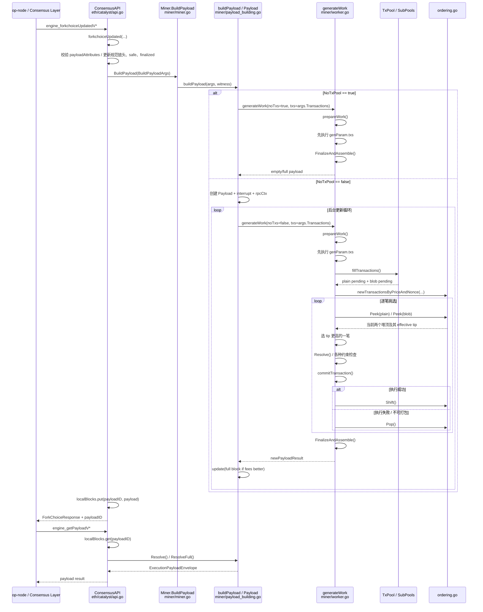
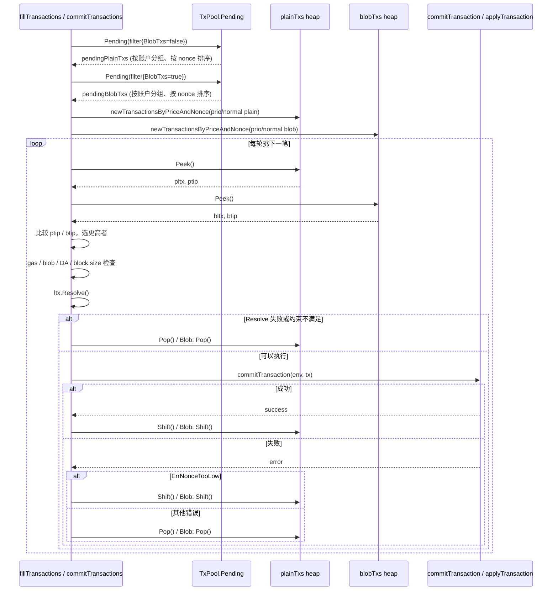

# 打包区块中的交易顺序与排序规则

本文档说明 op-geth 在构建区块时**如何决定交易顺序**，以及**具体的排序规则**。逻辑集中在 [miner/ordering.go:41-181](https://github.com/ethereum-optimism/op-geth/blob/d0734fd5f44234cde3b0a7c4beb1256fc6feedef/miner/ordering.go#L41-L181)、[miner/worker.go:561-775](https://github.com/ethereum-optimism/op-geth/blob/d0734fd5f44234cde3b0a7c4beb1256fc6feedef/miner/worker.go#L561-L775) 的 `fillTransactions` / `commitTransactions` 中。

**代码引用说明**：本文中的代码引用统一指向提交 `d0734fd5f44234cde3b0a7c4beb1256fc6feedef` 的 GitHub 永久链接，仓库地址为 [ethereum-optimism/op-geth](https://github.com/ethereum-optimism/op-geth)；带行号时统一使用 `blob/<commit>/<path>#Lx-Ly` 格式。

---

## 1. 总体顺序（从先到后）

区块内交易按以下**三段**依次排列：

| 顺序 | 来源 | 说明 |
| ------ | ------ | ------ |
| 1 | **强制包含交易** | [miner/worker.go:191-198](https://github.com/ethereum-optimism/op-geth/blob/d0734fd5f44234cde3b0a7c4beb1256fc6feedef/miner/worker.go#L191-L198) `genParam.txs`：L1 attributes 等 deposit 交易 + Engine API 传入的 `payloadAttributes.transactions`（若有）。按传入顺序依次执行。 |
| 2 | **优先账户交易** | 仅在未使用 `forceOverrides` 时生效。配置中的 `miner.prio` 账户 pending 交易，按「价格优先、同价按时间」排序，且**同一账户内严格按 nonce 递增**。 |
| 3 | **普通池内交易** | 仅在未使用 `forceOverrides` 时生效。其余 txpool pending 交易，同样按「价格优先、同价按时间」排序，同一账户内按 nonce 递增。 |

同一段内，普通/Blob 交易混排时，**每步选当前「矿工费」更高的一条**（见下）。

**`forceOverrides`（覆盖模式，与上表第 2、3 行对应）**

- **`generateParams.forceOverrides`** 为 `true` 且 **`overrideTxs` 非空**时：在 **`genParam.txs` 全部执行完毕**之后，**仅按 `overrideTxs` 的顺序**依次 `commitTransaction`，**不调用 `fillTransactions`，不读 txpool**，因此上表第 2、3 段（优先账户 / 普通池内排序）**均不生效**。实现见 [miner/worker.go:199-230](https://github.com/ethereum-optimism/op-geth/blob/d0734fd5f44234cde3b0a7c4beb1256fc6feedef/miner/worker.go#L199-L230)（`forceOverrides` 分支与否则走 `fillTransactions` 的 `else`）。
- 与 **`payloadAttributes.transactions` → `genParam.txs`** 的区别：后者与 L1 deposit **同属第一段「强制包含」**；若之后仍走 `fillTransactions`，第 2、3 段照常。**`overrideTxs` 是另一份列表**，表示「强制段之后、由调用方完全指定的剩余交易」，与 mempool 排序无关。
- **`prepareWork`** 中若 `genParams.forceOverrides` 为真，则用 **`overrideExtraData` 写入 `header.Extra`**（例如预编码的 EIP-1559 相关 extra）；见 [miner/worker.go:326-328](https://github.com/ethereum-optimism/op-geth/blob/d0734fd5f44234cde3b0a7c4beb1256fc6feedef/miner/worker.go#L326-L328)（注意其后 Holocene 等逻辑仍可能改写 `header.Extra`，以源码为准）。
- **典型入口**：测试 RPC **`BuildTestingPayload`**（`testing_buildBlockV*`）内设置 **`forceOverrides: true`**，并传入 `overrideTxs` / `overrideExtraData`；见 [miner/payload_building.go:437-452](https://github.com/ethereum-optimism/op-geth/blob/d0734fd5f44234cde3b0a7c4beb1256fc6feedef/miner/payload_building.go#L437-L452)。**正常 `ForkchoiceUpdated` → `BuildPayload` 路径**构造的 `generateParams` **默认不置该标志**，生产建块仍走 txpool / `fillTransactions`。

---

## 2. 矿工费（用于排序的「价格」）

排序用的「价格」是**矿工实际得到的小费**，即 **effective miner tip**（见 [miner/ordering.go:41-45](https://github.com/ethereum-optimism/op-geth/blob/d0734fd5f44234cde3b0a7c4beb1256fc6feedef/miner/ordering.go#L41-L45) `txWithMinerFee.fees`、[miner/ordering.go:51-67](https://github.com/ethereum-optimism/op-geth/blob/d0734fd5f44234cde3b0a7c4beb1256fc6feedef/miner/ordering.go#L51-L67) `newTxWithMinerFee`）：

- **无 base fee（Legacy 链）**：`fees = GasTipCap`
- **有 base fee（EIP-1559）**：`fees = min(GasFeeCap - BaseFee, GasTipCap)`  
  - 若 `GasFeeCap < BaseFee`，该交易不会通过建块筛选：一方面 `txpool.Pending(filter)` 会按 base fee 预过滤（如 [core/txpool/legacypool/legacypool.go:580-587](https://github.com/ethereum-optimism/op-geth/blob/d0734fd5f44234cde3b0a7c4beb1256fc6feedef/core/txpool/legacypool/legacypool.go#L580-L587)），另一方面在构建排序堆时 [miner/ordering.go:54-55](https://github.com/ethereum-optimism/op-geth/blob/d0734fd5f44234cde3b0a7c4beb1256fc6feedef/miner/ordering.go#L54-L55) 也会返回 `types.ErrGasFeeCapTooLow`

因此区块内「价格高」的交易会优先被选中，直到 gas（以及 Jovian 的 DA 空间等）用尽或达到其他限制。

---

## 3. 跨账户、跨类型的排序：价格堆 + 同价按时间

- **数据结构**：[miner/ordering.go:106-118](https://github.com/ethereum-optimism/op-geth/blob/d0734fd5f44234cde3b0a7c4beb1256fc6feedef/miner/ordering.go#L106-L118) `transactionsByPriceAndNonce`  
  - 每个账户只把**当前可执行的那笔**（即该账户 nonce 序列的**队头**）放进一个**堆**里。  
  - 堆的比较规则 [miner/ordering.go:70-89](https://github.com/ethereum-optimism/op-geth/blob/d0734fd5f44234cde3b0a7c4beb1256fc6feedef/miner/ordering.go#L70-L89) `txByPriceAndTime.Less`：  
    - **先比矿工费** `fees`：**高的优先**（`cmp > 0` 表示降序，堆顶是当前最高小费）。  
    - **矿工费相同**：按**首次被看到的挂单时间** `tx.Time` **早的优先**，保证顺序确定、可复现。

- **同一账户内**：  
  - 池子给 miner 的 pending 已是**按 nonce 排好**的（接口约定见 [core/txpool/subpool.go:161-166](https://github.com/ethereum-optimism/op-geth/blob/d0734fd5f44234cde3b0a7c4beb1256fc6feedef/core/txpool/subpool.go#L161-L166) `Pending`；LegacyPool 的 [core/txpool/legacypool/legacypool.go:562-579](https://github.com/ethereum-optimism/op-geth/blob/d0734fd5f44234cde3b0a7c4beb1256fc6feedef/core/txpool/legacypool/legacypool.go#L562-L579) `Pending` 内调用 [core/txpool/legacypool/list.go:251-260](https://github.com/ethereum-optimism/op-geth/blob/d0734fd5f44234cde3b0a7c4beb1256fc6feedef/core/txpool/legacypool/list.go#L251-L260) `Flatten()`，而 `Flatten()` 内部使用 [core/txpool/legacypool/list.go:241-247](https://github.com/ethereum-optimism/op-geth/blob/d0734fd5f44234cde3b0a7c4beb1256fc6feedef/core/txpool/legacypool/list.go#L241-L247) `sort.Sort(types.TxByNonce(...))`）。  
  - 每次从堆顶取走一笔后，用该账户的**下一笔（下一 nonce）** 再放入堆 [miner/ordering.go:160-174](https://github.com/ethereum-optimism/op-geth/blob/d0734fd5f44234cde3b0a7c4beb1256fc6feedef/miner/ordering.go#L160-L174) `Shift()`，因此**同一账户在区块内必然按 nonce 递增**，不会出现 nonce 乱序。

---

## 4. 普通交易 vs Blob 交易混排

- **分开取 pending**：  
  - [miner/worker.go:719-775](https://github.com/ethereum-optimism/op-geth/blob/d0734fd5f44234cde3b0a7c4beb1256fc6feedef/miner/worker.go#L719-L775) `fillTransactions` 先按 `BlobTxs: false` 取一遍 pending（plain），再按 `BlobTxs: true` 取一遍（blob），得到 `plainTxs` 和 `blobTxs` 两个 `transactionsByPriceAndNonce` 堆（[miner/worker.go:759-763](https://github.com/ethereum-optimism/op-geth/blob/d0734fd5f44234cde3b0a7c4beb1256fc6feedef/miner/worker.go#L759-L763)、[miner/worker.go:767-771](https://github.com/ethereum-optimism/op-geth/blob/d0734fd5f44234cde3b0a7c4beb1256fc6feedef/miner/worker.go#L767-L771)）。

- **每步二选一**（[miner/worker.go:561-617](https://github.com/ethereum-optimism/op-geth/blob/d0734fd5f44234cde3b0a7c4beb1256fc6feedef/miner/worker.go#L561-L617) `commitTransactions`）：  
  - 若只有 plain 或只有 blob，就取有的那种。  
  - 若两种都有，比较**当前堆顶的矿工费** [miner/worker.go:604-616](https://github.com/ethereum-optimism/op-geth/blob/d0734fd5f44234cde3b0a7c4beb1256fc6feedef/miner/worker.go#L604-L616) `ptip` / `btip`：  
    - **谁高取谁**（[miner/worker.go:612-615](https://github.com/ethereum-optimism/op-geth/blob/d0734fd5f44234cde3b0a7c4beb1256fc6feedef/miner/worker.go#L612-L615) `if ptip.Lt(btip) { 取 blob } else { 取 plain }`）。  
  - 因此**普通交易和 Blob 交易混在一起时，完全按「当前可用最高小费」决定下一条**，不再区分类型先后。

---

## 5. 规则小结表

| 维度 | 规则 |
| ------ | ------ |
| 区块最前 | 强制交易：`genParam.txs`（L1 deposit + API 指定）按传入顺序。 |
| 账户分组 | 先处理 `miner.prio` 中的账户，再处理其余账户。 |
| 跨账户 / 跨类型 | 按 **effective miner tip** 从高到低；同价按 **tx 首次挂单时间** 早的优先。 |
| 同一账户内 | 严格按 **nonce 递增**（由池子按 nonce 排序 + 堆只暴露「每账户队头」保证）。 |
| Plain vs Blob | 不单独分段，每步在两种堆顶中选**矿工费更高**的一条。 |

---

## 6. 源码摘录

以下为与交易排序直接相关的核心源码片段，便于对照上文规则阅读。

### 6.1 矿工费计算与堆比较（miner/ordering.go）

源码位置：

- [miner/ordering.go:41-45](https://github.com/ethereum-optimism/op-geth/blob/d0734fd5f44234cde3b0a7c4beb1256fc6feedef/miner/ordering.go#L41-L45) `txWithMinerFee`
- [miner/ordering.go:51-67](https://github.com/ethereum-optimism/op-geth/blob/d0734fd5f44234cde3b0a7c4beb1256fc6feedef/miner/ordering.go#L51-L67) `newTxWithMinerFee`
- [miner/ordering.go:81-89](https://github.com/ethereum-optimism/op-geth/blob/d0734fd5f44234cde3b0a7c4beb1256fc6feedef/miner/ordering.go#L81-L89) `txByPriceAndTime.Less`

**有效小费 `fees` 的计算**（EIP-1559：`min(GasFeeCap - BaseFee, GasTipCap)`；Legacy：`GasTipCap`）：

```go
// newTxWithMinerFee 中
tip := new(uint256.Int).Set(tx.GasTipCap)
if baseFee != nil {
    if tx.GasFeeCap.Cmp(baseFee) < 0 {
        return nil, types.ErrGasFeeCapTooLow
    }
    tip = new(uint256.Int).Sub(tx.GasFeeCap, baseFee)
    if tip.Gt(tx.GasTipCap) {
        tip = tx.GasTipCap
    }
}
return &txWithMinerFee{ tx: tx, from: from, fees: tip }, nil
```

**堆比较规则**（价格高的优先，同价按首次挂单时间早的优先）：

```go
// txByPriceAndTime.Less
func (s txByPriceAndTime) Less(i, j int) bool {
    cmp := s[i].fees.Cmp(s[j].fees)
    if cmp == 0 {
        return s[i].tx.Time.Before(s[j].tx.Time)
    }
    return cmp > 0  // 降序：fees 大的视为“更小”，堆顶为最高小费
}
```

### 6.2 每账户队头堆与 Shift（miner/ordering.go）

源码位置：

- [miner/ordering.go:106-118](https://github.com/ethereum-optimism/op-geth/blob/d0734fd5f44234cde3b0a7c4beb1256fc6feedef/miner/ordering.go#L106-L118) `transactionsByPriceAndNonce`
- [miner/ordering.go:120-148](https://github.com/ethereum-optimism/op-geth/blob/d0734fd5f44234cde3b0a7c4beb1256fc6feedef/miner/ordering.go#L120-L148) `newTransactionsByPriceAndNonce`
- [miner/ordering.go:153-157](https://github.com/ethereum-optimism/op-geth/blob/d0734fd5f44234cde3b0a7c4beb1256fc6feedef/miner/ordering.go#L153-L157) `Peek`
- [miner/ordering.go:164-174](https://github.com/ethereum-optimism/op-geth/blob/d0734fd5f44234cde3b0a7c4beb1256fc6feedef/miner/ordering.go#L164-L174) `Shift`
- [miner/ordering.go:180-181](https://github.com/ethereum-optimism/op-geth/blob/d0734fd5f44234cde3b0a7c4beb1256fc6feedef/miner/ordering.go#L180-L181) `Pop`

**堆结构**：每个账户只把「当前可执行的那笔」放进 `heads`，取走后用同账户下一笔替换（Shift）或整账户丢弃（Pop）。

```go
// transactionsByPriceAndNonce
type transactionsByPriceAndNonce struct {
    txs     map[common.Address][]*txpool.LazyTransaction // 每账户按 nonce 排好的队列
    heads   txByPriceAndTime                             // 每账户队头，按 fees 堆序
    signer  types.Signer
    baseFee *uint256.Int
}

// Shift：成功打包堆顶后，用该账户下一笔替换堆顶
func (t *transactionsByPriceAndNonce) Shift() {
    acc := t.heads[0].from
    if txs, ok := t.txs[acc]; ok && len(txs) > 0 {
        if wrapped, err := newTxWithMinerFee(txs[0], acc, t.baseFee); err == nil {
            t.heads[0], t.txs[acc] = wrapped, txs[1:]
            heap.Fix(&t.heads, 0)
            return
        }
    }
    heap.Pop(&t.heads)
}
```

### 6.3 取 Pending、拆优先账户、建双堆（miner/worker.go fillTransactions）

源码位置：

- [miner/worker.go:713-717](https://github.com/ethereum-optimism/op-geth/blob/d0734fd5f44234cde3b0a7c4beb1256fc6feedef/miner/worker.go#L713-L717) 读取 `tip` 和 `prio`
- [miner/worker.go:719-742](https://github.com/ethereum-optimism/op-geth/blob/d0734fd5f44234cde3b0a7c4beb1256fc6feedef/miner/worker.go#L719-L742) 构造 `PendingFilter`，分别获取 plain/blob pending
- [miner/worker.go:744-757](https://github.com/ethereum-optimism/op-geth/blob/d0734fd5f44234cde3b0a7c4beb1256fc6feedef/miner/worker.go#L744-L757) 拆分 `prio*` / `normal*`
- [miner/worker.go:758-775](https://github.com/ethereum-optimism/op-geth/blob/d0734fd5f44234cde3b0a7c4beb1256fc6feedef/miner/worker.go#L758-L775) 先填优先账户，再填普通账户

**按 1559/4844 过滤取 pending，再拆成优先账户 / 普通，分别建 plain、blob 两套堆**：

```go
filter := txpool.PendingFilter{
    MinTip:      uint256.MustFromBig(tip),
    MaxDATxSize: miner.config.MaxDATxSize,
}
if env.header.BaseFee != nil {
    filter.BaseFee = uint256.MustFromBig(env.header.BaseFee)
}
if env.header.ExcessBlobGas != nil {
    filter.BlobFee = uint256.MustFromBig(eip4844.CalcBlobFee(miner.chainConfig, env.header))
}
filter.BlobTxs = false
pendingPlainTxs := miner.txpool.Pending(filter)
filter.BlobTxs = true
// ... BlobVersion 等
pendingBlobTxs := miner.txpool.Pending(filter)

prioPlainTxs, normalPlainTxs := ..., pendingPlainTxs
prioBlobTxs, normalBlobTxs := ..., pendingBlobTxs
for _, account := range prio {
    if txs := normalPlainTxs[account]; len(txs) > 0 {
        delete(normalPlainTxs, account)
        prioPlainTxs[account] = txs
    }
    // 同理 prioBlobTxs
}
// 先填优先账户的堆，再填普通堆
if len(prioPlainTxs) > 0 || len(prioBlobTxs) > 0 {
    plainTxs := newTransactionsByPriceAndNonce(env.signer, prioPlainTxs, env.header.BaseFee)
    blobTxs := newTransactionsByPriceAndNonce(env.signer, prioBlobTxs, env.header.BaseFee)
    miner.commitTransactions(env, plainTxs, blobTxs, interrupt)
}
if len(normalPlainTxs) > 0 || len(normalBlobTxs) > 0 {
    plainTxs := newTransactionsByPriceAndNonce(env.signer, normalPlainTxs, env.header.BaseFee)
    blobTxs := newTransactionsByPriceAndNonce(env.signer, normalBlobTxs, env.header.BaseFee)
    miner.commitTransactions(env, plainTxs, blobTxs, interrupt)
}
```

### 6.4 每步在 Plain / Blob 堆顶选更高小费（miner/worker.go commitTransactions）

源码位置：

- [miner/worker.go:575-579](https://github.com/ethereum-optimism/op-geth/blob/d0734fd5f44234cde3b0a7c4beb1256fc6feedef/miner/worker.go#L575-L579) 中断信号检查
- [miner/worker.go:581-583](https://github.com/ethereum-optimism/op-geth/blob/d0734fd5f44234cde3b0a7c4beb1256fc6feedef/miner/worker.go#L581-L583) gas 不足直接结束
- [miner/worker.go:596-617](https://github.com/ethereum-optimism/op-geth/blob/d0734fd5f44234cde3b0a7c4beb1256fc6feedef/miner/worker.go#L596-L617) plain/blob 堆顶二选一
- [miner/worker.go:676-703](https://github.com/ethereum-optimism/op-geth/blob/d0734fd5f44234cde3b0a7c4beb1256fc6feedef/miner/worker.go#L676-L703) `commitTransaction` 后按结果 `Shift` / `Pop`

**从两个堆各 Peek，比较 tip，取更高者**：

```go
pltx, ptip := plainTxs.Peek()
bltx, btip := blobTxs.Peek()
switch {
case pltx == nil:
    txs, ltx = blobTxs, bltx
case bltx == nil:
    txs, ltx = plainTxs, pltx
default:
    if ptip.Lt(btip) {
        txs, ltx = blobTxs, bltx
    } else {
        txs, ltx = plainTxs, pltx
    }
}
// 后续：commitTransaction(env, ltx.Resolve())，成功则 txs.Shift()，失败则 txs.Pop()
```

### 6.5 同一账户内按 nonce 排序（core/types/transaction.go）

源码位置：

- [core/txpool/subpool.go:161-166](https://github.com/ethereum-optimism/op-geth/blob/d0734fd5f44234cde3b0a7c4beb1256fc6feedef/core/txpool/subpool.go#L161-L166) `Pending` 接口约定
- [core/txpool/legacypool/legacypool.go:562-579](https://github.com/ethereum-optimism/op-geth/blob/d0734fd5f44234cde3b0a7c4beb1256fc6feedef/core/txpool/legacypool/legacypool.go#L562-L579) `LegacyPool.Pending`
- [core/txpool/legacypool/list.go:237-260](https://github.com/ethereum-optimism/op-geth/blob/d0734fd5f44234cde3b0a7c4beb1256fc6feedef/core/txpool/legacypool/list.go#L237-L260) `flatten()` / `Flatten()`
- [core/types/transaction.go:803-810](https://github.com/ethereum-optimism/op-geth/blob/d0734fd5f44234cde3b0a7c4beb1256fc6feedef/core/types/transaction.go#L803-L810) `TxByNonce`

池子给 miner 的每账户列表已按 nonce 排序，使用的比较器：

```go
// TxByNonce
type TxByNonce Transactions

func (s TxByNonce) Less(i, j int) bool { return s[i].Nonce() < s[j].Nonce() }
```

---

## 7. 相关代码位置（可点击跳转）

| 逻辑 | 文件与行号（点击路径可打开文件） |
| ------ | ---------------------------------- |
| 矿工费计算、价格+时间比较、堆结构 | [miner/ordering.go:41-181](https://github.com/ethereum-optimism/op-geth/blob/d0734fd5f44234cde3b0a7c4beb1256fc6feedef/miner/ordering.go#L41-L181)：[L41-L45](https://github.com/ethereum-optimism/op-geth/blob/d0734fd5f44234cde3b0a7c4beb1256fc6feedef/miner/ordering.go#L41-L45) `txWithMinerFee.fees`、[L51-L67](https://github.com/ethereum-optimism/op-geth/blob/d0734fd5f44234cde3b0a7c4beb1256fc6feedef/miner/ordering.go#L51-L67) `newTxWithMinerFee`、[L81-L89](https://github.com/ethereum-optimism/op-geth/blob/d0734fd5f44234cde3b0a7c4beb1256fc6feedef/miner/ordering.go#L81-L89) `txByPriceAndTime.Less`、[L106-L148](https://github.com/ethereum-optimism/op-geth/blob/d0734fd5f44234cde3b0a7c4beb1256fc6feedef/miner/ordering.go#L106-L148) `transactionsByPriceAndNonce` / `newTransactionsByPriceAndNonce`、[L153-L181](https://github.com/ethereum-optimism/op-geth/blob/d0734fd5f44234cde3b0a7c4beb1256fc6feedef/miner/ordering.go#L153-L181) `Peek` / `Shift` / `Pop` |
| 取 pending、拆 prio / normal、选 plain vs blob | [miner/worker.go:561-775](https://github.com/ethereum-optimism/op-geth/blob/d0734fd5f44234cde3b0a7c4beb1256fc6feedef/miner/worker.go#L561-L775)：[L719-L775](https://github.com/ethereum-optimism/op-geth/blob/d0734fd5f44234cde3b0a7c4beb1256fc6feedef/miner/worker.go#L719-L775) `fillTransactions`、[L561-L703](https://github.com/ethereum-optimism/op-geth/blob/d0734fd5f44234cde3b0a7c4beb1256fc6feedef/miner/worker.go#L561-L703) `commitTransactions`（[L604-L616](https://github.com/ethereum-optimism/op-geth/blob/d0734fd5f44234cde3b0a7c4beb1256fc6feedef/miner/worker.go#L604-L616) plainTxs/blobTxs 的 Peek 与 tip 比较；[L676-L703](https://github.com/ethereum-optimism/op-geth/blob/d0734fd5f44234cde3b0a7c4beb1256fc6feedef/miner/worker.go#L676-L703) 成功/失败后的 `Shift` / `Pop`） |
| 强制交易最先执行 | [miner/worker.go:210-247](https://github.com/ethereum-optimism/op-geth/blob/d0734fd5f44234cde3b0a7c4beb1256fc6feedef/miner/worker.go#L210-L247)：[L210-L218](https://github.com/ethereum-optimism/op-geth/blob/d0734fd5f44234cde3b0a7c4beb1256fc6feedef/miner/worker.go#L210-L218) `for _, tx := range genParam.txs`；[L219-L247](https://github.com/ethereum-optimism/op-geth/blob/d0734fd5f44234cde3b0a7c4beb1256fc6feedef/miner/worker.go#L219-L247) 后续才进入 override 或 `fillTransactions` |
| override 路径（不走 txpool） | [miner/worker.go:220-230](https://github.com/ethereum-optimism/op-geth/blob/d0734fd5f44234cde3b0a7c4beb1256fc6feedef/miner/worker.go#L220-L230)：`forceOverrides && len(overrideTxs) > 0` 时直接按 `overrideTxs` 顺序执行 |
| 池子按 nonce 排序 | [core/txpool/subpool.go:161-166](https://github.com/ethereum-optimism/op-geth/blob/d0734fd5f44234cde3b0a7c4beb1256fc6feedef/core/txpool/subpool.go#L161-L166) `Pending` 接口约定「grouped by origin account and sorted by nonce」；[core/txpool/legacypool/legacypool.go:562-579](https://github.com/ethereum-optimism/op-geth/blob/d0734fd5f44234cde3b0a7c4beb1256fc6feedef/core/txpool/legacypool/legacypool.go#L562-L579) `Pending` 内 `list.Flatten()`；[core/txpool/legacypool/list.go:237-260](https://github.com/ethereum-optimism/op-geth/blob/d0734fd5f44234cde3b0a7c4beb1256fc6feedef/core/txpool/legacypool/list.go#L237-L260) `flatten()` / `Flatten` |
| TxByNonce 类型定义 | [core/types/transaction.go:803-810](https://github.com/ethereum-optimism/op-geth/blob/d0734fd5f44234cde3b0a7c4beb1256fc6feedef/core/types/transaction.go#L803-L810) |
| TxPool.Pending 合并各子池 | [core/txpool/txpool.go:365-373](https://github.com/ethereum-optimism/op-geth/blob/d0734fd5f44234cde3b0a7c4beb1256fc6feedef/core/txpool/txpool.go#L365-L373) |
| BlobPool.Pending（blob 交易来源） | [core/txpool/blobpool/blobpool.go:1872-1877](https://github.com/ethereum-optimism/op-geth/blob/d0734fd5f44234cde3b0a7c4beb1256fc6feedef/core/txpool/blobpool/blobpool.go#L1872-L1877) |

---

## 8. 与 Jovian 的关系

Jovian 不改变上述排序规则，只增加：

- **L1 attributes 等 deposit 交易**仍在 [miner/worker.go:210-218](https://github.com/ethereum-optimism/op-geth/blob/d0734fd5f44234cde3b0a7c4beb1256fc6feedef/miner/worker.go#L210-L218) `genParam.txs` 中，位于区块最前。  
- **DA 空间限制**：在 [miner/worker.go:586-643](https://github.com/ethereum-optimism/op-geth/blob/d0734fd5f44234cde3b0a7c4beb1256fc6feedef/miner/worker.go#L586-L643) `commitTransactions` 中若剩余 DA 不足，会跳过当前候选交易（或清空 blob 堆），排序逻辑不变。  
- **MinBaseFee** 等只影响区块头与校验，不改变「按矿工费 + 时间 + nonce」的打包顺序。

因此「**如何决定交易顺序、具体排序规则**」在 Jovian 下与上文一致。

---

## 9. 完整调用链：ForkchoiceUpdated -> generateWork -> fillTransactions -> commitTransactions -> ordering.go

下面按实际源码把一次建块请求从 Engine API 入口一直追到交易排序逻辑。

### 9.1 Engine API 入口：`engine_forkchoiceUpdatedV*`

- `engine_forkchoiceUpdatedV1/V2/V3/V4` 最终都会进入统一实现 [eth/catalyst/api.go:238-415](https://github.com/ethereum-optimism/op-geth/blob/d0734fd5f44234cde3b0a7c4beb1256fc6feedef/eth/catalyst/api.go#L238-L415) `forkchoiceUpdated(...)`。
- 该函数先做 fork / `payloadAttributes` 校验、规范链头（canonical head）更新、safe/finalized 更新，然后在 `payloadAttributes != nil` 时启动本地 payload 构建。

关键代码位置：

- [eth/catalyst/api.go:166-176](https://github.com/ethereum-optimism/op-geth/blob/d0734fd5f44234cde3b0a7c4beb1256fc6feedef/eth/catalyst/api.go#L166-L176) `ForkchoiceUpdatedV1`
- [eth/catalyst/api.go:180-194](https://github.com/ethereum-optimism/op-geth/blob/d0734fd5f44234cde3b0a7c4beb1256fc6feedef/eth/catalyst/api.go#L180-L194) `ForkchoiceUpdatedV2`
- [eth/catalyst/api.go:198-214](https://github.com/ethereum-optimism/op-geth/blob/d0734fd5f44234cde3b0a7c4beb1256fc6feedef/eth/catalyst/api.go#L198-L214) `ForkchoiceUpdatedV3`
- [eth/catalyst/api.go:218-235](https://github.com/ethereum-optimism/op-geth/blob/d0734fd5f44234cde3b0a7c4beb1256fc6feedef/eth/catalyst/api.go#L218-L235) `ForkchoiceUpdatedV4`
- [eth/catalyst/api.go:372-413](https://github.com/ethereum-optimism/op-geth/blob/d0734fd5f44234cde3b0a7c4beb1256fc6feedef/eth/catalyst/api.go#L372-L413) 解析 `payloadAttributes`、组装 `miner.BuildPayloadArgs`、调用 `api.eth.Miner().BuildPayload(...)`

### 9.2 `forkchoiceUpdated` 组装 `BuildPayloadArgs`

`forkchoiceUpdated` 会把 CL 传进来的 `payloadAttributes` 转成 miner 层的 `BuildPayloadArgs`：

- `Parent` 对应 `update.HeadBlockHash`
- `Timestamp` / `FeeRecipient` / `Random` / `Withdrawals` / `BeaconRoot` / `SlotNum`
- Optimism 额外字段：`NoTxPool`、`Transactions`、`GasLimit`、`EIP1559Params`、`MinBaseFee`

对应代码：

- [eth/catalyst/api.go:378-400](https://github.com/ethereum-optimism/op-geth/blob/d0734fd5f44234cde3b0a7c4beb1256fc6feedef/eth/catalyst/api.go#L378-L400) 反序列化 `payloadAttributes.Transactions` 并组装 `BuildPayloadArgs`
- [miner/payload_building.go:39-57](https://github.com/ethereum-optimism/op-geth/blob/d0734fd5f44234cde3b0a7c4beb1256fc6feedef/miner/payload_building.go#L39-L57) `BuildPayloadArgs` 定义

### 9.3 Miner 入口：`BuildPayload -> buildPayload`

- `Miner.BuildPayload` 只是导出包装器，直接转调 [miner/miner.go:249-252](https://github.com/ethereum-optimism/op-geth/blob/d0734fd5f44234cde3b0a7c4beb1256fc6feedef/miner/miner.go#L249-L252)。
- 真正的构建逻辑在 [miner/payload_building.go:301-435](https://github.com/ethereum-optimism/op-geth/blob/d0734fd5f44234cde3b0a7c4beb1256fc6feedef/miner/payload_building.go#L301-L435) `buildPayload(...)`。

这里有两条路径：

1. `NoTxPool == true`
   - 直接构造只包含 `args.Transactions` 的 payload，不进入 txpool 排序。
   - 代码见 [miner/payload_building.go:302-337](https://github.com/ethereum-optimism/op-geth/blob/d0734fd5f44234cde3b0a7c4beb1256fc6feedef/miner/payload_building.go#L302-L337)。
2. `NoTxPool == false`
   - 启动后台构建循环，反复调用 `generateWork(fullParams, witness)` 更新 payload，以最大化收益。
   - 代码见 [miner/payload_building.go:339-435](https://github.com/ethereum-optimism/op-geth/blob/d0734fd5f44234cde3b0a7c4beb1256fc6feedef/miner/payload_building.go#L339-L435)。

其中最关键的是：

- [miner/payload_building.go:391-403](https://github.com/ethereum-optimism/op-geth/blob/d0734fd5f44234cde3b0a7c4beb1256fc6feedef/miner/payload_building.go#L391-L403) `updatePayload := func()`
- [miner/payload_building.go:394](https://github.com/ethereum-optimism/op-geth/blob/d0734fd5f44234cde3b0a7c4beb1256fc6feedef/miner/payload_building.go#L394) `r := miner.generateWork(fullParams, witness)`

### 9.4 真正执行建块：`generateWork`

`generateWork` 是 worker 层的核心入口，负责把 `generateParams` 转成完整区块：

1. `prepareWork(...)` 构造 header、state、EVM 环境
2. 先执行 `genParam.txs` 里的强制交易
3. 如果 `forceOverrides` 为真，则直接执行 `overrideTxs`
4. 否则调用 `fillTransactions(...)` 从 txpool 挑交易
5. 最后 `FinalizeAndAssemble(...)` 组装出 block

代码位置：

- [miner/worker.go:181-248](https://github.com/ethereum-optimism/op-geth/blob/d0734fd5f44234cde3b0a7c4beb1256fc6feedef/miner/worker.go#L181-L248) `generateWork`
- [miner/worker.go:210-218](https://github.com/ethereum-optimism/op-geth/blob/d0734fd5f44234cde3b0a7c4beb1256fc6feedef/miner/worker.go#L210-L218) 强制交易 `genParam.txs`
- [miner/worker.go:219-230](https://github.com/ethereum-optimism/op-geth/blob/d0734fd5f44234cde3b0a7c4beb1256fc6feedef/miner/worker.go#L219-L230) `forceOverrides` 路径
- [miner/worker.go:231-247](https://github.com/ethereum-optimism/op-geth/blob/d0734fd5f44234cde3b0a7c4beb1256fc6feedef/miner/worker.go#L231-L247) `fillTransactions` 路径

### 9.5 从 txpool 拉交易：`fillTransactions`

`fillTransactions` 不做具体逐笔执行，它负责把 txpool 里的待选交易组织成适合排序的数据结构：

1. 构造 `txpool.PendingFilter`
2. 分别调用 `TxPool.Pending(filter)` 获取 plain / blob 两类 pending
3. 按 `miner.prio` 拆成优先账户与普通账户
4. 为每一组各自构造两套 `transactionsByPriceAndNonce`
5. 依次调用 `commitTransactions(...)`

代码位置：

- [miner/worker.go:713-775](https://github.com/ethereum-optimism/op-geth/blob/d0734fd5f44234cde3b0a7c4beb1256fc6feedef/miner/worker.go#L713-L775) `fillTransactions`
- [core/txpool/txpool.go:365-372](https://github.com/ethereum-optimism/op-geth/blob/d0734fd5f44234cde3b0a7c4beb1256fc6feedef/core/txpool/txpool.go#L365-L372) `TxPool.Pending`
- [core/txpool/legacypool/legacypool.go:567-579](https://github.com/ethereum-optimism/op-geth/blob/d0734fd5f44234cde3b0a7c4beb1256fc6feedef/core/txpool/legacypool/legacypool.go#L567-L579) `LegacyPool.Pending`
- [core/txpool/blobpool/blobpool.go:1867-1877](https://github.com/ethereum-optimism/op-geth/blob/d0734fd5f44234cde3b0a7c4beb1256fc6feedef/core/txpool/blobpool/blobpool.go#L1867-L1877) `BlobPool.Pending`

### 9.6 逐笔挑选与执行：`commitTransactions`

`commitTransactions` 是“不断挑下一笔”的主循环：

1. 检查 interrupt / gas / blob / Jovian DA 约束
2. `plainTxs.Peek()` 与 `blobTxs.Peek()` 取两个堆顶
3. 比较两个堆顶的 effective tip，取更高者
4. `ltx.Resolve()` 拿到真实交易对象
5. `commitTransaction(env, tx)` 执行
6. 成功则 `Shift()`，失败则 `Pop()`

代码位置：

- [miner/worker.go:561-703](https://github.com/ethereum-optimism/op-geth/blob/d0734fd5f44234cde3b0a7c4beb1256fc6feedef/miner/worker.go#L561-L703) `commitTransactions`
- [miner/worker.go:604-616](https://github.com/ethereum-optimism/op-geth/blob/d0734fd5f44234cde3b0a7c4beb1256fc6feedef/miner/worker.go#L604-L616) plain/blob 堆顶比较
- [miner/worker.go:662-677](https://github.com/ethereum-optimism/op-geth/blob/d0734fd5f44234cde3b0a7c4beb1256fc6feedef/miner/worker.go#L662-L677) `ltx.Resolve()` + `commitTransaction`
- [miner/worker.go:678-703](https://github.com/ethereum-optimism/op-geth/blob/d0734fd5f44234cde3b0a7c4beb1256fc6feedef/miner/worker.go#L678-L703) 成功/失败后的 `Shift` / `Pop`

### 9.7 排序数据结构：`ordering.go`

真正决定“谁排前面”的逻辑在 `miner/ordering.go`：

- `newTxWithMinerFee`：计算 effective miner tip
- `txByPriceAndTime.Less`：定义“价格优先、同价按时间”
- `transactionsByPriceAndNonce`：每账户一个队头组成堆
- `Peek/Shift/Pop`：暴露队头、成功后推进、失败后跳过该账户

代码位置：

- [miner/ordering.go:51-67](https://github.com/ethereum-optimism/op-geth/blob/d0734fd5f44234cde3b0a7c4beb1256fc6feedef/miner/ordering.go#L51-L67) `newTxWithMinerFee`
- [miner/ordering.go:81-89](https://github.com/ethereum-optimism/op-geth/blob/d0734fd5f44234cde3b0a7c4beb1256fc6feedef/miner/ordering.go#L81-L89) `txByPriceAndTime.Less`
- [miner/ordering.go:106-118](https://github.com/ethereum-optimism/op-geth/blob/d0734fd5f44234cde3b0a7c4beb1256fc6feedef/miner/ordering.go#L106-L118) `transactionsByPriceAndNonce`
- [miner/ordering.go:153-181](https://github.com/ethereum-optimism/op-geth/blob/d0734fd5f44234cde3b0a7c4beb1256fc6feedef/miner/ordering.go#L153-L181) `Peek` / `Shift` / `Pop`

### 9.8 GetPayload 如何取回结果

`forkchoiceUpdated` 启动构建后，会把 `payload` 放进 `localBlocks` 队列；后续 `engine_getPayloadV*` 再按 payload id 取回。

代码位置：

- [eth/catalyst/api.go:401-413](https://github.com/ethereum-optimism/op-geth/blob/d0734fd5f44234cde3b0a7c4beb1256fc6feedef/eth/catalyst/api.go#L401-L413) `api.localBlocks.put(id, payload)`
- [eth/catalyst/api.go:528-541](https://github.com/ethereum-optimism/op-geth/blob/d0734fd5f44234cde3b0a7c4beb1256fc6feedef/eth/catalyst/api.go#L528-L541) `getPayload(...)`
- [eth/catalyst/queue.go:64-90](https://github.com/ethereum-optimism/op-geth/blob/d0734fd5f44234cde3b0a7c4beb1256fc6feedef/eth/catalyst/queue.go#L64-L90) `payloadQueue.put/get`
- [miner/payload_building.go:227-266](https://github.com/ethereum-optimism/op-geth/blob/d0734fd5f44234cde3b0a7c4beb1256fc6feedef/miner/payload_building.go#L227-L266) `Payload.resolve`

可以把完整链路概括为：

`engine_forkchoiceUpdatedV*`
-> `ConsensusAPI.forkchoiceUpdated`
-> `api.eth.Miner().BuildPayload(args, ...)`
-> `miner.buildPayload`
-> `miner.generateWork`
-> `miner.fillTransactions`
-> `miner.commitTransactions`
-> `ordering.go` (`Peek/Shift/Pop` + `Less`)

---

## 10. 按源码逐步解释：一笔交易如何被选中 / 跳过

下面按一笔普通候选交易在源码中的真实路径，解释它是如何被打包、或在何处被跳过的。

### 10.1 进入候选集之前：先经过 txpool 过滤

交易不会直接进入排序堆，而是先通过 `txpool.Pending(filter)` 的筛选：

- 最低 tip：`MinTip`
- base fee：`BaseFee`
- blob fee：`BlobFee`
- Osaka 下的 `GasLimitCap`
- OP-Stack 的 `MaxDATxSize`

对应代码：

- [miner/worker.go:719-742](https://github.com/ethereum-optimism/op-geth/blob/d0734fd5f44234cde3b0a7c4beb1256fc6feedef/miner/worker.go#L719-L742) 构造 `PendingFilter`
- [core/txpool/legacypool/legacypool.go:580-589](https://github.com/ethereum-optimism/op-geth/blob/d0734fd5f44234cde3b0a7c4beb1256fc6feedef/core/txpool/legacypool/legacypool.go#L580-L589) LegacyPool 按 tip/base fee 过滤

如果交易在这里已经不满足 fee 条件，它根本不会进入后续排序堆。

### 10.2 进入排序堆：每账户只暴露一笔“当前可执行交易”

即便某个账户有很多 pending 交易，也不是全部一起进全局堆，而是：

1. 先保证该账户列表按 nonce 排序
2. 只把第一笔（队头）放进 `heads`
3. 后续只有当前一笔成功后，下一笔才有资格进入比较

代码位置：

- [core/txpool/legacypool/list.go:241-247](https://github.com/ethereum-optimism/op-geth/blob/d0734fd5f44234cde3b0a7c4beb1256fc6feedef/core/txpool/legacypool/list.go#L241-L247) `sort.Sort(types.TxByNonce(...))`
- [miner/ordering.go:131-139](https://github.com/ethereum-optimism/op-geth/blob/d0734fd5f44234cde3b0a7c4beb1256fc6feedef/miner/ordering.go#L131-L139) `newTransactionsByPriceAndNonce` 仅把每账户第一笔放入 `heads`

这就是“全局按价格，账户内按 nonce”的根本原因。

### 10.3 被选中为“下一笔候选交易”

主循环每一轮都会从 plain/blob 两个堆各取一个堆顶：

- `pltx, ptip := plainTxs.Peek()`
- `bltx, btip := blobTxs.Peek()`

然后：

- 只有 plain：选 plain
- 只有 blob：选 blob
- 两边都有：比较 `ptip` 和 `btip`，谁高选谁

代码位置：

- [miner/worker.go:604-616](https://github.com/ethereum-optimism/op-geth/blob/d0734fd5f44234cde3b0a7c4beb1256fc6feedef/miner/worker.go#L604-L616)

因此，一笔交易能否成为“当前下一笔”，取决于：

1. 它是不是自己账户的队头
2. 它的 effective tip 是否高于另一类堆顶

### 10.4 被选中后，先检查是否还能放进块里

即便它成了当前候选，还要继续过几道约束：

- gas 是否足够：[miner/worker.go:621-625](https://github.com/ethereum-optimism/op-geth/blob/d0734fd5f44234cde3b0a7c4beb1256fc6feedef/miner/worker.go#L621-L625)
- blob 空间是否足够：[miner/worker.go:627-633](https://github.com/ethereum-optimism/op-geth/blob/d0734fd5f44234cde3b0a7c4beb1256fc6feedef/miner/worker.go#L627-L633)
- Jovian DA footprint 是否足够：[miner/worker.go:636-643](https://github.com/ethereum-optimism/op-geth/blob/d0734fd5f44234cde3b0a7c4beb1256fc6feedef/miner/worker.go#L636-L643)
- OP-Stack block DA throttling 是否超限：[miner/worker.go:646-659](https://github.com/ethereum-optimism/op-geth/blob/d0734fd5f44234cde3b0a7c4beb1256fc6feedef/miner/worker.go#L646-L659)
- 区块大小是否超限：[miner/worker.go:667-668](https://github.com/ethereum-optimism/op-geth/blob/d0734fd5f44234cde3b0a7c4beb1256fc6feedef/miner/worker.go#L667-L668)

在这些阶段被拒绝时，通常会 `Pop()`，也就是跳过当前账户的这条队头交易。

### 10.5 `Resolve()`：把懒引用变成真实交易对象

排序堆里存的是 `txpool.LazyTransaction`，不是完整 `*types.Transaction`。只有真正准备执行时才：

```go
tx := ltx.Resolve()
```

代码位置：

- [miner/worker.go:662-665](https://github.com/ethereum-optimism/op-geth/blob/d0734fd5f44234cde3b0a7c4beb1256fc6feedef/miner/worker.go#L662-L665)

若 `Resolve()` 返回 `nil`，说明这笔交易已经从池子里消失/被驱逐，也会被跳过并 `Pop()`。

### 10.6 `commitTransaction`：真正执行

拿到真实交易后，会进入：

- [miner/worker.go:441-478](https://github.com/ethereum-optimism/op-geth/blob/d0734fd5f44234cde3b0a7c4beb1256fc6feedef/miner/worker.go#L441-L478) `commitTransaction`
- [miner/worker.go:529-540](https://github.com/ethereum-optimism/op-geth/blob/d0734fd5f44234cde3b0a7c4beb1256fc6feedef/miner/worker.go#L529-L540) `applyTransaction`

这里会做：

- interop / supervisor failsafe 检查
- conditional transaction 检查
- blob tx 特殊处理
- EVM 执行
- 成功后把 tx / receipt 加入 `env`

### 10.7 成功时：`Shift()`，让同账户下一笔顶上来

如果执行成功：

- 更新 DA 计数
- `txs.Shift()`

代码位置：

- [miner/worker.go:693-699](https://github.com/ethereum-optimism/op-geth/blob/d0734fd5f44234cde3b0a7c4beb1256fc6feedef/miner/worker.go#L693-L699)
- [miner/ordering.go:164-174](https://github.com/ethereum-optimism/op-geth/blob/d0734fd5f44234cde3b0a7c4beb1256fc6feedef/miner/ordering.go#L164-L174)

`Shift()` 会把该账户的下一 nonce 交易替换到堆顶，再重新 `heap.Fix`。  
这意味着“当前交易成功”是“同账户下一笔参与全局竞争”的前提。

### 10.8 失败时：什么时候 `Shift()`，什么时候 `Pop()`

这是最关键的“跳过规则”：

1. `ErrNonceTooLow`  
   - 代码：[miner/worker.go:679-681](https://github.com/ethereum-optimism/op-geth/blob/d0734fd5f44234cde3b0a7c4beb1256fc6feedef/miner/worker.go#L679-L681)
   - 动作：`Shift()`
   - 含义：通常是 head 变化导致当前队头已过时，尝试同账户下一笔。

2. `errTxConditionalInvalid`  
   - 代码：[miner/worker.go:682-686](https://github.com/ethereum-optimism/op-geth/blob/d0734fd5f44234cde3b0a7c4beb1256fc6feedef/miner/worker.go#L682-L686)
   - 动作：`Pop()`
   - 含义：这笔条件交易不满足，整账户从这一笔开始都不再继续尝试。

3. RPC context 超时 / 取消  
   - 代码：[miner/worker.go:687-689](https://github.com/ethereum-optimism/op-geth/blob/d0734fd5f44234cde3b0a7c4beb1256fc6feedef/miner/worker.go#L687-L689)
   - 动作：`Pop()`
   - 含义：本次构建窗口内不再继续尝试这条队头。

4. 交易在构建中被标记为 rejected  
   - 代码：[miner/worker.go:690-692](https://github.com/ethereum-optimism/op-geth/blob/d0734fd5f44234cde3b0a7c4beb1256fc6feedef/miner/worker.go#L690-L692)
   - 动作：`Pop()`

5. 其他执行错误  
   - 代码：[miner/worker.go:700-703](https://github.com/ethereum-optimism/op-geth/blob/d0734fd5f44234cde3b0a7c4beb1256fc6feedef/miner/worker.go#L700-L703)
   - 动作：`Pop()`
   - 含义：视为该账户当前队头不可执行，直接跳过该账户后续序列，避免卡住构建循环。

### 10.9 一句话总结“被选中 / 被跳过”的源码规则

一笔交易要被最终打包，必须同时满足：

1. 它先通过 `txpool.Pending(filter)` 过滤；
2. 它是自己账户当前的 nonce 队头；
3. 它在 plain/blob 两个队头里拥有更高的 effective tip；
4. 它还能满足 gas / blob / DA / block size 约束；
5. `Resolve()` 后仍存在；
6. `commitTransaction()` 执行成功。

否则，它会在上述某一步被跳过；跳过后的动作要么是：

- `Shift()`：继续尝试该账户下一笔
- `Pop()`：整个账户从当前队头开始都不再参与本轮构建

---

## 11. 时序图版调用链

下面用时序图展示从 `engine_forkchoiceUpdatedV*` 触发建块，到 `engine_getPayloadV*` 取回结果的完整路径。

### 11.1 总体时序图



### 11.2 交易排序子流程时序图

这个子图只关注 `fillTransactions -> commitTransactions -> ordering.go` 这一段，也就是“下一笔交易如何被决定”。



### 11.3 对照源码位置

- `ForkchoiceUpdatedV*` -> `forkchoiceUpdated`：
  [eth/catalyst/api.go:166-235](https://github.com/ethereum-optimism/op-geth/blob/d0734fd5f44234cde3b0a7c4beb1256fc6feedef/eth/catalyst/api.go#L166-L235),
  [eth/catalyst/api.go:238-415](https://github.com/ethereum-optimism/op-geth/blob/d0734fd5f44234cde3b0a7c4beb1256fc6feedef/eth/catalyst/api.go#L238-L415)
- `BuildPayloadArgs` / `buildPayload` / `Payload.resolve`：
  [miner/payload_building.go:39-57](https://github.com/ethereum-optimism/op-geth/blob/d0734fd5f44234cde3b0a7c4beb1256fc6feedef/miner/payload_building.go#L39-L57),
  [miner/payload_building.go:301-435](https://github.com/ethereum-optimism/op-geth/blob/d0734fd5f44234cde3b0a7c4beb1256fc6feedef/miner/payload_building.go#L301-L435),
  [miner/payload_building.go:227-266](https://github.com/ethereum-optimism/op-geth/blob/d0734fd5f44234cde3b0a7c4beb1256fc6feedef/miner/payload_building.go#L227-L266)
- `Miner.BuildPayload` 入口：
  [miner/miner.go:249-252](https://github.com/ethereum-optimism/op-geth/blob/d0734fd5f44234cde3b0a7c4beb1256fc6feedef/miner/miner.go#L249-L252)
- `generateWork` / `fillTransactions` / `commitTransactions`：
  [miner/worker.go:181-248](https://github.com/ethereum-optimism/op-geth/blob/d0734fd5f44234cde3b0a7c4beb1256fc6feedef/miner/worker.go#L181-L248),
  [miner/worker.go:713-775](https://github.com/ethereum-optimism/op-geth/blob/d0734fd5f44234cde3b0a7c4beb1256fc6feedef/miner/worker.go#L713-L775),
  [miner/worker.go:561-703](https://github.com/ethereum-optimism/op-geth/blob/d0734fd5f44234cde3b0a7c4beb1256fc6feedef/miner/worker.go#L561-L703)
- `ordering.go` 排序核心：
  [miner/ordering.go:51-67](https://github.com/ethereum-optimism/op-geth/blob/d0734fd5f44234cde3b0a7c4beb1256fc6feedef/miner/ordering.go#L51-L67),
  [miner/ordering.go:81-89](https://github.com/ethereum-optimism/op-geth/blob/d0734fd5f44234cde3b0a7c4beb1256fc6feedef/miner/ordering.go#L81-L89),
  [miner/ordering.go:106-181](https://github.com/ethereum-optimism/op-geth/blob/d0734fd5f44234cde3b0a7c4beb1256fc6feedef/miner/ordering.go#L106-L181)
- `GetPayload` / `payloadQueue`：
  [eth/catalyst/api.go:446-541](https://github.com/ethereum-optimism/op-geth/blob/d0734fd5f44234cde3b0a7c4beb1256fc6feedef/eth/catalyst/api.go#L446-L541),
  [eth/catalyst/queue.go:64-90](https://github.com/ethereum-optimism/op-geth/blob/d0734fd5f44234cde3b0a7c4beb1256fc6feedef/eth/catalyst/queue.go#L64-L90)

### 11.4 ASCII 版调用链图

如果当前 Markdown 预览器不支持 Mermaid，可以看下面这份纯文本调用链图。

#### 11.4.1 总体调用链

```text
op-node / CL
    |
    | engine_forkchoiceUpdatedV*
    v
ConsensusAPI.ForkchoiceUpdatedV1/V2/V3/V4
    |
    v
ConsensusAPI.forkchoiceUpdated(...)
    |
    +--> 校验 payloadAttributes / fork 版本
    +--> 更新规范链头（canonical head）/ safe / finalized
    |
    +--> 如果 payloadAttributes == nil
    |        |
    |        `--> 返回 VALID + nil payloadID
    |
    `--> 如果 payloadAttributes != nil
             |
             +--> 解析 payloadAttributes.Transactions
             +--> 组装 miner.BuildPayloadArgs
             |
             v
        api.eth.Miner().BuildPayload(args, witness)
             |
             v
        Miner.BuildPayload(...)
             |
             v
        miner.buildPayload(...)
             |
             +--> NoTxPool == true
             |      |
             |      +--> generateWork(noTxs=true, txs=args.Transactions)
             |      +--> 只构造“无 txpool”的 payload
             |      `--> 直接作为 full payload 返回
             |
             `--> NoTxPool == false
                    |
                    +--> 创建 Payload 对象
                    +--> 创建 interrupt / rpcCtx
                    +--> 启动后台更新循环
                    |
                    `--> 循环调用 generateWork(fullParams, witness)
                               |
                               v
                         miner.generateWork(...)
                               |
                               +--> prepareWork(...)
                               +--> 先执行 genParam.txs（强制交易）
                               |
                               +--> forceOverrides == true ?
                               |      |
                               |      +--> 直接执行 overrideTxs
                               |      `--> 不走 txpool 排序
                               |
                               `--> 否则走 txpool
                                      |
                                      v
                                 fillTransactions(...)
                                      |
                                      +--> TxPool.Pending(filter{BlobTxs=false})
                                      +--> TxPool.Pending(filter{BlobTxs=true})
                                      +--> 拆 prio 账户 / normal 账户
                                      +--> 为 plain/blob 分别建堆
                                      |
                                      v
                                 commitTransactions(...)
                                      |
                                      +--> Peek(plain)
                                      +--> Peek(blob)
                                      +--> 比较 effective tip
                                      +--> 选择更高的一笔
                                      +--> Resolve()
                                      +--> 各种约束检查(gas/blob/DA/size)
                                      +--> commitTransaction(...)
                                      |
                                      +--> 成功: Shift()
                                      `--> 失败: Pop() 或 Shift()
                                               |
                                               v
                                          ordering.go
                                               |
                                               +--> newTxWithMinerFee()
                                               +--> txByPriceAndTime.Less()
                                               +--> transactionsByPriceAndNonce.Peek()
                                               +--> Shift()
                                               `--> Pop()
                               |
                               v
                         FinalizeAndAssemble(...)
                               |
                               v
                         Payload.update(...)
                               |
                               +--> 如果 fees 更高则替换 full payload
                               `--> 否则保留旧 full payload
             |
             v
        api.localBlocks.put(payloadID, payload)
             |
             v
        返回 ForkChoiceResponse{VALID, payloadID}


op-node / CL
    |
    | engine_getPayloadV*
    v
ConsensusAPI.GetPayloadV*
    |
    v
ConsensusAPI.getPayload(payloadID, ...)
    |
    v
localBlocks.get(payloadID)
    |
    +--> Payload.Resolve()
    |         或
    `--> Payload.ResolveFull()
              |
              v
         ExecutionPayloadEnvelope
              |
              v
         返回给 op-node / CL
```

#### 11.4.2 交易排序子调用链

```text
fillTransactions(...)
    |
    +--> 构造 PendingFilter
    |
    +--> pendingPlainTxs = TxPool.Pending(filter with BlobTxs=false)
    +--> pendingBlobTxs  = TxPool.Pending(filter with BlobTxs=true)
    |
    +--> 按 miner.prio 拆成:
    |      - prioPlainTxs / prioBlobTxs
    |      - normalPlainTxs / normalBlobTxs
    |
    +--> 先处理 prio
    |      |
    |      +--> newTransactionsByPriceAndNonce(prioPlainTxs)
    |      +--> newTransactionsByPriceAndNonce(prioBlobTxs)
    |      `--> commitTransactions(...)
    |
    `--> 再处理 normal
           |
           +--> newTransactionsByPriceAndNonce(normalPlainTxs)
           +--> newTransactionsByPriceAndNonce(normalBlobTxs)
           `--> commitTransactions(...)


commitTransactions(...)
    |
    +--> 循环开始
    |
    +--> 检查 interrupt
    +--> 检查剩余 gas
    +--> 检查 blob limit / Jovian DA / block DA throttle
    |
    +--> pltx, ptip = plainTxs.Peek()
    +--> bltx, btip = blobTxs.Peek()
    |
    +--> 比较 ptip 与 btip
    |      |
    |      +--> ptip < btip  -> 选 blob 堆顶
    |      `--> 否则         -> 选 plain 堆顶
    |
    +--> ltx.Resolve()
    |      |
    |      `--> nil -> Pop() -> 下一轮
    |
    +--> txFitsSize / gas / blob / DA 检查
    |      |
    |      `--> 不满足 -> Pop() 或 break
    |
    +--> commitTransaction(env, tx)
           |
           +--> success
           |      |
           |      +--> 更新 DA 计数
           |      `--> Shift()
           |
           +--> ErrNonceTooLow
           |      |
           |      `--> Shift()
           |
           `--> 其他错误
                  |
                  `--> Pop()
```

#### 11.4.3 `ordering.go` 内部抽象图

```text
每个账户的 pending 列表
    |
    |  (已经按 nonce 排序)
    v
+-------------------+      +-------------------+      +-------------------+
| account A: n,n+1  |      | account B: m,m+1  |      | account C: k,k+1  |
+-------------------+      +-------------------+      +-------------------+
         |                            |                            |
         | 只取每个账户“当前队头”      |                            |
         +------------+---------------+-------------+--------------+
                      |                             |
                      v                             v
                +-----------------------------------------+
                | heads heap (txByPriceAndTime)           |
                | 排序键: effective tip DESC, time ASC    |
                +-----------------------------------------+
                                   |
                                   | Peek()
                                   v
                             当前全局最优交易
                                   |
                    +--------------+--------------+
                    |                             |
                    | 成功                        | 失败
                    v                             v
                 Shift()                       Pop()
                    |                             |
                    | 用同账户下一 nonce 顶上      | 丢弃该账户当前队头
                    v                             v
              heap.Fix(...)                 heap.Pop(...)
```

### 11.5 极简版单行调用链（贴近源码函数名）

```text
engine_forkchoiceUpdatedV* -> ConsensusAPI.ForkchoiceUpdatedV* -> ConsensusAPI.forkchoiceUpdated
-> Miner.BuildPayload -> miner.buildPayload -> miner.generateWork
-> miner.fillTransactions -> miner.commitTransactions
-> transactionsByPriceAndNonce.Peek -> txpool.LazyTransaction.Resolve
-> miner.commitTransaction -> miner.applyTransaction
-> transactionsByPriceAndNonce.Shift / transactionsByPriceAndNonce.Pop
-> engine_getPayloadV* -> ConsensusAPI.getPayload -> payloadQueue.get -> Payload.Resolve / Payload.ResolveFull
```

对应源码位置：

- [eth/catalyst/api.go:166-235](https://github.com/ethereum-optimism/op-geth/blob/d0734fd5f44234cde3b0a7c4beb1256fc6feedef/eth/catalyst/api.go#L166-L235) `ForkchoiceUpdatedV*`
- [eth/catalyst/api.go:238-415](https://github.com/ethereum-optimism/op-geth/blob/d0734fd5f44234cde3b0a7c4beb1256fc6feedef/eth/catalyst/api.go#L238-L415) `forkchoiceUpdated`
- [miner/miner.go:249-252](https://github.com/ethereum-optimism/op-geth/blob/d0734fd5f44234cde3b0a7c4beb1256fc6feedef/miner/miner.go#L249-L252) `Miner.BuildPayload`
- [miner/payload_building.go:301-435](https://github.com/ethereum-optimism/op-geth/blob/d0734fd5f44234cde3b0a7c4beb1256fc6feedef/miner/payload_building.go#L301-L435) `miner.buildPayload`
- [miner/worker.go:181-248](https://github.com/ethereum-optimism/op-geth/blob/d0734fd5f44234cde3b0a7c4beb1256fc6feedef/miner/worker.go#L181-L248) `miner.generateWork`
- [miner/worker.go:713-775](https://github.com/ethereum-optimism/op-geth/blob/d0734fd5f44234cde3b0a7c4beb1256fc6feedef/miner/worker.go#L713-L775) `miner.fillTransactions`
- [miner/worker.go:561-703](https://github.com/ethereum-optimism/op-geth/blob/d0734fd5f44234cde3b0a7c4beb1256fc6feedef/miner/worker.go#L561-L703) `miner.commitTransactions`
- [miner/ordering.go:153-181](https://github.com/ethereum-optimism/op-geth/blob/d0734fd5f44234cde3b0a7c4beb1256fc6feedef/miner/ordering.go#L153-L181) `Peek / Shift / Pop`
- [miner/worker.go:662-677](https://github.com/ethereum-optimism/op-geth/blob/d0734fd5f44234cde3b0a7c4beb1256fc6feedef/miner/worker.go#L662-L677) `Resolve -> commitTransaction`
- [miner/worker.go:441-540](https://github.com/ethereum-optimism/op-geth/blob/d0734fd5f44234cde3b0a7c4beb1256fc6feedef/miner/worker.go#L441-L540) `commitTransaction / applyTransaction`
- [eth/catalyst/api.go:446-541](https://github.com/ethereum-optimism/op-geth/blob/d0734fd5f44234cde3b0a7c4beb1256fc6feedef/eth/catalyst/api.go#L446-L541) `engine_getPayloadV* / getPayload`
- [eth/catalyst/queue.go:76-90](https://github.com/ethereum-optimism/op-geth/blob/d0734fd5f44234cde3b0a7c4beb1256fc6feedef/eth/catalyst/queue.go#L76-L90) `payloadQueue.get`
- [miner/payload_building.go:195-266](https://github.com/ethereum-optimism/op-geth/blob/d0734fd5f44234cde3b0a7c4beb1256fc6feedef/miner/payload_building.go#L195-L266) `Payload.Resolve / ResolveFull`

---

## 12. 延伸阅读

- [OP_GETH_ENGINE_API_BLOCK_BUILDING.md](https://github.com/ethereum-optimism/op-geth/blob/d0734fd5f44234cde3b0a7c4beb1256fc6feedef/docs/OP_GETH_ENGINE_API_BLOCK_BUILDING.md)：先看整体建块闭环，再回到本文看交易选择细节。
- [OP_GETH_JOVIAN_BLOCK_BUILDING.md](https://github.com/ethereum-optimism/op-geth/blob/d0734fd5f44234cde3b0a7c4beb1256fc6feedef/docs/OP_GETH_JOVIAN_BLOCK_BUILDING.md)：看 Jovian 下 `minBaseFee`、DA footprint 与 `BlobGasUsed` 对建块的影响。
- [OP_GETH_ARCHITECTURE_ANALYSIS.md](https://github.com/ethereum-optimism/op-geth/blob/d0734fd5f44234cde3b0a7c4beb1256fc6feedef/docs/OP_GETH_ARCHITECTURE_ANALYSIS.md)：从节点入口、区块执行到状态提交的更大架构背景。
