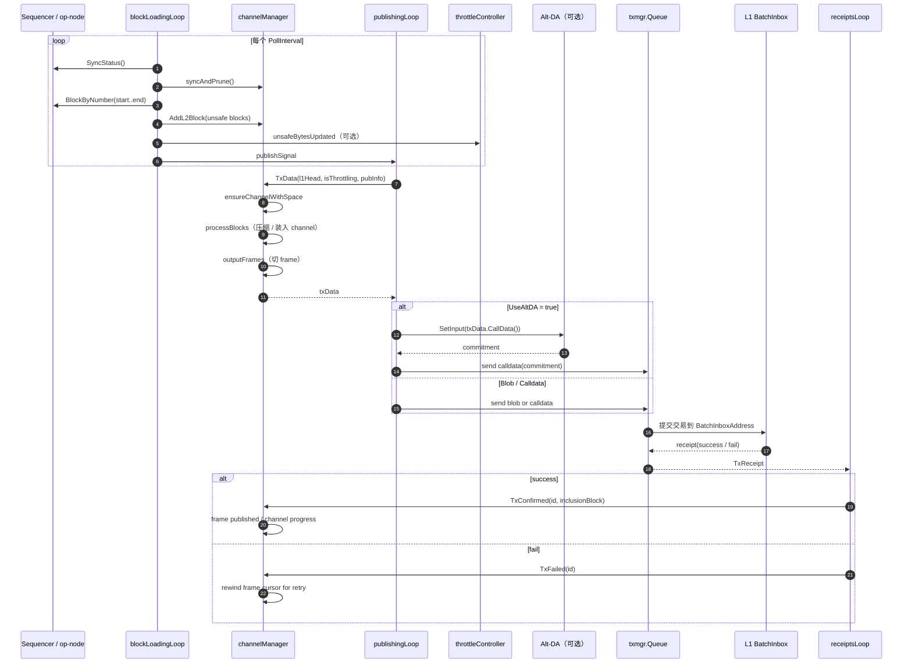
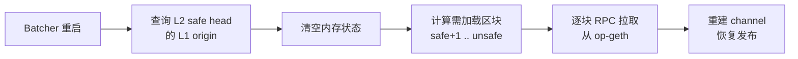
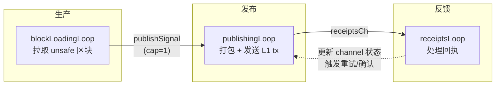
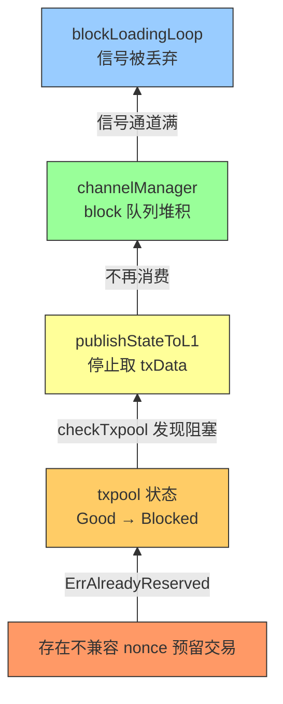
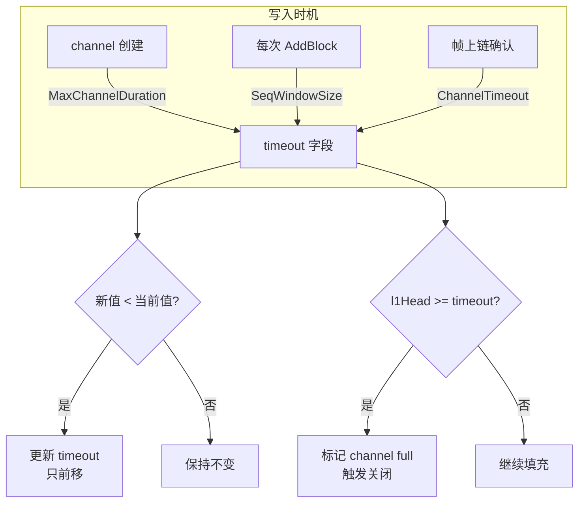
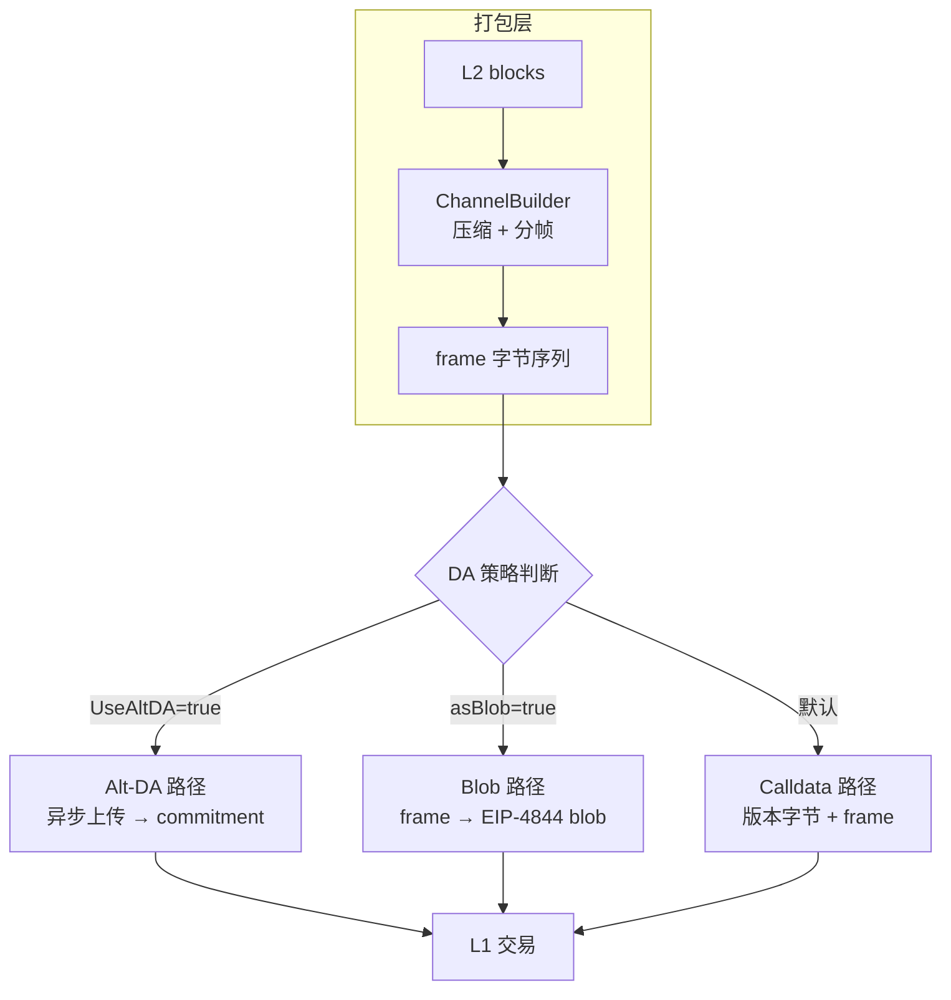
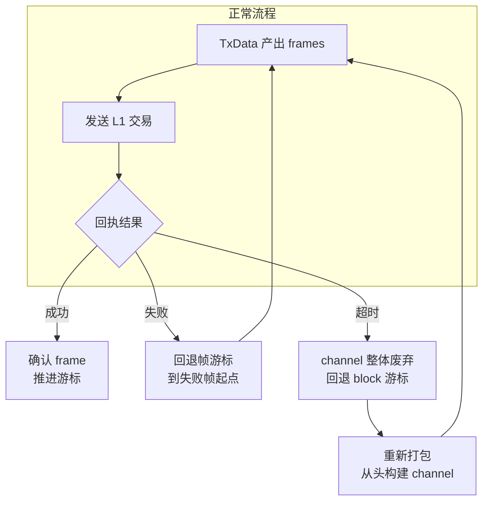
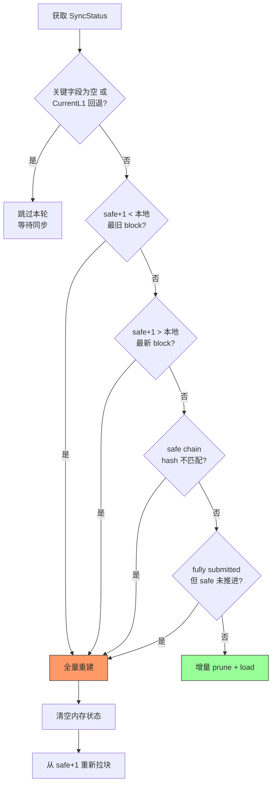
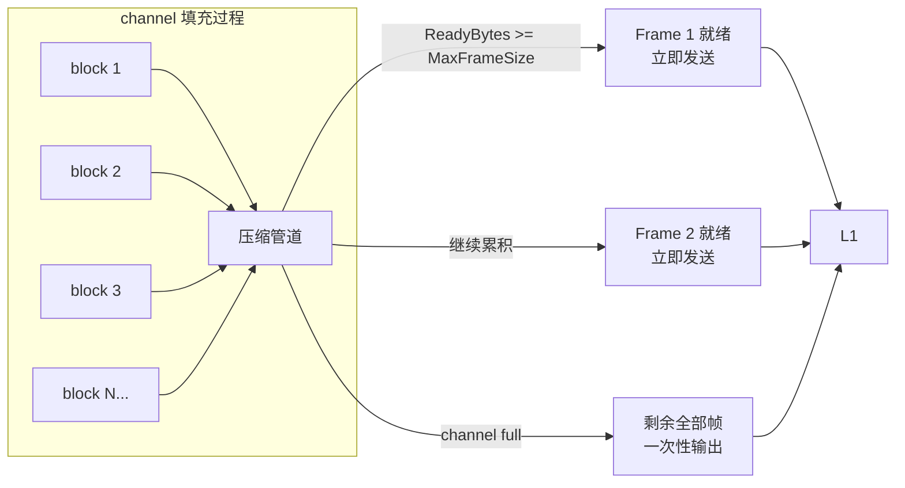
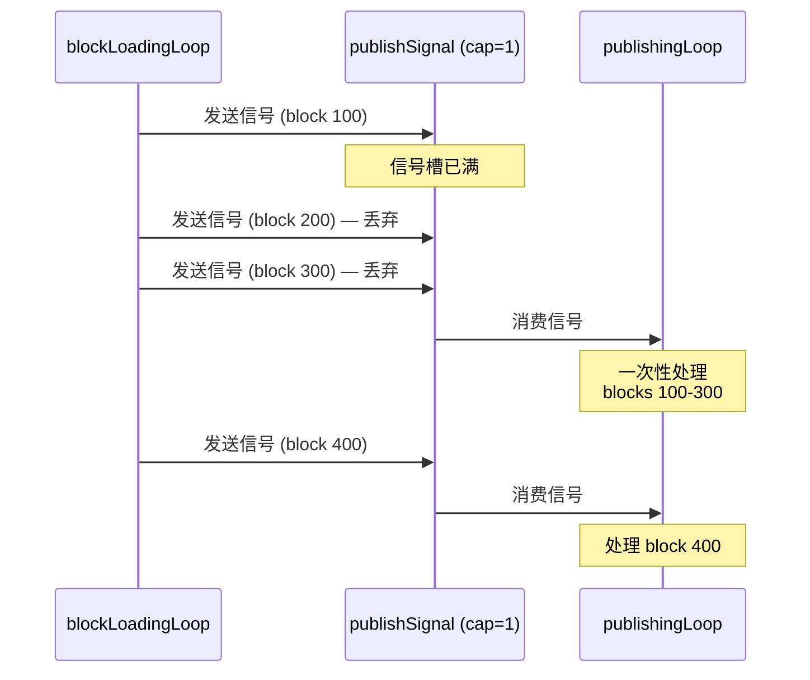

# op-batcher：L2 区块数据同步至 L1 的完整流程

> **范围说明**：本文聚焦 `op-batcher` 如何把 Sequencer 产出的 unsafe L2 blocks 组织并提交到 L1（`BatchInboxAddress`），不展开 L1 上合约执行细节与 `op-node` 派生内部实现。
>
> **源码版本**：基于 `optimism` monorepo，主要文件：
>
> - `op-batcher/batcher/driver.go`
> - `op-batcher/batcher/channel_manager.go`
> - `op-batcher/batcher/channel_builder.go`
> - `op-batcher/batcher/channel.go`
> - `op-batcher/batcher/sync_actions.go`
> - `op-batcher/batcher/tx_data.go`

---

## 目录

1. [关键概念](#sec-1)
2. [核心数据结构](#sec-2)
3. [流程时序图](#sec-3)
4. [分阶段流程详解](#sec-4)
   - [阶段 A：启动与并发管线初始化](#stage-a)
   - [阶段 B：状态对齐与增量拉取](#stage-b)
   - [阶段 C：通道打包与帧生成（核心）](#stage-c)
   - [阶段 D：DA 路径选择与交易构造](#stage-d)
   - [阶段 E：L1 提交与发送背压控制](#stage-e)
   - [阶段 F：回执确认与失败重试闭环](#stage-f)
   - [阶段 G：异常恢复与一致性重建](#stage-g)
5. [关键阶段速览（A-G）](#sec-5)
6. [源码映射与定位索引](#sec-6)
7. [一页速读总结](#sec-7)
8. [关键设计总结](#sec-8)

---

<a id="sec-1"></a>

## 1. 关键概念

下表整理 `op-batcher` 模块设计中的核心术语，统一中英文语义，方便后续章节对照源码阅读。

| 中文概念 | English | 用途说明 |
| --- | --- | --- |
| 批次提交器 | Batcher | 将 Sequencer 产出的 unsafe L2 blocks 打包并提交到 L1。 |
| 通道管理器 | Channel Manager | 管理 block 队列与 channel 生命周期，负责对外产出可发送的 `txData`。 |
| 通道构建器 | Channel Builder | 负责将 L2 block 数据编码、压缩、切分为 frames，并维护超时与满载状态。 |
| 通道 | Channel | 一段连续 L2 block 数据的打包单元，对应多笔 L1 提交交易。 |
| 帧 | Frame | Channel 的最小可发送分片，最终被封装进 calldata 或 blob 交易。 |
| 批次交易数据 | Transaction Data (`txData`) | 一次 L1 发送所需数据载体，包含 frame 集合及 DA 路径标记。 |
| 数据可用性 | Data Availability (DA) | 批次数据发布路径：`calldata` / `blob` / `Alt-DA`。 |
| 节流控制 | Throttling | 根据 L1 DA 压力动态收敛 batcher 发送行为。 |
| 同步状态 | Sync Status | 由 op-node 提供的链状态快照，驱动 prune/load/clear 决策。 |
| 不安全区块 | Unsafe L2 Block | 已排序但尚未通过 L1 派生确认的 L2 区块。 |
| 安全区块 | Safe L2 Block | 可由 L1 数据确定性派生得到的 L2 区块。 |
| 重组 | Reorg | 链分叉回滚事件，触发 batcher 清理状态并重建打包上下文。 |
| 提交窗口 | Sequencer Window | 区块提交到 L1 的有效窗口，接近窗口末尾会强制关闭 channel。 |
| 回执闭环 | Receipt Loop | 基于 L1 交易回执推进 channel 状态，成功确认或失败回退重试。 |

---

<a id="sec-2"></a>

## 2. 核心数据结构

下表聚焦 `op-batcher` 流程中最关键的数据结构与职责分工。

| 数据结构 | 主要位置 | 用途解释 |
| --- | --- | --- |
| `BatchSubmitter` | `op-batcher/batcher/driver.go` | batcher 主协调器，负责启动并管理加载、发布、回执三条主循环。 |
| `channelManager` | `op-batcher/batcher/channel_manager.go` | 维护 block/channel 队列，生成待发送 `txData`，并处理确认/失败回调。 |
| `ChannelBuilder` | `op-batcher/batcher/channel_builder.go` | 负责 block 编码压缩、frame 生成、timeout 更新、full 状态判定。 |
| `channel` | `op-batcher/batcher/channel.go` | 封装单个 channel 的发送进度、pending tx、confirmed tx 与回退游标。 |
| `txData` | `op-batcher/batcher/tx_data.go` | 单笔 L1 提交的发送载体，承载 frames 及 `asBlob` 等发送属性。 |
| `ChannelConfig` | `op-batcher/batcher/channel_config.go` | 描述压缩算法、frame 大小、目标帧数、超时参数、是否 blobs 等策略。 |
| `syncActions` | `op-batcher/batcher/sync_actions.go` | 统一表达一次同步周期的动作集合：`prune` / `load` / `clearState`。 |
| `inclusiveBlockRange` | `op-batcher/batcher/sync_actions.go` | 描述闭区间 block 范围，常用于增量加载 unsafe blocks。 |
| `eth.SyncStatus` | `op-service/eth` | 提供 `HeadL1/CurrentL1/UnsafeL2/LocalSafeL2` 等视图，作为同步输入。**注意**：batcher 使用 `LocalSafeL2`（本地安全头）而非 `SafeL2`（CrossSafe），以避免 interop 后引入额外依赖。 |
| `txmgr.Queue[txRef]` | `op-service/txmgr` | 负责 nonce/gas/retry 管理与异步发送队列。 |
| `txRef` | `op-batcher/batcher` | 交易关联引用，帮助在回执处理阶段定位对应 channel/frame。 |
| `TxReceipt[txRef]` | `op-service/txmgr` | 承载发送结果与关联引用，用于 `TxConfirmed` / `TxFailed` 状态推进。 |
| `pubInfo` | `op-batcher/batcher/driver.go` | 发布上下文信息（如强制发布、策略参数），影响 `TxData()` 选路与发送策略。 |

### 2.1 关键概念 ↔ 核心数据结构 ↔ 对应源码文件

| 关键概念 | 核心数据结构 | 对应源码文件 |
| --- | --- | --- |
| 批次提交主流程 | `BatchSubmitter` | `op-batcher/batcher/driver.go` |
| 同步状态对齐 | `eth.SyncStatus`、`syncActions`、`inclusiveBlockRange` | `op-batcher/batcher/sync_actions.go`、`op-batcher/batcher/driver.go` |
| 通道生命周期管理 | `channelManager`、`channel` | `op-batcher/batcher/channel_manager.go`、`op-batcher/batcher/channel.go` |
| 通道构建与压缩 | `ChannelBuilder` | `op-batcher/batcher/channel_builder.go` |
| 帧切分与发送载荷 | `txData` | `op-batcher/batcher/tx_data.go`、`op-batcher/batcher/channel_manager.go` |
| DA 路径选择（calldata/blob/Alt-DA） | `ChannelConfig`、`txData` | `op-batcher/batcher/channel_config.go`、`op-batcher/batcher/driver.go` |
| L1 发送队列与重试 | `txmgr.Queue[txRef]`、`txRef` | `op-service/txmgr/*`、`op-batcher/batcher/driver.go` |
| 回执确认与失败回退 | `TxReceipt[txRef]`、`channel` | `op-batcher/batcher/driver.go`、`op-batcher/batcher/channel.go` |
| 重组恢复与状态重建 | `syncActions.clearState`、`channelManager` | `op-batcher/batcher/sync_actions.go`、`op-batcher/batcher/channel_manager.go`、`op-batcher/batcher/driver.go` |

---

<a id="sec-3"></a>

## 3. 流程时序图



---

<a id="sec-4"></a>

## 4. 分阶段流程详解

---

<a id="stage-a"></a>

### 阶段 A：启动与并发管线初始化

- 主要工作：
  - 创建 `shutdownCtx / killCtx` 两级生命周期上下文，初始化 `channelManager` 状态（以 safe L1 origin 为起点）。
  - 启动 3 个核心并发循环：`blockLoadingLoop`（拉块）、`publishingLoop`（发布）、`receiptsLoop`（回执）。
  - （可选）启动 `throttlingLoop`，以 fan-out 方式为每个 endpoint 启动独立的 `singleEndpointThrottler`，动态调节 DA 大小上限。
  - 启动前先等待 L2 genesis 时间点；可配置 `WaitNodeSync` 等待 op-node 同步到最近 L1。
  - `publishSignal` 与 `unsafeBytesUpdated` 为容量 1 的非阻塞信号通道，满了会跳过，不阻塞发送方。
- 关键源码引用：
  - `op-batcher/batcher/driver.go`
    - `StartBatchSubmitting()`：创建信号通道，启动三条主循环和（可选）throttling 循环
    - `StopBatchSubmitting()`：先取消 `shutdownCtx`（优雅停），超时后取消 `killCtx`（强制停）
    - `blockLoadingLoop()`：轮询 sequencer，加载 unsafe 区块
    - `publishingLoop()`：消费 `publishSignal`，驱动 channel 打包和 L1 发送
    - `receiptsLoop()`：处理 txmgr 回执，更新 channel 状态
    - `throttlingLoop()`：fan-out 分发 unsafe bytes 更新到各 endpoint

---

<a id="stage-b"></a>

### 阶段 B：状态对齐与增量拉取

- 主要工作：
  - 周期调用 `getSyncStatus()` 获取 op-node 同步状态（使用 `LocalSafeL2` 而非 `SafeL2`）。
  - `syncAndPrune()` 计算 prune / load / clear 动作，裁剪已 safe 的块和 channel，拉取增量 unsafe 区块。
  - 检测 reorg / safe 链不一致 / 派生管道卡住时触发 `startAfresh` 全量重建。
  - 每 100 块触发一次 publish 信号（设置 `ignoreMaxChannelDuration`），每 tick 末尾无条件发送空 `pubInfo{}` 信号。
  - `AddL2Block()` 使用 `parentHash` 校验链连续性，不连续返回 `ErrReorg` → 触发 `waitNodeSyncAndClearState()`。
- 关键源码引用：
  - `op-batcher/batcher/driver.go`
    - `getSyncStatus()`：获取 `eth.SyncStatus`，含退避重试逻辑
    - `syncAndPrune()`：调用 `computeSyncActions` 后执行 prune / clear
    - `loadBlocksIntoState()`：逐块 `AddL2Block()` 入队，每 100 块触发 publish 信号
    - `waitNodeSyncAndClearState()`：遇到 reorg 时等待 op-node 追平再重建
  - `op-batcher/batcher/sync_actions.go`
    - `computeSyncActions()`：计算 `blocksToPrune` / `channelsToPrune` / `clearState` / `blocksToLoad`，检测多类不一致（safe 超前、hash 不匹配、派生卡住）→ 返回 `startAfresh`
  - `op-batcher/batcher/channel_manager.go`
    - `AddL2Block()`：block 入队，`parentHash` 校验连续性
    - `PruneSafeBlocks()` / `PruneChannels()`：已 safe 数据的 GC

---

<a id="stage-c"></a>

### 阶段 C：通道打包与帧生成（核心）

- 主要工作：
  - 将 L2 block 流压缩打包为 channel / frame，产出可直接上链的 `txData`。
  - `TxData()` → `getReadyChannel()` → `ensureChannelWithSpace()` → `processBlocks()` → `outputFrames()` → `nextTxData()`。
  - 未满 channel 也会产出 ready frames 并发送（边打包边发送），不必等 channel 全满。
  - 首次提交前动态检测 DA 类型变化（`UseBlobs`），变化时 `handleChannelInvalidated()` 回退 blockCursor 重新打包。
  - channel 超时由统一 `timeout` 字段管理（MaxChannelDuration / SeqWindowSize / ChannelTimeout 三种机制，"只前移"原则）。
  - calldata 模式每笔 tx 含 1 frame；blob 模式每笔 tx 含最多 `MaxFramesPerTx()`（= `TargetNumFrames`）个 frame。
  - `publishingLoop` 与 `blockLoadingLoop` 对 channelManager 的所有调用都在 `channelMgrMutex` 保护下。
- 关键源码引用：
  - `op-batcher/batcher/channel_manager.go`
    - `TxData()`：取下一笔可发送数据，含 DA 类型切换检测与 channel 重建
    - `getReadyChannel()`：确保有可发送的 channel，含 `forcePublish` 处理
    - `ensureChannelWithSpace()`：按需创建新 `ChannelBuilder`，绑定 `ChannelConfig`
    - `processBlocks()`：将 block 批量加入 channel 压缩管道
    - `outputFrames()`：产出 frame 数据（增量 or 全量）
    - `registerL1Block()`：注册 L1 head，`CheckTimeout` 统一检查超时
    - `nextTxData()`：从 channel 弹出一笔 `txData`，登记 `txChannels[txID]`
    - `handleChannelInvalidated()`：回退 blockCursor，丢弃当前及更新的 channel
  - `op-batcher/batcher/channel_builder.go`
    - `AddBlock()`：block 进压缩管道（委托 `ChannelOut.AddBlock()`），更新 l1Origin / l2 / SeqWindow 超时，触发 full 检测
    - `OutputFrames()`：未满 → `outputReadyFrames()`；已满 → `closeAndOutputAllFrames()`
    - `CheckTimeout()`：检查统一 timeout 字段，达到则标记 full
    - `FramePublished()`：帧上链后更新 ChannelTimeout 基准
  - `op-batcher/batcher/channel.go`
    - `NextTxData()`：按 `MaxFramesPerTx()` 弹出 frames，组装 `txData`
    - `TxFailed()`：失败重传，`RewindFrameCursor()` 回退帧游标
  - `op-batcher/batcher/channel_config.go`
    - `MaxFramesPerTx()`：calldata → 1；blob → `TargetNumFrames`

---

<a id="stage-d"></a>

### 阶段 D：DA 路径选择与交易构造

- 主要工作：
  - 把 `txData` 变成真正的 L1 交易候选（blob / calldata / Alt-DA commitment）。
  - `publishTxToL1()` 先取 `l1Tip`，再从 `channelManager.TxData()` 取数据。
  - `sendTransaction()` 按优先级分支：Alt-DA → Blob → Calldata。
  - Alt-DA 路径通过 errgroup 异步执行（受 `MaxConcurrentDARequests` 上限），返回后 `publishStateToL1` 可继续处理下一笔。
  - `sendTx()` 设置 gas limit（`core.FloorDataGas()`）并调用 `txmgr.Queue.Send()`。
- 关键源码引用：
  - `op-batcher/batcher/driver.go`
    - `publishTxToL1()`：取 l1Tip + TxData，调用 `sendTransaction`
    - `sendTransaction()`：Alt-DA / Blob / Calldata 三路分支选择
    - `publishToAltDAAndL1()`：errgroup 异步调用 `AltDA.SetInput()`，拿到 commitment 后构造 calldata tx
    - `blobTxCandidate()`：每个 frame 编码为 EIP-4844 Blob
    - `calldataTxCandidate()`：拼接版本字节 + frame 数据
    - `sendTx()`：设置 gas limit，调用 `queue.Send()`
  - `op-batcher/batcher/tx_data.go`
    - `CallData()`：版本字节 + 拼接 frame 数据为 calldata
    - `Blobs()`：将 frame 数据编码为 blob

---

<a id="stage-e"></a>

### 阶段 E：L1 提交与发送背压控制

- 主要工作：
  - `publishingLoop()` 持续消费 `publishSignal`，每次信号触发 `publishStateToL1()`。
  - `publishStateToL1()` 在 txmgr 未关闭且 `TxpoolGood` 时循环"取 txData → 发送"。
  - `txmgr.Queue` 控制最大并发 pending 交易数（`MaxPendingTransactions`），超出上限时 `queue.Send()` 阻塞，自然形成背压。
  - txpool 堵塞恢复分两阶段：`receiptsLoop` 检测 `ErrAlreadyReserved` → 设置 `TxpoolBlocked`；`checkTxpool()` 检测到后发取消交易 → 回执到达后恢复 `TxpoolGood`。
  - 发布循环退出时依次等待 Alt-DA goroutine group 和 txmgr queue 全部收尾，防止丢回执。
  - `forcePublish`（`Flush()` API）仅在 `currentChannel != nil && TotalFrames()==0` 时强制 close 并产出帧。
- 关键源码引用：
  - `op-batcher/batcher/driver.go`
    - `publishingLoop()`：消费 `publishSignal`，驱动发布，退出时等待 DA + txQueue
    - `publishStateToL1()`：循环取 txData 并发送，检查 txmgr 和 txpool 状态
    - `checkTxpool()`：检测 `TxpoolBlocked` → 切换 `TxpoolCancelPending` → 发取消交易
    - `cancelBlockingTx()`：blob 卡住发 calldata 取消，反之发 blob 取消

---

<a id="stage-f"></a>

### 阶段 F：回执确认与失败重试闭环

- 主要工作：
  - `receiptsLoop()` 持续消费 `receiptsCh`，以 receipt 为准更新 channel 生命周期。
  - 成功回执：`recordConfirmedTx()` → `TxConfirmed(id, inclusionBlock)`，删除 pending / 写入 confirmed / 更新 inclusion 区间 / 检查 fully submitted / 检查 timed out。
  - 失败回执：`recordFailedTx()` → `TxFailed(id)`，`RewindFrameCursor()` 回退到失败帧第一帧，下次 `TxData()` 重新产出。
  - channel 超时判定：`maxInclusionBlock - minInclusionBlock >= ChannelTimeout`，超时触发 `handleChannelInvalidated()` 回退重建。
  - **Granite 硬分叉前**：`ChannelTimeout` 可能偏短导致误判超时，仅浪费资金不影响 safe head。
- 关键源码引用：
  - `op-batcher/batcher/driver.go`
    - `receiptsLoop()`：消费 `receiptsCh`，检测 `ErrAlreadyReserved` 设置 txpool 状态
    - `handleReceipt()`：分发到 `recordConfirmedTx()` / `recordFailedTx()`
    - `recordConfirmedTx()`：调用 `channelMgr.TxConfirmed(id, l1block)`
    - `recordFailedTx()`：调用 `channelMgr.TxFailed(id)`
  - `op-batcher/batcher/channel_manager.go`
    - `TxConfirmed()`：删除 `txChannels` 映射，调用 `channel.TxConfirmed()`，超时则 `handleChannelInvalidated()`
    - `TxFailed()`：删除 `txChannels` 映射，调用 `channel.TxFailed()`
  - `op-batcher/batcher/channel.go`
    - `TxConfirmed()`：未知 tx 检查 → 删 pending / 写 confirmed / `FramePublished()` / 更新 min/max inclusionBlock / 检查 fullySubmitted + timedOut
    - `TxFailed()`：`RewindFrameCursor()` 回退帧游标
    - `isTimedOut()`：`maxInclusionBlock - minInclusionBlock >= ChannelTimeout`

---

<a id="stage-g"></a>

### 阶段 G：异常恢复与一致性重建

- 主要工作：
  - 在 reorg / safe 链不一致 / sequencer 不同步 / channel 超时等异常下恢复一致状态。
- `computeSyncActions()` 在四类确定性失配下返回 `startAfresh`：`safe+1 < 最旧 block`、`safe+1 > 最新 block`、safe chain hash 不匹配、fully submitted 但 safe 未推进；若是关键字段为空或 `CurrentL1` 回退则先 `outOfSync` 跳过本轮。
  - `clearState()` 以 `LocalSafeL2.L1Origin` 为起点清理 `channelManager`（含 5 秒重试逻辑，context 取消时兜底零值清理）。
  - `waitNodeSync()` 轮询 op-node，等待其同步到目标 L1 block 后再恢复拉块。
  - 一致性 > 吞吐：宁可多提交一遍，不允许提交错误数据。unsafe block 通过重拉 sequencer 可完全恢复。
- 关键源码引用：
  - `op-batcher/batcher/sync_actions.go`
    - `computeSyncActions()`：PART 1-5 分层检测，返回 `syncActions{clearState, blocksToLoad, blocksToPrune, channelsToPrune}`
  - `op-batcher/batcher/driver.go`
    - `clearState()`：获取 `safeL1Origin()` → `channelMgr.Clear()`，失败则 5 秒重试
    - `waitNodeSync()`：`dial.WaitRollupSync()` 轮询等待 op-node 追平
    - `waitNodeSyncAndClearState()`：组合等待同步 + 清理状态
  - `op-batcher/batcher/channel_manager.go`
    - `Clear()`：清空 blocks / channels / tip / txChannels，重置指标

---

<a id="sec-5"></a>

## 5. 关键阶段速览（A-G）

| 阶段 | 名称 | 一句话总结 |
| --- | --- | --- |
| A | 启动与并发管线初始化 | 启动"拉块、发布、回执"三条并发主循环，形成持续提交流水线。 |
| B | 状态对齐与增量拉取 | 以 `SyncStatus` 为准裁剪本地状态，按增量加载 unsafe 区块。 |
| C | 通道打包与帧生成（核心） | 把 L2 区块压缩打包为 channel/frame，产出可直接上链的 `txData`。 |
| D | DA 路径选择与交易构造 | 根据配置与节流状态选择 blob/calldata/Alt-DA commitment 发送路径。 |
| E | L1 提交与发送背压控制 | 通过 `txmgr.Queue` 管理 pending、nonce 与发送节奏，把批次写入 L1。 |
| F | 回执确认与失败重试闭环 | 成功则推进 channel 状态，失败则回退帧游标并重试，保证最终可达。 |
| G | 异常恢复与一致性重建 | 遇到 reorg/不同步/超时等异常时清理并重建状态，恢复一致性。 |

---

<a id="sec-6"></a>

## 6. 源码映射与定位索引

| 文件 | 关键函数 | 说明 |
| --- | --- | --- |
| `driver.go` | `StartBatchSubmitting` | 启动主循环，创建信号通道 |
| `driver.go` | `blockLoadingLoop` | 轮询 sequencer，加载 unsafe 块 |
| `driver.go` | `publishingLoop` | 消费信号，发布批次到 L1 |
| `driver.go` | `receiptsLoop` | 处理回执，更新 channel 状态 |
| `driver.go` | `publishTxToL1` | 取 txData，构造并发送 L1 tx |
| `driver.go` | `sendTransaction` | blob / calldata / Alt-DA 路径选择 |
| `driver.go` | `clearState` | 基于 safe L1 origin 清理状态 |
| `sync_actions.go` | `computeSyncActions` | 计算 prune/load/clear 动作 |
| `channel_manager.go` | `TxData` | 取下一笔可发送数据（含 DA 类型切换） |
| `channel_manager.go` | `getReadyChannel` | 确保有可发送的 channel |
| `channel_manager.go` | `processBlocks` | 将 block 批量加入 channel |
| `channel_manager.go` | `outputFrames` | 产出 frame 数据 |
| `channel_manager.go` | `AddL2Block` | block 入队，校验连续性 |
| `channel_manager.go` | `TxConfirmed` / `TxFailed` | 回执回调，推进或回退 channel |
| `channel_builder.go` | `AddBlock` | block 进压缩管道，触发 full 检测 |
| `channel_builder.go` | `OutputFrames` | 增量或全量输出帧 |
| `channel_builder.go` | `CheckTimeout` | L1 block 注册，判断超时 |
| `channel_builder.go` | `FramePublished` | 帧上链后更新 timeout 基准 |
| `channel.go` | `NextTxData` | 弹出一笔 txData |
| `channel.go` | `TxFailed` | 失败重传，回退帧游标 |
| `channel.go` | `TxConfirmed` | 确认帧，判断 fully submitted / timed out |
| `tx_data.go` | `CallData` / `Blobs` | 将 frame 编码为 calldata 或 blob |

---

<a id="sec-7"></a>

## 7. 一页速读总结

```
Batcher 周期拉取增量 unsafe L2 块（正常为 [newestInState+1 .. unsafe]，全量重建为 [safe+1 .. unsafe]），维护本地 block 队列。
    ↓
ChannelManager 把块压缩进 channel，切成 frame，产出 txData。
    ↓
Publisher 按 blob / calldata / Alt-DA 路径构造 L1 交易，
发送到 BatchInboxAddress（txmgr.Queue 控制并发与重试）。
    ↓
ReceiptsLoop 依回执确认 channel 推进，或回退帧游标重试。
    ↓
遇到 reorg / 超时 / 派生卡住时，清理并基于 safe 视角重建，一致性优先。
```

---

<a id="sec-8"></a>

## 8. 关键设计总结

### 8.1 无状态设计（Stateless）

**原理**：batcher 不持久化任何状态到磁盘。所有 block 队列、channel、pending 交易映射均为纯内存结构。重启后通过查询链上 safe head 确定起点，从 L2 执行引擎重新拉取区块数据并重建打包状态。代价仅为重新压缩打包，换取的是**零运维磁盘管理、零状态迁移问题、天然幂等重启**。



**权衡**：牺牲启动速度（需重新拉块 + 压缩），换取运维简单性和故障恢复的确定性。

---

### 8.2 三循环管道架构（Pipeline）

**原理**：三个并发循环各司其职，通过信号通道解耦，形成 **生产 → 发布 → 反馈** 的流水线。它们在逻辑上解耦，但在生命周期上存在耦合；单阶段短时阻塞通常不会立即拖垮整体。



**关键特性**：
- 生产与发布通过容量 1 的信号通道连接，天然合并多次触发为一次处理。
- 反馈循环独立消费回执，不阻塞发布循环的下一笔发送。
- 关闭时按 `shutdownCtx → killCtx` 两级优雅退出，等待所有循环完成。

---

### 8.3 多层背压机制（Backpressure）

**原理**：当发送侧遇到 nonce 预留冲突或 pending 上限时，背压逐层向上传递，自动降低上游（拉块、打包）的速率，避免内存无限增长和 nonce 失控。



**三层控制**：

| 层级 | 机制 | 效果 |
| --- | --- | --- |
| L1 交易管理 | `MaxPendingTransactions` 限制并发 | `queue.Send()` 阻塞，停止发送新交易 |
| txpool 状态机 | `Good → Blocked → CancelPending → Good` | 识别 `ErrAlreadyReserved` 后发送取消交易，完成后恢复 |
| 信号通道 | 容量 1，满则丢弃 | 上游永不阻塞，多次信号合并 |

---

### 8.4 三层超时统一管理（Multi-layer Timeout）

**原理**：channel 有三种不同来源的截止时间，但不分别跟踪，而是写入**同一个 `timeout` 字段**，以"只前移"原则保证最早到期的超时生效。简化了检查逻辑——只需比较一个值。



**只前移原则**：三种超时竞争写入同一字段，但只有"更早的"才能覆盖。这意味着最先到期的超时类型自动生效，无需优先级判断。

---

### 8.5 DA 策略抽象（DA Abstraction）

**原理**：打包层（channel/frame）与传输层（DA 路径）解耦。打包层只产出 frame 字节序列，不关心最终如何上链。传输层在发送时才决定走 calldata / blob / Alt-DA，且支持运行时动态切换（如 L1 gas 价格变化导致策略切换）。其中 Alt-DA 与 blobs 为互斥模式。



**动态切换保护**：每次取 txData 前重新评估 DA 配置。若发现策略变化（如从 calldata 切到 blob），当前 channel 被整体废弃并回退，用新配置重新打包，确保**同一 channel 内 DA 类型一致**。

---

### 8.6 失败重试与幂等性（Retry & Idempotency）

**原理**：采用**游标回退 + 至少一次交付**模型。失败不丢弃数据，而是将游标回退到失败点，下次取数据时自动重新产出相同序列。发送层允许重试与重复提交，不允许遗漏；重复数据的最终处理由上层派生/协议语义兜底。



**两级回退粒度**：
- **帧级**：单笔交易失败 → 回退到该交易第一帧，其他 channel 数据不受影响。
- **channel 级**：超时或 DA 切换 → 整个 channel 废弃，从原始 block 重新压缩打包。

---

### 8.7 一致性优先恢复（Consistency-first Recovery）

**原理**：每个 tick 都会对比链上真实状态和本地内存状态。对“暂时不同步”信号（如关键字段为空、`CurrentL1` 回退）会先跳过本轮；对确定性的状态失配（重组、safe 链错位、派生卡住）才执行清空并从 safe 视角重建。宁可多提交一遍浪费 gas，也不允许提交错误数据。



**设计原则**：一致性 > 吞吐 > 成本。错误数据上链会导致 derivation 失败甚至安全事故，重复提交仅浪费 batcher 资金。

---

### 8.8 增量流式传输（Incremental Streaming）

**原理**：不等 channel 完全填满再发送，而是一边往 channel 填充 block，一边将已凑齐的 frame 输出并发送。这使得首帧延迟大幅降低——channel 还在接收新 block 时，早期的 frame 已经在 L1 上链。



**对比**：传统"填满再发"需要等 channel 完全满后才产出所有帧，首帧延迟等于整个 channel 的填充时间。流式传输将首帧延迟降低到**一帧的累积时间**。

---

### 8.9 信号驱动惰性求值（Signal-driven Lazy Evaluation）

**原理**：`publishingLoop` 不轮询，而是等待信号才工作。信号通道容量为 1，意味着无论上游发了多少次信号，消费者只会处理一次——自然地将多次触发合并为一次批量处理，避免重复扫描和无效工作。



**特殊信号**：
- **ignoreMaxChannelDuration**：大 backlog 加载时携带，告诉发布循环跳过超时检查，避免还没加载完就因超时关闭 channel。
- **forcePublish**：外部 API（`Flush()`）触发，强制立即关闭当前 channel 并产出帧。
- **空信号**：每 tick 末尾无条件发送，确保即使无新块也能触发已就绪 frame 的发送。

---

*本文档由源码分析自动生成，如有出入请以源码为准。*
