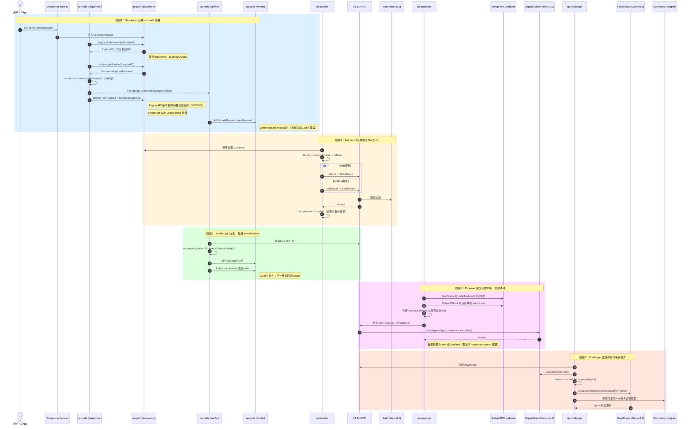

# OP Stack 全链路源码对照笔记

## 1. 全链路时序图（源码对照）

> 说明：该图已按 `op-node`、`op-batcher`、`op-proposer`、`op-challenger` 当前实现语义校正。  
> 重点修正：`op-proposer` 走 `DisputeGameFactory.create(...)`，`op-challenger` 以“监控并参与已创建 game”为主。

## 2. 时序图源码锚点与职责说明

### 2.1 阶段1：Sequencer 出块与 Unsafe 传播

- 主要工作：
  - `op-node` sequencer 准备 payload attributes，通过 3 次 Engine API 驱动出块：
    1. `engine_forkchoiceUpdated(attrs)` — 启动异步构建，返回 `PayloadID`
    2. `engine_getPayload(payloadID)` — 等待 `BlockTime - sealingDuration` 后取回密封区块
    3. `engine_newPayload(...)` — 执行/校验 payload；成功后由后续 forkchoice 更新推进链头
  - 密封后先通过 `conductor.CommitUnsafePayload` 完成 HA 共识，再通过异步 gossiper 发布 `ExecutionPayloadEnvelope`。
  - verifier 侧接收 unsafe payload 并进入本地引擎处理队列。
- 关键源码引用（按出块时序排列）：
  - **步骤 ①** `startBuildingBlock()` — 准备 attributes 并发出 `BuildStartEvent`
    - `op-node/rollup/sequencing/sequencer.go`：<https://github.com/ethereum-optimism/optimism/blob/b053ac1dd6e5e8b3e6d3d941c3300643c9d6d18b/op-node/rollup/sequencing/sequencer.go>
    - 调用 `FindL1Origin` -> `PreparePayloadAttributes` -> 发出 `BuildStartEvent`
  - **步骤 ②** `onBuildStart()` — 调用 `engine_forkchoiceUpdated(attrs)` 启动异步构建
    - `op-node/rollup/engine/build_start.go`：<https://github.com/ethereum-optimism/optimism/blob/b053ac1dd6e5e8b3e6d3d941c3300643c9d6d18b/op-node/rollup/engine/build_start.go>
    - 内部调用 `startPayload()` -> `engine.ForkchoiceUpdate(ctx, &fc, attrs)` -> 返回 `PayloadID`
    - 发出 `BuildStartedEvent`，排序器据此调度密封时机（`payloadTime - sealingDuration`）
  - **步骤 ③** `onBuildSeal()` — 调用 `engine_getPayload` 取回密封区块
    - `op-node/rollup/engine/build_seal.go`：<https://github.com/ethereum-optimism/optimism/blob/b053ac1dd6e5e8b3e6d3d941c3300643c9d6d18b/op-node/rollup/engine/build_seal.go>
    - 内部调用 `engine.GetPayload(ctx, ev.Info)` -> `sanityCheckPayload` -> 发出 `BuildSealedEvent`
  - **步骤 ④** `onBuildSealed()` — Conductor 共识 -> P2P gossip -> 触发本地 payload 处理
    - `op-node/rollup/sequencing/sequencer.go`（同上）
    - 执行顺序：`conductor.CommitUnsafePayload(30s 超时)` -> `asyncGossip.Gossip(envelope)` -> 发出 `PayloadProcessEvent`
  - **步骤 ④a** Conductor HA 共识
    - `op-node/rollup/conductor/conductor.go`：<https://github.com/ethereum-optimism/optimism/blob/b053ac1dd6e5e8b3e6d3d941c3300643c9d6d18b/op-node/rollup/conductor/conductor.go>
    - `CommitUnsafePayload()`：将 payload 提交到 conductor FSM（非 HA 模式下为 NoOp）
  - **步骤 ④b** P2P 广播
    - `op-node/rollup/async/asyncgossiper.go`：<https://github.com/ethereum-optimism/optimism/blob/b053ac1dd6e5e8b3e6d3d941c3300643c9d6d18b/op-node/rollup/async/asyncgossiper.go>
    - `gossip()` -> `SignAndPublishL2Payload`
  - **步骤 ⑤** `onPayloadProcess()` — 调用 `engine_newPayload` 执行/校验 payload
    - `op-node/rollup/engine/payload_process.go`：<https://github.com/ethereum-optimism/optimism/blob/b053ac1dd6e5e8b3e6d3d941c3300643c9d6d18b/op-node/rollup/engine/payload_process.go>
    - 内部调用 `engine.NewPayload(ctx, payload, beaconRoot)` -> `ExecutionValid` 时发出 `PayloadSuccessEvent`
    - `PayloadSuccessEvent` 后由 `tryUpdateEngineInternal()` 触发 forkchoice 更新推进本地链头
  - **Verifier 侧接收 unsafe payload**
    - `op-node/p2p/event.go`：<https://github.com/ethereum-optimism/optimism/blob/b053ac1dd6e5e8b3e6d3d941c3300643c9d6d18b/op-node/p2p/event.go>
    - `OnUnsafeL2Payload()`：接收 P2P payload 并交给 `SyncDeriver`
    - `op-node/rollup/driver/sync_deriver.go`：<https://github.com/ethereum-optimism/optimism/blob/b053ac1dd6e5e8b3e6d3d941c3300643c9d6d18b/op-node/rollup/driver/sync_deriver.go>
    - `OnUnsafeL2Payload()`：进入 `Engine.AddUnsafePayload(...)`

### 2.2 阶段2：Batcher DA 提交到 L1

- 主要工作：
  - 批处理服务启动三条循环：加载区块、发布交易、处理回执。
  - 从 L2 拉块进入 `channelManager`，组装 `channel/frame/txData`。
  - 根据策略发送 blob/calldata 交易到 `BatchInbox`，并按回执更新/重排状态。
- 关键源码引用：
  - `op-batcher/batcher/driver.go`：<https://github.com/ethereum-optimism/optimism/blob/b053ac1dd6e5e8b3e6d3d941c3300643c9d6d18b/op-batcher/batcher/driver.go>
    - `StartBatchSubmitting()`：启动 `blockLoadingLoop/publishingLoop/receiptsLoop`
    - `loadBlocksIntoState()`：循环拉取 L2 blocks
    - `publishStateToL1()` / `publishTxToL1()`：取 `TxData` 并发 L1
    - `sendTransaction()` / `blobTxCandidate()` / `calldataTxCandidate()`
    - `recordConfirmedTx()` / `recordFailedTx()`：回执驱动状态变化
  - `op-batcher/batcher/channel_manager.go`：<https://github.com/ethereum-optimism/optimism/blob/b053ac1dd6e5e8b3e6d3d941c3300643c9d6d18b/op-batcher/batcher/channel_manager.go>
    - `TxData()` / `nextTxData()`：从 channel 取待发数据
    - `TxConfirmed()` / `TxFailed()`：确认与失败处理
  - `op-batcher/batcher/channel.go`：<https://github.com/ethereum-optimism/optimism/blob/b053ac1dd6e5e8b3e6d3d941c3300643c9d6d18b/op-batcher/batcher/channel.go>
    - `NextTxData()`：按 frame 组装交易数据包

### 2.3 阶段3：Verifier 派生与 Safe/Finalized 推进

- 主要工作：
  - 从 L1 数据源按阶段还原 L2 输入（Frame -> Channel -> Batch -> Attributes）。
  - 将派生结果送入引擎，推进 safe；若与 unsafe 冲突，以 L1 派生为准。
  - finalizer 基于 L1 finalized 信号推动 L2 finalized。
- 关键源码引用：
  - `op-node/rollup/derive/pipeline.go`：<https://github.com/ethereum-optimism/optimism/blob/b053ac1dd6e5e8b3e6d3d941c3300643c9d6d18b/op-node/rollup/derive/pipeline.go>
    - `NewDerivationPipeline()`：各派生 stage 组装
    - `Step()`：派生主推进逻辑
  - `op-node/rollup/engine/events.go`：<https://github.com/ethereum-optimism/optimism/blob/b053ac1dd6e5e8b3e6d3d941c3300643c9d6d18b/op-node/rollup/engine/events.go>
    - `ForkchoiceUpdateEvent{Unsafe, Safe, Finalized}`
  - `op-node/rollup/engine/engine_controller.go`：<https://github.com/ethereum-optimism/optimism/blob/b053ac1dd6e5e8b3e6d3d941c3300643c9d6d18b/op-node/rollup/engine/engine_controller.go>
    - `onForkchoiceUpdate()`：处理 unsafe payload 队列与适配条件
    - `requestForkchoiceUpdate()`：发出三头状态
    - `PromoteFinalized()`：推动 finalized
  - `op-node/rollup/finality/finalizer.go`：<https://github.com/ethereum-optimism/optimism/blob/b053ac1dd6e5e8b3e6d3d941c3300643c9d6d18b/op-node/rollup/finality/finalizer.go>
    - `OnL1Finalized()` / `tryFinalize()`：L1 finality -> L2 finalized

### 2.4 阶段4：Proposer 创建 Dispute Game

- 主要工作：
  - 周期轮询：判断是否达到 proposal interval、是否与最近 claim 重复。
  - 通过配置的 rollup RPC endpoint 调 `SyncStatus` 获取 **safe 或 finalized**（取决于 `--proposal-source` 配置）的 L2 区块号，再通过 `OutputAtBlock` 获取对应的 output root。
  - 构建并发送 DGF `create` 交易（附带 init bond）。
- 关键源码引用（按提议时序排列）：
  - **步骤 ①** 获取目标 L2 区块号
    - `op-proposer/proposer/driver.go`：<https://github.com/ethereum-optimism/optimism/blob/b053ac1dd6e5e8b3e6d3d941c3300643c9d6d18b/op-proposer/proposer/driver.go>
    - `FetchCurrentBlockNumber()`：调用 `SyncStatus()` RPC，根据 `--proposal-source` 配置返回 **safe** 或 **finalized** 的 L2 区块号
  - **步骤 ②** 获取 output root
    - `op-proposer/proposer/source/source_rollup.go`：<https://github.com/ethereum-optimism/optimism/blob/b053ac1dd6e5e8b3e6d3d941c3300643c9d6d18b/op-proposer/proposer/source/source_rollup.go>
    - `ProposalAtSequenceNum()`：调用 `client.OutputAtBlock(ctx, blockNum)` RPC 获取 output root
  - **步骤 ③** 判断是否需要提议
    - `op-proposer/proposer/driver.go`（同上）
    - `FetchDGFOutput()`：检查 `HasProposedSince` 判断是否在 proposal interval 内已提交
  - **步骤 ④** 构建并发送 DGF create 交易
    - `op-proposer/contracts/disputegamefactory.go`：<https://github.com/ethereum-optimism/optimism/blob/b053ac1dd6e5e8b3e6d3d941c3300643c9d6d18b/op-proposer/contracts/disputegamefactory.go>
    - `ProposalTx()`：获取 `initBond`，构造 `DisputeGameFactory.create(gameType, outputRoot, extraData)` 交易
    - `op-proposer/proposer/driver.go`（同上）
    - `sendTransaction()`：通过 `Txmgr.Send()` 发送交易到 L1

### 2.5 阶段5：Challenger 监控与博弈执行

- 主要工作：
  - 监听 L1 新头，按时间窗口从 DGF 拉取 game 列表。
  - monitor 把任务交给 scheduler，scheduler 并发驱动 player/agent 执行动作。
  - responder 将动作转为链上交易（attack/defend/step/resolveClaim/resolve）。
  - 需要 preimage/trace 时，通过 uploader 与 VM 侧数据协同（含 Cannon 相关路径）。
- 关键源码引用：
  - `op-challenger/game/service.go`：<https://github.com/ethereum-optimism/optimism/blob/b053ac1dd6e5e8b3e6d3d941c3300643c9d6d18b/op-challenger/game/service.go>
    - `Start()`：启动 scheduler/claimer/preimages/monitor
  - `op-challenger/game/monitor.go`：<https://github.com/ethereum-optimism/optimism/blob/b053ac1dd6e5e8b3e6d3d941c3300643c9d6d18b/op-challenger/game/monitor.go>
    - `StartMonitoring()`：订阅 newHeads
    - `progressGames()`：`GetGamesAtOrAfter` 后调度执行
  - `op-challenger/game/fault/contracts/gamefactory.go`：<https://github.com/ethereum-optimism/optimism/blob/b053ac1dd6e5e8b3e6d3d941c3300643c9d6d18b/op-challenger/game/fault/contracts/gamefactory.go>
    - `GetGamesAtOrAfter()`：按窗口拉取 dispute games
  - `op-challenger/game/scheduler/scheduler.go`：<https://github.com/ethereum-optimism/optimism/blob/b053ac1dd6e5e8b3e6d3d941c3300643c9d6d18b/op-challenger/game/scheduler/scheduler.go>
    - `Schedule()` / `loop()`：调度与结果回收
  - `op-challenger/game/fault/agent.go`：<https://github.com/ethereum-optimism/optimism/blob/b053ac1dd6e5e8b3e6d3d941c3300643c9d6d18b/op-challenger/game/fault/agent.go>
    - `Act()` / `performAction()`：计算并执行 next actions
  - `op-challenger/game/fault/responder/responder.go`：<https://github.com/ethereum-optimism/optimism/blob/b053ac1dd6e5e8b3e6d3d941c3300643c9d6d18b/op-challenger/game/fault/responder/responder.go>
    - `PerformAction()`：动作到链上交易映射
  - `op-challenger/game/fault/contracts/faultdisputegame.go`：<https://github.com/ethereum-optimism/optimism/blob/b053ac1dd6e5e8b3e6d3d941c3300643c9d6d18b/op-challenger/game/fault/contracts/faultdisputegame.go>
    - `AttackTx()` / `DefendTx()` / `StepTx()` / `ResolveClaimTx()` / `ResolveTx()`
  - `op-challenger/sender/sender.go`：<https://github.com/ethereum-optimism/optimism/blob/b053ac1dd6e5e8b3e6d3d941c3300643c9d6d18b/op-challenger/sender/sender.go>
    - `SendAndWaitSimple()`：统一交易发送与回执等待

## 3. 极简索引（阶段 / 函数 / 作用）

| 阶段 | 关键函数 | 一句话作用 |
| --- | --- | --- |
| 阶段1：Sequencer 出块 + unsafe 传播 | `sequencer.startBuildingBlock` | 准备 payload attributes 并发出 `BuildStartEvent`，启动新块生产。 |
| 阶段1：Sequencer 出块 + unsafe 传播 | `engineCtrl.onBuildStart` | 调用 `engine_forkchoiceUpdated(attrs)` 开始异步构建，返回 PayloadID（版本按时间戳动态选择）。 |
| 阶段1：Sequencer 出块 + unsafe 传播 | `engineCtrl.onBuildSeal` | 调用 `engine_getPayload(payloadID)` 取回密封的 `ExecutionPayloadEnvelope`。 |
| 阶段1：Sequencer 出块 + unsafe 传播 | `sequencer.onBuildSealed` | Conductor 共识 -> P2P gossip -> 发出 `PayloadProcessEvent`。 |
| 阶段1：Sequencer 出块 + unsafe 传播 | `asyncgossiper.gossip` | 对 `ExecutionPayloadEnvelope` 签名并发布到 P2P 网络。 |
| 阶段1：Sequencer 出块 + unsafe 传播 | `sync_deriver.OnUnsafeL2Payload` | verifier 侧接收 unsafe payload 并送入引擎队列。 |
| 阶段2：Batcher 提交 DA 到 L1 | `BatchSubmitter.StartBatchSubmitting` | 启动加载区块、发布交易、处理回执三条主循环。 |
| 阶段2：Batcher 提交 DA 到 L1 | `BatchSubmitter.publishTxToL1` | 从 `channelManager` 取 `TxData` 并提交到 L1。 |
| 阶段2：Batcher 提交 DA 到 L1 | `channelManager.TxData` | 按 channel/frame 组装下一笔待提交数据（blob/calldata）。 |
| 阶段2：Batcher 提交 DA 到 L1 | `BatchSubmitter.recordConfirmedTx` | 处理上链回执，确认提交并驱动通道状态前进。 |
| 阶段3：Verifier 派生 safe/finalized | `DerivationPipeline.Step` | 从 L1 数据逐步派生 L2 输入并推进派生流程。 |
| 阶段3：Verifier 派生 safe/finalized | `engineController.onForkchoiceUpdate` | 消化 unsafe 队列并按 forkchoice 条件推进链头。 |
| 阶段3：Verifier 派生 safe/finalized | `Finalizer.tryFinalize` | 基于 L1 finalized 信号提升 L2 finalized。 |
| 阶段4：Proposer 创建 dispute game | `L2OutputSubmitter.FetchDGFOutput` | 判断是否到提议窗口并抓取当前可提议输出。 |
| 阶段4：Proposer 创建 dispute game | `L2OutputSubmitter.FetchCurrentBlockNumber` | 按配置取 safe 或 finalized L2 区块号作为提议目标。 |
| 阶段4：Proposer 创建 dispute game | `L2OutputSubmitter.sendTransaction` | 构建并发送 DGF 提议交易到 L1。 |
| 阶段4：Proposer 创建 dispute game | `DisputeGameFactory.ProposalTx` | 生成 `create` 交易候选并附带 `initBond`。 |
| 阶段5：Challenger 监控并博弈 | `gameMonitor.progressGames` | 从 DGF 拉取窗口内游戏并提交给调度器。 |
| 阶段5：Challenger 监控并博弈 | `Scheduler.Schedule` | 将 game 更新任务放入调度队列并触发并发执行。 |
| 阶段5：Challenger 监控并博弈 | `Agent.Act` | 计算下一步动作并执行争议响应流程。 |
| 阶段5：Challenger 监控并博弈 | `FaultResponder.PerformAction` | 将 move/step/challenge 动作映射为链上交易并发送。 |
