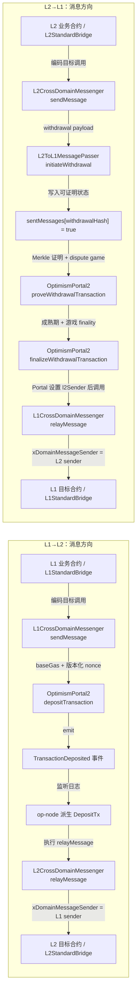
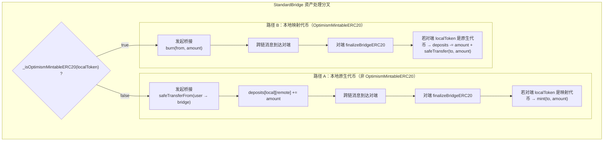
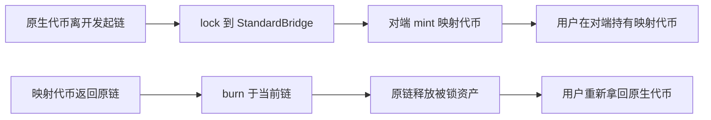
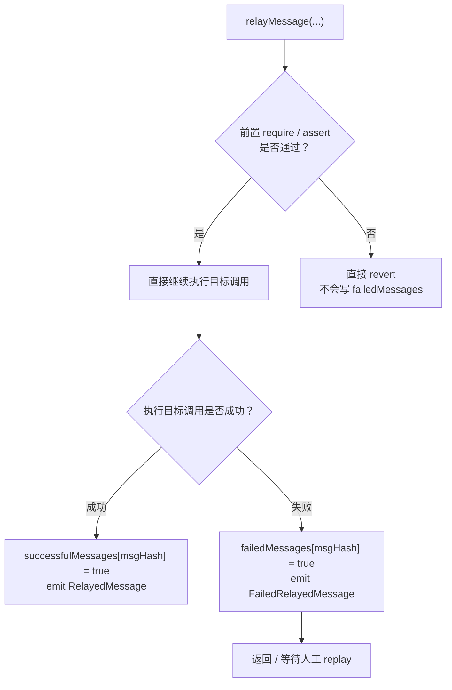
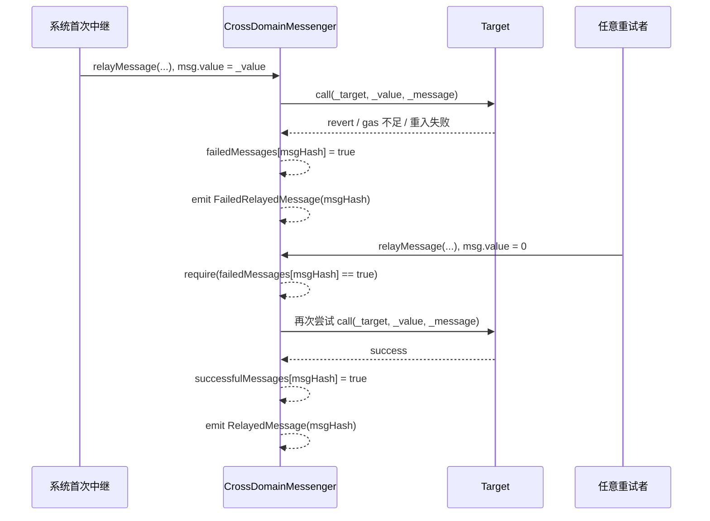
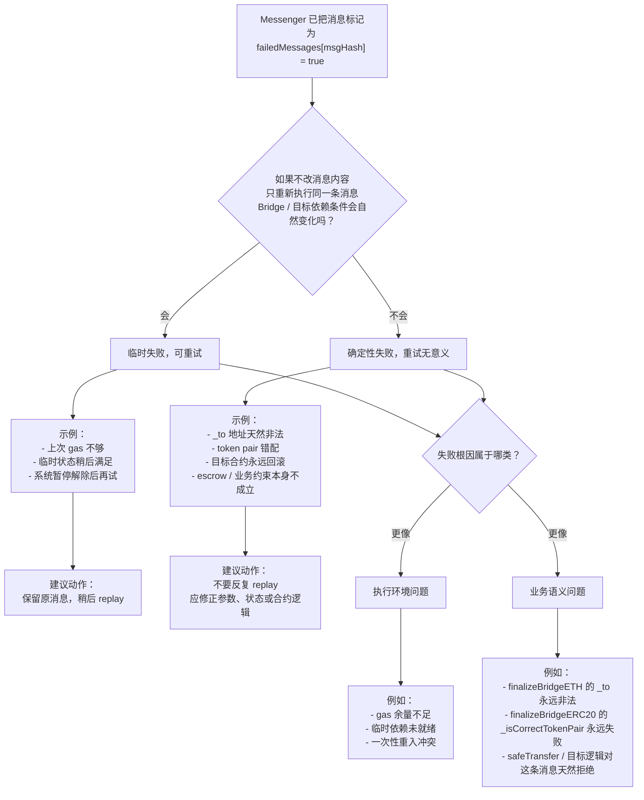

# OP Stack 跨链桥三层架构设计解析

> L1→L2：`StandardBridge → CrossDomainMessenger → OptimismPortal2`
>
> L2→L1：`StandardBridge → CrossDomainMessenger → L2ToL1MessagePasser → OptimismPortal2`

本文仍然使用“三层架构”来组织内容，但第一层在两个方向上并不完全对称：

- `L1→L2` 的发送原语是 `OptimismPortal2.depositTransaction()`
- `L2→L1` 的发送原语是 `L2ToL1MessagePasser.initiateWithdrawal()`，而 `OptimismPortal2` 负责 L1 侧的证明与最终确认

## 阅读导航

- [三层总览](#三层总览)
  - [双向分层图](#双向分层图)
  - [消息方向图](#消息方向图)
  - [资产路径图](#资产路径图)
  - [鉴权边界图](#鉴权边界图)
- [协议栈类比](#协议栈类比)
- [第一层：传输原语层（OptimismPortal2 / L2ToL1MessagePasser）](#第一层传输原语层optimismportal2--l2tol1messagepasser)
  - [L1→L2：存款原语](#l1l2存款原语)
  - [L2→L1：提款证明与最终确认](#l2l1提款证明与最终确认)
  - [ResourceMetering：资源定价机制](#resourcemetering资源定价机制)
  - [第一层安全机制](#第一层安全机制)
- [第二层：消息中继层（CrossDomainMessenger）](#第二层消息中继层crossdomainmessenger)
  - [sendMessage：发送路径](#sendmessage发送路径)
  - [relayMessage：中继路径](#relaymessage中继路径)
  - [L1/L2 Messenger 差异](#l1l2-messenger-差异)
  - [第二层安全机制](#第二层安全机制)
- [失败与重试机制](#失败与重试机制)
  - [失败分类](#失败分类)
  - [可重试失败](#可重试失败)
  - [不可重试失败](#不可重试失败)
  - [Replay 机制](#replay-机制)
  - [实务判断要点](#实务判断要点)
  - [Bridge / 目标层失败语义](#bridge--目标层失败语义)
    - [Bridge / 目标层失败判别图](#bridge--目标层失败判别图)
- [第三层：资产桥接层（StandardBridge）](#第三层资产桥接层standardbridge)
  - [资产路径分叉](#资产路径分叉)
  - [发起桥接路径](#发起桥接路径)
  - [桥接确认路径](#桥接确认路径)
  - [L1/L2 Bridge 差异](#l1l2-bridge-差异)
  - [第三层安全机制](#第三层安全机制)
- [端到端调用链](#端到端调用链)
  - [L1→L2 存款路径](#l1l2-存款路径)
  - [L2→L1 提款路径](#l2l1-提款路径)
- [三层安全机制对照](#三层安全机制对照)
- [关键事件对照](#关键事件对照)
- [常见误区速查](#常见误区速查)
- [设计原理与分层动机](#设计原理与分层动机)
  - [单一职责与独立演进](#单一职责与独立演进)
  - [复用性：Messenger 是通用消息通道](#复用性messenger-是通用消息通道)
  - [L1/L2 对称性：模板方法模式](#l1l2-对称性模板方法模式)
  - [安全隔离与审计边界](#安全隔离与审计边界)
  - [可绕过性：不同用户选择不同抽象层级](#可绕过性不同用户选择不同抽象层级)
- [继承与职责关系](#继承与职责关系)
- [关键源码索引](#关键源码索引)

---

## 三层总览

OP Stack 的跨链桥采用三层分离架构，每层有明确的单一职责；但最底层在两个方向上使用了不同的传输原语：

```text
┌───────────────────────────────────────────────────────────┐
│  第三层  StandardBridge                                    │
│  职责：资产逻辑（代币识别、lock/release、burn/mint、记账）     │
│  关注：ERC20 / ETH 处理、OptimismMintableERC20 检测         │
├───────────────────────────────────────────────────────────┤
│  第二层  CrossDomainMessenger                              │
│  职责：消息可靠性（编码、nonce、重放保护、失败重试、来源验证）  │
│  关注：消息完整性、Gas 安全余量、重入防护                     │
├───────────────────────────────────────────────────────────┤
│  第一层  OptimismPortal / L2ToL1MessagePasser              │
│  职责：L1↔L2 传输原语（deposit 事件、提款证明、争议游戏验证）  │
│  关注：ResourceMetering、地址别名、Merkle 证明、挑战期        │
└───────────────────────────────────────────────────────────┘
```

**核心设计原则：每层以稳定接口解耦。上层尽量不感知下层细节，但三层之间并非“完全无关”，而是通过少量明确接口协作。**

### 双向分层图

```mermaid
flowchart TB
    subgraph A["L1→L2：存款 / 消息发送"]
        A0["用户 / 应用"]
        A1["第三层：StandardBridge / 业务合约<br/>bridge* / sendMessage"]
        A2["第二层：L1CrossDomainMessenger<br/>sendMessage → _sendMessage"]
        A3["第一层：OptimismPortal2<br/>depositTransaction"]
        A4["派生层：op-node / execution engine<br/>监听 TransactionDeposited 并执行 DepositTx"]
        A5["L2CrossDomainMessenger<br/>relayMessage"]
        A6["L2StandardBridge / L2 目标合约<br/>finalize* / 目标调用"]

        A0 --> A1 --> A2 --> A3 --> A4 --> A5 --> A6
    end

    subgraph B["L2→L1：提款 / 消息发送"]
        B0["用户 / 应用"]
        B1["第三层：StandardBridge / 业务合约<br/>bridge* / sendMessage"]
        B2["第二层：L2CrossDomainMessenger<br/>sendMessage → _sendMessage"]
        B3["第一层：L2ToL1MessagePasser<br/>initiateWithdrawal<br/>sentMessages[withdrawalHash] = true"]
        B4["L1 证明阶段：OptimismPortal2<br/>proveWithdrawalTransaction"]
        B5["等待阶段<br/>PROOF_MATURITY_DELAY_SECONDS<br/>+ dispute game finality"]
        B6["L1 最终确认：OptimismPortal2<br/>finalizeWithdrawalTransaction"]
        B7["L1CrossDomainMessenger<br/>relayMessage"]
        B8["L1StandardBridge / L1 目标合约<br/>finalize* / 目标调用"]

        B0 --> B1 --> B2 --> B3 --> B4 --> B5 --> B6 --> B7 --> B8
    end
```



这张图强调两个关键点：

- 发送侧的上两层是对称的：都是 `StandardBridge / 业务合约 → CrossDomainMessenger`
- 第一层是**按方向分裂**的：`L1→L2` 走 `OptimismPortal2.depositTransaction()`，`L2→L1` 先走 `L2ToL1MessagePasser.initiateWithdrawal()`，再在 L1 侧进入 `OptimismPortal2.prove/finalize`

### 消息方向图



这张图只关心“消息怎么走”，不关心资产是什么：

- `L1→L2` 的关键载体是 `TransactionDeposited` 事件，消息靠 op-node 派生为 L2 的 deposit 交易
- `L2→L1` 的关键载体是 `sentMessages[withdrawalHash]` 这条状态，消息靠 Merkle 证明和 dispute game 验证进入 L1 执行
- `relayMessage()` 是两侧真正把“跨链消息”转换为“本地调用”的枢纽

### 资产路径图



如果换成“资产守恒”的视角，可以把它理解成一对对称动作：



这张图只关心“资产怎么守恒”，不关心消息怎么传：

- `lock/release` 对应的是**原生资产**在其原链上的托管与释放
- `burn/mint` 对应的是**映射资产**在非原生链上的销毁与铸造
- `StandardBridge` 通过 `_isOptimismMintableERC20()` 决定当前这一步该走哪条资产路径

### 鉴权边界图

```mermaid
flowchart TB
    subgraph P1["L1→L2：谁有权调用 L2StandardBridge.finalize* ?"]
        P1A["L1StandardBridge<br/>发起跨链消息"]
        P1B["L1CrossDomainMessenger<br/>sendMessage"]
        P1C["OptimismPortal2<br/>depositTransaction"]
        P1D["L2CrossDomainMessenger.relayMessage"]
        P1E["_isOtherMessenger()<br/>undoL1ToL2Alias(msg.sender)<br/>== otherMessenger"]
        P1F["relayMessage 内部<br/>xDomainMsgSender = _sender<br/>= L1StandardBridge"]
        P1G["L2StandardBridge.finalize*"]
        P1H["onlyOtherBridge<br/>1. msg.sender == messenger<br/>2. messenger.xDomainMessageSender() == otherBridge"]

        P1A --> P1B --> P1C --> P1D --> P1E --> P1F --> P1G --> P1H
    end

    subgraph P2["L2→L1：谁有权调用 L1StandardBridge.finalize* ?"]
        P2A["L2StandardBridge<br/>发起跨链消息"]
        P2B["L2CrossDomainMessenger<br/>sendMessage"]
        P2C["L2ToL1MessagePasser<br/>initiateWithdrawal"]
        P2D["OptimismPortal2<br/>finalizeWithdrawalTransaction"]
        P2E["Portal 在执行前设置<br/>l2Sender = _tx.sender<br/>= L2CrossDomainMessenger"]
        P2F["L1CrossDomainMessenger.relayMessage"]
        P2G["_isOtherMessenger()<br/>msg.sender == portal<br/>&& portal.l2Sender() == otherMessenger"]
        P2H["relayMessage 内部<br/>xDomainMsgSender = _sender<br/>= L2StandardBridge"]
        P2I["L1StandardBridge.finalize*"]
        P2J["onlyOtherBridge<br/>1. msg.sender == messenger<br/>2. messenger.xDomainMessageSender() == otherBridge"]

        P2A --> P2B --> P2C --> P2D --> P2E --> P2F --> P2G --> P2H --> P2I --> P2J
    end
```



这张图把 5 个关键校验串成了一条完整的“身份传递链”：

- `_isOtherMessenger()` 负责证明“当前正在执行的 `relayMessage()`，确实来自对端 Messenger”
- `AddressAliasHelper.undoL1ToL2Alias()` 只出现在 `L1→L2` 方向，因为 L2 上看到的 `msg.sender` 是 L1 合约地址的别名
- `portal.l2Sender()` 只出现在 `L2→L1` 方向，因为 L1 上的 `L1CrossDomainMessenger` 需要通过 Portal 读取这笔提款的真实 L2 发送者
- `relayMessage()` 在通过来源校验后，会把真正的业务发送者写入 `xDomainMessageSender`
- `onlyOtherBridge` 不是直接相信 `msg.sender`，而是要求：
  - 外层调用者必须是本链 Messenger
  - Messenger 记录的 `xDomainMessageSender()` 必须等于对端 Bridge

可以把这套链路理解成两级鉴权：

1. `Messenger` 先证明“消息来自对端 Messenger”
2. `Bridge` 再证明“对端 Messenger 代表的真实业务发送者，确实是对端 Bridge”

---

## 协议栈类比

这三层架构与网络协议栈的分层思想完全一致：

```text
StandardBridge                         ≈ HTTP  （应用层：定义“资产桥接语义”）
CrossDomainMessenger                   ≈ TCP   （传输层：可靠消息、nonce、重试、来源验证）
OptimismPortal2 / L2ToL1MessagePasser  ≈ IP    （底层传输原语：按方向分别承担发包/证明）
```

每层对上层提供抽象服务，对下层隐藏实现细节。

---

## 第一层：传输原语层（OptimismPortal2 / L2ToL1MessagePasser）

严格来说，这一层在两个方向上并不完全对称：

- `L1→L2` 的发送原语是 `OptimismPortal2.depositTransaction()`
- `L2→L1` 的发送原语是 `L2ToL1MessagePasser.initiateWithdrawal()`，而 `OptimismPortal2` 负责 L1 侧的 `prove/finalize`

因此，本节虽然以 `OptimismPortal2` 为标题，但理解时应把它和 `L2ToL1MessagePasser` 视为同一层的两侧实现。

### L1→L2：存款原语

```text
OptimismPortal2.depositTransaction(_to, _value, _gasLimit, _isCreation, _data)
│
├── metered(_gasLimit)               ← ResourceMetering 计费
├── CustomGasToken 检查               ← CGT 模式禁止发送 ETH
├── ETHLockbox 锁定                   ← 若启用 Lockbox，锁定 msg.value
├── 合约创建检查                      ← _isCreation 时 _to 必须为 address(0)
├── Gas 下限检查                      ← _gasLimit >= minimumGasLimit(_data.length)
├── Calldata 大小检查                 ← _data.length <= 120,000 bytes
├── 地址别名                          ← 合约调用者：from += 0x1111...1111
├── 编码 opaqueData                   ← abi.encodePacked(msg.value, _value, _gasLimit, _isCreation, _data)
│
└── emit TransactionDeposited(from, _to, DEPOSIT_VERSION, opaqueData)
    └── op-node 监听 → L2 派生 deposit 交易 → EVM 执行
```

#### 源码位置

`packages/contracts-bedrock/src/L1/OptimismPortal2.sol:depositTransaction`

### L2→L1：提款证明与最终确认

提款是两步流程，中间有挑战期：

```text
步骤 1：proveWithdrawalTransaction
══════════════════════════════════
│
├── _assertNotPaused()                   ← 系统未暂停
├── _isUnsafeTarget 检查                 ← 禁止 Portal/ETHLockbox 作目标
├── 获取 DisputeGame                     ← disputeGameFactory.gameAtIndex(_disputeGameIndex)
├── 游戏有效性检查
│   ├── anchorStateRegistry.isGameProper()    ← 已注册、未黑名单、未退休、且系统未暂停
│   ├── anchorStateRegistry.isGameRespected() ← 创建时属于受尊重的游戏类型
│   └── status() != CHALLENGER_WINS           ← 仅排除已被推翻的 claim，尚不等于“最终有效”
├── 输出根验证                           ← rootClaim == hashOutputRootProof(proof)
├── Merkle 包含证明                      ← 证明 sentMessages[hash]=true 在 L2 状态中
│
├── provenWithdrawals[hash][msg.sender] = { disputeGameProxy, timestamp }
├── proofSubmitters[hash].push(msg.sender)
└── emit WithdrawalProven

         ⏳ 等待 PROOF_MATURITY_DELAY_SECONDS（通常 7 天）

步骤 2：finalizeWithdrawalTransaction
══════════════════════════════════════
│
├── _assertNotPaused()                    ← 系统未暂停
├── l2Sender == DEFAULT_L2_SENDER         ← 重入保护
├── _isUnsafeTarget 检查
├── checkWithdrawal(hash, proofSubmitter)
│   ├── !finalizedWithdrawals[hash]       ← 未重复 finalize
│   ├── provenWithdrawal.timestamp != 0   ← 已证明
│   ├── 成熟期已过                        ← block.timestamp - timestamp > delay
│   └── anchorStateRegistry.isGameClaimValid(game)
│       ├── isGameProper                  ← 未作废
│       ├── isGameRespected               ← 受尊重类型
│       ├── isGameFinalized               ← 已 resolve + 超过 finality delay
│       └── status == DEFENDER_WINS       ← 防御者获胜
│
├── finalizedWithdrawals[hash] = true     ← 标记已完成
├── ethLockbox.unlockETH(_tx.value)       ← 解锁 ETH（若使用 Lockbox）
├── l2Sender = _tx.sender                 ← 设置 L2 发送者
├── SafeCall.callWithMinGas(...)          ← 执行提款调用
├── l2Sender = DEFAULT_L2_SENDER          ← 重置哨兵
└── emit WithdrawalFinalized(hash, success)
```

> 这里有两个不同的等待阶段，容易混淆：
>
> - `prove` 之前，链下需要先等到一个可用于证明的 `dispute game / root claim`
> - `prove` 之后，链上还必须等待 `PROOF_MATURITY_DELAY_SECONDS`
> - `finalize` 时，`AnchorStateRegistry.isGameClaimValid()` 还会额外要求游戏已经 `resolved` 且经过 `disputeGameFinalityDelaySeconds`

#### 多重证明机制

同一笔提款允许多人提交证明（`proofSubmitters` 数组），finalize 时可选择任意有效证明。
这防止了恶意证明者通过提交无效证明来阻塞合法提款。

#### 提款验证源码位置

- `packages/contracts-bedrock/src/L1/OptimismPortal2.sol:proveWithdrawalTransaction`
- `packages/contracts-bedrock/src/L1/OptimismPortal2.sol:finalizeWithdrawalTransaction`
- `packages/contracts-bedrock/src/L1/OptimismPortal2.sol:checkWithdrawal`

### ResourceMetering：资源定价机制

Portal 通过 `metered` 修饰符对 L1→L2 deposit 进行 EIP-1559 风格的 gas 定价，防止 spam：

```text
ResourceParams {
    prevBaseFee    ← 上一区块的 base fee
    prevBoughtGas  ← 当前区块已购买的 gas
    prevBlockNum   ← 上一次更新 base fee 的区块号
}

ResourceConfig {
    maxResourceLimit              ← 每区块最大可购买 deposit gas
    elasticityMultiplier          ← 弹性乘数
    baseFeeMaxChangeDenominator   ← base fee 最大变化分母
    minimumBaseFee / maximumBaseFee ← base fee 上下限
}

metered(_gasLimit) 修饰符流程：
1. 跨块时更新 base fee（类似 EIP-1559 算法）
   targetResourceLimit = maxResourceLimit / elasticityMultiplier
   gasUsedDelta = prevBoughtGas - targetResourceLimit
   newBaseFee = prevBaseFee ± baseFeeDelta（受 min/max 约束）
   空块做指数衰减

2. 购买 gas
   prevBoughtGas += _gasLimit
   若超过 maxResourceLimit → revert OutOfGas

3. 费用计算
   resourceCost = _gasLimit × prevBaseFee
   gasCost = resourceCost / max(block.basefee, 1 gwei)
   通过 gas burn 收取费用
```

#### ResourceMetering 源码位置

`packages/contracts-bedrock/src/L1/ResourceMetering.sol`

### 第一层安全机制

| 机制 | 实现 | 作用 |
| --- | --- | --- |
| 暂停 | `_assertNotPaused()` → `systemConfig.paused()` | 紧急停机 |
| 重入保护 | `l2Sender` 哨兵变量 | 防止 finalize 期间重入 |
| 不安全目标 | `_isUnsafeTarget` 禁止 Portal/ETHLockbox | 防自调用 |
| 成熟期 | `PROOF_MATURITY_DELAY_SECONDS` | 留出挑战时间 |
| 争议游戏验证 | `AnchorStateRegistry.isGameClaimValid()` | 确保 L2 状态有效 |
| 多重证明 | `proofSubmitters[]` | 防单点阻塞 |
| 重放保护 | `finalizedWithdrawals[hash]` | 防重复 finalize |
| ResourceMetering | `metered` 修饰符 | 防 L1→L2 spam |
| 地址别名 | `AddressAliasHelper.applyL1ToL2Alias` | 防 L1/L2 地址冲突 |
| Calldata 限制 | `_data.length <= 120,000` | 防过大交易 |

---

## 第二层：消息中继层（CrossDomainMessenger）

Messenger 提供通用的跨链消息发送和中继能力，是 Bridge 和任何需要跨链通信的合约的基础设施。

### sendMessage：发送路径

```text
CrossDomainMessenger.sendMessage(_target, _message, _minGasLimit)
│
├── 编码消息
│   └── abi.encodeWithSelector(
│         relayMessage.selector,
│         messageNonce(),    ← 版本化 nonce（版本号 + 计数器）
│         msg.sender,        ← 发送者
│         _target,           ← 目标地址
│         msg.value,         ← ETH 值
│         _minGasLimit,      ← 最小 gas
│         _message           ← 消息数据
│       )
│
├── 计算 Gas 安全余量
│   └── baseGas = _minGasLimit
│         + RELAY_CONSTANT_OVERHEAD (200,000)
│         + calldata 相关开销
│         + TX_BASE_GAS (21,000)
│         + RELAY_CALL_OVERHEAD (40,000)
│
├── _sendMessage(otherMessenger, totalGas, msg.value, encodedData)
│   └── 子类实现（见下文 L1/L2 差异）
│
├── emit SentMessage(_target, msg.sender, _message, nonce, _minGasLimit)
├── emit SentMessageExtension1(msg.sender, msg.value)
└── ++msgNonce
```

### relayMessage：中继路径

```text
CrossDomainMessenger.relayMessage(_nonce, _sender, _target, _value, _minGasLimit, _message)
│
├── paused() 检查                        ← L1 检查 SuperchainConfig
├── 版本解码                              ← version < 2
├── v0 兼容性检查                         ← 传统消息哈希未被中继
├── 计算 v1 消息哈希
│   └── hashCrossDomainMessageV1(nonce, sender, target, value, minGasLimit, message)
│
├── 来源验证
│   ├── _isOtherMessenger() → 首次中继    ← assert(msg.value == _value)
│   └── failedMessages[hash] → 重播       ← require(msg.value == 0)
│
├── !successfulMessages[hash]             ← 防重复执行
├── !_isUnsafeTarget(_target)             ← 防自调用
├── hasMinGas(_minGasLimit, ...)          ← 确保足够 gas
│
├── xDomainMsgSender = _sender            ← 设置跨链发送者（供被调合约查询）
├── SafeCall.call(_target, gasleft() - buffer, _value, _message)
├── xDomainMsgSender = DEFAULT_L2_SENDER  ← 重置
│
├── 成功 → successfulMessages[hash] = true + emit RelayedMessage
└── 失败 → failedMessages[hash] = true    + emit FailedRelayedMessage
```

### L1/L2 Messenger 差异

`CrossDomainMessenger` 是 abstract 基类。L1/L2 两侧主要覆写 `_sendMessage`、`_isOtherMessenger`、`_isUnsafeTarget`，其中 L1 侧还额外覆写了 `paused()`：

| 方法 / 行为 | L1CrossDomainMessenger | L2CrossDomainMessenger |
| --- | --- | --- |
| `paused()` | `systemConfig.paused()` | 继承基类，固定 `false` |
| `_sendMessage` | `portal.depositTransaction{value}(...)` | `L2ToL1MessagePasser.initiateWithdrawal{value}(...)` |
| `_isOtherMessenger` | `msg.sender == portal && portal.l2Sender() == otherMessenger` | `undoL1ToL2Alias(msg.sender) == otherMessenger` |
| `_isUnsafeTarget` | 禁止 `this` 和 `portal` | 禁止 `this` 和 `L2ToL1MessagePasser` |

#### L1CrossDomainMessenger._sendMessage

```solidity
function _sendMessage(address _to, uint64 _gasLimit, uint256 _value, bytes memory _data) internal override {
    portal.depositTransaction{ value: _value }({
        _to: _to,
        _value: _value,
        _gasLimit: _gasLimit,
        _isCreation: false,
        _data: _data
    });
}
```

#### L2CrossDomainMessenger._sendMessage

```solidity
function _sendMessage(address _to, uint64 _gasLimit, uint256 _value, bytes memory _data) internal override {
    IL2ToL1MessagePasser(Predeploys.L2_TO_L1_MESSAGE_PASSER).initiateWithdrawal{ value: _value }(
        _to, _gasLimit, _data
    );
}
```

#### L2ToL1MessagePasser.initiateWithdrawal

```text
L2ToL1MessagePasser.initiateWithdrawal(_target, _gasLimit, _data)
│
├── 计算 withdrawal hash
│   └── Hashing.hashWithdrawal(nonce, msg.sender, _target, msg.value, _gasLimit, _data)
│
├── sentMessages[withdrawalHash] = true   ← 记录到状态，后续会被包含进可用于证明的 output-root claim
├── emit MessagePassed(...)
└── ++msgNonce
```

`sentMessages` 的 storage root 被包含在用于证明的 output-root claim 中，用户后续可在 L1 上通过 Merkle proof 证明提款存在。

这里最好区分“事件”和“可证明状态”：

- `MessagePassed` 是链下观察友好的事件
- 真正进入可证明状态的是 `sentMessages[withdrawalHash] = true`
- `OptimismPortal2.proveWithdrawalTransaction()` 证明的是 `sentMessages` 这条状态，而不是 `MessagePassed` 事件本身

#### Messenger 源码位置

- `packages/contracts-bedrock/src/universal/CrossDomainMessenger.sol`
- `packages/contracts-bedrock/src/L1/L1CrossDomainMessenger.sol`
- `packages/contracts-bedrock/src/L2/L2CrossDomainMessenger.sol`
- `packages/contracts-bedrock/src/L2/L2ToL1MessagePasser.sol`

### 第二层安全机制

| 机制 | 实现 | 作用 |
| --- | --- | --- |
| 暂停 | `paused()` | L1 接入 SuperchainConfig，L2 始终 false |
| 重放保护 | `successfulMessages[hash]` | 防重复执行已成功的消息 |
| 失败重试 | `failedMessages[hash]` | 允许手动重播失败消息 |
| 重入保护 | `xDomainMsgSender` 哨兵 | 防中继期间重入 |
| 来源验证 | `_isOtherMessenger()` | 确保消息来自对端 Messenger |
| 不安全目标 | `_isUnsafeTarget()` | 禁止向自身或底层传输合约发消息 |
| Gas 安全余量 | `baseGas()` 计算 | 确保目标调用有足够 gas |
| Gas 检查 | `hasMinGas()` | 中继时验证剩余 gas |
| 消息版本 | `MESSAGE_VERSION = 1` | 向前兼容 v0 传统消息 |

---

## 失败与重试机制

`CrossDomainMessenger` 的失败处理并不是“失败就 revert，然后再发一次”这么简单，而是分成两类：

- 一类失败会被**记录为可重试**，写入 `failedMessages[msgHash] = true`
- 另一类失败会**直接 revert**，不会进入 replay 通道

理解这一点很重要，因为它直接决定了某条跨链消息后续能否被手动重放。

### 失败分类



核心区别在于：

- **前置校验失败**：消息根本没有进入“可重试执行态”，通常直接 revert
- **执行阶段失败**：消息已经通过来源、版本、目标、重放等检查，但目标调用失败，才会进入 `failedMessages`

### 可重试失败

下面这些分支会把消息写入 `failedMessages`，因此后续允许 replay：

```text
relayMessage(...)
│
├── 情况 1：剩余 gas 不足
│   └── !SafeCall.hasMinGas(_minGasLimit, RELAY_RESERVED_GAS + RELAY_GAS_CHECK_BUFFER)
│       → failedMessages[msgHash] = true
│       → emit FailedRelayedMessage
│
├── 情况 2：发生重入
│   └── xDomainMsgSender != DEFAULT_L2_SENDER
│       → failedMessages[msgHash] = true
│       → emit FailedRelayedMessage
│
└── 情况 3：目标调用返回失败
    └── success == false
        → failedMessages[msgHash] = true
        → emit FailedRelayedMessage
```

这三种情况的共同点是：**消息本身是合法的，只是这次执行没能成功完成**。因此协议允许后续手动重试。

#### 典型例子

- 用户提供的 `_minGasLimit` 太小，导致 `relayMessage()` 判断当前上下文不足以安全执行目标调用
- 目标合约临时回滚，例如依赖的外部状态还没准备好
- 消息执行过程中遇到重入保护哨兵，当前这次尝试被标记为失败，后续可在干净环境中重播

### 不可重试失败

下面这些失败一般会直接 revert，不会写入 `failedMessages`，因此**不能依赖 replay 机制恢复**：

| 失败类型 | 触发点 | 是否写 `failedMessages` | 含义 |
| --- | --- | --- | --- |
| Messenger 被暂停 | `require(paused() == false)` | 否 | 系统层硬阻断 |
| 消息版本非法 | `require(version < 2)` | 否 | 消息格式本身无效 |
| v0 旧消息已中继 | `successfulMessages[oldHash]` | 否 | 历史重复消息 |
| 重放时 `msg.value != 0` | replay 分支 `require(msg.value == 0)` | 否 | 重放接口使用错误 |
| 不是失败消息却想 replay | `require(failedMessages[msgHash])` | 否 | 根本没有重试资格 |
| 目标是被禁止系统地址 | `require(_isUnsafeTarget(_target) == false)` | 否 | 安全策略阻断 |
| 消息已经成功执行过 | `require(successfulMessages[msgHash] == false)` | 否 | 成功消息不可重复执行 |

这类失败不是“执行失败”，而是“消息在协议层就不被接受”。因此不会进入可重试集合。

### Replay 机制

当消息第一次执行失败后，后续可以由任意账户再次调用同一个 `relayMessage(...)` 进行重放：



这里有一个很关键的实现细节：

- **首次中继**时，如果消息来自系统路径（`_isOtherMessenger() == true`），要求 `msg.value == _value`
- **重试中继**时，要求 `msg.value == 0`

也就是说，replay 并不是“再带一次 ETH 进来”，而是 Messenger 使用自己已经持有的那笔 `_value` 再尝试执行目标调用。

### 实务判断要点

#### 1. `failedMessages` 不是“失败日志”，而是“可重试资格表”

很多人会误以为“只要失败过，消息就会出现在 `failedMessages` 里”。实际上并不是。只有那些**已经通过协议层校验、但执行层未完成**的消息，才会进入 `failedMessages`。

#### 2. `successfulMessages` 的优先级更高

一旦消息成功执行：

- `successfulMessages[msgHash] = true`
- 后续任何再次调用 `relayMessage(...)` 都会被拒绝

所以 replay 是一次性的补救通道，不是可无限重放的消息总线。

#### 3. “可 replay” 不等于“最终一定能成功”

如果目标合约在任何条件下都会回滚，例如：

- 业务逻辑永久不满足
- 目标地址本身就是错误的
- 目标合约实现已经固定会拒绝该消息

那么 replay 也只会再次失败。协议只是允许重试，并不保证重试一定成功。

#### 4. `L1→L2` 和 `L2→L1` 都共享同一套 Messenger 失败语义

虽然两个方向的底层传输不同：

- `L1→L2`：`OptimismPortal2.depositTransaction()` → deposit tx → `L2CrossDomainMessenger.relayMessage()`
- `L2→L1`：`L2ToL1MessagePasser.initiateWithdrawal()` → `OptimismPortal2.finalizeWithdrawalTransaction()` → `L1CrossDomainMessenger.relayMessage()`

但真正定义“失败是否可重试”的地方，都是两侧共同继承的 `CrossDomainMessenger.relayMessage()`。

#### 5. Gas 估算有一个特殊分支

当 `tx.origin == ESTIMATION_ADDRESS` 时，如果消息失败，Messenger 会主动 revert，而不是静默记录失败后返回。

这不是普通用户路径，而是为了让 `eth_estimateGas` 得到“成功执行该消息真正需要的 gas”。

### Bridge / 目标层失败语义

这里有一个非常重要、但很容易被误解的边界：

- **Messenger 层的“可重试”**，只表示这条消息在协议层被允许再次调用 `relayMessage(...)`
- **它不保证 Bridge / 目标合约层最终一定能成功**

原因很简单：`CrossDomainMessenger` 只能看到“目标调用这次成功了还是失败了”，但它并不知道失败是：

- **暂时性的执行环境问题**，还是
- **Bridge 业务语义上的确定性失败**

因此，Messenger 会把很多目标调用失败统一记成 `failedMessages[msgHash] = true`，给出 replay 机会；但其中一部分在 Bridge 层其实是“无论重试多少次都会失败”的。

#### Bridge / 目标层失败判别图



这张图可以浓缩成一句判断题：

> **重试会不会改变成功条件？**
>
> - 如果会，通常属于“临时失败，可重试”
> - 如果不会，通常属于“确定性失败，重试无意义”

#### 为什么会出现这种情况

`relayMessage()` 最终是用一个低级 `call` 去执行目标：

```text
CrossDomainMessenger.relayMessage(...)
└── SafeCall.call(_target, ..., _message)
    └── 目标合约返回 success / failure
```

对于 Messenger 来说，只要目标返回 `false`，它就只能做统一处理：

- `failedMessages[msgHash] = true`
- `emit FailedRelayedMessage(msgHash)`

但“返回 false”的原因可能完全不同：

| 失败原因 | 对 Messenger 来说 | 对 Bridge / 业务层来说 |
| --- | --- | --- |
| 当次 gas 不够 | 一次失败，可 replay | 常常是暂时性的，补足执行 gas 可能成功 |
| 目标合约临时状态未满足 | 一次失败，可 replay | 有时是暂时性的 |
| `finalizeBridgeETH` 目标地址非法 | 一次失败，可 replay | 业务条件永久错误，重试也不会变 |
| `finalizeBridgeERC20` token pair 错配 | 一次失败，可 replay | 参数永久错误，重试也不会变 |
| `deposits` 不足 / 释放条件不成立 | 一次失败，可 replay | 如果底层记账状态不变，仍会持续失败 |
| 接收方合约逻辑永远回滚 | 一次失败，可 replay | 永久不可成功 |

#### 几类典型的“Messenger 可重试，但 Bridge 层永久不可成功”

##### 1. ETH 提款/存款的接收目标本身就不可能成功

`StandardBridge.finalizeBridgeETH()` 内部有几个硬约束：

- `_to != address(this)`
- `_to != address(messenger)`
- 最终 `SafeCall.call(_to, gasleft(), _amount, hex"")` 必须成功

这意味着下面几种情况即使进入了 `failedMessages`，也基本是永久失败：

- 用户把 ETH 桥到了对侧 `StandardBridge` 自身
- 用户把 ETH 桥到了对侧 `CrossDomainMessenger`
- 用户把 ETH 桥到一个“无论给多少 gas 都会回滚”的合约

这也是 `bridgeETHTo()` / `withdrawTo()` 注释里反复警告“资金可能永久锁定”的原因。Messenger 只知道“这次目标调用失败了”，但 Bridge 层的业务条件根本不允许成功。

##### 2. ERC20 的 token pair 本身就是错的

`finalizeBridgeERC20()` 对映射代币路径会执行：

```text
require(_isCorrectTokenPair(_localToken, _remoteToken))
```

如果跨链消息中携带的 `_localToken / _remoteToken` 组合与 `OptimismMintableERC20.remoteToken()` 不匹配，那么这个错误是**参数层面的确定性错误**：

- 这次 replay 失败
- 下次 replay 还是失败
- 因为消息内容本身不会改变

也就是说，Messenger 层允许 replay，并不等于 replay 能修正已经编码进消息里的错误参数。

##### 3. 原生 ERC20 的 escrow 状态不满足

对于非 `OptimismMintableERC20` 路径，`finalizeBridgeERC20()` 依赖：

- `deposits[_localToken][_remoteToken]` 中有足够余额
- `IERC20(_localToken).safeTransfer(_to, _amount)` 可以成功

如果这里失败，可能有两类情况：

- **暂时性**：例如代币实现临时异常、系统暂停解除后可恢复
- **确定性**：例如 escrow 记账本身就不满足、token 行为与桥不兼容

后一类即使 replay 也没有帮助，因为 Bridge 依赖的状态和代币语义并没有被 replay 改变。

##### 4. 目标合约的业务逻辑永远拒绝这条消息

很多跨链消息的目标不一定是 Bridge，也可能是任意业务合约。

如果目标合约内部有类似这样的硬条件：

- 只接受某个白名单 sender
- 某个 immutable 配置不匹配
- 某个状态机阶段永远过了
- 某个 selector / calldata 永远不合法

那么 Messenger 看到的仍然只是“call 失败，可 replay”；但从业务上讲，这条消息已经永久无解。

#### 如何区分“值得 replay”还是“重试也没用”

一个很实用的判断标准是：

**问自己：如果不改变消息内容，只是重新执行同一条消息，目标合约依赖的条件会不会自然变化？**

如果答案是“会”，那可能值得 replay，例如：

- 上次交易本身 gas 不够
- 某个临时状态稍后会满足
- 系统暂停稍后会解除

如果答案是“不会”，那通常就是 Bridge / 目标层的永久失败，例如：

- `_to` 地址天生非法
- token pair 编码错误
- 目标合约逻辑对这条消息永远拒绝
- 资产路径选择本身就不成立

#### 一句话总结

`failedMessages` 解决的是“**协议允许再试一次**”的问题，解决不了“**这条消息从业务语义上是否本来就不可能成功**”的问题。

Bridge 层和目标合约层决定的是后者。

#### 消息失败与重试：源码位置

- `packages/contracts-bedrock/src/universal/CrossDomainMessenger.sol:relayMessage`
- `packages/contracts-bedrock/src/universal/CrossDomainMessenger.sol:xDomainMessageSender`
- `packages/contracts-bedrock/src/L1/L1CrossDomainMessenger.sol:_isOtherMessenger`
- `packages/contracts-bedrock/src/L2/L2CrossDomainMessenger.sol:_isOtherMessenger`

---

## 第三层：资产桥接层（StandardBridge）

StandardBridge 是面向用户的最高层抽象，处理所有资产相关逻辑。

### 资产路径分叉

StandardBridge 通过 ERC165 接口检测区分两种代币，走不同的处理路径：

```text
_isOptimismMintableERC20(_localToken)
│
├── true → OptimismMintableERC20（映射代币）
│   ├── 发起桥接：burn(_from, _amount)        ← 销毁本链映射代币
│   └── 完成桥接：mint(_to, _amount)           ← 铸造本链映射代币
│
└── false → 原生 ERC20
    ├── 发起桥接：safeTransferFrom → bridge    ← 锁定到桥合约
    │   └── deposits[local][remote] += amount
    └── 完成桥接：safeTransfer → user           ← 从桥合约释放
        └── deposits[local][remote] -= amount
```

#### _isOptimismMintableERC20 检测

```solidity
function _isOptimismMintableERC20(address _token) internal view returns (bool) {
    return
        ERC165Checker.supportsInterface(_token, type(ILegacyMintableERC20).interfaceId) ||
        ERC165Checker.supportsInterface(_token, type(IOptimismMintableERC20).interfaceId);
}
```

#### _isCorrectTokenPair 校验

```solidity
function _isCorrectTokenPair(address _mintableToken, address _otherToken) internal view returns (bool) {
    if (ERC165Checker.supportsInterface(_mintableToken, type(ILegacyMintableERC20).interfaceId)) {
        return _otherToken == ILegacyMintableERC20(_mintableToken).l1Token();
    } else {
        return _otherToken == IOptimismMintableERC20(_mintableToken).remoteToken();
    }
}
```

### 发起桥接路径

#### ETH 桥接路径

```text
bridgeETH(_minGasLimit, _extraData)          ← onlyEOA
bridgeETHTo(_to, _minGasLimit, _extraData)
│
└── _initiateBridgeETH(_from, _to, msg.value, _minGasLimit, _extraData)
    ├── require(msg.value == _amount)
    ├── _emitETHBridgeInitiated(...)
    └── messenger.sendMessage{value: _amount}({
          _target: otherBridge,
          _message: abi.encodeWithSelector(finalizeBridgeETH.selector, ...),
          _minGasLimit
        })
```

#### ERC20 桥接路径

```text
bridgeERC20(_localToken, _remoteToken, _amount, _minGasLimit, _extraData)   ← onlyEOA
bridgeERC20To(_localToken, _remoteToken, _to, _amount, _minGasLimit, _extraData)
│
└── _initiateBridgeERC20(...)
    ├── require(msg.value == 0)                    ← ERC20 桥接禁止附带 ETH
    │
    ├── if _isOptimismMintableERC20(_localToken):
    │   ├── require(_isCorrectTokenPair(...))       ← 校验 token pair
    │   └── IOptimismMintableERC20.burn(_from, _amount)
    │
    ├── else:
    │   ├── IERC20.safeTransferFrom(_from, bridge, _amount)
    │   └── deposits[_localToken][_remoteToken] += _amount
    │
    ├── _emitERC20BridgeInitiated(...)
    └── messenger.sendMessage({
          _target: otherBridge,
          _message: abi.encodeWithSelector(
              finalizeBridgeERC20.selector,
              _remoteToken,    ← 注意顺序反转！对端的 local = 本端的 remote
              _localToken,
              _from, _to, _amount, _extraData
          ),
          _minGasLimit
        })
```

> 关键细节：跨链消息中代币地址顺序被**反转**，因为消息在对端执行时，对端的 `_localToken` 就是本端的 `_remoteToken`。

### 桥接确认路径

```text
finalizeBridgeERC20(_localToken, _remoteToken, _from, _to, _amount, _extraData)
│                                                        ↑ onlyOtherBridge
├── require(!paused())
│
├── if _isOptimismMintableERC20(_localToken):
│   ├── require(_isCorrectTokenPair(...))
│   └── IOptimismMintableERC20.mint(_to, _amount)        ← 铸造映射代币
│
├── else:
│   ├── deposits[_localToken][_remoteToken] -= _amount
│   └── IERC20.safeTransfer(_to, _amount)                ← 释放原生代币
│
└── _emitERC20BridgeFinalized(...)
```

### L1/L2 Bridge 差异

| 维度 | L1StandardBridge | L2StandardBridge |
| --- | --- | --- |
| 暂停 | `systemConfig.paused()` | 固定返回 `false` |
| 初始化 | `messenger` + `systemConfig` | `messenger` = L2 预部署 |
| `otherBridge` | 指向 L2StandardBridge | 指向 L1StandardBridge |
| 遗留接口 | `depositETH` / `depositERC20` | `withdraw` / `withdrawTo` |
| 遗留事件 | `ETHDepositInitiated` 等 | `WithdrawalInitiated` 等 |
| ETHLockbox | 通过 Portal 间接交互 | 无 |
| 继承 | StandardBridge + ProxyAdminOwnedBase | StandardBridge |

#### Bridge 源码位置

- `packages/contracts-bedrock/src/universal/StandardBridge.sol`
- `packages/contracts-bedrock/src/L1/L1StandardBridge.sol`
- `packages/contracts-bedrock/src/L2/L2StandardBridge.sol`

### 第三层安全机制

| 机制 | 实现 | 作用 |
| --- | --- | --- |
| onlyEOA | `bridgeETH` / `bridgeERC20` | 防止合约钱包意外桥接 |
| onlyOtherBridge | `finalizeBridgeETH` / `finalizeBridgeERC20` | 只有对端桥可确认 |
| 暂停 | `paused()` | 紧急停机 |
| Token pair 校验 | `_isCorrectTokenPair()` | 防止映射代币错配 |
| deposits 记账 | `deposits[local][remote]` | 原生代币的锁定量追踪 |
| msg.value 校验 | ETH: `msg.value == _amount`; ERC20: `msg.value == 0` | 防值不匹配 |

---

## 端到端调用链

### L1→L2 存款路径

以 ERC20 桥接为例：

```text
用户 EOA
└── L1StandardBridge.bridgeERC20(localToken, remoteToken, amount, minGas, data)
    └── StandardBridge._initiateBridgeERC20(...)
        ├── [原生代币] IERC20.safeTransferFrom(user → bridge) + deposits += amount
        ├── [映射代币] IOptimismMintableERC20.burn(user, amount)
        │
        └── L1CrossDomainMessenger.sendMessage{value}(...)    ← 第三层 → 第二层
            ├── 编码 relayMessage(nonce, sender=bridge, target=L2Bridge, ...)
            ├── baseGas = minGas + overhead
            │
            └── L1CrossDomainMessenger._sendMessage(...)       ← 第二层 → 第一层
                └── OptimismPortal2.depositTransaction{value}(...)
                    ├── metered(_gasLimit) — ResourceMetering
                    ├── 地址别名：from = alias(L1CrossDomainMessenger)
                    └── emit TransactionDeposited(from, to, version, opaqueData)

                            ⬇ op-node 监听事件，在 L2 上派生 deposit 交易

L2 执行（deposit 交易，无需签名）
└── L2CrossDomainMessenger.relayMessage(nonce, sender=L1Bridge, target=L2Bridge, ...)
    ├── _isOtherMessenger(): undoAlias(msg.sender) == L1CrossDomainMessenger ✓
    ├── xDomainMsgSender = L1StandardBridge
    │
    └── L2StandardBridge.finalizeBridgeERC20(localToken, remoteToken, from, to, amount, data)
        ├── [映射代币] IOptimismMintableERC20.mint(to, amount)
        └── [原生代币] deposits -= amount + IERC20.safeTransfer(to, amount)
```

### L2→L1 提款路径

```text
用户 EOA
└── L2StandardBridge.bridgeERC20(localToken, remoteToken, amount, minGas, data)
    └── StandardBridge._initiateBridgeERC20(...)
        ├── [映射代币] IOptimismMintableERC20.burn(user, amount)
        ├── [原生代币] IERC20.safeTransferFrom(user → bridge) + deposits += amount
        │
        └── L2CrossDomainMessenger.sendMessage(...)            ← 第三层 → 第二层
            └── L2CrossDomainMessenger._sendMessage(...)        ← 第二层 → 第一层
                └── L2ToL1MessagePasser.initiateWithdrawal(...)
                    ├── sentMessages[withdrawalHash] = true
                    ├── emit MessagePassed(...)
                    └── ++msgNonce

        ⏳ 等待可用于证明的 dispute game / output-root claim 就绪

用户（L1 上操作）
├── 步骤 1：OptimismPortal2.proveWithdrawalTransaction(tx, gameIndex, proof, withdrawalProof)
│   ├── DisputeGame 有效性检查
│   ├── Merkle 证明 sentMessages[hash]=true
│   └── provenWithdrawals[hash][msg.sender] = { game, timestamp }
│
│   ⏳ 等待 PROOF_MATURITY_DELAY_SECONDS
│
└── 步骤 2：OptimismPortal2.finalizeWithdrawalTransaction(tx)
    ├── checkWithdrawal: 已证明 + 成熟期已过 + 游戏有效
    ├── finalizedWithdrawals[hash] = true
    ├── l2Sender = tx.sender
    │
    └── SafeCall.callWithMinGas(L1CrossDomainMessenger, relayMessage calldata)
        └── L1CrossDomainMessenger.relayMessage(...)
            ├── _isOtherMessenger(): msg.sender==portal && portal.l2Sender()==L2Messenger ✓
            ├── xDomainMsgSender = L2StandardBridge
            │
            └── L1StandardBridge.finalizeBridgeERC20(...)
                ├── [原生代币] deposits -= amount + IERC20.safeTransfer(to, amount)
                └── [映射代币] IOptimismMintableERC20.mint(to, amount)
```

---

## 三层安全机制对照

```text
┌──────────────────────┬──────────────────────┬─────────────────────────────────────┐
│   StandardBridge     │ CrossDomainMessenger  │ Portal / MessagePasser             │
│   (资产安全)         │ (消息完整性)          │ (传输安全与可证明性)               │
├──────────────────────┼──────────────────────┼─────────────────────────────────────┤
│ onlyEOA              │ 消息版本检查          │ metered (Portal / L1→L2)           │
│ onlyOtherBridge      │ successfulMessages    │ sentMessages (MessagePasser / L2→L1)│
│ paused()             │ failedMessages        │ 地址别名                           │
│ _isCorrectTokenPair  │ xDomainMsgSender      │ _assertNotPaused                   │
│ deposits 记账        │ _isOtherMessenger     │ l2Sender 重入保护                  │
│ msg.value 校验       │ _isUnsafeTarget       │ _isUnsafeTarget                    │
│                      │ hasMinGas             │ PROOF_MATURITY_DELAY               │
│                      │ baseGas 安全余量      │ isGameClaimValid                   │
│                      │ paused()              │ 多重证明 proofSubmitters           │
│                      │                       │ finalizedWithdrawals               │
└──────────────────────┴──────────────────────┴─────────────────────────────────────┘
```

---

## 关键事件对照

每一层都发出独立的事件，便于不同场景的监听和索引：

| 层 | 事件 | 用途 |
| --- | --- | --- |
| **Portal** | `TransactionDeposited` | op-node 监听，触发 L2 deposit 派生 |
| **Portal** | `WithdrawalProven` | 提款证明提交 |
| **Portal** | `WithdrawalFinalized` | 提款最终确认（含成功/失败标志） |
| **Messenger** | `SentMessage` + `SentMessageExtension1` | 跨链消息发送记录 |
| **Messenger** | `RelayedMessage` | 消息成功中继 |
| **Messenger** | `FailedRelayedMessage` | 消息中继失败（可重试） |
| **Bridge** | `ETHBridgeInitiated` / `ERC20BridgeInitiated` | 桥接发起 |
| **Bridge** | `ETHBridgeFinalized` / `ERC20BridgeFinalized` | 桥接确认 |
| **Bridge (legacy)** | `ETHDepositInitiated` / `ERC20DepositInitiated` 等 | 向后兼容旧版索引器 |
| **L2ToL1MessagePasser** | `MessagePassed` | L2 提款记录事件；真正进入可证明状态的是 `sentMessages` 映射 |

---

## 常见误区速查

这一节不引入新机制，只把前面最容易混淆的点压缩成“误区 vs 正解”。

| 常见误区 | 正解 |
| --- | --- |
| `failedMessages` 记录了所有失败的跨链消息 | 不是。它只记录**允许 replay 的那部分失败**；很多前置校验失败会直接 revert，根本不会进入 `failedMessages` |
| 一条消息进入 `failedMessages` 就说明重试后大概率能成功 | 不是。`failedMessages` 只说明**协议允许再试一次**，不代表 Bridge / 目标合约层的业务条件会自然变好 |
| `proveWithdrawalTransaction()` 成功后，提款就稳了 | 不是。`prove` 只说明提款被证明存在；后面还要等待 `PROOF_MATURITY_DELAY_SECONDS`，并且 `finalize` 时游戏仍需满足 `isGameClaimValid()` |
| `WithdrawalFinalized` 事件意味着目标调用一定成功 | 不一定。`WithdrawalFinalized(withdrawalHash, success)` 里带了 `success` 标志，Portal 会把提款标记为 finalized，但目标调用可能失败 |
| `MessagePassed` 事件本身就是 L2→L1 可证明的依据 | 不是。真正进入可证明状态的是 `L2ToL1MessagePasser.sentMessages[withdrawalHash] = true`；`MessagePassed` 只是便于观察的事件 |
| `OptimismMintableERC20` 会在用户第一次桥接时自动创建 | 不会。它需要先由 `OptimismMintableERC20Factory` 部署好；桥接流程里只会 `mint` / `burn`，不会自动部署映射代币 |
| `OptimismMintableERC20` 天生就是“L2 代币” | 不准确。它本质上是**桥控制的映射代币**，可以表示“远端链资产在本链上的映射”，语义上不是写死为“只属于 L2” |
| `onlyOtherBridge` 只是检查 `msg.sender` 是否等于 Messenger | 不对。它是两段校验：`msg.sender == messenger`，并且 `messenger.xDomainMessageSender() == otherBridge`，真正信任的是对端 Bridge 身份 |
| 地址别名机制在所有跨链调用里都对称出现 | 不是。最典型的是 `L1→L2` 方向的合约调用需要 alias；L2 侧通过 `AddressAliasHelper.undoL1ToL2Alias(msg.sender)` 还原原始 L1 合约地址 |
| Bridge 三层结构在两个方向上完全对称 | 不对。上两层相对对称，但第一层不对称：`L1→L2` 走 `OptimismPortal2.depositTransaction()`，`L2→L1` 先走 `L2ToL1MessagePasser.initiateWithdrawal()`，再在 L1 进入 `OptimismPortal2.prove/finalize` |
| replay 时需要把原来的 ETH 再带一次 | 不需要。系统首次中继要求 `msg.value == _value`，而 replay 分支要求 `msg.value == 0`；Messenger 会用自己已持有的那笔 value 再执行一次 |

如果只记一条经验法则，可以记这个：

> **先分清你看到的是“事件”、还是“状态”；再分清你面对的是“协议层可重试”、还是“业务层可成功”。**

## 设计原理与分层动机

### 单一职责与独立演进

三层在不同时间独立升级过，互不影响：

| 层 | 典型升级案例 | 影响范围 |
| --- | --- | --- |
| Bridge | 添加 `OptimismMintableERC20` 精度支持、Permit2 集成 | Messenger/Portal 不变 |
| Messenger | 从 v0 消息编码迁移到 v1（增加 value 字段） | Bridge/Portal 不变 |
| Portal | 从 `L2OutputOracle` 迁移到 `DisputeGame` 验证 | Bridge/Messenger 不变 |

如果三层耦合在一起，Portal 的争议游戏升级就会波及桥接代币逻辑，风险和审计范围都会剧增。

### 复用性：Messenger 是通用消息通道

```text
                     CrossDomainMessenger
                    ╱         │          ╲
          StandardBridge   合约 A       合约 B
          (资产桥接)     (治理投票)   (预言机同步)
```

`sendMessage()` 是 `external payable` 且无调用者限制——任何合约都可以通过 Messenger 发送跨链消息。
如果把桥接逻辑和消息逻辑合并，其他合约就无法复用跨链通信能力。

### L1/L2 对称性：模板方法模式

`CrossDomainMessenger` 和 `StandardBridge` 都是 `abstract` 基类，L1/L2 子类共享大部分骨架逻辑，只在少数网络相关点上覆写：

```text
StandardBridge (abstract)                CrossDomainMessenger (abstract)
├── L1StandardBridge                     ├── L1CrossDomainMessenger
│   └── paused() → systemConfig          │   ├── _sendMessage → portal.depositTransaction
│                                        │   ├── _isOtherMessenger → portal + l2Sender
└── L2StandardBridge                     │   └── _isUnsafeTarget → this + portal
    └── paused() → false                 │
                                         └── L2CrossDomainMessenger
                                             ├── _sendMessage → MessagePasser.initiateWithdrawal
                                             ├── _isOtherMessenger → undoL1ToL2Alias
                                             └── _isUnsafeTarget → this + MessagePasser
```

L1 和 L2 共享约 95% 的逻辑（消息编码、重放保护、gas 计算、代币处理），但并不只有**传输原语**不同。像 `L1CrossDomainMessenger.paused()`、`L1StandardBridge.paused()` 这类网络侧安全接入点，也是在子类中实现的。

这是**模板方法设计模式**的经典应用——基类定义骨架，子类只覆写网络相关差异点。

### 安全隔离与审计边界

```text
Portal    = 直接涉及资金安全 + 争议游戏   → 最严格审计 + 形式化验证
Messenger = 消息完整性 + 重放保护          → 中等审计
Bridge    = 业务逻辑 + 代币处理            → 常规审计
```

如果发现 Bridge 的 ERC165 检查有 bug，影响范围仅限于桥接代币逻辑，不会波及 Portal 的提款验证。
反之，Portal 的争议游戏升级也不会影响 Bridge 的资产处理。

### 可绕过性：不同用户选择不同抽象层级

```text
高级用户 / 特殊场景：
  `L1→L2` 可直接调用 `Portal.depositTransaction()`，跳过 Messenger 和 Bridge
  `L2→L1` 可直接调用 `L2ToL1MessagePasser.initiateWithdrawal()` 发起底层提款记录
  但仍需在 L1 经过 `OptimismPortal2.prove/finalize` 才能完成提款

中级开发者：
  调用 Messenger.sendMessage()             ← 跳过 Bridge
  自行处理资产逻辑，但享受消息可靠性保障

普通用户 / 前端 SDK：
  调用 Bridge.bridgeERC20()                ← 最高层抽象
  什么都不用管，桥替你处理一切
```

---

## 继承与职责关系

```text
L1StandardBridge
├── StandardBridge (abstract, Initializable)
│   ├── deposits mapping
│   ├── messenger, otherBridge
│   ├── bridgeETH/bridgeERC20/finalize*
│   └── _initiateBridge*/finalizeBridge*
├── ProxyAdminOwnedBase
├── ReinitializableBase
└── ISemver

L2StandardBridge
├── StandardBridge (abstract, Initializable)
└── ISemver

L1CrossDomainMessenger
├── CrossDomainMessenger (abstract)
│   ├── CrossDomainMessengerLegacySpacer0
│   ├── Initializable
│   ├── CrossDomainMessengerLegacySpacer1
│   ├── successfulMessages, failedMessages, xDomainMsgSender
│   ├── sendMessage / relayMessage
│   └── _sendMessage (abstract) / _isOtherMessenger (abstract)
├── ProxyAdminOwnedBase
├── ReinitializableBase
└── ISemver

L2CrossDomainMessenger
├── CrossDomainMessenger (abstract)
└── ISemver

OptimismPortal2
├── Initializable
├── ResourceMetering (abstract)
│   └── ResourceParams { prevBaseFee, prevBoughtGas, prevBlockNum }
├── ReinitializableBase
├── ProxyAdminOwnedBase
└── ISemver

L2ToL1MessagePasser
└── ISemver
```

---

## 关键源码索引

| 合约 | 文件路径 |
| --- | --- |
| StandardBridge | `packages/contracts-bedrock/src/universal/StandardBridge.sol` |
| L1StandardBridge | `packages/contracts-bedrock/src/L1/L1StandardBridge.sol` |
| L2StandardBridge | `packages/contracts-bedrock/src/L2/L2StandardBridge.sol` |
| CrossDomainMessenger | `packages/contracts-bedrock/src/universal/CrossDomainMessenger.sol` |
| L1CrossDomainMessenger | `packages/contracts-bedrock/src/L1/L1CrossDomainMessenger.sol` |
| L2CrossDomainMessenger | `packages/contracts-bedrock/src/L2/L2CrossDomainMessenger.sol` |
| OptimismPortal2 | `packages/contracts-bedrock/src/L1/OptimismPortal2.sol` |
| ResourceMetering | `packages/contracts-bedrock/src/L1/ResourceMetering.sol` |
| L2ToL1MessagePasser | `packages/contracts-bedrock/src/L2/L2ToL1MessagePasser.sol` |
| OptimismMintableERC20 | `packages/contracts-bedrock/src/universal/OptimismMintableERC20.sol` |
| OptimismMintableERC20Factory | `packages/contracts-bedrock/src/universal/OptimismMintableERC20Factory.sol` |
| Hashing | `packages/contracts-bedrock/src/libraries/Hashing.sol` |
| SafeCall | `packages/contracts-bedrock/src/libraries/SafeCall.sol` |
| AddressAliasHelper | `packages/contracts-bedrock/src/vendor/AddressAliasHelper.sol` |
| AnchorStateRegistry | `packages/contracts-bedrock/src/dispute/AnchorStateRegistry.sol` |
