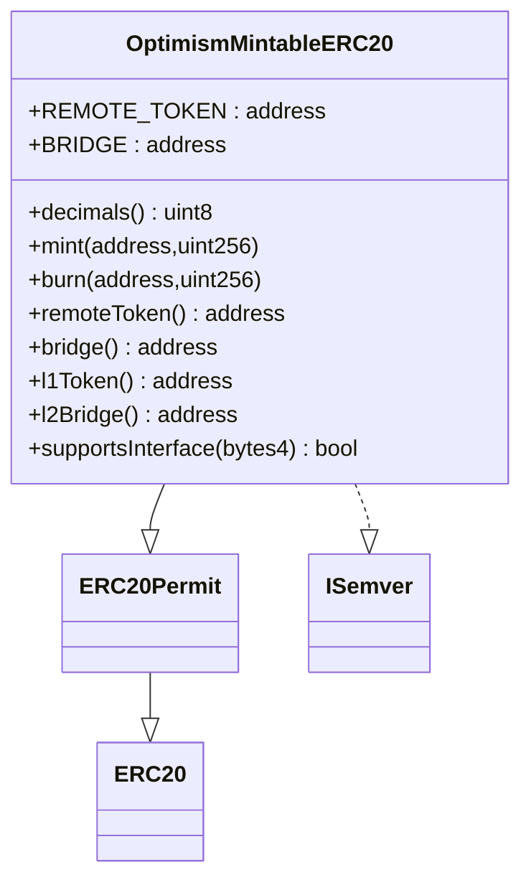

# OptimismMintableERC20 源码与桥接语义分析

`OptimismMintableERC20` 是 OP Stack 标准桥体系里的“桥控制映射 ERC20”。它不是普通的原生 ERC20，也不是用户发起桥接时临时自动创建的代币，而是**预先部署好的映射资产合约**：当远端链某个 ERC20 需要在本链有一个可流通表示时，工厂会先部署一个 `OptimismMintableERC20` 实例；之后桥接过程中只发生 `mint` / `burn`，不会自动部署新代币。

## 阅读导航

- [1. 一句话定义](#1-一句话定义)
- [2. 它到底是什么类型的 ERC20](#2-它到底是什么类型的-erc20)
- [3. 合约结构总览](#3-合约结构总览)
- [4. 部署方式与创建时机](#4-部署方式与创建时机)
- [5. 在 StandardBridge 中如何工作](#5-在-standardbridge-中如何工作)
- [6. 为什么桥能直接 burn / mint](#6-为什么桥能直接-burn--mint)
- [7. 关键安全边界](#7-关键安全边界)
- [8. Permit2 与 allowance 的特殊行为](#8-permit2-与-allowance-的特殊行为)
- [9. 常见误区](#9-常见误区)
- [10. 源码索引](#10-源码索引)

---

## 1. 一句话定义

`OptimismMintableERC20` 是一个由本链 `StandardBridge` 独占 `mint` / `burn` 权限的 ERC20 映射代币，用来表示“远端链资产在本链上的桥接表示”。

---

## 2. 它到底是什么类型的 ERC20

从 Solidity 继承关系看，它首先是一个标准 ERC20：

- 继承 `ERC20`
- 继承 `ERC20Permit`
- 实现 `ISemver`
- 同时兼容 `IOptimismMintableERC20` 和 `ILegacyMintableERC20`

但从协议语义看，它不是“本链原生资产”，而是**桥控制的映射资产**。

可以把桥里的 ERC20 分成两类：

| 类型 | 代表什么 | 跨链发起时 | 对端确认时 |
| --- | --- | --- | --- |
| 本链原生 ERC20 | 资产本体就在当前链 | `safeTransferFrom` 锁到桥里 | 对端 `mint` 映射代币 |
| `OptimismMintableERC20` | 远端链资产在当前链的映射 | `burn` 当前链映射代币 | 对端释放原生资产，或再次 `mint` 另一侧映射 |

因此，`OptimismMintableERC20` 最准确的理解不是“L2 代币”，而是：

> **某条链上，由桥控制发行的、用于表示远端链资产的映射 ERC20。**

这也是为什么源码注释里明确写着它既可以作为 “L1 token 的 L2 表示”，也可以反过来作为 “L2 token 的 L1 表示”。

---

## 3. 合约结构总览

### 3.1 核心状态

合约最重要的三个不可变字段是：

- `REMOTE_TOKEN`：远端链上的配对代币地址
- `BRIDGE`：本链 `StandardBridge` 地址
- `DECIMALS`：本地显示精度，通常要求与远端资产一致

它们都在构造函数里写入，部署后不可更改。

### 3.2 关键接口



### 3.3 向后兼容

它同时暴露两套读接口：

- 新接口：`remoteToken()`、`bridge()`
- 旧接口：`l1Token()`、`l2Bridge()`

这是为了兼容早期 `StandardL2ERC20` / `LegacyMintableERC20` 集成。

---

## 4. 部署方式与创建时机

### 4.1 谁来部署

它通常由 `OptimismMintableERC20Factory` 部署，而不是由用户手工直接部署。

工厂关键逻辑：

- `createOptimismMintableERC20(...)`
- `createOptimismMintableERC20WithDecimals(...)`
- 使用 `CREATE2`
- `salt = keccak256(abi.encode(remoteToken, name, symbol, decimals))`

这意味着同一组参数会得到可预测地址。

### 4.2 什么时候创建

标准流程是：

1. 先部署映射代币
2. 再开始桥接
3. 桥接时对这个已存在的代币做 `mint` / `burn`

也就是说：

- **不是**每次桥接自动创建
- **不是**用户第一次存款时临时部署
- **而是**先有映射合约，再有后续流转

### 4.3 是否是预部署合约

需要区分两件事：

- `OptimismMintableERC20Factory` 在 OP Stack 里通常是系统工厂，L2 上有固定预部署地址口径
- 单个 `OptimismMintableERC20` 实例**不是预部署模板实例**，而是工厂按具体 token 对创建出来的合约

---

## 5. 在 StandardBridge 中如何工作

`StandardBridge` 会先判断本地 token 是否属于 `OptimismMintableERC20` 路径：

```text
_isOptimismMintableERC20(localToken)
├── true  -> burn / mint 路径
└── false -> lock / release 路径
```

### 5.1 发起桥接时

当用户在当前链桥出 `OptimismMintableERC20` 时：

```text
bridgeERC20(...)
└── _initiateBridgeERC20(...)
    ├── _isOptimismMintableERC20(localToken) == true
    ├── require(_isCorrectTokenPair(localToken, remoteToken))
    ├── IOptimismMintableERC20(localToken).burn(from, amount)
    └── messenger.sendMessage(... finalizeBridgeERC20 ...)
```

这里发生的不是 `transferFrom + escrow`，而是**直接销毁当前链映射代币**。

### 5.2 对端确认时

当跨链消息到达目标链后：

```text
finalizeBridgeERC20(...)
├── _isOptimismMintableERC20(localToken) == true
├── require(_isCorrectTokenPair(localToken, remoteToken))
└── IOptimismMintableERC20(localToken).mint(to, amount)
```

这里发生的是**铸造目标链上的映射表示**。

### 5.3 直观生命周期


---

## 6. 为什么桥能直接 burn / mint

这是 `OptimismMintableERC20` 和普通 ERC20 最不一样的地方。

合约通过 `onlyBridge` 修饰符限制：

- `mint()` 只能由 `BRIDGE` 调用
- `burn()` 只能由 `BRIDGE` 调用

这意味着代币供应量不是由 `owner`、`admin` 或用户自己控制，而是严格绑定到桥接消息的执行。

这种设计的好处是：

- 不需要给用户暴露任意铸造权限
- 供应变化只发生在桥接路径里
- 资产守恒更容易推理和审计

需要注意的一点是：在 `OptimismMintableERC20` 路径里，桥发起函数最终烧的是 `_from` 的余额，而不是先把代币转进桥里再烧。这说明它本质上是“桥授权销毁的映射资产”，而不是“先托管到 escrow 再释放”的原生资产路径。

---

## 7. 关键安全边界

### 7.1 `REMOTE_TOKEN` 绑定配对关系

`StandardBridge` 在桥接发起和确认阶段都会做 token pair 校验：

- 老版本代币读 `l1Token()`
- 新版本代币读 `remoteToken()`

如果消息里的 `_remoteToken` 和本地映射代币声明的远端地址不匹配，会直接失败。

### 7.2 `BRIDGE` 绑定唯一铸销权限

只有部署时绑定的 `BRIDGE` 可以改动供应量，避免了：

- 任意账户伪造桥接铸币
- 错桥调用错误 token
- 后续治理随意改铸销控制者

### 7.3 `supportsInterface()` 让桥识别代币类型

`StandardBridge` 不是靠名字判断，而是靠 ERC165：

- `ILegacyMintableERC20`
- `IOptimismMintableERC20`

只要接口匹配，它就会走 `burn/mint` 路径。

---

## 8. Permit2 与 allowance 的特殊行为

这是这个合约里一个容易被忽略、但很实用的设计。

`allowance(owner, spender)` 在 `spender == PERMIT2()` 时直接返回 `uint256.max`。

这不等于“任何人都能随便转走代币”，而是：

- OP Stack 把 `Permit2` 视为固定地址组件
- 该 token 对 `Permit2` 永远表现为“无限 allowance”
- 真正的转账权限仍由 `Permit2` 自己的签名授权机制约束

它的实际效果是：

- 用户通常不需要再专门给 `Permit2` 发一笔 `approve`
- DeFi 集成时可以更顺畅地做 `permit + transferFrom`

---

## 9. 常见误区

| 误区 | 正解 |
| --- | --- |
| `OptimismMintableERC20` 就是 “L2 token” | 不准确。它是“远端资产在本链的桥接映射”，理论上可双向存在 |
| 用户第一次桥接时会自动部署它 | 不会。通常要先由工厂创建实例 |
| 它和普通 ERC20 的区别只是多了 `mint` | 不止。它把供应控制权永久绑定给 `StandardBridge`，并带有远端 token 配对语义 |
| 它的跨链路径和原生 ERC20 一样 | 不一样。它走 `burn/mint`，原生 ERC20 走 `lock/release` |
| `allowance(Permit2)` 返回无限值就不安全 | 不等于放弃权限控制，真正权限仍由 Permit2 的签名授权机制控制 |

---

## 10. 源码索引

### 核心合约

- `packages/contracts-bedrock/src/universal/OptimismMintableERC20.sol`
- `packages/contracts-bedrock/src/universal/OptimismMintableERC20Factory.sol`
- `packages/contracts-bedrock/src/universal/StandardBridge.sol`

### 接口

- `packages/contracts-bedrock/interfaces/universal/IOptimismMintableERC20.sol`
- `packages/contracts-bedrock/interfaces/legacy/ILegacyMintableERC20.sol`

### 可配合阅读

- `docs/ai/optimism/optimism-bridge-layered-architecture.md`
- `docs/ai/optimism-bridge-deposit-withdrawal-analysis.md`
- `docs/ai/optimism-codebase-predeploy-mechanism.md`

---

## 总结

如果只用一句话记住它：

> `OptimismMintableERC20` 不是“普通 ERC20 的桥接版本”，而是**桥本身定义出来的映射资产表示层**。

它的核心不是“代币功能很多”，而是三件事：

- 绑定一个远端配对资产
- 把供应量控制权绑定给本链桥
- 在 `StandardBridge` 中承担 `burn/mint` 路径
