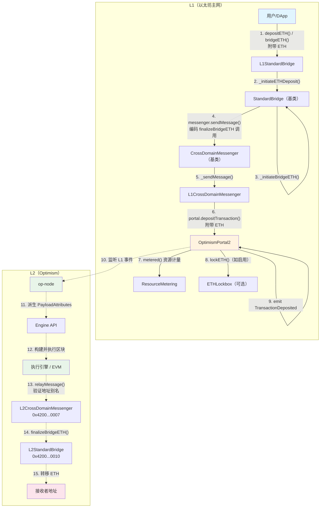
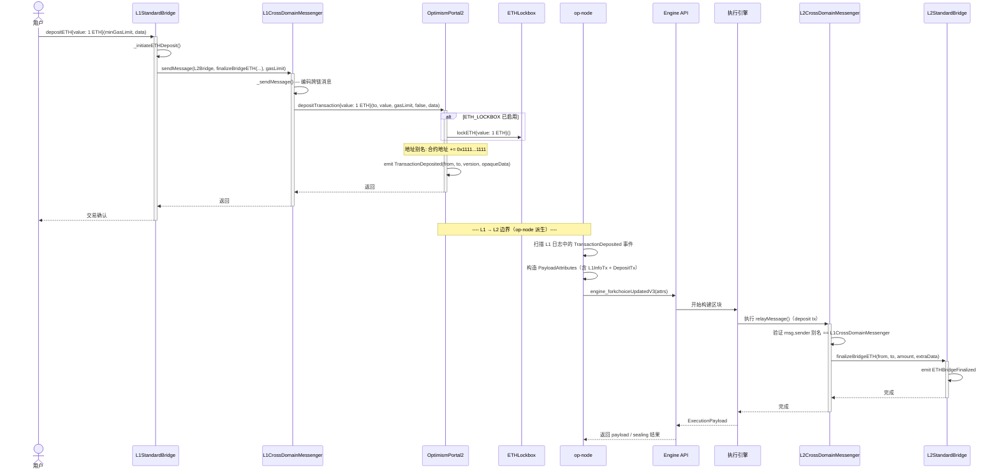
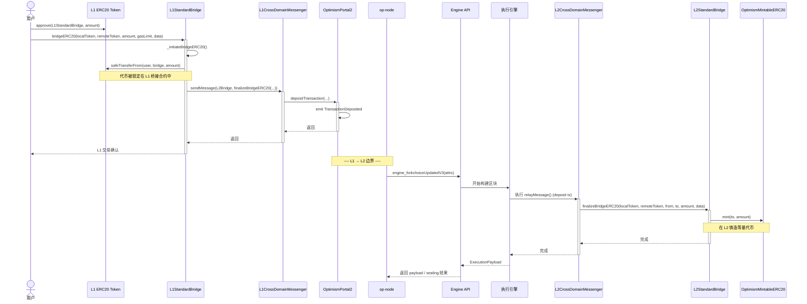
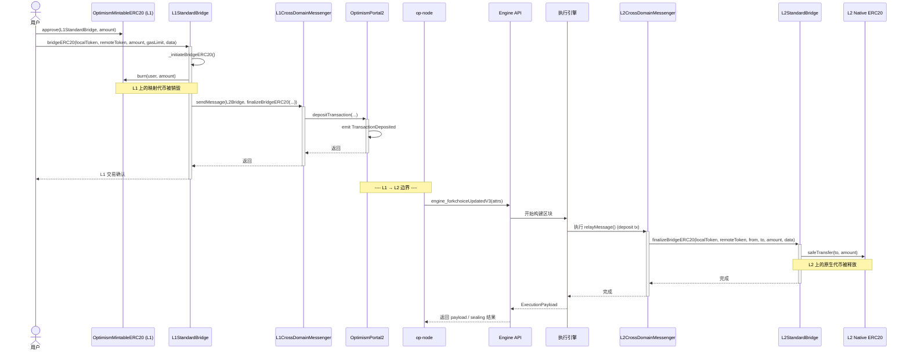
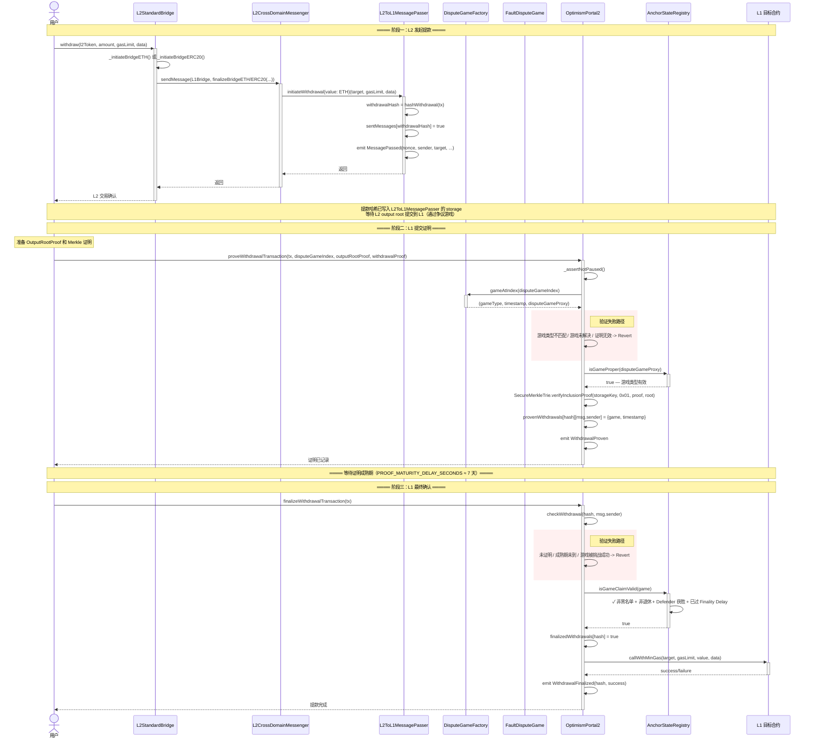
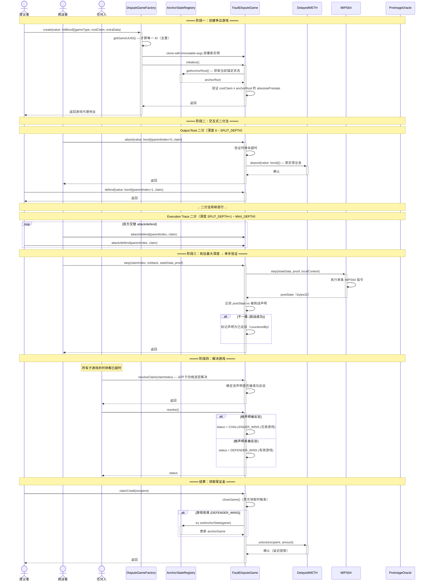
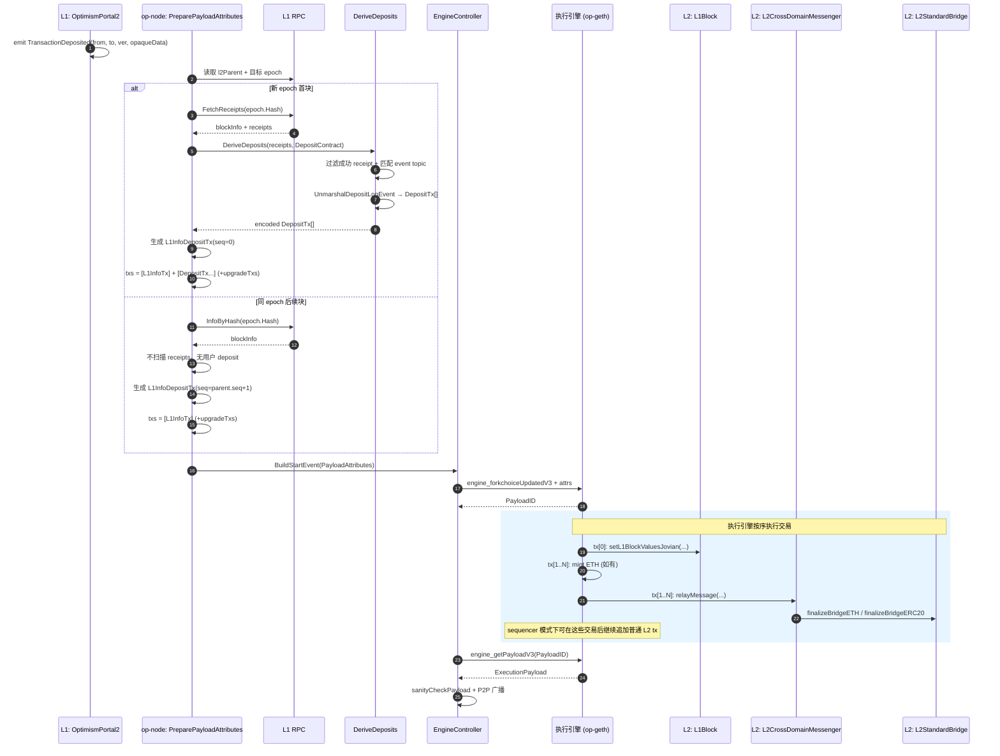

# Optimism Bedrock 合约源码完整分析报告

## 源码引用基线

- 仓库：`ethereum-optimism/optimism`
- 源码地址：[https://github.com/ethereum-optimism/optimism](https://github.com/ethereum-optimism/optimism)
- 基线 Commit：`b053ac1dd6e5e8b3e6d3d941c3300643c9d6d18b`

## 目录导航

- [Optimism Bedrock 合约源码完整分析报告](#optimism-bedrock-合约源码完整分析报告)
  - [源码引用基线](#源码引用基线)
  - [目录导航](#目录导航)
  - [术语表](#术语表)
  - [推荐阅读导引](#推荐阅读导引)
  - [系统定位与整体架构](#系统定位与整体架构)
    - [核心合约类图](#核心合约类图)
  - [代码目录与模块详解](#代码目录与模块详解)
    - [L1 核心合约（src/L1/）](#l1-核心合约srcl1)
    - [L2 核心合约（src/L2/）](#l2-核心合约srcl2)
    - [跨链通用合约（src/universal/）](#跨链通用合约srcuniversal)
    - [故障证明：争议游戏（src/dispute/）](#故障证明争议游戏srcdispute)
    - [故障证明：Cannon 虚拟机（src/cannon/）](#故障证明cannon-虚拟机srccannon)
    - [基础库（src/libraries/）](#基础库srclibraries)
    - [治理合约（src/governance/）](#治理合约srcgovernance)
    - [L1 合约管理与 OPCM](#l1-合约管理与-opcm)
    - [安全多签（src/safe/）](#安全多签srcsafe)
    - [遗留合约（src/legacy/）](#遗留合约srclegacy)
    - [外围工具（src/periphery/）](#外围工具srcperiphery)
    - [第三方依赖（src/vendor/）](#第三方依赖srcvendor)
  - [核心调用链与执行路径](#核心调用链与执行路径)
    - [L1 → L2 ETH 存款路径](#l1--l2-eth-存款路径)
      - [ETH 存款：调用链](#eth-存款调用链)
      - [ETH 存款：时序图](#eth-存款时序图)
    - [L1 → L2 ERC20 存款路径](#l1--l2-erc20-存款路径)
      - [L1 原生代币路径（Lock -\> Mint）](#l1-原生代币路径lock---mint)
      - [L2 原生代币路径（Burn -\> Release）](#l2-原生代币路径burn---release)
    - [L2 → L1 提款路径](#l2--l1-提款路径)
      - [提款路径：调用链](#提款路径调用链)
      - [提款路径：时序图](#提款路径时序图)
    - [争议游戏执行路径](#争议游戏执行路径)
      - [争议游戏：调用链](#争议游戏调用链)
      - [争议游戏：时序图](#争议游戏时序图)
    - [DepositTx 生命周期（L1 事件、op-node 派生与 L2 执行）](#deposittx-生命周期l1-事件op-node-派生与-l2-执行)
    - [流程相关核心合约总览](#流程相关核心合约总览)
  - [推荐学习路径](#推荐学习路径)
    - [第一阶段：理解核心架构（必修）](#第一阶段理解核心架构必修)
    - [第二阶段：跨链消息传递（重要）](#第二阶段跨链消息传递重要)
    - [第三阶段：桥接系统（重要）](#第三阶段桥接系统重要)
    - [第四阶段：故障证明系统（高级 ⭐⭐⭐）](#第四阶段故障证明系统高级-)
    - [第五阶段：L2 运行时（进阶）](#第五阶段l2-运行时进阶)
    - [第六阶段：跨链互操作（前沿）](#第六阶段跨链互操作前沿)
    - [第七阶段：部署与治理（可选）](#第七阶段部署与治理可选)
    - [第八阶段：基础设施（参考）](#第八阶段基础设施参考)
  - [统计信息与复杂度概览](#统计信息与复杂度概览)
    - [核心文件复杂度前 10](#核心文件复杂度前-10)

---

## 术语表

| 术语 | 含义 | 在本文中的典型位置 |
| --- | --- | --- |
| `DepositTx` | OP Stack 中由 L1 日志派生出的特殊 L2 交易类型（`type 0x7E`）。它不依赖普通 ECDSA 验签，`from`、`mint`、`value` 等字段由 L1 事件确定。 | `L1 → L2 ETH 存款路径`、`DepositTx 生命周期（L1 事件、op-node 派生与 L2 执行）` |
| `L1InfoDepositTx` | 每个 L2 区块开头都会插入的一笔系统 deposit 交易，用来把 L1 区块信息和系统配置写入 L2 的 `L1Block` 预部署合约。 | `阶段二：op-node 解析与 DepositTx 构建`、`阶段四：执行引擎内部处理` |
| `TransactionDeposited` | `OptimismPortal2.depositTransaction()` 在 L1 上发出的事件。`op-node` 会扫描该事件并把它解码成用户 `DepositTx`。 | `ETH 存款：参数编码概览`、`阶段一：L1 事件发射` |
| `sourceHash` | 每笔 deposit 的确定性来源标识。用户 deposit 使用 `keccak256(domain=0 \|\| keccak256(l1BlockHash \|\| logIndex))` 计算，保证同一笔 L1 事件在所有节点上得到相同身份。 | `ETH 存款：参数编码概览`、`阶段二：op-node 解析与 DepositTx 构建`、`DepositTx 生命周期：设计要点` |
| `epoch` | 一段共享同一个 L1 origin 的 L2 区块区间。新 epoch 的首块会扫描对应 L1 origin 区块 receipts 来派生用户 deposits；同 epoch 后续块通常不会重复扫描。 | `阶段二：op-node 解析与 DepositTx 构建`、`DepositTx 生命周期：时序图` |
| `L1 origin` | 某个 L2 区块引用的 L1 区块。它决定该 L2 区块派生时所使用的 L1 上下文，也是区分 epoch 的核心依据。 | `阶段二：op-node 解析与 DepositTx 构建`、`DepositTx 生命周期：时序图` |
| `PayloadAttributes` | `op-node` 发送给执行引擎的构块输入模板，包含时间戳、`Transactions`、gas limit 等字段。它先决定“哪些系统 / deposit 交易必须进块”，再由执行引擎据此构造 payload。 | `阶段二：op-node 解析与 DepositTx 构建`、`阶段三：Engine API 交互` |
| `ExecutionPayload` | 执行引擎根据 `PayloadAttributes` 构建并返回的最终区块执行结果，包含最终交易列表、状态根、区块哈希等。 | `阶段三：Engine API 交互`、`DepositTx 生命周期：时序图` |
| `NoTxPool` | `PayloadAttributes` 中的一个开关。为 `true` 时，执行引擎不会从本地 tx pool 再附加普通用户交易，常用于验证者的确定性派生路径。 | `DepositTx 生命周期：设计要点` |
| `地址别名` / `Address Aliasing` | 当 L1 合约通过 Portal 发起存款时，`from` 会加上固定偏移量 `0x1111...1111` 映射到 L2，防止 L1 合约地址在 L2 冒充同地址账户。L2 messenger 再通过 `undoL1ToL2Alias` 还原来源。 | `ETH 存款：时序图`、`ETH 存款：特殊流程`、`阶段四：执行引擎内部处理` |
| `Output Root` | L2 状态对 L1 的压缩承诺，通常由状态根、`L2ToL1MessagePasser` 存储根等字段组成。L1 上的提款证明就是基于这个承诺验证某条 L2 消息确实存在。 | `L2 → L1 提款路径` |
| `L2ToL1MessagePasser` | L2 上记录提款消息的底层预部署合约。提款哈希写入它的存储后，才可能被后续的 output root 和 L1 证明机制引用。 | `L2 核心合约（src/L2/）`、`L2 → L1 提款路径` |
| `CrossDomainMessenger` | L1/L2 共享的跨域消息基类，负责 `sendMessage()`、`relayMessage()`、消息哈希、重放保护、失败消息重试等机制。`L1CrossDomainMessenger` 和 `L2CrossDomainMessenger` 都继承它。 | `跨链通用合约（src/universal/）`、`L1 → L2 ETH 存款路径`、`L2 → L1 提款路径` |
| `StandardBridge` | L1/L2 共享的桥接基类，负责 ETH / ERC20 的桥接发起与确认。运行时看到的是 `L1StandardBridge` / `L2StandardBridge`，而很多核心 `finalizeBridge*` 逻辑实现位于这个基类中。 | `跨链通用合约（src/universal/）`、`L1 → L2 ETH 存款路径`、`L1 → L2 ERC20 存款路径` |
| `OptimismMintableERC20` | 表示“对侧链原生资产”在当前链上的映射 ERC20。其典型语义是：桥到当前链时 `mint`，从当前链桥回去时 `burn`。 | `跨链通用合约（src/universal/）`、`L1 → L2 ERC20 存款路径` |
| `FaultDisputeGame` | OP Stack 故障证明的核心争议游戏合约。它通过交互式二分法把“某个 output root 是否正确”的争议逐步缩小到可单步验证的粒度。 | `故障证明：争议游戏（src/dispute/）`、`争议游戏执行路径` |
| `AnchorStateRegistry` | 维护锚定状态和“哪些争议游戏仍然有效”的注册表。L1 提款最终确认时，会依赖它判断相关 dispute game 的 claim 是否仍然可信。 | `故障证明：争议游戏（src/dispute/）`、`L2 → L1 提款路径`、`争议游戏执行路径` |
| `MIPS64` / `PreimageOracle` | Cannon 故障证明中的链上虚拟机与其外部数据提供组件。前者负责单步执行验证，后者负责提供执行所需的预映像数据。 | `故障证明：Cannon 虚拟机`、`争议游戏执行路径` |
| `SafeCall.call` | 一个避免复制 returndata 的底层安全调用库函数，常用于 messenger / bridge 的外部调用路径，可降低 gas 风险并防止 returndata bomb 类问题。 | `L1 → L2 ETH 存款路径`、`阶段四：执行引擎内部处理`、`DepositTx 生命周期：设计要点` |
| `ConfigUpdate` | `SystemConfig` 发出的配置变更事件。`op-node` 会据此更新派生所需的系统参数，例如 gas limit、fee scalar、batcher 配置等。 | `L1 核心合约（src/L1/）`、`SystemConfig` 相关说明 |

---

## 推荐阅读导引

如果你是第一次读这份文档，建议按下面的顺序进入：

### 阶段一：建立全局心智模型

- 先读 `术语表`
- 再读 `系统定位与整体架构`
- 然后看 `流程相关核心合约总览`

目标：先弄清楚 L1 / L2 两侧分别有哪些核心角色，以及 `Portal / Messenger / Bridge / Dispute Game` 各自负责什么。

### 阶段二：掌握核心用户路径

- 优先读 `L1 → L2 ETH 存款路径`
- 接着读 `L2 → L1 提款路径`
- 然后读 `DepositTx 生命周期（L1 事件、op-node 派生与 L2 执行）`

目标：先抓住“资金和消息是怎么跨层移动的”，再理解 `op-node` 和执行引擎如何把 L1 事件变成 L2 可执行交易。

### 阶段三：补足 ERC20 与桥接抽象

- 读 `L1 → L2 ERC20 存款路径`
- 对照 `跨链通用合约（src/universal/）`
- 重点回看 `CrossDomainMessenger.sol`、`StandardBridge.sol`、`OptimismMintableERC20.sol`

目标：把 ETH 桥接和 ERC20 桥接放到同一个抽象框架里理解，特别是“当前链原生资产”和“对侧链原生资产映射代币”的区别。

### 阶段四：进入故障证明系统

- 先读 `争议游戏执行路径`
- 再读 `故障证明：争议游戏（src/dispute/）`
- 最后读 `故障证明：Cannon 虚拟机（src/cannon/）`

目标：先理解争议游戏的大流程，再进入 `FaultDisputeGame -> MIPS64 -> PreimageOracle` 的细节，不要一开始就扎进 VM 指令级实现。

### 场景一：源码追踪

- 存款主线：`OptimismPortal2.sol` → `CrossDomainMessenger.sol` → `StandardBridge.sol` → `op-node/rollup/derive/*`
- 提款主线：`L2ToL1MessagePasser.sol` → `OptimismPortal2.sol` → `AnchorStateRegistry.sol`
- 争议游戏主线：`DisputeGameFactory.sol` → `FaultDisputeGame.sol` → `MIPS64.sol`
- 配置同步主线：`SystemConfig.sol` → `L1Block.sol` → `GasPriceOracle.sol`

目标：按“入口 -> 基类 -> 派生/执行 -> 验证”顺序看代码，能显著降低在文件间来回跳转的成本。

### 场景二：快速掌握重点

- 只读 `术语表`
- `系统定位与整体架构`
- `L1 → L2 ETH 存款路径`
- `L2 → L1 提款路径`
- `DepositTx 生命周期（L1 事件、op-node 派生与 L2 执行）`
- `推荐学习路径`

这样可以在最短时间内建立对 Bedrock 合约体系的整体认知。

---

## 系统定位与整体架构

OP Stack 智能合约体系分布在 L1（以太坊主网）和 L2（Optimism 链）两侧，通过跨链消息传递协议连接。整体架构可以用一张图概括：

```text
┌─────────────────────────────────────── L1（以太坊主网）──────────────────────────────────────┐
│                                                                                              │
│  ┌──────────────┐    ┌─────────────────────┐    ┌──────────────────┐    ┌─────────────────┐  │
│  │ SystemConfig │    │  OptimismPortal2    │    │ DisputeGame      │    │ SuperchainConfig│  │
│  │  (配置中心)   │───>│  (存款/提款入口)     │<───│  Factory         │    │  (暂停控制)      │  │
│  └──────────────┘    └─────────────────────┘    │  (争议工厂)       │    └─────────────────┘  │
│         │                    │    ▲              └──────────────────┘              │          │
│         │                    │    │                       │                       │          │
│         ▼                    ▼    │              ┌────────▼────────┐              │          │
│  ┌──────────────┐    ┌───────────────┐          │ FaultDisputeGame│              │          │
│  │ L1Messenger  │    │ L1Standard    │          │ AnchorStateReg  │              │          │
│  │  (消息传递)   │    │   Bridge      │          │  (故障证明)      │              │          │
│  └──────────────┘    │  (资产桥接)    │          └─────────────────┘              │          │
│                      └───────────────┘                   │                       │          │
│                                                  ┌───────▼───────┐               │          │
│                                                  │ MIPS64 / Pre- │               │          │
│                                                  │ imageOracle   │               │          │
│                                                  │ (单步执行验证)  │               │          │
│                                                  └───────────────┘               │          │
└──────────────────────────────────────────────────────────────────────────────────────────────┘
                              ▲  deposit tx / withdrawal proof
                              │
                              ▼
┌──────────────────────────────────────── L2（Optimism）────────────────────────────────────────┐
│                                                                                              │
│  ┌──────────────┐    ┌───────────────┐    ┌───────────────┐    ┌────────────────────┐       │
│  │ L1Block      │    │ L2Messenger   │    │ L2Standard    │    │ GasPriceOracle     │       │
│  │  (L1 状态)    │    │  (消息传递)    │    │   Bridge      │    │  (费用计算)          │       │
│  │ 0x...0015    │    │ 0x...0007     │    │ 0x...0010     │    │ 0x...000F          │       │
│  └──────────────┘    └───────────────┘    └───────────────┘    └────────────────────┘       │
│                                                                                              │
│  ┌──────────────┐    ┌───────────────┐    ┌───────────────┐    ┌────────────────────┐       │
│  │ L2ToL1Msg    │    │ FeeVault(s)   │    │ Governance    │    │ SuperchainERC20    │       │
│  │  Passer      │    │ Base/L1/Seq   │    │   Token       │    │  (跨链代币标准)      │       │
│  │ 0x...0016    │    │ 0x...0019/1A  │    │ 0x...0042     │    │                    │       │
│  └──────────────┘    └───────────────┘    └───────────────┘    └────────────────────┘       │
└──────────────────────────────────────────────────────────────────────────────────────────────┘
```

### 核心合约类图

下图展示了核心合约之间的继承关系（实线箭头 `--|>`）和组合/依赖关系（虚线箭头 `..>`），按 L1、L2、通用基类、争议系统、Cannon 虚拟机五个层级组织。

```mermaid
classDiagram
    direction TB

    %% ═══════════════════ 基类 / 抽象合约 ═══════════════════

    class Initializable {
        <<OpenZeppelin>>
    }
    class OwnableUpgradeable {
        <<OpenZeppelin>>
    }
    class ReinitializableBase {
        <<abstract>>
        +initVersion() uint64
    }
    class ProxyAdminOwnedBase {
        <<abstract>>
    }
    class ResourceMetering {
        <<abstract>>
        +metered(uint64 gasLimit)
        #_resourceConfig() ResourceConfig
    }
    class CrossDomainMessenger {
        <<abstract>>
        +sendMessage(address, bytes, uint32)
        +relayMessage(...)
        #otherMessenger : CrossDomainMessenger
        #msgNonce : uint240
        #successfulMessages : mapping
        #failedMessages : mapping
    }
    class StandardBridge {
        <<abstract>>
        +bridgeETH(uint32, bytes)
        +bridgeERC20(address, address, uint256, uint32, bytes)
        #messenger : ICrossDomainMessenger
        #otherBridge : StandardBridge
        #deposits : mapping
    }
    class Clone {
        <<Solady>>
    }
    class WETH98 {
        +deposit()
        +withdraw(uint256)
    }

    Initializable <|-- ResourceMetering
    Initializable <|-- CrossDomainMessenger
    Initializable <|-- StandardBridge

    %% ═══════════════════ L1 核心合约 ═══════════════════

    class OptimismPortal2 {
        +depositTransaction(address, uint256, uint64, bool, bytes)
        +proveWithdrawalTransaction(...)
        +finalizeWithdrawalTransaction(...)
        -systemConfig : ISystemConfig
        -anchorStateRegistry : IAnchorStateRegistry
        -ethLockbox : IETHLockbox
    }
    class SystemConfig {
        +gasLimit() uint64
        +batcherHash() bytes32
        +feeScalars()
        +paused() bool
        -superchainConfig : ISuperchainConfig
    }
    class SuperchainConfig {
        +pause(address)
        +unpause()
        +paused() bool
        -guardian : address
    }
    class L1CrossDomainMessenger {
        -portal : IOptimismPortal
        -systemConfig : ISystemConfig
    }
    class L1StandardBridge {
        -systemConfig : ISystemConfig
    }
    class ETHLockbox {
        +lockETH()
        +unlockETH(uint256)
        -authorizedPortals : mapping
    }

    ResourceMetering <|-- OptimismPortal2
    ReinitializableBase <|-- OptimismPortal2
    ProxyAdminOwnedBase <|-- OptimismPortal2

    OwnableUpgradeable <|-- SystemConfig
    ReinitializableBase <|-- SystemConfig
    ProxyAdminOwnedBase <|-- SystemConfig

    ReinitializableBase <|-- SuperchainConfig
    ProxyAdminOwnedBase <|-- SuperchainConfig

    CrossDomainMessenger <|-- L1CrossDomainMessenger
    ReinitializableBase <|-- L1CrossDomainMessenger
    ProxyAdminOwnedBase <|-- L1CrossDomainMessenger

    StandardBridge <|-- L1StandardBridge
    ReinitializableBase <|-- L1StandardBridge
    ProxyAdminOwnedBase <|-- L1StandardBridge

    ReinitializableBase <|-- ETHLockbox
    ProxyAdminOwnedBase <|-- ETHLockbox

    OptimismPortal2 ..> SystemConfig : 读取配置
    OptimismPortal2 ..> ETHLockbox : 锁定/解锁 ETH
    L1CrossDomainMessenger ..> OptimismPortal2 : depositTransaction()
    L1CrossDomainMessenger ..> SystemConfig : paused()
    L1StandardBridge ..> L1CrossDomainMessenger : sendMessage()
    SystemConfig ..> SuperchainConfig : 暂停状态

    %% ═══════════════════ L2 核心合约 ═══════════════════

    class L2CrossDomainMessenger {
        +relayMessage(...)
    }
    class L2StandardBridge {
        +withdraw(address, uint256, uint32, bytes)
    }
    class L2ToL1MessagePasser {
        +initiateWithdrawal(address, uint256, bytes)
        +sentMessages : mapping
        +msgNonce : uint240
    }
    class L1Block {
        +number() uint64
        +timestamp() uint64
        +basefee() uint256
        +hash() bytes32
    }
    class GasPriceOracle {
        +getL1Fee(bytes) uint256
        +baseFee() uint256
    }

    CrossDomainMessenger <|-- L2CrossDomainMessenger
    StandardBridge <|-- L2StandardBridge

    L2CrossDomainMessenger ..> L2ToL1MessagePasser : initiateWithdrawal()
    L2StandardBridge ..> L2CrossDomainMessenger : sendMessage()
    GasPriceOracle ..> L1Block : 读取 L1 费用参数

    %% ═══════════════════ 跨链代币 ═══════════════════

    class OptimismMintableERC20 {
        +mint(address, uint256)
        +burn(address, uint256)
        +REMOTE_TOKEN : address
        +BRIDGE : address
    }

    StandardBridge ..> OptimismMintableERC20 : mint / burn

    %% ═══════════════════ 争议系统 ═══════════════════

    class DisputeGameFactory {
        +create(GameType, Claim, bytes) IDisputeGame
        +gameAtIndex(uint256)
        -gameImpls : mapping
        -initBonds : mapping
        -_disputeGameList : GameId[]
    }
    class IDisputeGame {
        <<interface>>
    }
    class FaultDisputeGame {
        +attack(uint256, Claim)
        +defend(uint256, Claim)
        +step(uint256, bool, bytes, bytes)
        +resolve() GameStatus
        +resolveClaim(uint256, uint256)
        +claimCredit(address)
    }
    class AnchorStateRegistry {
        +isGameClaimValid(IDisputeGame) bool
        +setAnchorState(IDisputeGame)
        -disputeGameFactory : IDisputeGameFactory
        -anchorGame : IDisputeGame
        -disputeGameBlacklist : mapping
    }
    class DelayedWETH {
        +unlock(address, uint256)
        +withdraw(address, uint256)
        -systemConfig : ISystemConfig
    }

    OwnableUpgradeable <|-- DisputeGameFactory
    ReinitializableBase <|-- DisputeGameFactory
    ProxyAdminOwnedBase <|-- DisputeGameFactory

    Clone <|-- FaultDisputeGame

    ReinitializableBase <|-- AnchorStateRegistry
    ProxyAdminOwnedBase <|-- AnchorStateRegistry

    WETH98 <|-- DelayedWETH
    ReinitializableBase <|-- DelayedWETH
    ProxyAdminOwnedBase <|-- DelayedWETH

    IDisputeGame <|.. FaultDisputeGame
    DisputeGameFactory ..> IDisputeGame : 按 GameType clone
    FaultDisputeGame ..> AnchorStateRegistry : getAnchorRoot / setAnchorState
    FaultDisputeGame ..> DelayedWETH : deposit / unlock
    class IBigStepper {
        <<interface>>
        +step(bytes, bytes, bytes32) bytes32
    }

    FaultDisputeGame ..> IBigStepper : vm().step()
    OptimismPortal2 ..> AnchorStateRegistry : isGameClaimValid
    OptimismPortal2 ..> DisputeGameFactory : gameAtIndex

    %% ═══════════════════ Cannon 虚拟机 ═══════════════════

    class MIPS64 {
        +step(bytes, bytes, bytes32) bytes32
        +ORACLE : IPreimageOracle
    }
    class PreimageOracle {
        +readPreimage(bytes32, uint256)
        +loadLocalData(...)
        +loadKeccak256PreimagePartAtIndex(...)
    }

    MIPS64 ..> PreimageOracle : 读取外部数据
```



**图例说明**：

- **实线箭头** (`--|>`)：继承关系（`is-a`），如 `L1StandardBridge` 继承自 `StandardBridge`
- **虚线箭头** (`..>`)：组合/依赖关系（`has-a` / `uses`），如 `OptimismPortal2` 依赖 `SystemConfig` 读取配置
- **`<<abstract>>`**：抽象合约，不可直接部署，由子合约继承并实现
- **`<<OpenZeppelin>>`**：来自 OpenZeppelin 的标准基类

---

## 代码目录与模块详解

### L1 核心合约（src/L1/）

这是整个 OP Stack 在以太坊主网上的核心合约集，管理存款、提款、系统配置和安全控制。

| 文件 | 行数 | 用途 |
| --- | --- | --- |
| **OptimismPortal2.sol** | 740 | **核心入口合约**。处理 L1→L2 存款（`depositTransaction`）和 L2→L1 提款的证明+确认（`proveWithdrawalTransaction` / `finalizeWithdrawalTransaction`）。所有 ETH 跨链转移都经过此合约。 |
| **OptimismPortalInterop.sol** | 744 | OptimismPortal2 的跨链互操作扩展版本，增加了 Super Root 证明支持。 |
| **SystemConfig.sol** | 680 | **系统配置中心**。管理所有链上可配置参数（gas limit、fee scalars、batcher 地址、EIP-1559 参数等）。op-node 通过监听 ConfigUpdate 事件获取配置变更。 |
| **SuperchainConfig.sol** | 175 | **全局安全控制**。Guardian 可暂停整个系统的提款操作；支持全局暂停和按链暂停。 |
| **L1CrossDomainMessenger.sol** | 145 | L1 侧的跨链消息高层接口。通过 Portal 发送 L1→L2 消息，验证 L2→L1 消息来源。 |
| **L1StandardBridge.sol** | 401 | L1 侧标准桥接合约。处理 ETH 和 ERC20 的存款发起和提款确认。 |
| **L1ERC721Bridge.sol** | 146 | L1 侧 ERC721（NFT）桥接合约。 |
| **ResourceMetering.sol** | 173 | 类 EIP-1559 的资源计量抽象合约。用于 Portal 存款的费用市场。 |
| **ETHLockbox.sol** | 232 | ETH 锁箱，集中管理 Superchain 中多个 Portal 的 ETH。 |
| **FeesDepositor.sol** | 123 | 从 L1 向 L2 存入费用收入的合约。 |
| **ProtocolVersions.sol** | 104 | 协议版本管理，追踪推荐版本和最低要求版本。 |
| **DataAvailabilityChallenge.sol** | 450 | 数据可用性挑战合约，用于 Alt-DA（替代数据可用性）模式。 |
| **ProxyAdminOwnedBase.sol** | 106 | 代理管理权限基类。 |

### L2 核心合约（src/L2/）

这些合约预部署在 L2 上，地址以 `0x4200000000000000000000000000000000` 开头。

| 文件 | 预部署地址 | 行数 | 用途 |
| --- | --- | --- | --- |
| **L1Block.sol** | 0x...0015 | 218 | 暴露最近的 L1 区块信息（number、timestamp、basefee、hash 等），每个 epoch 由 depositor 账户更新。 |
| **L2ToL1MessagePasser.sol** | 0x...0016 | 151 | L2→L1 提款的底层存储合约。提款哈希写入 `sentMessages`，storage root 包含在 output root 中，支持 L1 上的 Merkle proof 验证。 |
| **L2CrossDomainMessenger.sol** | 0x...0007 | 99 | L2 侧跨链消息高层接口。通过 L2ToL1MessagePasser 发送消息，使用地址别名验证 L1 来源。 |
| **L2StandardBridge.sol** | 0x...0010 | 268 | L2 侧标准桥接合约。处理 ETH/ERC20 的提款发起和存款确认。 |
| **GasPriceOracle.sol** | 0x...000F | 297 | Gas 价格预言机。提供 L1 数据费用计算 API，包含压缩估算的线性回归参数。 |
| **FeeVault.sol** | - | 197 | 费用金库抽象基类，支持向 L1/L2 的 recipient 提取累积费用。 |
| **BaseFeeVault.sol** | 0x...0019 | 18 | 累积 L2 交易 base fee。 |
| **L1FeeVault.sol** | 0x...001A | 18 | 累积 L2 交易的 L1 数据费用部分。 |
| **SequencerFeeVault.sol** | 0x...0011 | 25 | 累积 Sequencer 收取的优先费用。 |
| **OperatorFeeVault.sol** | 0x...001B | 18 | 累积运营者费用。 |
| **CrossL2Inbox.sol** | 0x...0022 | 130 | 跨 L2 消息接收合约，通过 EIP-2930 access list 验证消息有效性。 |
| **L2ToL2CrossDomainMessenger.sol** | 0x...0023 | 302 | L2↔L2 跨链消息传递合约（跨链互操作）。 |
| **OptimismSuperchainERC20.sol** | - | 153 | Superchain 跨链 ERC20 标准实现。 |
| **SuperchainTokenBridge.sol** | 0x...0028 | 98 | Superchain 代币桥接，支持跨 L2 的代币转移。 |
| **SuperchainETHBridge.sol** | - | 80 | Superchain ETH 桥接。 |
| **L2ERC721Bridge.sol** | 0x...0014 | 129 | L2 侧 ERC721 桥接。 |
| **FeeSplitter.sol** | - | 255 | 费用分配合约，按比例分配给不同接收方。 |
| **L1Withdrawer.sol** | - | 117 | L1 提款辅助合约。 |
| **WETH.sol** | 0x...0006 | 32 | L2 上的 WETH 封装。 |

### 跨链通用合约（src/universal/）

L1 和 L2 共享的基类合约。

| 文件 | 行数 | 用途 |
| --- | --- | --- |
| **CrossDomainMessenger.sol** | 531 | **跨链消息传递基类**。提供 `sendMessage()` / `relayMessage()`，实现消息哈希、重放保护、失败消息重试等核心逻辑。L1/L2 Messenger 均继承此合约。 |
| **StandardBridge.sol** | 627 | **标准桥接基类**。处理 ETH/ERC20 的桥接发起与确认，区分“当前链原生资产”（锁定/释放）和“对侧链原生资产的映射代币”（铸造/销毁）。 |
| **OptimismMintableERC20.sol** | 153 | 可铸造/销毁的 ERC20，表示“对侧链原生资产”在当前链上的映射代币。 |
| **OptimismMintableERC20Factory.sol** | 143 | OptimismMintableERC20 的工厂合约。 |
| **ERC721Bridge.sol** | 197 | ERC721 桥接基类。 |
| **Proxy.sol** | 169 | EIP-1967 透明代理实现。 |
| **ProxyAdmin.sol** | 194 | 代理管理合约，支持多种代理类型的升级。 |
| **WETH98.sol** | 152 | WETH9 兼容的 WETH 实现。 |
| **StorageSetter.sol** | 73 | 辅助合约，用于在升级过程中直接设置存储槽。 |
| **ReinitializableBase.sol** | 25 | 可重复初始化的基类。 |

### 故障证明：争议游戏（src/dispute/）

OP Stack 的故障证明核心：通过交互式争议游戏验证 L2 状态根的正确性。

| 文件 | 行数 | 用途 |
| --- | --- | --- |
| **FaultDisputeGame.sol** | 1672 | **故障争议游戏核心实现**（仓库中最复杂的合约之一）。实现交互式二分法（bisection）：先在 output root 层面二分，再在 execution trace 层面二分，最后用 MIPS64 VM 做单步验证。包含时钟机制、保证金激励、声明树等。 |
| **SuperFaultDisputeGame.sol** | 1299 | FaultDisputeGame 的 Super Root 版本，支持多链 interop 场景。 |
| **DisputeGameFactory.sol** | 336 | **争议游戏工厂**。使用 clone-with-immutable-args 模式高效部署游戏实例；维护 UUID 去重；管理游戏类型、实现和保证金。 |
| **AnchorStateRegistry.sol** | 352 | **锚定状态注册表**。存储最新已验证的 L2 状态根（anchor state），新游戏从此状态开始。提供全面的游戏有效性验证（`isGameClaimValid`）。Guardian 可通过黑名单和退休机制作废游戏。 |
| **DelayedWETH.sol** | 130 | 延迟 WETH，为争议游戏的保证金提供延迟提款保护。 |
| **PermissionedDisputeGame.sol** | 99 | 带权限控制的争议游戏，限制谁可以参与。 |
| **SuperPermissionedDisputeGame.sol** | 104 | Super Root 版本的带权限争议游戏。 |
| **lib/Types.sol** | 144 | 争议游戏专用类型定义（GameType、Claim、Position 等）。 |
| **lib/LibPosition.sol** | 204 | 二分树位置库，将深度+索引编码到单个 uint128 中。 |
| **lib/Errors.sol** | 182 | 争议游戏错误定义。 |
| **zk/OptimisticZkGame.sol** | 703 | ZK 争议游戏实现（实验性）。 |

### 故障证明：Cannon 虚拟机（src/cannon/）

链上 MIPS64 虚拟机，用于争议游戏的最终单步验证。

| 文件 | 行数 | 用途 |
| --- | --- | --- |
| **MIPS64.sol** | 1149 | **MIPS64 单步执行器**。给定 pre-state witness + Merkle proof，执行一条 MIPS64 指令，返回 post-state 承诺值。支持多线程调度、LL/SC 原子操作、futex 等 syscall。 |
| **PreimageOracle.sol** | 895 | **预映像预言机**。存储 Cannon 虚拟机需要的外部数据（L1/L2 状态、交易数据等）。支持大预映像提案和挑战。 |
| **PreimageKeyLib.sol** | 59 | 预映像 key 编解码。 |
| **libraries/MIPS64Instructions.sol** | 951 | MIPS64 指令集实现（算术、逻辑、分支、内存访问等）。 |
| **libraries/MIPS64Memory.sol** | 177 | MIPS64 内存访问和 Merkle 证明验证。 |
| **libraries/MIPS64Syscalls.sol** | 455 | MIPS64 系统调用实现（read、write、mmap、clone 等）。 |

### 基础库（src/libraries/）

整个系统使用的通用工具库。

| 文件 | 行数 | 用途 |
| --- | --- | --- |
| **Predeploys.sol** | 206 | L2 预部署合约地址常量定义（0x4200...开头的所有合约地址）。 |
| **Hashing.sol** | 156 | 哈希工具：deposit 交易哈希、跨域消息哈希、output root 哈希等。 |
| **Encoding.sol** | 346 | 编码工具：RLP 编码 deposit 交易、跨域消息编码/解码。 |
| **Types.sol** | 96 | 核心类型定义：OutputRootProof、WithdrawalTransaction 等。 |
| **SafeCall.sol** | 168 | 安全外部调用，不复制 returndata 防止 gas 攻击。 |
| **Constants.sol** | 73 | 全局常量定义。 |
| **Storage.sol** | 88 | 确定性存储槽读写，与 solc 布局解耦。 |
| **Bytes.sol** | 144 | 字节操作工具。 |
| **Arithmetic.sol** | 55 | 安全数学运算。 |
| **Blueprint.sol** | 222 | EIP-5202 Blueprint 合约部署辅助。 |
| **GasPayingToken.sol** | 88 | 自定义 gas 代币支持。 |
| **TransientContext.sol** | 115 | EIP-1153 瞬态存储工具。 |
| **rlp/RLPReader.sol** | 250 | RLP 解码。 |
| **rlp/RLPWriter.sol** | 163 | RLP 编码。 |
| **trie/MerkleTrie.sol** | 221 | Merkle Patricia Trie 验证。 |
| **trie/SecureMerkleTrie.sol** | 50 | Secure Merkle Trie（key 先哈希）。 |

### 治理合约（src/governance/）

| 文件 | 行数 | 用途 |
| --- | --- | --- |
| **GovernanceToken.sol** | 48 | OP 治理代币（0x4200...0042），支持投票委托和 EIP-2612 签名授权。 |
| **MintManager.sol** | 67 | 铸造管理合约，控制通胀规则（每年最多 2%），是 GovernanceToken 的 owner。 |

### L1 合约管理与 OPCM

OP Contracts Manager：管理 OP Stack 合约的部署和升级。

| 文件 | 行数 | 用途 |
| --- | --- | --- |
| **OPContractsManager.sol** | 2203 | **OP 合约管理器主合约**（位于 `src/L1/`，仓库中行数最多的合约）。编排整个 OP Stack 的部署流程。 |
| **OPContractsManagerV2.sol** | 1012 | V2 版本的合约管理器。 |
| **OPContractsManagerMigrator.sol** | 268 | 从旧版本迁移到 OPCM 管理。 |
| **OPContractsManagerUtils.sol** | 424 | OPCM 工具函数。 |
| **OPContractsManagerContainer.sol** | 108 | OPCM 容器合约。 |

### 安全多签（src/safe/）

基于 Gnosis Safe 的安全模块，用于协议治理的多签控制。

| 文件 | 行数 | 用途 |
| --- | --- | --- |
| **DeputyPauseModule.sol** | 205 | 允许指定的 Deputy 在紧急情况下暂停系统。 |
| **LivenessGuard.sol** | 163 | 活跃度守卫，追踪签名者的最后活跃时间。 |
| **LivenessModule.sol** | 267 | 活跃度模块，移除长期不活跃的签名者。 |
| **LivenessModule2.sol** | 426 | 活跃度模块 V2。 |
| **TimelockGuard.sol** | 678 | 时间锁守卫，对 Safe 交易施加延迟。 |

### 遗留合约（src/legacy/）

向后兼容的旧版合约，大部分已弃用。

| 文件 | 用途 |
| --- | --- |
| **AddressManager.sol** | 旧版地址注册表 |
| **L1ChugSplashProxy.sol** | 旧版代理实现 |
| **LegacyMessagePasser.sol** | 旧版消息传递（已由 L2ToL1MessagePasser 替代） |
| **DeployerWhitelist.sol** | 旧版部署白名单（已弃用） |
| **L1BlockNumber.sol** | 旧版 L1 区块号查询（已由 L1Block 替代） |

### 外围工具（src/periphery/）

非核心协议的辅助工具。

| 模块 | 用途 |
| --- | --- |
| **Drippie** | 自动化定时执行工具，支持条件触发的链上操作 |
| **Faucet** | 测试网水龙头 |
| **Monitoring** | 链上监控辅助（DisputeMonitorHelper） |

### 第三方依赖（src/vendor/）

| 文件 | 用途 |
| --- | --- |
| **AddressAliasHelper.sol** | L1→L2 地址别名工具（+0x1111...1111 偏移） |
| **eas/** | Ethereum Attestation Service 集成 |

---

## 核心调用链与执行路径

### L1 → L2 ETH 存款路径

用户从 L1 向 L2 桥接 ETH 的完整调用链和时序。

#### ETH 存款：前置条件

- 用户在 L1 拥有足够的 ETH 支付金额和 Gas 费。

#### ETH 存款：调用链



#### ETH 存款：时序图



#### ETH 存款：参数编码概览

每一层调用中，原始参数如何被**编码包装**，最终形成 `opaqueData` 写入链上事件。

> 交互式可视化版本（本地浏览器打开）：[optimism-bridge-l1-to-l2-encoding-flow.html](./optimism-bridge-l1-to-l2-encoding-flow.html)

#### ETH 存款：参数编码明细

| 层级 | 函数 | 关键编码动作 |
| --- | --- | --- |
| ① | `L1StandardBridge.bridgeETH()` | 用户原始输入：`_minGasLimit`、`_extraData`、`{ value: msg.value }` |
| ② | `StandardBridge._initiateBridgeETH()` | 编码 `_message = abi.encodeWithSelector(finalizeBridgeETH.selector, _from, _to, _amount, _extraData)` |
| ③ | `CrossDomainMessenger.sendMessage()` | 生成版本化 nonce；计算 `gasLimit = baseGas(_message, _minGasLimit)`；编码 `_data = abi.encodeWithSelector(relayMessage.selector, nonce, sender, target, value, minGasLimit, _message)` |
| ④ | `L1CrossDomainMessenger._sendMessage()` | 参数透传，调用 `portal.depositTransaction{ value: _value }(_to, _value, _gasLimit, false, _data)` |
| ⑤ | `OptimismPortal2.depositTransaction()` | 打包 `opaqueData = abi.encodePacked(msg.value, _value, _gasLimit, _isCreation, _data)`；`emit TransactionDeposited(from, to, version, opaqueData)` |

**`opaqueData` 字节布局（`abi.encodePacked` 紧凑打包）**

| 字节范围 | 字段 | 类型 | 说明 |
| --- | --- | --- | --- |
| `[0, 31]` | `msg.value` | `uint256` | L1 锁入 ETH 总量（Mint 金额） |
| `[32, 63]` | `_value` | `uint256` | L2 接收者收到的 ETH |
| `[64, 71]` | `_gasLimit` | `uint64` | L2 交易 gas 上限 |
| `[72]` | `_isCreation` | `bool` | 是否合约创建（`0x00` = false） |
| `[73+]` | `_data` | `bytes` | `relayMessage(...)` ABI 编码（变长） |

**`_data` 内部结构（`relayMessage` v1，selector `0xd764ad0b`）**

| 字段 | 大小 | 内容 |
| --- | --- | --- |
| `selector` | 4 bytes | `0xd764ad0b` |
| `nonce` | 32 bytes | 高 16 位 = `version(1)`，低 240 位 = 递增序号 |
| `sender` | 32 bytes | `L1StandardBridge` 地址 |
| `target` | 32 bytes | `L2StandardBridge` 地址 |
| `value` | 32 bytes | ETH 金额 |
| `minGasLimit` | 32 bytes | 用户指定的 `_minGasLimit` |
| `message` | 变长 | `finalizeBridgeETH(_from, _to, _amount, _extraData)` ABI 编码 |

##### op-node 解析流程

```text
解析 opaqueData：
  msgValue := opaqueData[0:32]    // uint256 → L2 Mint 金额
  value    := opaqueData[32:64]   // uint256 → 发给 to 的 ETH
  gasLimit := opaqueData[64:72]   // uint64  → L2 gas
  isCreate := opaqueData[72]      // bool
  data     := opaqueData[73:]     // bytes   → relayMessage 编码

构造 DepositTx（RLP 类型 0x7E）：
  SourceHash = keccak256(domain=0 || keccak256(L1 区块 hash || logIndex))
  From       = from（事件 indexed 字段，已做地址别名处理）
  To         = L2CrossDomainMessenger
  Mint       = msgValue
  Value      = value
  Gas        = gasLimit
  Data       = data

L2 执行链路：
  （由执行引擎执行 DepositTx）
  L2CrossDomainMessenger.relayMessage(nonce, sender, target, value, minGas, message)
  → L2StandardBridge.finalizeBridgeETH(_from, _to, _amount, _extraData)
```

这里的运行时目标合约是 `L2StandardBridge`，但 `finalizeBridgeETH` 的具体实现位于其共享基类 `StandardBridge` 中。

#### ETH 存款：关键结论

ETH 存款的本质不是 L1 直接把 ETH 推到 L2，而是 L1 先生成一条可验证事件，再由 `op-node + 执行引擎` 在 L2 端确定性重放这次跨域调用。

#### ETH 存款：特殊流程

| 特殊点 | 具体行为 | 代码引用 | 影响/审计关注 |
| --- | --- | --- | --- |
| 存款入口不受 pause 限制 | `depositTransaction` 无 `paused()` gate（与提款不同） | `src/L1/OptimismPortal2.sol` `depositTransaction(...)` | 紧急暂停主要拦截提款证明/最终确认，不拦截新存款进入派生队列 |
| 双 value 语义 | 事件 `opaqueData` 同时编码 `msg.value` 与 `_value` | `src/L1/OptimismPortal2.sol` `abi.encodePacked(msg.value, _value, ...)` | 链下解码时必须区分“L1 锁入 ETH”与“L2 call value” |
| 合约发起地址别名 | 非 EOA 调用时 `from` 使用 `AddressAliasHelper.applyL1ToL2Alias` | `src/L1/OptimismPortal2.sol` + `src/vendor/AddressAliasHelper.sol` | 防止 L1 合约地址在 L2 冒充普通地址身份 |
| 最小 gas 与 calldata 上限 | `_gasLimit >= minimumGasLimit(len)` 且 `_data.length <= 120000` | `src/L1/OptimismPortal2.sol` `minimumGasLimit` / `CalldataTooLarge` 检查 | 防止低成本挤占 L2 资源；防超大交易影响网络传播策略 |
| ETHLockbox 与 CGT 分支 | 启用 `ETH_LOCKBOX` 时锁入 lockbox；启用 `CUSTOM_GAS_TOKEN` 时禁止 `msg.value > 0` | `src/L1/OptimismPortal2.sol` `_isUsingLockbox` / `_isUsingCustomGasToken` 分支 | 同一入口在不同 feature flag 下资金路径不同，运维切换需谨慎 |
| ResourceMetering 计价 | `metered(_gasLimit)` 按 EIP-1559 风格动态调价并 burn L1 gas | `src/L1/ResourceMetering.sol` `_metered(...)` | L1 存款速率治理核心，参数配置（`ResourceConfig`）影响吞吐与成本 |

#### ETH 存款：源码锚点

- `L1StandardBridge.depositETH`: `src/L1/L1StandardBridge.sol @ b053ac1dd6e5e8b3e6d3d941c3300643c9d6d18b`
- `CrossDomainMessenger.sendMessage`: `src/universal/CrossDomainMessenger.sol @ b053ac1dd6e5e8b3e6d3d941c3300643c9d6d18b`
- `OptimismPortal2.depositTransaction`: `src/L1/OptimismPortal2.sol @ b053ac1dd6e5e8b3e6d3d941c3300643c9d6d18b`
- `StandardBridge.finalizeBridgeETH`: `src/universal/StandardBridge.sol @ b053ac1dd6e5e8b3e6d3d941c3300643c9d6d18b`

### L1 → L2 ERC20 存款路径

ERC20 桥接分为两种情况：**L1 原生代币**（锁定在 L1，L2 铸造映射代币）和 **L2 原生代币**（在 L1 销毁映射代币，回到 L2 时释放原生资产）。

#### ERC20 存款：前置条件

- 用户已在 L1 上 `approve` 足够数量的代币给 `L1StandardBridge`。

#### L1 原生代币路径（Lock -> Mint）

适用于 USDT, DAI 等在 L1 发行的代币。



#### L2 原生代币路径（Burn -> Release）

适用于 OP 等在 L2 原生发行，但已桥接到 L1 的代币。



#### ERC20 存款：特殊流程

| 特殊点 | 具体行为 | 代码引用 | 影响/审计关注 |
| --- | --- | --- | --- |
| 实际走 Messenger 消息 | ERC20 存款不是 Portal 直接处理资产，而是 `StandardBridge -> messenger.sendMessage -> 对侧 finalize` | `src/universal/StandardBridge.sol` `_initiateBridgeERC20(...)` | 失败面由消息中继与对侧执行共同决定，不是单链同步转账 |
| 两类代币分流（最关键） | 若 `localToken` 是 `OptimismMintableERC20`，则在当前发起链 `burn`；否则执行 `transferFrom` 并更新 `deposits` 记账 | `src/universal/StandardBridge.sol` `_isOptimismMintableERC20` 分支 | 必须明确 token 归属域，否则会误判资金形态（锁仓 vs 销毁） |
| 代币对校验 | 对 mintable token 强校验 `_isCorrectTokenPair(local, remote)` | `src/universal/StandardBridge.sol` `_isCorrectTokenPair(...)` | 防伪配对 token，避免跨链铸造到错误资产映射 |
| 消息参数中的 token 顺序反转 | 发送到对侧 `finalizeBridgeERC20` 时，`_remoteToken/_localToken` 调换顺序 | `src/universal/StandardBridge.sol` `abi.encodeWithSelector(this.finalizeBridgeERC20.selector, _remoteToken, _localToken, ...)` | 非常容易在二开桥接时写错，导致 finalize 失败或资产锁死 |
| EOA 限制不对称 | `bridgeERC20` 有 `onlyEOA`，但 `bridgeERC20To` 不强制 `onlyEOA` | `src/universal/StandardBridge.sol` | 需结合业务入口自行控制“是否允许合约代调用” |
| 兼容性边界 | 官方不保证 fee-on-transfer/rebasing/blocklist token 正常桥接 | `src/L1/L1StandardBridge.sol` 合约注释 | 集成前需白名单和专项测试，不能按“标准 ERC20 都可桥接”假设上线 |

#### ERC20 存款：源码锚点

- `StandardBridge.bridgeERC20`: `src/universal/StandardBridge.sol @ b053ac1dd6e5e8b3e6d3d941c3300643c9d6d18b`
- `StandardBridge.finalizeBridgeERC20`: `src/universal/StandardBridge.sol @ b053ac1dd6e5e8b3e6d3d941c3300643c9d6d18b`
- `OptimismMintableERC20.mint/burn`: `src/universal/OptimismMintableERC20.sol @ b053ac1dd6e5e8b3e6d3d941c3300643c9d6d18b`

#### ERC20 存款：关键结论

ERC20 存款的核心不是 Portal 保管代币，而是 `StandardBridge` 根据资产归属决定走“锁定/释放”还是“销毁/铸造映射代币”两条路径。

### L2 → L1 提款路径

提款是三阶段流程：① L2 发起 → ② L1 证明 → ③ L1 最终确认。

#### 提款路径：前置条件

- L2 提款交易已成功上链。
- 对应的 L2 Output Root 已由 Proposer 提交到 L1（通常每小时一次）。

#### 提款路径：调用链

```mermaid
graph TD
    subgraph Phase1["阶段一：L2 发起提款"]
        User2["用户（L2）"]
        L2Bridge2["L2StandardBridge"]
        L2Msg2["L2CrossDomainMessenger"]
        MsgPasser["L2ToL1MessagePasser<br/>0x4200...0016"]
    end

    subgraph Phase2["阶段二：L1 证明"]
        User1P["用户/中继者（L1）"]
        PortalP["OptimismPortal2"]
        ASR_P["AnchorStateRegistry"]
        DGF_P["DisputeGameFactory"]
        DG_P["IDisputeGame"]
        Merkle["SecureMerkleTrie"]
    end

    subgraph Phase3["阶段三：L1 最终确认"]
        User1F["用户/中继者（L1）"]
        PortalF["OptimismPortal2"]
        ASR_F["AnchorStateRegistry"]
        Target["L1 目标合约"]
        Lockbox2["ETHLockbox（可选）"]
    end

    User2 -->|"1. withdraw() / bridgeETH()"| L2Bridge2
    L2Bridge2 -->|"2. sendMessage()"| L2Msg2
    L2Msg2 -->|"3. initiateWithdrawal(target, gasLimit, data)"| MsgPasser
    MsgPasser -->|"4. sentMessages[hash] = true<br/>emit MessagePassed"| MsgPasser

    User1P -->|"5. proveWithdrawalTransaction(tx, gameIndex, proof, withdrawalProof)"| PortalP
    PortalP -->|"6. gameAtIndex()"| DGF_P
    DGF_P -->|"返回游戏实例"| DG_P
    PortalP -->|"7. isGameProper() + isGameRespected()"| ASR_P
    PortalP -->|"8. verifyInclusionProof()"| Merkle
    PortalP -->|"9. provenWithdrawals[hash][sender] = ProvenWithdrawal"| PortalP

    User1F -->|"10. finalizeWithdrawalTransaction(tx)<br/>（等待成熟期后）"| PortalF
    PortalF -->|"11. checkWithdrawal() — 验证证明有效性"| PortalF
    PortalF --x|"验证失败 (Revert)"| User1F
    PortalF -->|"12. isGameClaimValid()"| ASR_F
    PortalF -->|"13. unlockETH()（如启用）"| Lockbox2
    PortalF -->|"14. callWithMinGas(target, gasLimit, value, data)"| Target
    Target --x|"执行失败 (Success=False)"| PortalF

    style Phase1 fill:#e8f5e9
    style Phase2 fill:#fff3e0
    style Phase3 fill:#fce4ec
```



#### 提款路径：时序图



#### 提款路径：源码锚点

- `L2ToL1MessagePasser.initiateWithdrawal`: `src/L2/L2ToL1MessagePasser.sol @ b053ac1dd6e5e8b3e6d3d941c3300643c9d6d18b`
- `OptimismPortal2.proveWithdrawalTransaction`: `src/L1/OptimismPortal2.sol @ b053ac1dd6e5e8b3e6d3d941c3300643c9d6d18b`
- `OptimismPortal2.finalizeWithdrawalTransaction`: `src/L1/OptimismPortal2.sol @ b053ac1dd6e5e8b3e6d3d941c3300643c9d6d18b`
- `AnchorStateRegistry.isGameClaimValid`: `src/dispute/AnchorStateRegistry.sol @ b053ac1dd6e5e8b3e6d3d941c3300643c9d6d18b`

#### 提款路径：关键结论

提款不是一次交易完成，而是“L2 记录消息 → L1 证明存在 → L1 在有效争议游戏窗口后执行”的三阶段流程。

### 争议游戏执行路径

争议游戏是 OP Stack 故障证明的核心：通过交互式二分法在 L1 上验证 L2 状态。

#### 争议游戏：前置条件

- 提议者（Proposer）已质押保证金。
- 挑战者（Challenger）已发现无效的 L2 Output Root。

#### 争议游戏：调用链

```mermaid
graph TD
    subgraph Create["阶段一：创建游戏"]
        Proposer["提议者"]
        DGF["DisputeGameFactory"]
        FDG["FaultDisputeGame<br/>（CWIA Clone 实例）"]
        ASR["AnchorStateRegistry"]
    end

    subgraph Bisect["阶段二：交互式二分法"]
        Challenger["挑战者"]
        Defender["防御者"]
        FDG2["FaultDisputeGame"]
        DWETH["DelayedWETH<br/>（保证金管理）"]
    end

    subgraph SingleStep["阶段三：单步验证"]
        Mover["移动方"]
        FDG3["FaultDisputeGame"]
        VM["MIPS64（VM）"]
        Oracle["PreimageOracle"]
    end

    subgraph Resolve["阶段四：解决与结算"]
        Anyone["任何人"]
        FDG4["FaultDisputeGame"]
        ASR2["AnchorStateRegistry"]
        DWETH2["DelayedWETH"]
    end

    Proposer -->|"1. create(gameType, rootClaim, extraData)<br/>附带保证金"| DGF
    DGF -->|"2. clone-with-immutable-args 部署"| FDG
    DGF -->|"3. 调用 initialize()"| FDG
    FDG -->|"4. initialize() 内部读取 anchorRoot<br/>并校验 rootClaim 与绝对预状态"| ASR

    Challenger -->|"5. attack(parentIndex, claim)<br/>附带保证金"| FDG2
    Defender -->|"6. defend(parentIndex, claim)<br/>附带保证金"| FDG2
    FDG2 -->|"保证金锁定"| DWETH

    Mover -->|"7. step(claimIndex, isAttack, stateData, proof)"| FDG3
    FDG3 -->|"8. VM.step(stateData, proof, localContext)"| VM
    VM -->|"9. 读取外部数据"| Oracle
    VM -->|"10. 返回 postState 承诺"| FDG3

    Anyone -->|"11. resolveClaim(claimIndex)"| FDG4
    Anyone -->|"12. resolve() — 确定最终赢家"| FDG4
    FDG4 --x|"挑战成功 (CHALLENGER_WINS)"| Anyone
    Anyone -->|"13. claimCredit(recipient)"| FDG4
    FDG4 -->|"14. closeGame() 中尝试 setAnchorState()（try/catch）"| ASR2
    FDG4 -->|"15. unlock/withdraw + 领取保证金"| DWETH2

    style Create fill:#e1f5fe
    style Bisect fill:#fff3e0
    style SingleStep fill:#fce4ec
    style Resolve fill:#e8f5e9
```



#### 争议游戏：时序图



#### 争议游戏：源码锚点

- `DisputeGameFactory.create`: `src/dispute/DisputeGameFactory.sol @ b053ac1dd6e5e8b3e6d3d941c3300643c9d6d18b`
- `FaultDisputeGame.attack/defend`: `src/dispute/FaultDisputeGame.sol @ b053ac1dd6e5e8b3e6d3d941c3300643c9d6d18b`
- `FaultDisputeGame.step`: `src/dispute/FaultDisputeGame.sol @ b053ac1dd6e5e8b3e6d3d941c3300643c9d6d18b`
- `MIPS64.step`: `src/cannon/MIPS64.sol @ b053ac1dd6e5e8b3e6d3d941c3300643c9d6d18b`
- `FaultDisputeGame.resolve`: `src/dispute/FaultDisputeGame.sol @ b053ac1dd6e5e8b3e6d3d941c3300643c9d6d18b`

#### 争议游戏：关键结论

争议游戏的目标不是在链上重放整条 L2 链，而是通过交互式二分法把争议压缩到单步虚拟机验证，把链上成本控制在可接受范围。

### DepositTx 生命周期（L1 事件、op-node 派生与 L2 执行）

前面的 `L1 → L2 ETH 存款路径` 与 `L1 → L2 ERC20 存款路径` 主要描述了合约层面的调用链，本节补充 **op-node 侧的处理逻辑**，将 Solidity 事件与 Go 代码串联起来，形成端到端的完整视图。

需要特别区分两层概念：

- `PreparePayloadAttributes()` 产出的是 **派生模板**，默认只包含系统交易 / deposit 交易，且 `NoTxPool=true`。
- 对 sequencer 而言，后续构块阶段仍可在合适场景下把交易池中的普通 L2 交易追加进最终区块。

> 交互式可视化版本（本地浏览器打开）：[optimism-bridge-deposit-tx-lifecycle.html](./optimism-bridge-deposit-tx-lifecycle.html)

#### 阶段一：L1 事件发射

`OptimismPortal2.depositTransaction()` 发出 `TransactionDeposited` 事件，事件 ABI：

| Topics | 内容 |
| --- | --- |
| `topics[0]` | `keccak256("TransactionDeposited(address,address,uint256,bytes)")` |
| `topics[1]` | `from`（indexed，合约发起时已做地址别名） |
| `topics[2]` | `to`（indexed） |
| `topics[3]` | `version`（indexed，当前固定为 `0`） |
| `data` | `abi.encode(abi.encodePacked(mint, value, gasLimit, isCreation, data))` |

#### 阶段二：op-node 解析与 DepositTx 构建

#### DepositTx 生命周期：调用链

```text
PreparePayloadAttributes()                          // op-node/rollup/derive/attributes.go
├── 判断：l2Parent.L1Origin.Number != epoch.Number？
│   ├── 是（新 epoch 首块）
│   │   ├── FetchReceipts(epoch.Hash)                // 获取 L1 receipts
│   │   ├── DeriveDeposits(receipts, depositAddr)    // op-node/rollup/derive/deposits.go
│   │   │   └── UserDeposits(receipts, depositAddr)
│   │   │       └── UnmarshalDepositLogEvent(log)    // op-node/rollup/derive/deposit_log.go
│   │   │           ├── 解析 topics → from, to, version
│   │   │           ├── 解析 opaqueData → mint, value, gas, isCreation, data
│   │   │           └── 计算 sourceHash = keccak256(domain=0 || keccak256(l1BlockHash || logIndex))
│   │   └── UpdateSystemConfigWithL1Receipts()
│   └── 否（同 epoch 后续块）
│       └── depositTxs = nil, seqNumber++
├── L1InfoDeposit() → 构建 L1InfoDepositTx          // op-node/rollup/derive/l1_block_info.go
│   ├── From: 0xdeaddeaddeaddeaddeaddeaddeaddeaddead0001
│   ├── To:   0x4200000000000000000000000000000000000015 (L1Block)
│   ├── Data: setL1BlockValues*() calldata
│   └── sourceHash: domain=1
└── 组装模板交易列表
    txs = [L1InfoDepositTx] + [UserDepositTx...] + [UpgradeTx...]
```

#### DepositTx 生命周期：关键差异

| 特性 | 普通 L2 交易 | Deposit 交易 (type `0x7E`) |
| --- | --- | --- |
| 签名验证 | 需要 ECDSA | 无需签名，`from` 由 L1 事件决定 |
| Nonce 检查 | 严格递增 | 跳过 nonce 检查 |
| Gas 付费 | 从发送者余额扣除 | 不扣 L2 gas 费（L1 已通过 `metered` 收费） |
| Mint 语义 | 无 | `mint > 0` 时凭空增加 `from` 余额 |
| 失败行为 | 回滚状态变更 | gas 用完不回滚已 mint 的 ETH |

#### 阶段三：Engine API 交互

```text
Sequencer / Verifier
  └─→ emit BuildStartEvent(attributes)

EngineController.onBuildStart()                     // op-node/rollup/engine/build_start.go
  ├── 构造 ForkchoiceState{head, safe, finalized}
  └─→ startPayload(fc, attributes)
      └─→ engine.ForkchoiceUpdate(fc, attrs)        // Engine API: engine_forkchoiceUpdatedV3
          └── 返回 PayloadID

EngineController.onBuildSeal()                      // op-node/rollup/engine/build_seal.go
  └─→ engine.GetPayload(payloadInfo)                // Engine API: engine_getPayloadV3
      ├── sanityCheckPayload()
      │   ├── txs[0] 必须是 deposit 类型
      │   └── 所有 deposit 必须连续排在前面
      └── 返回 ExecutionPayload
```

#### 阶段四：执行引擎内部处理

执行引擎至少会按 `PayloadAttributes.Transactions` 中已给定的顺序逐笔执行这些系统 / deposit 交易；对 sequencer 而言，最终区块还可能在其后附加普通交易池交易。

**交易 0 — L1InfoDepositTx（每个区块必有）**：

```text
from: 0xdead...0001 → L1Block(0x4200...0015).setL1BlockValuesJovian(...)
  └── 更新 number, timestamp, basefee, hash, batcherHash 等参数
  └── GasPriceOracle 等合约后续读取这些值
```

**交易 1..N — UserDepositTx（仅新 epoch 首块的模板中有）**：

ETH 存款（通过 Bridge）的 L2 合约调用链：

```text
EL 执行 DepositTx (from=L1CDM_alias, to=L2CDM, value=X, mint=X)
│
├── mint X ETH → from 余额增加
│
└─→ L2CrossDomainMessenger.relayMessage(nonce, sender, target, value, minGas, message)
    ├── _isOtherMessenger(): undoL1ToL2Alias(msg.sender) == L1CDM ✓
    ├── xDomainMsgSender = L1StandardBridge
    └─→ SafeCall.call(L2StandardBridge, gas, X, message)
        └─→ finalizeBridgeETH(from, to, X, extraData)
            ├── onlyOtherBridge: messenger.xDomainMsgSender() == L1Bridge ✓
            └─→ SafeCall.call(to, gasleft(), X, hex"")  // ETH 转给最终接收者
```

ERC20 存款的 L2 合约调用链：

```text
EL 执行 DepositTx (from=L1CDM_alias, to=L2CDM, value=0, mint=0)
│
└─→ L2CrossDomainMessenger.relayMessage(...)
    └─→ SafeCall.call(L2StandardBridge, gas, 0, message)
        └─→ finalizeBridgeERC20(localToken, remoteToken, from, to, amount, ...)
            ├── _isOptimismMintableERC20(localToken) == true
            └─→ IOptimismMintableERC20(localToken).mint(to, amount)
```

同样需要区分：运行时接收消息的实例是 `L2StandardBridge`，但 `finalizeBridgeERC20` 的共享实现位于 `StandardBridge` 基类中。

#### DepositTx 生命周期：时序图



#### DepositTx 生命周期：设计要点

| 设计点 | 源码位置 | 说明 |
| --- | --- | --- |
| 确定性 sourceHash | `op-node/rollup/derive/deposit_source.go` | `keccak256(domain \|\| keccak256(l1Hash \|\| logIdx))` 保证每笔 deposit 全局唯一 |
| 新 epoch 才扫描 receipts | `op-node/rollup/derive/attributes.go:80` | `l2Parent.L1Origin.Number != epoch.Number` 条件判断 |
| L1InfoTx 始终排第一 | `op-node/rollup/derive/attributes.go:178` | `txs[0] = l1InfoTx`，执行引擎也会校验 |
| NoTxPool=true | `op-node/rollup/derive/attributes.go:200` | 验证者模式不从 mempool 取交易，确保确定性派生 |
| sanityCheck 强制约束 | `op-node/rollup/engine/build_seal.go:158` | 区块第一笔必须是 deposit，deposit 必须连续排前 |
| SafeCall 不拷贝返回数据 | `src/libraries/SafeCall.sol` | `outloc=0, outlen=0`：防 returndata bomb，节省 gas |
| hasMinGas EIP-150 校验 | `src/libraries/SafeCall.sol:100` | `gas*63 >= minGas*64 + 63*(40000+reserved)` 确保子调用不被截断 |

#### DepositTx 生命周期：源码锚点

- `PreparePayloadAttributes`: `op-node/rollup/derive/attributes.go @ b053ac1dd6e5e8b3e6d3d941c3300643c9d6d18b`
- `UnmarshalDepositLogEvent`: `op-node/rollup/derive/deposit_log.go @ b053ac1dd6e5e8b3e6d3d941c3300643c9d6d18b`
- `DeriveDeposits`: `op-node/rollup/derive/deposits.go @ b053ac1dd6e5e8b3e6d3d941c3300643c9d6d18b`
- `L1InfoDeposit`: `op-node/rollup/derive/l1_block_info.go @ b053ac1dd6e5e8b3e6d3d941c3300643c9d6d18b`
- `UserDepositSource.SourceHash`: `op-node/rollup/derive/deposit_source.go @ b053ac1dd6e5e8b3e6d3d941c3300643c9d6d18b`
- `onBuildStart / startPayload`: `op-node/rollup/engine/build_start.go @ b053ac1dd6e5e8b3e6d3d941c3300643c9d6d18b`
- `onBuildSeal / sanityCheckPayload`: `op-node/rollup/engine/build_seal.go @ b053ac1dd6e5e8b3e6d3d941c3300643c9d6d18b`
- `SafeCall.call`: `src/libraries/SafeCall.sol @ b053ac1dd6e5e8b3e6d3d941c3300643c9d6d18b`
- `L1Block.setL1BlockValuesJovian`: `src/L2/L1Block.sol @ b053ac1dd6e5e8b3e6d3d941c3300643c9d6d18b`
- `CrossDomainMessenger.relayMessage`: `src/universal/CrossDomainMessenger.sol @ b053ac1dd6e5e8b3e6d3d941c3300643c9d6d18b`

#### DepositTx 生命周期：关键结论

DepositTx 生命周期的关键在于“事件确定输入、`op-node` 确定模板、执行引擎确定执行结果”，三者共同保证存款不会被 sequencer 任意省略或重写。

### 流程相关核心合约总览

| 流程 | L1 合约 | L2 合约 | 共享基类/库 |
| --- | --- | --- | --- |
| **ETH 存款** | OptimismPortal2, L1StandardBridge, L1CrossDomainMessenger, ResourceMetering, ETHLockbox | L2StandardBridge, L2CrossDomainMessenger | StandardBridge, CrossDomainMessenger |
| **ERC20 存款** | OptimismPortal2, L1StandardBridge, L1CrossDomainMessenger | L2StandardBridge, L2CrossDomainMessenger, OptimismMintableERC20 | StandardBridge, CrossDomainMessenger, OptimismMintableERC20Factory |
| **提款（三阶段）** | OptimismPortal2, AnchorStateRegistry, DisputeGameFactory | L2StandardBridge, L2CrossDomainMessenger, L2ToL1MessagePasser | Hashing, Types, SecureMerkleTrie |
| **争议游戏** | DisputeGameFactory, FaultDisputeGame, AnchorStateRegistry, MIPS64, PreimageOracle, DelayedWETH | — (但验证的是 L2 状态) | LibPosition, Types (dispute) |

---

## 推荐学习路径

### 第一阶段：理解核心架构（必修）

> 目标：理解 OP Stack 的基本工作原理和核心数据流

#### 基础类型与编码：`Types.sol + Hashing.sol + Encoding.sol`

- 学习重点：建立后续阅读所需的基础类型和编码心智模型
- 关注点：`WithdrawalTransaction`、`OutputRootProof`、deposit 哈希、跨域消息哈希
- 预计时间：1-2 小时

#### Portal 核心入口：`OptimismPortal2.sol`（⭐⭐⭐）

- 学习重点：跑通存款、提款证明和最终确认三条主线
- 关注点：`depositTransaction()`、`proveWithdrawalTransaction()`、`finalizeWithdrawalTransaction()`
- 预计时间：3-4 小时

#### 系统配置中心：`SystemConfig.sol`（⭐⭐⭐）

- 学习重点：理解链上配置如何影响派生和运行时行为
- 关注点：确定性存储槽设计、`ConfigUpdate` 事件、gas/fee/batcher 配置
- 预计时间：2-3 小时

#### 全局安全控制：`SuperchainConfig.sol`

- 学习重点：理解系统级紧急制动与暂停语义
- 关注点：Guardian 权限、pause/unpause、pause 生命周期
- 预计时间：30 分钟

### 第二阶段：跨链消息传递（重要）

> 目标：理解 L1↔L2 消息传递的完整机制

#### 跨链消息基类：`CrossDomainMessenger.sol`（⭐⭐⭐）

- 学习重点：掌握跨域消息发送与中继的统一抽象
- 关注点：`sendMessage()`、`relayMessage()`、消息哈希、重放保护、失败重试
- 预计时间：3-4 小时

#### L1/L2 Messenger 实现：`L1CrossDomainMessenger.sol + L2CrossDomainMessenger.sol`

- 学习重点：理解消息基类在两侧链上的落地方式
- 关注点：L1/L2 差异化实现、地址别名机制（`AddressAliasHelper`）
- 预计时间：1-2 小时

#### 提款消息存储：`L2ToL1MessagePasser.sol`

- 学习重点：理解提款消息如何在 L2 留痕并被 L1 证明引用
- 关注点：提款哈希存储、`sentMessages`、与 output root 的关系
- 预计时间：1 小时

### 第三阶段：桥接系统（重要）

> 目标：理解资产跨链转移的完整流程

#### 桥接基类：`StandardBridge.sol`（⭐⭐）

- 学习重点：掌握 ETH/ERC20 桥接的统一抽象
- 关注点：“当前链原生资产”与“对侧链原生资产映射代币”的分流语义
- 预计时间：2-3 小时

#### L1/L2 Bridge 实现：`L1StandardBridge.sol + L2StandardBridge.sol`

- 学习重点：理解桥接抽象在两侧链上的具体实现
- 关注点：L1/L2 差异、遗留事件兼容、和 Messenger 的耦合点
- 预计时间：1-2 小时

#### 映射代币与工厂：`OptimismMintableERC20.sol + Factory`

- 学习重点：理解映射代币的 mint/burn 生命周期
- 关注点：远程链代币在本地链的表示方式、工厂部署逻辑
- 预计时间：1 小时

### 第四阶段：故障证明系统（高级 ⭐⭐⭐）

> 目标：理解 OP Stack 如何在 L1 上验证 L2 状态

#### 争议游戏工厂：`DisputeGameFactory.sol`

- 学习重点：理解争议游戏实例如何被创建和索引
- 关注点：游戏创建、UUID 去重、clone-with-immutable-args
- 预计时间：2 小时

#### 锚定状态注册表：`AnchorStateRegistry.sol`

- 学习重点：理解哪些争议游戏会被系统继续信任
- 关注点：锚定状态管理、游戏有效性验证链、黑名单与退休机制
- 预计时间：2 小时

#### 故障争议游戏核心：`FaultDisputeGame.sol`（⭐⭐⭐）

- 学习重点：理解故障证明系统最核心的交互式争议逻辑
- 关注点：二分法、时钟机制、保证金激励、声明树
- 预计时间：6-8 小时

#### Cannon 虚拟机：`MIPS64.sol + PreimageOracle.sol`（⭐⭐）

- 学习重点：理解单步执行验证如何在链上落地
- 关注点：MIPS64 执行、预映像读取、多线程调度、syscall 处理
- 预计时间：4-6 小时

### 第五阶段：L2 运行时（进阶）

> 目标：理解 L2 的运行机制

#### L1 状态注入：`L1Block.sol`

- 学习重点：理解 L2 如何消费 L1 上下文
- 关注点：L1 区块信息注入、预部署读接口
- 预计时间：1 小时

#### L2 费用计算：`GasPriceOracle.sol`

- 学习重点：理解 L2 费用与 L1 数据费用的计算方式
- 关注点：费用参数读取、L1 数据费用估算
- 预计时间：1-2 小时

#### 费用金库体系：`FeeVault` 系列（`BaseFeeVault / L1FeeVault / SequencerFeeVault`）

- 学习重点：理解系统费用如何按类别累计和提取
- 关注点：费用收集、提取路径、不同 Vault 的职责分工
- 预计时间：1 小时

### 第六阶段：跨链互操作（前沿）

> 目标：理解 Superchain 跨链互操作

#### L2 间消息收件与中继：`CrossL2Inbox.sol + L2ToL2CrossDomainMessenger.sol`

- 学习重点：理解 Superchain 内部的 L2↔L2 消息传递模型
- 关注点：消息收件、消息中继、跨链互操作语义
- 预计时间：2-3 小时

#### Superchain 代币桥：`OptimismSuperchainERC20.sol + SuperchainTokenBridge.sol`

- 学习重点：理解跨 L2 资产标准与桥接抽象
- 关注点：Superchain ERC20 标准、跨 L2 代币桥接
- 预计时间：1-2 小时

### 第七阶段：部署与治理（可选）

#### 部署编排中心：`OPContractsManager.sol`

- 学习重点：理解 OP Stack 合约部署与升级编排
- 关注点：部署流程、版本管理、容器与工具合约
- 预计时间：3-4 小时

#### 治理代币与铸造管理：`GovernanceToken.sol + MintManager.sol`

- 学习重点：理解治理代币及其铸造权限边界
- 关注点：OP 代币治理、铸造管理
- 预计时间：30 分钟

#### 治理多签安全模块：Safe 模块系列

- 学习重点：理解治理侧的多签安全控制
- 关注点：Deputy Pause、活跃度机制、时间锁守卫
- 预计时间：2-3 小时

### 第八阶段：基础设施（参考）

#### 代理升级体系：`Proxy.sol + ProxyAdmin.sol`

- 学习重点：理解核心合约的代理与升级路径
- 关注点：代理模式、升级控制、ProxyAdmin 职责
- 预计时间：1 小时

#### 资源计量机制：`ResourceMetering.sol`

- 学习重点：理解存款费用市场与资源限速机制
- 关注点：EIP-1559 风格计价、存款资源计量
- 预计时间：1 小时

#### 通用工具库：`libraries/` 下的工具库

- 学习重点：作为源码阅读时的配套工具集按需补充
- 关注点：哈希、编码、类型、存储、Trie 验证等工具
- 预计时间：按需

---

## 统计信息与复杂度概览

| 模块 | 文件数 | 总行数 | 复杂度 |
| --- | --- | --- | --- |
| L1 核心合约 | 13 | ~6,200 | ⭐⭐⭐ |
| L2 核心合约 | 33 | ~3,800 | ⭐⭐ |
| 跨链通用合约 | 10 | ~2,800 | ⭐⭐⭐ |
| 故障证明-争议 | 10 | ~5,200 | ⭐⭐⭐⭐⭐ |
| 故障证明-Cannon | 8 | ~3,800 | ⭐⭐⭐⭐ |
| 基础库 | 22 | ~2,600 | ⭐⭐ |
| L1 合约管理 | 5 | ~2,100 | ⭐⭐⭐ |
| 安全多签 | 7 | ~1,900 | ⭐⭐ |
| 治理 | 2 | ~115 | ⭐ |
| 遗留 | 7 | ~560 | ⭐ |
| 外围工具 | 8 | ~680 | ⭐ |
| 第三方依赖 | 8 | ~1,700 | ⭐ |
| **合计** | **~156** | **~33,400** | |

### 核心文件复杂度前 10

| 排名 | 文件 | 行数 | 重要性 |
| --- | --- | --- | --- |
| 1 | OPContractsManager.sol | 2203 | 部署编排 |
| 2 | FaultDisputeGame.sol | 1672 | 故障证明核心 |
| 3 | SuperFaultDisputeGame.sol | 1299 | 跨链互操作故障证明 |
| 4 | MIPS64.sol | 1149 | 单步执行验证 |
| 5 | MIPS64Instructions.sol | 951 | MIPS64 指令集 |
| 6 | PreimageOracle.sol | 895 | 预映像预言机 |
| 7 | OptimismPortal2.sol | 740 | L1 核心入口 |
| 8 | SystemConfig.sol | 680 | 系统配置 |
| 9 | StandardBridge.sol | 627 | 桥接基类 |
| 10 | CrossDomainMessenger.sol | 531 | 消息传递基类 |
