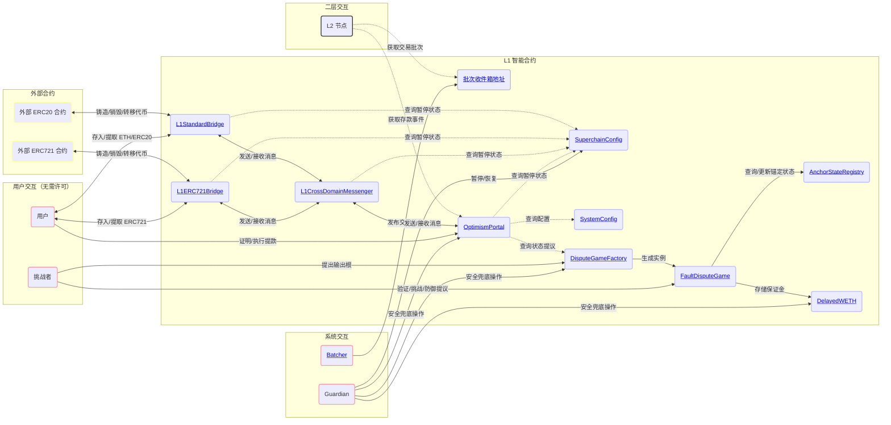
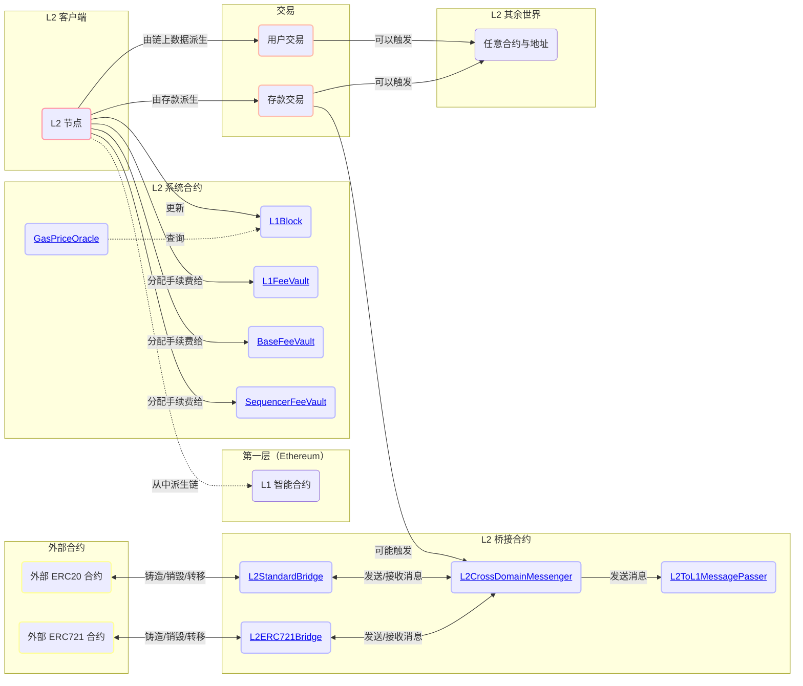
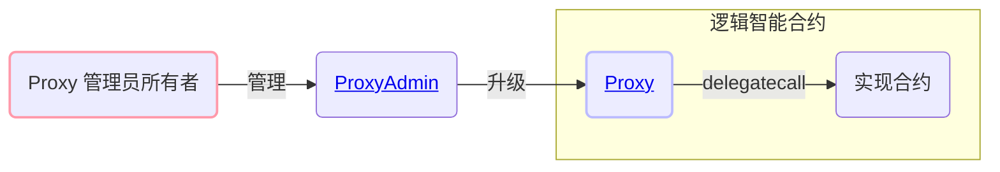
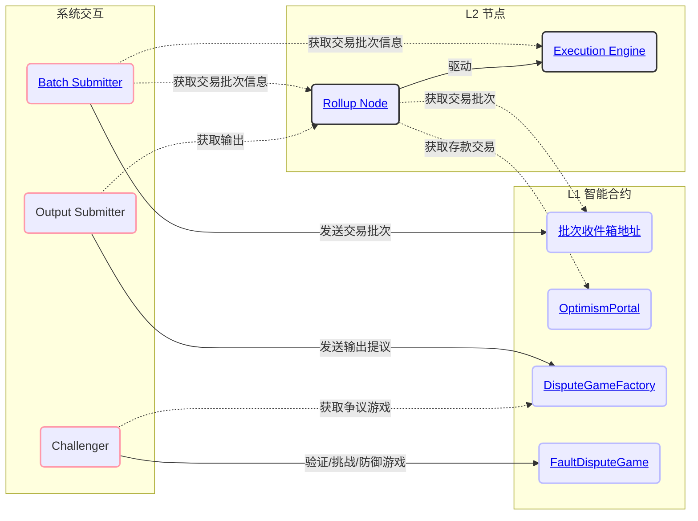

# Optimism 概览

原文链接：[Optimism Overview](https://github.com/ethereum-optimism/specs/blob/main/specs/protocol/overview.md)

<!-- START doctoc generated TOC please keep comment here to allow auto update -->
<!-- DON'T EDIT THIS SECTION, INSTEAD RE-RUN doctoc TO UPDATE -->
**目录**

- [Optimism 概览](#optimism-概览)
  - [架构设计目标](#架构设计目标)
  - [架构概览](#架构概览)
    - [核心 L1 智能合约](#核心-l1-智能合约)
      - [核心 L1 智能合约说明](#核心-l1-智能合约说明)
    - [核心 L2 智能合约](#核心-l2-智能合约)
      - [核心 L2 智能合约说明](#核心-l2-智能合约说明)
    - [智能合约代理](#智能合约代理)
    - [L2 节点组件](#l2-节点组件)
    - [交易/区块传播](#交易区块传播)
  - [关键交互详解](#关键交互详解)
    - [存款](#存款)
    - [区块派生](#区块派生)
      - [概述](#概述)
      - [Epoch 与排序窗口](#epoch-与排序窗口)
      - [区块派生循环](#区块派生循环)
    - [Engine API](#engine-api)

<!-- END doctoc generated TOC please keep comment here to allow auto update -->

本文档是对 Optimism 协议的高层技术概览。其目标是以较为非正式的方式解释协议如何运作，并引导读者前往规范的其他部分以进一步学习。

本文档假设你已经阅读过[背景](https://specs.optimism.io/background.html)。

## 架构设计目标

- **执行层面的 EVM 等价性：** 开发者体验应当与 L1 完全一致，除非 L2 引入了根本性的差异。
  - 不需要特殊编译器。
  - 不会出现意外的 gas 成本。
  - 交易追踪开箱即用。
  - 所有现有的 Ethereum 工具都可以继续使用，你只需要更换链 ID。
- **尽可能兼容 ETH1 节点：** 实现应尽量减少与原生 Geth 节点的差异，并尽可能复用现有的 L1 标准。
  - 执行引擎/rollup 节点使用 ETH2 Engine API 来构建规范的 L2 链。
  - 执行引擎复用了 Geth 现有的交易池和同步实现，包括 snap sync。
- **最小化状态与复杂性：**
  - 在可能的情况下，参与 rollup 基础设施的服务应当是无状态的。
  - 有状态服务应能够通过点对点网络和链上同步机制，从一个全新的数据库恢复到完整运行状态。
  - 运行一个副本节点应像运行一个 Geth 节点一样简单。

## 架构概览

### 核心 L1 智能合约

下面你会看到一张架构图，用于描述 OP Stack 的核心 L1 智能合约。那些被认为是“外围”的、并非 OP Stack 系统运行核心部分的智能合约，会单独描述。



#### 核心 L1 智能合约说明

- 上文所描述的 `批次收件箱地址`（**以灰色高亮显示**）并不是一个智能合约，而是一个被任意选定、并假定没有已知私钥的账户。关于如何推导该账户地址的约定，见[可配置性](https://specs.optimism.io/protocol/configurability.html#consensus-parameters)页面。
  - 在历史上，它通常被推导为 `0xFF0000....<L2 chain ID>`，其中 `<L2 chain ID>` 是发布数据所对应的 Layer 2 网络的链 ID。这也是为什么许多链，例如 OP Mainnet，其批次收件箱地址都采用这种形式。
- 位于 `Proxy` 合约之后的智能合约会以**蓝色高亮显示**。请参考下面的[智能合约代理](#智能合约代理)一节来理解这些代理的设计方式。
  - `L1CrossDomainMessenger` 合约位于 [`ResolvedDelegateProxy`](https://github.com/ethereum-optimism/optimism/tree/develop/packages/contracts-bedrock/src/legacy/ResolvedDelegateProxy.sol) 合约之后，这是 OP Stack 旧版本中使用的一种遗留代理合约类型。该代理类型仅用于 `L1CrossDomainMessenger`，以保持向后兼容。
  - `L1StandardBridge` 合约位于 [`L1ChugSplashProxy`](https://github.com/ethereum-optimism/optimism/tree/develop/packages/contracts-bedrock/src/legacy/L1ChugSplashProxy.sol) 合约之后，这是 OP Stack 旧版本中使用的一种遗留代理合约类型。该代理类型仅用于 `L1StandardBridge`，以保持向后兼容。

### 核心 L2 智能合约

这里你会看到一张架构图，用于描述原生存在于 L2 链上的核心 OP Stack 智能合约。



#### 核心 L2 智能合约说明

- 被标记为 "L2 System Contracts" 的合约，会在链派生过程中被自动更新或修改。用户通常不会直接修改这些合约，唯一的例外是 `FeeVault` 合约，因为任何用户都可以触发其中积累手续费向预先设定的提款地址提取。
- 位于 `Proxy` 合约之后的智能合约会以**蓝色高亮显示**。请参考下面的[智能合约代理](#智能合约代理)一节来理解这些代理的设计方式。
- 对于 "L2 Bridge Contracts" 的用户交互，图中未展示，但其整体上基本遵循[核心 L1 智能合约](#核心-l1-智能合约)架构图中所描述的相同用户交互模式。

### 智能合约代理

大多数 OP Stack 智能合约都位于由 `ProxyAdmin` 合约管理的 `Proxy` 合约之后。
`ProxyAdmin` 合约由某个 `owner` 地址控制，这个地址既可以是 EOA，也可以是智能合约。
下面的图解释了典型代理合约的行为方式。



### L2 节点组件

下面你会看到一张图，展示构成 L2 节点的各组件之间的基本交互，以及不同参与者如何使用这些组件来完成各自角色的职责。



### 交易/区块传播

**规范链接：**

- [Execution Engine](https://specs.optimism.io/protocol/exec-engine.html)

由于 EE 底层使用的是 Geth，Optimism 使用 Geth 内建的点对点网络和交易池来传播交易。这个网络同样可以用于传播已提交的区块，并支持 snap-sync。

而尚未提交的区块，则通过 Rollup Nodes 的另一套独立点对点网络进行传播。这是可选的，但它为验证者及其 JSON-RPC 客户端提供了更低延迟，因此作为一种便利功能而存在。

下图展示了排序器与验证者之间的关系：


## 关键交互详解

### 存款

**规范链接：**

- [Deposits](https://specs.optimism.io/protocol/deposits.html)

Optimism 支持两类存款：用户存款，以及 L1 属性存款。执行用户存款时，用户会调用 `OptimismPortal` 合约上的 `depositTransaction` 方法。该操作会触发 `TransactionDeposited` 事件，而 rollup 节点会在区块派生过程中读取这些事件。

L1 属性存款用于通过调用 L1 Attributes 预部署合约，在 L2 上登记 L1 区块属性（区块号、时间戳等）。它们不能由用户发起，而是由 rollup 节点自动加入到 L2 区块中。

这两类存款都会在 L2 上被表示为同一种自定义的 EIP-2718 交易类型。

### 区块派生

#### 概述

给定一条 L1 Ethereum 链，rollup 链可以被确定性地派生出来。整个 rollup 链都能够基于 L1 区块链被派生，这正是 Optimism 之所以是 rollup 的根本原因。这个过程可以表示为：

```text
derive_rollup_chain(l1_blockchain) -> rollup_blockchain
```

Optimism 的区块派生函数被设计成具备以下特性：

- 除了通过 L1 和 L2 执行引擎 API 易于访问的状态外，不依赖任何其他状态。
- 支持排序器及排序器共识。
- 能够抵抗排序器审查。

#### Epoch 与排序窗口

rollup 链被划分为多个 epochs。L1 区块号与 epoch 号之间是一一对应的关系。

对于 L1 区块号 `n`，存在一个对应的 rollup epoch `n`，而该 epoch 只有在经过一个 *sequencing window* 之后才能被派生出来，也就是说，只有当 L1 区块号 `n + SEQUENCING_WINDOW_SIZE` 被加入 L1 链后，才能派生对应 epoch。

每个 epoch 至少包含一个区块。该 epoch 中的每个区块都包含一笔 L1 info transaction，其中携带关于 L1 的上下文信息，例如区块哈希和时间戳。该 epoch 的第一个区块还会包含通过 `OptimismPortal` 合约在 L1 上发起的所有存款。所有 L2 区块也都可以包含 *sequenced transactions*，即直接提交给排序器的交易。

当排序器为某个 epoch 创建新的 L2 区块时，它必须在该 epoch 的排序窗口内，将其作为某个 *batch* 的一部分提交到 L1 上，也就是说，该批次必须在 L1 区块 `n + SEQUENCING_WINDOW_SIZE` 之前上链。这些批次，以及 `TransactionDeposited` L1 事件，共同使得基于 L1 链派生 L2 链成为可能。

排序器在构建后续 L2 区块时，并不需要等待某个 L2 区块对应的 batch 已经提交到 L1。实际上，batch 通常会包含多个 L2 区块对应的排序交易。这正是排序器能够实现 *快速交易确认* 的原因。

由于某个 epoch 的交易批次可以在排序窗口内的任意位置提交，验证者必须在整个窗口范围内搜索交易批次。这样可以抵御 L1 上交易何时被打包的不确定性。而这种不确定性也正是我们需要排序窗口的原因：否则排序器就可以事后向旧的 epoch 中追加区块，而验证者将无法知道某个 epoch 何时可以最终确定。

排序窗口还能够防止排序器进行审查：在某个 L1 区块中发起的存款，最迟会在经过 `SEQUENCING_WINDOW_SIZE` 个 L1 区块后被包含进 L2 链。

下图描述了这种关系，以及 L2 区块如何从 L1 区块派生出来，其中省略了 L1 info transactions：


#### 区块派生循环

rollup node 的一个子组件，称为 *rollup driver*，实际负责执行区块派生函数。rollup driver 本质上是一个无限循环，不断运行区块派生函数。对于每个 epoch，区块派生函数会执行以下步骤：

1. 为排序窗口中的每个区块下载存款数据和交易批次数据。
2. 将存款数据和交易批次数据转换为 Engine API 所需的 payload attributes。
3. 将 payload attributes 提交给 Engine API，在那里它们会被转换为区块并加入规范链。

之后，该过程会随着 epoch 递增不断重复，直到追上 L1 链的最新高度。

### Engine API

rollup driver 本身并不会直接创建区块。相反，它通过 Engine API 指挥执行引擎来创建区块。对于上文所述区块派生循环中的每一次迭代，rollup driver 都会构造一个 *payload attributes* 对象并发送给执行引擎。执行引擎随后会把这个 payload attributes 对象转换为区块，并将其加入链中。rollup driver 的基本执行顺序如下：

1. 使用 payload attributes 对象调用 [fork choice updated][EngineAPIVersion]。这里先略过 fork choice state 参数的细节，你只需要知道其中一个字段是 L2 链的 `headBlockHash`，它被设置为 L2 链头部区块的哈希。Engine API 会返回一个 payload ID。
2. 使用第 1 步返回的 payload ID 调用 [get payload][EngineAPIVersion]。Engine API 会返回一个 payload 对象，其中一个字段就是区块哈希。
3. 使用第 2 步返回的 payload 调用 [new payload][EngineAPIVersion]。（Ecotone 区块必须使用 V3；Ecotone 之前的区块必须使用 V2 版本）
4. 再次调用 [fork choice updated][EngineAPIVersion]，并将 fork choice 参数中的 `headBlockHash` 设置为第 2 步返回的区块哈希。此时，L2 链的链头就成为第 1 步创建的区块。

[EngineAPIVersion]: https://specs.optimism.io/protocol/derivation.html#engine-api-usage

下面的泳道图对这一过程进行了可视化展示：


____
