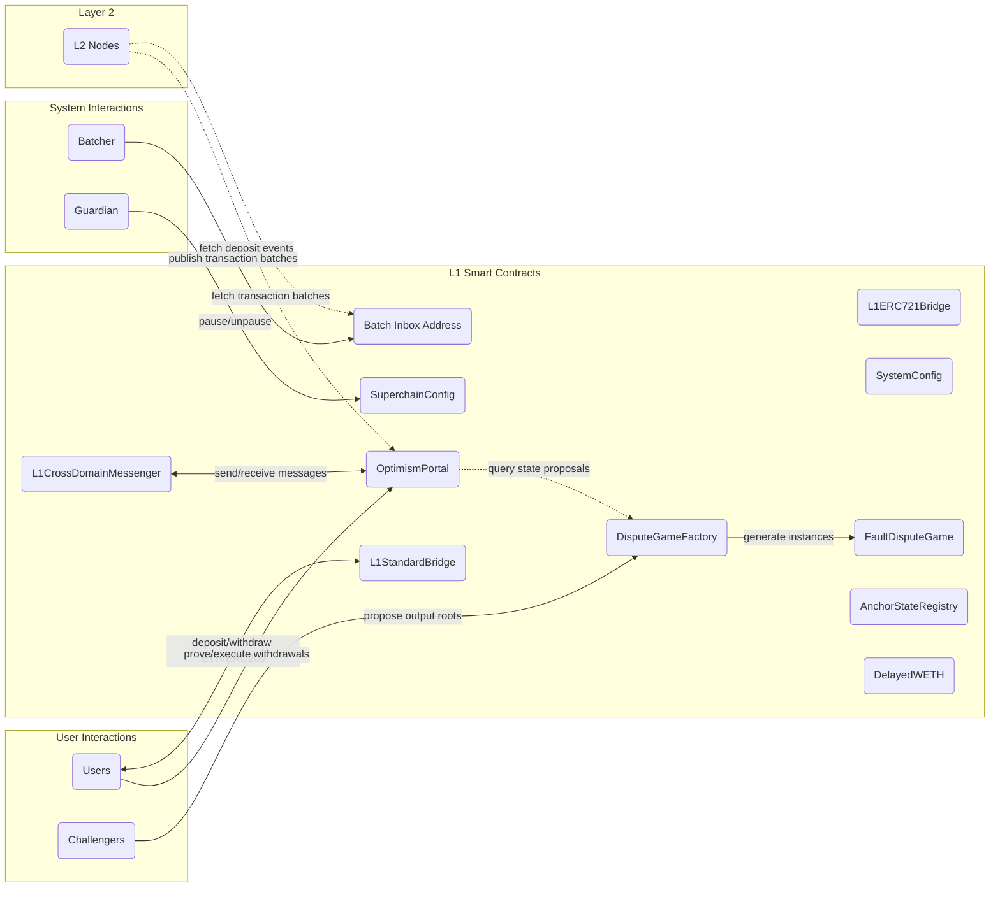
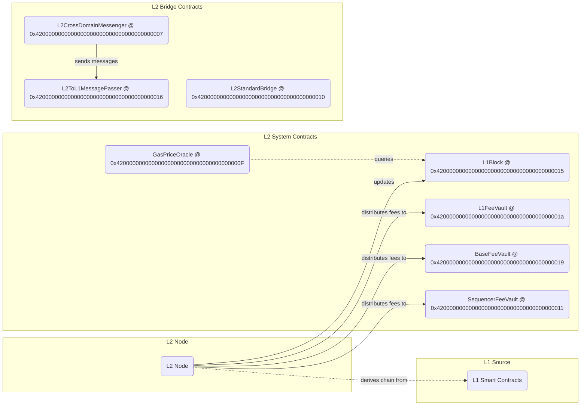
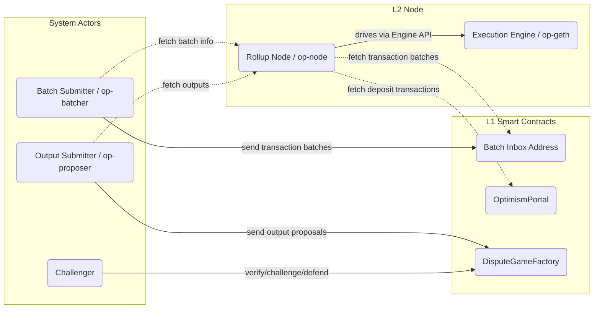
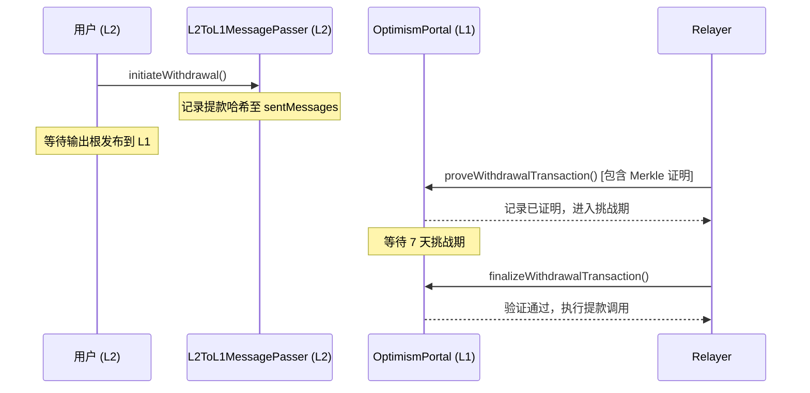

# Optimism Layer 2 协议规格文档

> 基于 [ethereum-optimism/specs](https://github.com/ethereum-optimism/specs) 官方规格文档整理
>
> 文档版本：覆盖 Bedrock → Regolith → Canyon → Delta → Ecotone → Fjord → Granite → Holocene → Isthmus → Jovian（简要）

---

## 目录

0. [核心概念（中英双语）](#核心概念中英双语)
1. [架构设计目标](#1-架构设计目标)
2. [整体架构概览](#2-整体架构概览)
   - [L1 核心智能合约](#21-l1-核心智能合约)
   - [L2 核心智能合约（Predeploys）](#22-l2-核心智能合约predeploys)
   - [L2 节点组件](#23-l2-节点组件)
3. [L2 链派生（Chain Derivation）](#3-l2-链派生chain-derivation)
   - [Epoch 与 Sequencing Window](#31-epoch-与-sequencing-window)
   - [派生流水线架构](#32-派生流水线架构)
   - [批次提交线格式（Wire Format）](#33-批次提交线格式wire-format)
   - [协议参数](#34-协议参数)
4. [存款机制（Deposits）](#4-存款机制deposits)
   - [存款交易类型](#41-存款交易类型)
   - [L1 属性存款交易](#42-l1-属性存款交易)
   - [用户存款交易](#43-用户存款交易)
   - [地址混淆（Address Aliasing）](#44-地址混淆address-aliasing)
5. [提款机制（Withdrawals）](#5-提款机制withdrawals)
   - [提款流程](#51-提款流程)
   - [L2ToL1MessagePasser 合约](#52-l2tol1messagepasser-合约)
   - [OptimismPortal 合约](#53-optimismportal-合约)
   - [提款验证与最终化](#54-提款验证与最终化)
6. [执行引擎（Execution Engine）](#6-执行引擎execution-engine)
   - [EIP-1559 参数](#61-eip-1559-参数)
   - [费用机制](#62-费用机制)
   - [Engine API](#63-engine-api)
   - [同步机制](#64-同步机制)
7. [跨域消息传递（Cross-Domain Messaging）](#7-跨域消息传递cross-domain-messaging)
   - [CrossDomainMessenger 接口](#71-crossdomainmessenger-接口)
   - [消息版本控制](#72-消息版本控制)
8. [Rollup 节点（Rollup Node）](#8-rollup-节点rollup-node)
   - [Driver 驱动器](#81-driver-驱动器)
   - [P2P 网络层](#82-p2p-网络层)
   - [输出 RPC 方法](#83-输出-rpc-方法)
9. [批次提交器（Batcher）](#9-批次提交器batcher)
10. [L2 输出根提案（Output Root Proposals）](#10-l2-输出根提案output-root-proposals)
    - [L2 输出根构造](#101-l2-输出根构造)
    - [输出根 Oracle 合约](#102-输出根-oracle-合约)
11. [预部署合约（Predeploys）](#11-预部署合约predeploys)
12. [系统配置（System Config）](#12-系统配置system-config)
    - [配置更新机制](#121-配置更新机制)
    - [关键配置参数](#122-关键配置参数)
13. [保证 Gas 市场（Guaranteed Gas Market）](#13-保证-gas-市场guaranteed-gas-market)
14. [超链升级历史（Superchain Upgrade History）](#14-超链升级历史superchain-upgrade-history)
    - [Bedrock（基础版本）](#141-bedrock基础版本)
    - [Regolith](#142-regolith)
    - [Canyon](#143-canyon)
    - [Delta](#144-delta)
    - [Ecotone](#145-ecotone)
    - [Fjord](#146-fjord)
    - [Granite](#147-granite)
    - [Holocene](#148-holocene)
    - [Isthmus](#149-isthmus)
    - [Jovian及后续升级](#1410-jovian及后续升级)
15. [超链协议版本管理](#15-超链协议版本管理)
16. [安全考量](#16-安全考量)

---

## 核心概念（中英双语）

以下术语与定义对齐 `specs/glossary.md` 与 `specs/protocol/` 的核心语义：

| English Term | 中文术语 | 定义（中文） |
| ------ | ------ | ------ |
| Layer 1 (L1) | 第一层（L1） | 指 Ethereum 主链，是 OP Stack 的结算与数据可用性来源。 |
| Layer 2 (L2) | 第二层（L2） | 指 Optimism 链，通过从 L1 派生得到规范链状态。 |
| Sequencer | 排序器 | 接收 L2 用户交易、生成 L2 区块，并通过 Batcher 将数据发布到 L1。 |
| Sequencing Window | 排序窗口 | 某个 epoch 可使用的 L1 区块范围，通常写作 `[N, N + SWS)`。 |
| Sequencing Epoch | 排序纪元 | 与特定 L1 区块编号对应的一段连续 L2 区块区间。 |
| L1 Origin | L1 来源块 | 某个 L2 区块所绑定的 L1 参考区块（按 epoch 关系确定）。 |
| Deposited Transaction | 存款交易（L1 发起、L2 执行） | 从 L1 事件派生到 L2 的特殊交易类型（`0x7E`），由协议强制包含。 |
| L1 Attributes Deposited Transaction | L1 属性存款交易 | 每个 L2 区块第一笔系统交易，用于把 L1 区块属性写入 `L1Block`。 |
| User-Deposited Transaction | 用户存款交易 | 用户通过 `OptimismPortal` 在 L1 发起，随后在 L2 由派生流程执行。 |
| Batcher | 批次提交器 | 将 Sequencer 数据编码为 channel/frame，并通过 L1 交易发布。 |
| Batcher Transaction | 批次交易 | 发送到 Batch Inbox 的 L1 交易，承载一到多个 channel frames。 |
| Channel / Channel Frame | 通道 / 通道帧 | 批次压缩与分片传输结构；通道由多个帧组成并可跨多个 L1 交易提交。 |
| Rollup Node | Rollup 节点 | 执行派生流程（L1 数据 -> Payload Attributes -> L2 区块）的共识层客户端。 |
| Payload Attributes | 载荷属性 | Engine API 的区块构建输入，包含时间戳、交易列表、gasLimit 等。 |
| Safe L2 Head | 安全 L2 链头 | 已由当前规范 L1 数据完全派生得到的 L2 链头。 |
| Unsafe L2 Head | 不安全 L2 链头 | 尚未被 L1 数据确认的投机性链头（通常来自 Sequencer/P2P）。 |
| Finalized L2 Head | 最终化 L2 链头 | 已由 finalized L1 数据派生、可视为不可逆的 L2 链头。 |
| Chain Re-Organization (Reorg) | 链重组 | 链头切换到非原链头子块的分叉重选事件；L2 重组通常由 L1 重组触发。 |
| Data Availability (DA) | 数据可用性 | 验证者可获取重建 L2 所需输入数据的性质（calldata/blob 等承载）。 |
| L2 Output Root | L2 输出根 | 对 L2 状态、提款存储根及区块哈希的版本化承诺。 |
| Fault Proof | 故障证明 | 对错误输出根或错误状态转换进行挑战与裁决的证明机制。 |
| Predeploy / Preinstall / Precompile | 预部署 / 预安装 / 预编译 | 三类“系统级合约形态”：创世内置代理合约、创世内置通用合约、EVM 原生实现合约。 |
| Address Aliasing | 地址混淆 | L1 合约地址映射到 L2 别名地址的规则，用于隔离跨域同地址风险。 |

---

## 1. 架构设计目标

Optimism 协议的架构围绕以下三个核心设计目标展开：

### 执行层 EVM 等价性（Execution-Level EVM Equivalence）

开发者体验应与 L1 完全一致，除非 L2 引入本质性差异：

- 无需特殊编译器
- 无意外的 Gas 消耗
- 交易追踪（trace）开箱即用
- 所有现有以太坊工具均可直接使用，只需修改 Chain ID

### 最大化与 ETH1 节点的兼容性

实现应尽量减少与原生 Geth 节点的差异，充分利用现有 L1 标准：

- 执行引擎与 Rollup 节点使用 ETH2 Engine API 构建规范 L2 链
- 执行引擎复用 Geth 现有的内存池（mempool）与同步实现（包括 snap sync）

### 最小化状态与复杂度

- 为 Rollup 基础设施提供服务的组件尽可能设计为无状态（stateless）
- 有状态的服务能够通过 P2P 网络和链上同步机制从空白数据库恢复至完整运行状态
- 运行一个副本节点应与运行 Geth 节点一样简单

---

## 2. 整体架构概览

### 2.1 L1 核心智能合约



**关键 L1 合约说明：**

| 合约 | 职责 |
| ------ | ------ |
| `OptimismPortal` | 存款入口与提款出口，L1↔L2 消息传递的底层合约 |
| `L1CrossDomainMessenger` | L1 侧的跨域消息高层 API，支持消息重放 |
| `L1StandardBridge` | ETH/ERC20 资产的 L1 标准桥接合约 |
| `L1ERC721Bridge` | ERC721（NFT）资产的 L1 桥接合约 |
| `SystemConfig` | L1 上的链配置管理合约，派生过程读取其日志事件 |
| `SuperchainConfig` | 超链级别的暂停/恢复状态管理 |
| `DisputeGameFactory` | 争议游戏工厂，生成故障证明（Fault Proof）游戏实例 |
| `FaultDisputeGame` | 故障争议游戏合约，用于挑战和验证输出根 |
| `Batch Inbox Address` | 非合约 EOA 地址，Batcher 向此地址发送批次交易数据 |

> **注意**：`Batch Inbox Address` 不是智能合约，而是一个约定的 EOA 地址（历史上常用 `0xFF0000....<L2 Chain ID>` 格式）。

### 2.2 L2 核心智能合约（Predeploys）



### 2.3 L2 节点组件



---

## 3. L2 链派生（Chain Derivation）

L2 链的核心特性：**L2 链可以从 L1 链确定性地完全派生出来**，即：

```text
derive_rollup_chain(l1_blockchain) → rollup_blockchain
```

### 3.1 Epoch 与 Sequencing Window

Rollup 链被划分为若干 **Epoch（纪元）**，Epoch 编号与 L1 区块编号一一对应：

- L1 第 `n` 号区块对应 Rollup 第 `n` 号 Epoch
- 每个 Epoch 至少包含一个 L2 区块
- 每个 Epoch 内的所有 L2 区块均包含 **L1 信息交易**（记录对应 L1 区块的哈希、时间戳等）
- Epoch 第一个 L2 区块还包含通过 `OptimismPortal` 发起的所有存款交易

**Sequencing Window（排序窗口）**的作用：

- 对于 L1 第 `n` 号区块，其对应的批次数据可以在 L1 第 `[n, n + SEQUENCING_WINDOW_SIZE)` 号区块内的任意位置提交
- 这保护了对 L1 交易包含不确定性的抵抗能力
- 同时防止 Sequencer 审查：L1 上的存款交易最迟会在 `SEQUENCING_WINDOW_SIZE` 个 L1 区块后被包含进 L2

**L2 区块时间戳约束：**

```text
block.timestamp = prev_l2_timestamp + l2_block_time   (OP Mainnet 默认 l2_block_time = 2s，可配置)
l1_origin.timestamp <= block.timestamp <= max_l2_timestamp
max_l2_timestamp = max(l1_origin.timestamp + max_sequencer_drift, prev_l2_timestamp + l2_block_time)
```

### 3.2 派生流水线架构

L2 链派生通过一个 **8 阶段流水线** 实现：

```text
L1 数据流向（外→内）：
┌─────────────┐    ┌──────────┐    ┌───────────┐    ┌─────────────┐
│ L1 Traversal│ -> │L1 Retrieval│ -> │Frame Queue│ -> │ Channel Bank│
└─────────────┘    └──────────┘    └───────────┘    └─────────────┘
                                                            |
┌─────────────┐    ┌───────────┐    ┌─────────────┐         |
│ Engine Queue│ <- │Batch Queue│ <- │Channel Reader│ <-------┘
└─────────────┘    └───────────┘    └─────────────┘
        |
        ↓（Payload Attributes Derivation 穿插其中）
  执行引擎 (op-geth)
```

各阶段职责：

| 阶段 | 职责 |
| ------ | ------ |
| **L1 Traversal** | 逐个读取 L1 区块头；同步更新 System Config |
| **L1 Retrieval** | 从 L1 区块中提取 Batcher 交易（验证 `to` 地址和发送者签名） |
| **Frame Queue** | 缓冲一个数据交易，解码为 Channel Frames 队列 |
| **Channel Bank** | 管理 Channel 缓冲区；处理剪枝（按大小）和超时（按 L1 区块数） |
| **Channel Reader** | 解压 Channel 数据；解码 Sequencer Batches |
| **Batch Queue** | 按时间戳对批次重排序；填补时间槽中的空白 |
| **Payload Attributes Derivation** | 将批次转换为 PayloadAttributes（包含存款交易和排序交易） |
| **Engine Queue** | 将 PayloadAttributes 发送至执行引擎；管理 L2 链头状态 |

**Engine Queue 维护三个 L2 区块引用：**

- `finalized`：可从 L1 最终化数据完全派生，不可逆
- `safe`：可从当前规范 L1 链完全派生
- `unsafe`（latest）：尚未通过 L1 数据验证，来自排序器 P2P 广播

**流水线重置（Pipeline Reset）**：

当检测到 L1 重组（reorg）时，流水线会重置以从新的起始点重新派生，支持：
- 节点重启后从现有引擎实例继续
- 执行引擎链不一致时的恢复
- L1 链重组后的恢复
- 在故障证明程序中初始化管道以派生争议块

### 3.3 批次提交线格式（Wire Format）

批次数据的封装层次（由外到内）：

```text
Batcher Transaction
    └── version_byte(0x00) ++ frames...
              └── Frame = channel_id(16B) + frame_number(2B) + data_length(4B) + data + is_last(1B)
                              └── Channel = zlib/brotli 压缩后的 RLP 编码批次序列
                                              └── Batch = batch_version ++
                                                 [parent_hash, epoch_number, epoch_hash, timestamp, tx_list]
```

**Frame 格式：**

```text
frame = channel_id(bytes16) ++ frame_number(uint16) ++ frame_data_length(uint32) ++ frame_data ++ is_last(bool)
固定开销 = 16 + 2 + 4 + 1 = 23 bytes
```

**Channel 格式（压缩）：**

- Bedrock/Canyon/Delta/Ecotone/Fjord-前：使用 `zlib` (RFC-1950) 压缩，无字典
- Fjord 起：引入 **Brotli** 压缩，通过版本化编码格式区分

**Batch 格式：**

| 版本 | 内容 | 引入版本 |
| ------ | ------ | --------- |
| `batch_version = 0` | `rlp_encode([parent_hash, epoch_number, epoch_hash, timestamp, tx_list])` | Bedrock |
| `batch_version = 1` | Span Batch：将多个连续 L2 区块的批次通过差量编码合并，大幅降低数据大小 | Delta |

**Batch 有效性判断（Batch Queue 阶段）：**

| 判断结果 | 含义 |
| --------- | ------ |
| `drop` | 批次无效，已永久排除（除非 L1 重组） |
| `accept` | 批次有效，应被处理 |
| `undecided` | 缺少 L1 信息，暂无法判断 |
| `future` | 批次可能有效，但尚不能处理，需稍后重试 |

**Batcher 交易认证：**
- `to` 字段必须等于配置的 Batch Inbox 地址
- 发送者（从签名恢复）必须匹配 System Config 中的 batcher 地址

### 3.4 协议参数

| 参数 | Bedrock 默认值 | 最新默认值 | 变更版本 |
| ------ | --------------- | ----------- | --------- |
| `max_sequencer_drift` | 600 秒 | 1800 秒（固定常量） | Fjord |
| `MAX_RLP_BYTES_PER_CHANNEL` | 10,000,000 | 100,000,000 | Fjord |
| `MAX_CHANNEL_BANK_SIZE` | 100,000,000 | 1,000,000,000 | Fjord |
| `CHANNEL_TIMEOUT` | 300 L1 区块 | 50 L1 区块 | Granite（减小） |
| `l2_block_time` | OP Mainnet 默认 2 秒 | OP Mainnet 默认 2 秒 | 可配置参数 |

---

## 4. 存款机制（Deposits）

存款（Deposit）是在 L1 上发起、在 L2 上执行的跨链交易。

### 4.1 存款交易类型

Optimism 定义了 [EIP-2718] 兼容的新交易类型，前缀为 `0x7E`：

| 字段 | 类型 | 说明 |
| ------ | ------ | ------ |
| `sourceHash` | `bytes32` | 唯一标识存款来源，防止重复 |
| `from` | `address` | 发送者地址（显式指定，无签名验证） |
| `to` | `address` | 接收者地址（合约创建时为零地址） |
| `mint` | `uint256` | 在 L2 上铸造的 ETH 数量 |
| `value` | `uint256` | 发送给接收者的 ETH 数量 |
| `gas` | `uint64` | L2 上的 Gas 限制 |
| `isSystemTx` | `bool` | Regolith 后强制为 `false` |
| `data` | `bytes` | 调用数据 |

**存款交易的特殊执行规则：**

- `mint` 的 ETH 无条件铸造（即使执行失败也不撤销）
- 不验证签名、nonce、手续费
- 无 Gas 退款（Gas 在 L1 上已购买）
- 执行失败时回滚至 EVM 处理前的状态（但 mint 保留，nonce +1）

**`sourceHash` 计算：**

```text
// 用户存款
keccak256(bytes32(uint256(0)), keccak256(l1BlockHash, bytes32(uint256(l1LogIndex))))

// L1 属性存款
keccak256(bytes32(uint256(1)), keccak256(l1BlockHash, bytes32(uint256(seqNumber))))

// 升级存款
keccak256(bytes32(uint256(2)), keccak256(intent))
```

### 4.2 L1 属性存款交易

每个 L2 区块的**第一笔交易**固定为 L1 属性存款交易：

- `from`: `0xdeaddeaddeaddeaddeaddeaddeaddeaddead0001`（L1 Attributes Depositor，无私钥 EOA）
- `to`: `0x4200000000000000000000000000000000000015`（L1Block 预部署合约）
- 调用 `setL1BlockValues()` 写入对应 L1 区块的属性

**L1Block 合约存储的数据：**

- L1 区块 `number`、`timestamp`、`basefee`、`hash`
- `sequenceNumber`：当前 L2 区块相对于 Epoch 起始的偏移量
- `batcherHash`：批次提交者的版本化承诺
- 费用相关标量参数（随升级更新）

### 4.3 用户存款交易

用户通过调用 `OptimismPortal.depositTransaction()` 发起存款，产生 `TransactionDeposited` 事件，Rollup 节点在派生时读取并处理。

每个 Epoch 的**第一个** L2 区块包含该 Epoch 对应 L1 区块上发起的所有用户存款交易（位于 L1 属性存款交易之后）。

### 4.4 地址混淆（Address Aliasing）

当**合约**在 L1 调用 `depositTransaction` 时，其地址会被转换（混淆）：

```text
aliased_address = from_address + 0x1111000000000000000000000000000000001111  (unchecked uint160 溢出)
```

**目的**：防止 L1 合约与 L2 合约地址相同但代码不同引发的安全攻击。EOA 地址不会被混淆。

---

## 5. 提款机制（Withdrawals）

提款（Withdrawal）是在 L2 上发起、在 L1 上最终执行的跨链交易，可用于：
- 向 L1 合约发送消息
- 将 ETH 从 L2 账户转移至 L1 账户

### 5.1 提款流程



**三个关键交易阶段：**

1. **提款发起**（L2）：调用 `L2ToL1MessagePasser.initiateWithdrawal()`
2. **提款证明**（L1）：调用 `OptimismPortal.proveWithdrawalTransaction()`，提交 Merkle 包含证明
3. **提款最终化**（L1）：7 天挑战期结束后，调用 `OptimismPortal.finalizeWithdrawalTransaction()`

> Relayer 不必须是发起提款的同一账户。

### 5.2 L2ToL1MessagePasser 合约

地址：`0x4200000000000000000000000000000000000016`

```solidity
interface L2ToL1MessagePasser {
    event MessagePassed(
        uint256 indexed nonce,    // 全局递增的消息 nonce
        address indexed sender,
        address indexed target,
        uint256 value,
        uint256 gasLimit,
        bytes data,
        bytes32 withdrawalHash
    );

    function initiateWithdrawal(address _target, uint256 _gasLimit, bytes memory _data) payable external;
    function sentMessages(bytes32) view external returns (bool);
    function burn() external;  // 销毁合约内积累的 ETH（减少 L2 供应）
}
```

**注意**：提款中**不进行**地址混淆，发送者地址原样传递至 L1。

### 5.3 OptimismPortal 合约

`OptimismPortal` 是 L2 的入口和出口合约（同时处理存款和提款）：

```solidity
interface OptimismPortal {
    function proveWithdrawalTransaction(
        Types.WithdrawalTransaction memory _tx,
        uint256 _l2OutputIndex,
        Types.OutputRootProof calldata _outputRootProof,
        bytes[] calldata _withdrawalProof
    ) external;

    function finalizeWithdrawalTransaction(
        Types.WithdrawalTransaction memory _tx
    ) external;

    function l2Sender() returns (address) external;
}
```

### 5.4 提款验证与最终化

**证明所需输入：**

```text
WithdrawalTransaction:
  - nonce         // 消息 nonce
  - sender        // L2 发送者地址
  - target        // L1 目标地址
  - value         // 发送的 ETH
  - data          // 调用数据
  - gasLimit      // 转发的 Gas 限制

证明数据:
  - l2OutputIndex    // 输出根在 Oracle 中的索引
  - outputRootProof  // 4 个 bytes32（用于派生输出根）
  - withdrawalProof  // L2ToL1MessagePasser 合约的 Merkle 包含证明
```

**验证条件：**
1. `l2OutputIndex` 对应非零的 `OutputProposal`
2. `outputRootProof` 的 keccak256 哈希等于记录的 `outputRoot`
3. `withdrawalProof` 是有效的 Merkle 包含证明

---

## 6. 执行引擎（Execution Engine）

执行引擎基于 Geth 实现（op-geth），通过 Engine API 与 Rollup 节点交互。

### 6.1 EIP-1559 参数

L2 使用 EIP-1559 基础费用机制，但有以下差异：

- 基础费用**不销毁**，而是积累至 `BaseFeeVault`
- 可通过链配置指定 EIP-1559 `Denominator` 和 `Elasticity`
- **Canyon 后**：引入 `EIP1559DenominatorCanyon`
- **Holocene 后**：EIP-1559 参数可通过 System Config **动态配置**，并编码在区块 `extraData` 字段中
- **Jovian 后**：引入可配置的**最低基础费用（minBaseFee）**

### 6.2 费用机制

L2 上的排序交易（非存款交易）收取三种费用：

#### 优先费（Priority Fee）→ SequencerFeeVault

遵循 EIP-1559 规范，由区块 coinbase 地址（即 `SequencerFeeVault`）收取。

#### 基础费（Base Fee）→ BaseFeeVault

遵循 EIP-1559 规范，但**不销毁**，积累到 `BaseFeeVault`。

#### L1 成本费（L1-Cost Fee）→ L1FeeVault

协议通过向 L2 用户收取额外费用来资助批次提交成本，根据 L2 交易的估算批次提交成本计算。

**Pre-Ecotone 计算公式：**

```text
L1 Cost = (rollupDataGas + l1FeeOverhead) * l1BaseFee * l1FeeScalar / 1e6

rollupDataGas = zeroes * 4 + ones * 16   (Regolith 后，Regolith 前 ones 额外加 68)
```

**Ecotone 后（支持 EIP-4844 Blob DA）：**

```text
L1 Cost = (zeroes*4 + ones*16) * (16*l1BaseFee*l1BaseFeeScalar + l1BlobBaseFee*l1BlobBaseFeeScalar) / 16e6
```

**三个 Fee Vault 预部署地址：**

| Vault | 地址 |
| ------- | ------ |
| `SequencerFeeVault` | `0x4200000000000000000000000000000000000011` |
| `BaseFeeVault` | `0x4200000000000000000000000000000000000019` |
| `L1FeeVault` | `0x420000000000000000000000000000000000001a` |

积累到一定数量后，ETH 可被提取到 L1 的不可变目标地址。

### 6.3 Engine API

Rollup 节点通过标准以太坊 Engine API 驱动执行引擎，扩展了 `PayloadAttributes` 字段：

**区块构建循环（4 步）：**

```text
1. engine_forkchoiceUpdatedVX(forkchoiceState, payloadAttributes) → payloadId
2. engine_getPayloadVX(payloadId)                                   → executionPayload
3. engine_newPayloadVX(executionPayload)
4. engine_forkchoiceUpdatedVX(forkchoiceState{head=newBlockHash}, null)
```

**Engine API 版本使用说明（按方法区分）：**

| 方法 | 当前使用方式 |
| ------ | ------------- |
| `engine_forkchoiceUpdated` | 当前 `op-node` 使用 `V4`，对 Bedrock/Canyon/Delta/Ecotone/Isthmus payload 向后兼容 |
| `engine_getPayload` | 当前 `op-node` 使用 `V4`，对 Bedrock/Canyon/Delta/Ecotone/Isthmus payload 向后兼容 |
| `engine_newPayload` | 按 payload 类型调用：Bedrock/Canyon/Delta 用 `V2`，Ecotone 用 `V3`，Isthmus 用 `V4` |

> 该映射来自 `derivation.md` 的 Engine Queue 章节，避免将所有方法简单按硬分叉版本一一绑定而产生误解。

**扩展的 PayloadAttributesV3 字段：**

```js
PayloadAttributesV3: {
    timestamp: QUANTITY
    prevRandao: DATA (32 bytes)
    suggestedFeeRecipient: DATA (20 bytes)
    withdrawals: array of WithdrawalV1
    parentBeaconBlockRoot: DATA (32 bytes)   // Ecotone 起
    transactions: array of DATA               // 确定性交易列表
    noTxPool: bool                            // true 时禁止从 tx pool 添加交易
    gasLimit: QUANTITY
    eip1559Params: DATA (8 bytes) or null     // Holocene 起
    minBaseFee: QUANTITY or null              // Jovian 起
}
```

**`engine_signalSuperchainV1`**（可选扩展）：

Rollup 节点通过此接口向执行引擎发送超链协议版本信号，执行引擎据此判断自身版本是否满足推荐/必要版本要求，不满足时可暂停运行（需操作者同意）。

### 6.4 同步机制

**快速路径（Happy-path Sync）：**
- Rollup 节点通知执行引擎最新的 L2 链头
- 执行引擎通过 P2P 网络进行 snap-sync（状态同步）或区块同步，快速追赶至最新状态

**最差情况同步（Worst-case Sync）：**
- 执行引擎离线、无 P2P 连接时（或 P2P 同步停滞）
- Rollup 节点检测到引擎落后后，逐一从 L1 派生数据并通过 Engine API 注入 L2 区块
- 此路径无需任何 P2P 节点，完全从 L1 数据重建

---

## 7. 跨域消息传递（Cross-Domain Messaging）

### 7.1 CrossDomainMessenger 接口

```solidity
interface CrossDomainMessenger {
    // 发送跨域消息
    function sendMessage(address _target, bytes memory _message, uint32 _minGasLimit) external payable;

    // 在目标域上执行消息
    function relayMessage(
        uint256 _nonce,
        address _sender,
        address _target,
        uint256 _value,
        uint256 _minGasLimit,
        bytes memory _message
    ) external payable returns (bytes memory returnData_);

    // 查询消息状态
    function successfulMessages(bytes32) external view returns (bool);
    function failedMessages(bytes32) external view returns (bool);

    event RelayedMessage(bytes32 indexed msgHash);
    event FailedRelayedMessage(bytes32 indexed msgHash);
}
```

**L1→L2（存款方向）：**
- 用户调用 `L1CrossDomainMessenger.sendMessage()`
- 无需用户在 L2 调用 `relayMessage`
- 用户在 L1 支付 L2 Gas，消息自动被包含进 L2 执行

**L2→L1（提款方向）：**
- 用户在 L2 调用 `L2CrossDomainMessenger.sendMessage()`（最终写入 `L2ToL1MessagePasser`）
- 等待输出根发布到 L1 并过挑战期
- 在 L1 调用 `OptimismPortal.finalizeWithdrawalTransaction()`（内部调用 `L1CrossDomainMessenger.relayMessage()`）

**预部署地址：**

| 合约 | 地址 |
| ------ | ------ |
| `L2CrossDomainMessenger` | `0x4200000000000000000000000000000000000007` |

### 7.2 消息版本控制

消息 nonce 的前 2 字节用于版本元数据：

**Version 0（旧版）：**

```solidity
abi.encodeWithSignature("relayMessage(address,address,bytes,uint256)", _target, _sender, _message, _messageNonce)
```

**Version 1（当前）：**

```solidity
abi.encodeWithSignature(
    "relayMessage(uint256,address,address,uint256,uint256,bytes)",
    _nonce,
    _sender,
    _target,
    _value,
    _gasLimit,
    _data
)
```

---

## 8. Rollup 节点（Rollup Node）

Rollup 节点（`op-node`）是负责从 L1 区块派生 L2 链的核心共识层客户端。

### 8.1 Driver 驱动器

Driver 持续运行派生循环，管理以下状态：

- 跟踪 L1 最新区块头
- 跟踪 L2 链同步进度（`unsafe`/`safe`/`finalized`）
- 随新 L1 输入可用时迭代派生步骤

**协议版本追踪：**

Rollup 节点监控 L1 上的 `ProtocolVersions` 合约，获取推荐/必要版本，
并通过 `engine_signalSuperchainV1` 通知执行引擎。
版本不满足要求时，节点应警告用户；不满足必要版本时，可暂停引擎（需操作者同意）。

### 8.2 P2P 网络层

Rollup 节点支持可选的 P2P 网络以降低 Sequencer 到验证节点的延迟：

**网络协议栈：**
- **发现**：Discv5（与 Ethereum L1 共享）
- **传输/连接**：LibP2P（TCP，含 Noise 加密）
- **消息传播**：GossipSub（发布-订阅协议）

**Gossip Topics（区块主题）：**

| Topic | 协议版本 |
| ------- | --------- |
| `blocksv1` | Bedrock |
| `blocksv2` | Canyon / Delta |
| `blocksv3` | Ecotone（父信标区块根） |
| `blocksv4` | Isthmus |

**重要特性：**
- P2P 层的数据属于**投机性扩展（unsafe chain）**，不影响 Rollup 安全性
- 节点始终优先以 L1 数据为准，如有冲突则重组 P2P 接收的数据
- 区块通过签名验证（由 `unsafe_block_signer` 签名，防止 DoS 攻击）

### 8.3 输出 RPC 方法

```text
optimism_outputAtBlock(blockNumber) → {
    version: DATA (32B),
    outputRoot: DATA (32B),
    blockRef: L2BlockRef,
    withdrawalStorageRoot: DATA (32B),
    stateRoot: DATA (32B),
    syncStatus: SyncStatus
}
```

---

## 9. 批次提交器（Batcher）

Batcher（`op-batcher`）负责将 L2 Sequencer 数据提交到 L1，使其对验证者可用。

**最简 Batcher 实现循环：**

```text
loop:
  1. 检查 unsafe L2 区块号是否超过 safe 区块号（需提交 unsafe 数据）
  2. 遍历所有 unsafe L2 区块，跳过已提交的
  3. 开启 Channel，缓冲所有待提交的 L2 区块数据（按派生规格编码和压缩）
  4. 从 Channel 中拉取 Frame，填充数据交易，直到 Channel 为空
  5. 将数据交易提交到 L1
```

**注意事项：**

- 数据提交后 L2 的 safe/unsafe 视图不会立即更新
- 需要注意不要重复提交数据
- 任何数据均可在任意时间提交，但只有符合派生规格的数据才对验证者有效

---

## 10. L2 输出根提案（Output Root Proposals）

Output Proposer（`op-proposer`）定期向 L1 提交 L2 状态承诺，供提款验证使用。

> **注意（适用范围）**：`proposals.md` 这里描述的是 `L2OutputOracle v1.0.0` 模式，
> 其输出根提交权限为单账户（permissioned proposer）。在引入 Stage-1 Fault Proof 的网络配置中，
> 输出根相关流程由 `DisputeGameFactory` + `FaultDisputeGame` 体系承载，参与权限与流程取决于该网络的治理与部署参数，
> 不应与 `L2OutputOracle v1.0.0` 混为同一机制。

### 10.1 L2 输出根构造

```text
output_root = keccak256(version_byte || payload)

// version_byte = bytes32(0)
payload = state_root || withdrawal_storage_root || latest_block_hash
```

其中：
- `state_root`：L2 执行层所有账户的 MPT 根
- `withdrawal_storage_root`：`L2ToL1MessagePasser` 合约存储的 MPT 根（Isthmus 后直接存在区块头 `withdrawalsRoot` 字段中）
- `latest_block_hash`：最新 L2 区块哈希

### 10.2 输出根 Oracle 合约

**Proposer 算法（伪代码）：**

```python
while True:
    next_checkpoint_block = L2OutputOracle.nextBlockNumber()
    rollup_status = op_node_client.sync_status()
    if rollup_status.finalized_l2.number >= next_checkpoint_block:
        output = op_node_client.output_at_block(next_checkpoint_block)
        send_transaction(output)
    time.sleep(poll_interval)
```

**安全机制：**
- L1 重组时：Proposer 可附带 L1 区块哈希验证，防止基于已重组 L1 数据的错误提案
- 提案可被 `CHALLENGER` 账户删除（同时删除其后所有提案）

---

## 11. 预部署合约（Predeploys）

预部署合约在创世状态中位于固定地址，直接在 EVM 中运行。地址前缀命名空间：`0x4200000000000000000000000000000000000xxx`

**完整预部署地址表：**

| 合约名 | 地址 | 版本 | 状态 |
| -------- | ------ | ------ | ------ |
| `LegacyMessagePasser` | `0x4200000000000000000000000000000000000000` | Legacy | 已废弃 |
| `DeployerWhitelist` | `0x4200000000000000000000000000000000000002` | Legacy | 已废弃 |
| `LegacyERC20ETH` | `0xDeadDeAddeAddEAddeadDEaDDEAdDeaDDeAD0000` | Legacy | 已废弃 |
| `WETH9` | `0x4200000000000000000000000000000000000006` | Legacy | 有效 |
| `L2CrossDomainMessenger` | `0x4200000000000000000000000000000000000007` | Legacy | 有效 |
| `L2StandardBridge` | `0x4200000000000000000000000000000000000010` | Legacy | 有效 |
| `SequencerFeeVault` | `0x4200000000000000000000000000000000000011` | Legacy | 有效 |
| `OptimismMintableERC20Factory` | `0x4200000000000000000000000000000000000012` | Legacy | 有效 |
| `L1BlockNumber` | `0x4200000000000000000000000000000000000013` | Legacy | 已废弃 |
| `L2ERC721Bridge` | `0x4200000000000000000000000000000000000014` | Legacy | 有效 |
| `L1Block` | `0x4200000000000000000000000000000000000015` | Bedrock | 有效 |
| `L2ToL1MessagePasser` | `0x4200000000000000000000000000000000000016` | Bedrock | 有效 |
| `OptimismMintableERC721Factory` | `0x4200000000000000000000000000000000000017` | Bedrock | 有效 |
| `ProxyAdmin` | `0x4200000000000000000000000000000000000018` | Bedrock | 有效 |
| `BaseFeeVault` | `0x4200000000000000000000000000000000000019` | Bedrock | 有效 |
| `L1FeeVault` | `0x420000000000000000000000000000000000001a` | Bedrock | 有效 |
| `SchemaRegistry` | `0x4200000000000000000000000000000000000020` | Bedrock | 有效 |
| `EAS` | `0x4200000000000000000000000000000000000021` | Bedrock | 有效 |
| `GasPriceOracle` | `0x420000000000000000000000000000000000000F` | Legacy | 有效 |
| `GovernanceToken` | `0x4200000000000000000000000000000000000042` | Legacy | 有效 |
| `BeaconBlockRoot` | `0x000F3df6D732807Ef1319fB7B8bB8522d0Beac02` | Ecotone | 有效 |
| `OperatorFeeVault` | `0x420000000000000000000000000000000000001B` | Isthmus | 有效 |

**关键预部署合约功能简述：**

- **`L1Block`**：存储最新 L1 区块的属性（区块号、时间戳、基础费、哈希等），由 Rollup 节点在每个 L2 区块派生时更新
- **`GasPriceOracle`**：提供链下 Gas 估算 API（`getL1Fee(bytes)`）
- **`L2StandardBridge`**：ETH/ERC20 跨链桥，内部通过 `L2CrossDomainMessenger` 发送消息
- **`L2ToL1MessagePasser`**：记录提款消息哈希至 `sentMessages` 映射
- **`ProxyAdmin`**：所有预部署代理合约的管理者，其所有者可升级任意预部署合约
- **`BeaconBlockRoot`**（Ecotone+）：提供 L1 信标区块根访问（EIP-4788）
- **`OperatorFeeVault`**（Isthmus+）：Operator 费用金库

---

## 12. 系统配置（System Config）

`SystemConfig` 是 L1 上的配置管理合约，通过 Log 事件向 L2 派生过程传播配置变更，是 OP Stack 链配置的权威来源。

### 12.1 配置更新机制

通过 `ConfigUpdate(uint256 version, uint8 updateType, bytes data)` 事件触发配置更新：

| 更新类型 | 更新内容 |
| --------- | --------- |
| Type `0` | `batcherHash` 覆写 |
| Type `1` | `overhead` 和 `scalar` 覆写（Ecotone 后 overhead 忽略，scalar 用版本化编码） |
| Type `2` | `gasLimit` 覆写 |
| Type `3` | `unsafeBlockSigner` 覆写 |
| Type `4` | `eip1559Params` 覆写（denominator 和 elasticity） |
| Type `5` | `operatorFeeParams` 覆写（scalar 和 constant） |
| Type `6` | `minBaseFee` 覆写 |
| Type `7` | `daFootprintGasScalar` 覆写 |

### 12.2 关键配置参数

| 参数 | 说明 |
| ------ | ------ |
| **Batch Inbox** | Sequencer 发布批次交易的目标地址 |
| **Batcher Hash** | 识别有效 Batcher 发送者的版本化 32 字节哈希（V0：单地址承诺） |
| **Fee Scalars** | L1 数据费用计算参数（Pre-Ecotone: overhead + scalar；Post-Ecotone: baseFeeScalar + blobBaseFeeScalar） |
| **Unsafe Block Signer** | P2P 广播 unsafe 区块的签名地址，存储在特殊 slot `keccak256("systemconfig.unsafeblocksigner")` |
| **L2 Gas Limit** | 单个 L2 区块的最大 Gas 量，上限由 `maximumGasLimit()` 控制 |

---

## 13. 保证 Gas 市场（Guaranteed Gas Market）

存款交易（deposited transactions）的 Gas 被称为"保证 Gas（Guaranteed Gas）"：

- Gas 在 L1 上购买（通过燃烧 L1 Gas 或直接支付 ETH）
- Gas 在 L2 上**不可退款**
- 使用 EIP-1559 风格的算法计算 L2 Gas 价格

**Gas 组成：**
- **Gas Stipend**：抵消存款事件本身消耗的 L1 Gas，`credit = gas_spent * L1_base_fee`
- **额外保证 Gas**：用户希望在保证额度之上购买的额外 Gas

**默认参数：**

| 参数 | 值 |
| ------ | ----- |
| `MAX_RESOURCE_LIMIT` | 20,000,000 |
| `ELASTICITY_MULTIPLIER` | 10 |
| `BASE_FEE_MAX_CHANGE_DENOMINATOR` | 8 |
| `MINIMUM_BASE_FEE` | 1 gwei |
| `MAXIMUM_BASE_FEE` | 340,282,366,920,938,463,463,374,607,431,768,211,455 (uint128 最大值) |
| `TARGET_RESOURCE_LIMIT` | `MAX_RESOURCE_LIMIT / ELASTICITY_MULTIPLIER` |

---

## 14. 超链升级历史（Superchain Upgrade History）

Optimism 协议通过**基于时间戳的激活规则**进行网络升级（Holocene 前部分使用区块号激活）。

### 14.1 Bedrock（基础版本）

OP Stack 的基础架构版本，引入了：
- 当前协议框架（派生流水线、存款/提款机制）
- 基于 Geth 的执行引擎
- `L1Block`、`L2ToL1MessagePasser` 等核心预部署合约
- Engine API 集成

### 14.2 Regolith

**主题**：修复 Bedrock 审计中发现的存款处理问题

**主要变更：**
- 禁用 `isSystemTx` 布尔值（系统交易使用与普通存款相同的 Gas 计量规则）
- 收据中记录实际 Gas 使用量，并从 L2 区块 Gas 池中扣除
- 新增收据字段 `depositNonce`（存储发送者发起 EVM 处理前的 nonce 值）
- 修正 L1 费用函数（去除 Bedrock 遗留的 68 字节额外开销）

### 14.3 Canyon

**主题**：集成 L1 Shapella 升级

**执行层变更：**
- [EIP-3651](https://eips.ethereum.org/EIPS/eip-3651)：Warm COINBASE（预热 COINBASE 地址）
- [EIP-3855](https://eips.ethereum.org/EIPS/eip-3855)：PUSH0 指令
- [EIP-3860](https://eips.ethereum.org/EIPS/eip-3860)：限制和计量 initcode
- [EIP-4895](https://eips.ethereum.org/EIPS/eip-4895)：信标链推送提款作为操作（L2 提款数组设为空数组）
- [EIP-6049](https://eips.ethereum.org/EIPS/eip-6049)：废弃 SELFDESTRUCT
- 修改 EIP-1559 分母（EIP1559DenominatorCanyon）
- Canyon 收据哈希包含 `depositNonce` 和 `depositNonceVersion`

**共识层变更：**
- 修复 Channel 读取顺序（扫描整个 Channel Bank 而非只读第一个）

### 14.4 Delta

**主题**：引入 Span Batches 优化批次压缩效率

**共识层变更：**
- 引入 **Span Batches**（`batch_version = 1`）：将多个连续 L2 区块的批次合并为单个批次，通过差量编码大幅降低数据大小

### 14.5 Ecotone

**主题**：集成 L1 Dencun 升级，支持 EIP-4844 Blob DA

**执行层变更：**
- [EIP-1153](https://eips.ethereum.org/EIPS/eip-1153)：瞬态存储操作码（TSTORE/TLOAD）
- [EIP-4844](https://eips.ethereum.org/EIPS/eip-4844)：Shard Blob 交易
  - L2 上**禁用** Blob 交易类型（L2 不提供 Blob 服务，Batcher 在 L1 上使用 Blob）
  - `BLOBBASEFEE` 操作码始终返回 1（因 L2 无实际 Blob 处理）
- [EIP-4788](https://eips.ethereum.org/EIPS/eip-4788)：EVM 中的信标区块根（L1 信标区块根嵌入 L2 区块头；`BeaconBlockRoot` 合约在升级时自动部署）
- [EIP-5656](https://eips.ethereum.org/EIPS/eip-5656)：MCOPY 内存拷贝指令
- [EIP-6780](https://eips.ethereum.org/EIPS/eip-6780)：仅在同一交易内允许 SELFDESTRUCT
- [EIP-7516](https://eips.ethereum.org/EIPS/eip-7516)：BLOBBASEFEE 操作码（L2 上始终推入 1）

**共识层变更：**
- 支持 Blob DA：L1 Retrieval 阶段支持从 EIP-4844 Blob 中检索 Batcher 数据（Batcher 可将批次数据发布为 L1 Blob，降低 DA 成本）
- 更新 L1 数据费用计算（引入 `l1BlobBaseFee` 和 `l1BlobBaseFeeScalar`，兼顾 calldata 和 blob 两种 DA 方式）
- `L1Block` 合约升级时自动扩展存储 Blob 相关字段（`blobBaseFee`、`l1BaseFeeScalar`、`l1BlobBaseFeeScalar`）

### 14.6 Fjord

**主题**：费用机制优化与批次压缩升级

**执行层变更：**
- [RIP-7212](https://github.com/ethereum/RIPs/blob/master/RIPS/rip-7212.md)：secp256r1 椭圆曲线预编译（P256VERIFY）
- FastLZ 压缩用于 L1 数据费用计算（更准确的压缩率估算）
- 废弃 `GasPriceOracle.getL1GasUsed()` 方法

**共识层变更：**
- `max_sequencer_drift` 从可配置链参数变为**固定常量** 1800 秒
- 引入 **Brotli** 通道压缩（新增版本化通道编码格式）
- `MAX_RLP_BYTES_PER_CHANNEL` 增至 100,000,000
- `MAX_CHANNEL_BANK_SIZE` 增至 1,000,000,000

### 14.7 Granite

**主题**：安全性与性能修复

**执行层变更：**
- 限制 `bn256Pairing` 预编译输入大小（防止大输入导致的性能问题）

**共识层变更：**
- 减小 Channel Timeout 至 **50 个 L1 区块**（加速派生，降低延迟）

### 14.8 Holocene

**主题**：动态 EIP-1559 参数与派生机制改进

**执行层变更：**
- **动态 EIP-1559 参数**：通过 System Config 可配置 EIP-1559 分母和弹性参数；参数编码在区块 `extraData` 字段中

**共识层变更：**
- Holocene Derivation：改进派生机制（详见 holocene/derivation.md）

**智能合约变更：**
- System Config 支持 `setEIP1559Params()`

### 14.9 Isthmus

**主题**：集成 L1 Pectra 升级，引入 Operator Fee

**执行层变更：**
- [EIP-7702](https://eips.ethereum.org/EIPS/eip-7702)：EOA 代码设置（含 Span Batch 更新支持）
- [EIP-2537](https://eips.ethereum.org/EIPS/eip-2537)：BLS12-381 椭圆曲线操作预编译
- [EIP-2935](https://eips.ethereum.org/EIPS/eip-2935)：历史区块哈希存储（EIP-2935 合约自动部署）
- [EIP-7623](https://eips.ethereum.org/EIPS/eip-7623)：提高 calldata 成本
- `L2ToL1MessagePasser` 存储根写入区块头 `withdrawalsRoot` 字段（优化提款证明）
- 引入 **Operator Fee**（新增 `OperatorFeeVault` 预部署，`0x420000000000000000000000000000000000001B`）

**共识层变更：**
- Isthmus Derivation（含对 EIP-7702 SetCode 交易类型 4 的批次支持）

**智能合约变更：**
- 新增 `OperatorFeeVault` 预部署合约
- `L1Block` 合约扩展
- System Config 支持 `setOperatorFeeScalars()`

### 14.10 Jovian及后续升级

**主题**：最低基础费用与 DA 足迹 Gas 标量

**执行层变更：**
- 引入可配置的**最低基础费用（`minBaseFee`）**：防止基础费用降至零，保障 Sequencer 最低收益
- `extraData` 字段编码扩展，包含 `minBaseFee`
- 引入 **DA 足迹 Gas 标量（`daFootprintGasScalar`）**：更精确地按字节数计算 DA 成本

**后续升级（Karst、Lagoon、Monsoon、Narrows、Orogeny、Permafrost）**

这些升级在本文档撰写时处于规划或开发阶段，可参阅各自 `overview.md` 文档获取最新规格。

---

## 15. 超链协议版本管理

### 协议版本格式

协议版本与 [Semver](https://semver.org/) 兼容，编码为 32 字节：

```text
<version-type(1B)><reserved(7B)><build(8B)><major(4B)><minor(4B)><patch(4B)><pre-release(4B)>
```

版本类型 `0` 的结构：`[0][保留 7B][build 8B][major 4B][minor 4B][patch 4B][pre-release 4B]`

### 超链目标（Superchain Target）

超链目标定义了一组遵循相同升级时间表的链，通过 L1 上的 `ProtocolVersions` 合约发布推荐/必要版本信号：

- **推荐版本**：节点应升级至该版本
- **必要版本**：节点必须升级至该版本，否则可能影响安全性

### 激活规则

**当前（Block-timestamp 激活）：**
- 当 L2 区块的时间戳 `>=` 对应升级的激活时间戳时，升级生效
- 激活参数通过 Rollup Node 配置（如 `regolith_time`, `canyon_time` 等）和执行引擎配置（如 `config.canyonTime` 等）同步指定

---

## 16. 安全考量

### 提款安全

**防止双花提款：**
- 每个提款哈希只能被最终化一次（通过 mapping 记录已使用的提款哈希）
- 提款证明基于 Merkle 证明，需对应有效的输出根
- 7 天挑战期允许任何人挑战错误的输出根

**提款字段不可篡改：**
- 修改 `sender`：导致欺骗攻击
- 修改 `target`/`data`/`value`：危险地改变提款意图
- 修改 `gasLimit`：可能导致执行失败（Out of Gas）

**`OptimismPortal` 任意消息能力：**

`OptimismPortal` 合约可被用作在 L1 上发送任意交易的工具（以 `OptimismPortal` 为 `msg.sender`），因此：
- 错误转入 `OptimismPortal` 的 ERC20 代币实际上已丢失

### Sequencer 抗审查

- Sequencer 在 `SEQUENCING_WINDOW_SIZE` 个 L1 区块内**必须**包含 L1 存款交易
- 若 Sequencer 拒绝服务，用户仍可通过 L1 直接存款（在排序窗口结束后强制包含）

### 批次认证

- Batcher 交易通过签名验证（from 地址必须匹配 System Config 中的 `batcherHash`）
- 未知版本的 Batcher 交易或 Frame 将被忽略

### L1 重组处理

- Rollup 节点支持流水线重置（Pipeline Reset），可应对任意深度的 L1 重组
- Post-Merge 后，L1 重组深度受 L1 最终化延迟约束（约 13 分钟）

### 故障证明（Fault Proof）

当 Proposer 提交了错误的输出根时：
- Challenger 可通过 `FaultDisputeGame` 发起挑战
- 故障证明系统（基于 Cannon MIPS 模拟器）可验证任意 L2 状态转换
- 7 天挑战期内未受挑战的输出根被视为有效

---

## 附录：关键地址速查表

### L2 预部署合约地址

| 合约 | 地址 |
| ------ | ------ |
| `L2CrossDomainMessenger` | `0x4200000000000000000000000000000000000007` |
| `L2StandardBridge` | `0x4200000000000000000000000000000000000010` |
| `SequencerFeeVault` | `0x4200000000000000000000000000000000000011` |
| `GasPriceOracle` | `0x420000000000000000000000000000000000000F` |
| `L1Block` | `0x4200000000000000000000000000000000000015` |
| `L2ToL1MessagePasser` | `0x4200000000000000000000000000000000000016` |
| `ProxyAdmin` | `0x4200000000000000000000000000000000000018` |
| `BaseFeeVault` | `0x4200000000000000000000000000000000000019` |
| `L1FeeVault` | `0x420000000000000000000000000000000000001a` |
| `OperatorFeeVault` | `0x420000000000000000000000000000000000001B` |
| `BeaconBlockRoot` | `0x000F3df6D732807Ef1319fB7B8bB8522d0Beac02` |

### 特殊账户

| 账户 | 地址 | 用途 |
| ------ | ------ | ------ |
| L1 Attributes Depositor | `0xdeaddeaddeaddeaddeaddeaddeaddeaddead0001` | 发送 L1 属性存款交易（无私钥） |
| LegacyERC20ETH | `0xDeadDeAddeAddEAddeadDEaDDEAdDeaDDeAD0000` | Bedrock 前的 ETH 表示合约（已废弃） |

### 参考地址

- OP Stack Specification 主页：<https://specs.optimism.io/>
- GitHub 仓库（ethereum-optimism/specs）：<https://github.com/ethereum-optimism/specs>

---

*本文档基于 ethereum-optimism/specs 仓库，系统整理了 Optimism OP Stack 从 Bedrock 至 Isthmus 的完整协议规格，*
*并简要介绍了 Jovian 及后续升级方向。*
*如需了解 Karst、Lagoon、Monsoon、Narrows、Orogeny、Permafrost 等最新升级的详细规格，*
*请参阅 `specs/protocol/` 目录下对应的 `overview.md` 文档。*
