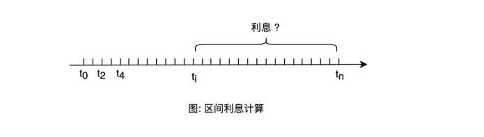
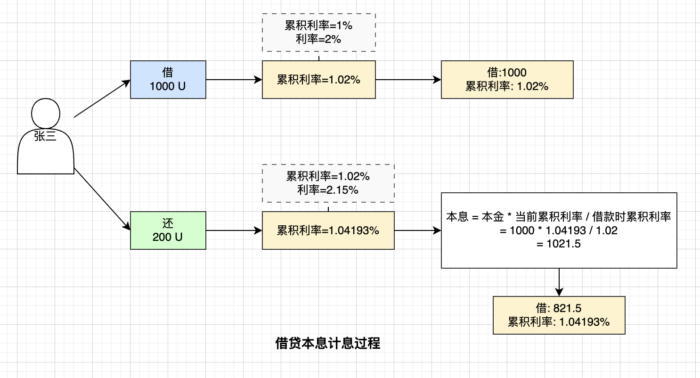

# 借贷协议如何计算利息

## 利息计算基础

### 什么是利息

**利息** 是借贷双方因暂时让渡资金的使用权所产生的代价。即：借款方为了使用他人的资金需要支付一定的费用，存款方因为让出资金的使用权而获得报酬。

### 存款利息

**存款利息** 是银行或借贷平台因使用客户存款而支付给客户的报酬。

**计算要素**：

- **本金** (P)：存款的初始金额
- **利率** (R)：平台承诺的年利率百分比
- **时间** (T)：存款的时间长度（通常以年为单位）

**基本公式**（单利）：

$$\text{存款利息} = \text{本金} \times \text{利率} \times \text{时间}$$

$$I = P \times R \times T$$

**例子**：存入 10,000 元，年利率 3%，存期 2 年
$$I = 10,000 \times 3\% \times 2 = 600 \text{ 元}$$

最终收益 = 10,000 + 600 = 10,600 元

---

### 贷款利息

**贷款利息** 是借款方因使用贷款人的资金而需支付的代价。

**计算要素**：

- **贷款额度** (P)：借入的初始金额
- **贷款利率** (R)：按约定的年利率百分比
- **贷款时间** (T)：借款的时间长度（通常以年为单位）

**基本公式**（单利）：

$$\text{贷款利息} = \text{贷款本金} \times \text{贷款利率} \times \text{贷款时间}$$

$$I = P \times R \times T$$

**例子**：借入 100,000 元，年利率 5%，借期 3 年
$$I = 100,000 \times 5\% \times 3 = 15,000 \text{ 元}$$

最终需还 = 100,000 + 15,000 = 115,000 元

---

### 单利 vs 复利

| 特性 | 单利 | 复利 |
|------|------|------|
| **定义** | 只按本金计算利息 | 利息本身也会产生利息 |
| **利息来源** | 仅来自本金 | 来自本金和已累计利息 |
| **增长速度** | 线性增长 | 指数级增长 |
| **金融产品** | 传统定期存款 | 借贷协议、投资产品 |
| **公式** | $A = P(1 + RT)$ | $A = P(1 + R)^T$ |

---

## 复利的深入理解

### 什么是复利

**复利** 是指将累积的利息与现有本金合并，以新的本金计算下期利息，俗称"利滚利"。

**例子**：以 10% 的月利率借 100 元，按复利计算：

- 第 1 个月：产生 10 元利息，本利和变为 110 元
- 第 2 个月：以 110 元为本金，产生 11 元利息，本利和变为 121 元
- 第 3 个月：以 121 元为本金，产生 12.1 元利息，本利和变为 133.1 元

与单利（每月只产生 10 元）相比，复利增速明显加快。

### 复利计算公式

**固定利率复利公式**：

设初始本金 $P$，年利率 $R$，时长 $T$ 年，每年复利次数 $N$，则到期复利金额为：

$$A = P \left(1+ \frac{R}{N}\right)^{NT}$$

若每年复利一次，公式简化为：

$$A = P(1+R)^{T}$$

**特点**：呈指数级增长，增速远快于单利。

---

## 浮动利率环境下的计息

在区块链借贷协议中，利率不是固定的，而是根据市场供需关系动态变化。因此采用递推公式计算：

$$A_{t+1} = A_t(1+R_{t+1})$$

其中：

- $A_{t+1}$：第 $t+1$ 时刻的复利额
- $A_t$：第 $t$ 时刻的复利额（新本金）
- $R_{t+1}$：第 $t$ 到 $t+1$ 时间段的区间利率

**推导结果**：

$$A_{t+1} = P(1+R_1)(1+R_2)(1+R_3)\cdots(1+R_{t+1})$$

---

## 区间利息计算

### 问题的提出



用户不一定从起点开始借款，可能在任意时刻 $t_i$ 借款，在 $t_n$ 时刻还款。如何计算本息？

假如七哥在 $t_i$ 时刻借走 500 万 U，在 $t_n$ 时刻还款时连本带息应还多少呢？

### 数学推导

根据浮动利率公式推导：

$$A = P \frac{(1+R_1)(1+R_2)(1+R_3)\cdots(1+R_{t+1})}{(1+R_1)(1+R_2)\cdots(1+R_{i-1})(1+R_i)}$$

$$A = P \frac{\mathcal{R}_{t+1}}{\mathcal{R}_{i}}$$

其中 $\mathcal{R}_{t+1} = (1+R_1)(1+R_2)\cdots(1+R_{t+1})$ 表示 $t+1$ 时的**累积利率**。

---

## 累积利率

### 问题：为什么需要累积利率？

在区块链借贷协议中存在一个**严重的计算效率问题**：

#### 笨办法 ❌（不可行）

如果为每个借款人单独存储和计算利息：

```
借款人数量：100万人
存储内容：每个人的借款金额、借款时间、当前利息
计算频率：每个交易触发时，都要遍历100万人进行计算
结果：计算量巨大，Gas费用天文数字！
```

**具体问题**：

- 智能合约执行成本（Gas）与计算量成正比
- 为100万人计算利息 = 执行100万次乘法 = 需要消耗巨额Gas
- 实际上这样做根本不可行，交易费用会高到无人使用

#### 聪明办法 ✅（累积利率）

使用单一的全局累积利率（BorrowIndex）：

```
存储内容：只维护一个数字（BorrowIndex）+ 每个人的借款金额和借款时的BorrowIndex
计算频率：每次交易只需更新一个BorrowIndex
结果：计算量恒定，无论多少借款人都是O(1)复杂度！
```

**优势对比**：

| 方案 | 存储量 | 计算量 | Gas消耗 | 可扩展性 |
|------|--------|--------|---------|---------|
| 笨办法 | O(n) | O(n) | 巨大 | ❌ 不可行 |
| 累积利率 | O(1) | O(1) | 固定 | ✅ 高效 |

其中 n = 借款人数量

### 累积利率的核心价值

**核心洞察**：
> "我们不需要为每个人单独计算，只要维护好一个全局的'增长倍数'（累积利率），就能通过简单的乘除法为任何人在任何时刻计算本息。"

**类比理解**：

- ❌ 笨办法 = 每个学生都有专门的记账员，每次交易都要手工更新
- ✅ 累积利率 = 只有一个总账，记录整个班级的"综合增长率"，任何时刻任何人的成绩都能通过这个增长率算出

### 关键好处

1. **计算效率高**
   - 无论多少借款人，计算时间恒定
   - 单次交易的计算复杂度：O(1)

2. **存储空间少**
   - 全局只需存储一个BorrowIndex
   - 每个借款人只需存储：本金金额 + 借款时的BorrowIndex（2个数据）
   - 不需要存储每笔交易的详细历史

3. **Gas费用低廉**
   - 计算量小 = Gas消耗少
   - 降低用户成本
   - 提高DeFi的可用性和竞争力

4. **实时准确**
   - 每次交易都触发计息
   - 利息累积完全准确
   - 无需等待周期性结算

5. **可扩展性强**
   - 支持大规模用户
   - 即使有100万、1000万用户也不影响效率
   - 这是DeFi能够广泛应用的基础

### 与传统金融的对比

| 维度 | 传统银行 | DeFi协议 |
|------|---------|---------|
| **计息方式** | 定期（每月/每季度） | 实时（每次交易） |
| **利率** | 固定 | 浮动 |
| **计算方法** | 中心化数据库查询 | 分布式智能合约 |
| **计算约束** | 没有约束 | 受限于Gas成本 |
| **解决方案** | 不需要优化 | 必须用累积利率！ |

**关键点**：传统金融没有"交易成本"问题，所以不需要这样优化。而区块链上每次计算都要消耗Gas，这就决定了DeFi必须采用累积利率这样的巧妙方案。

---

## 解决方案：累积利率

### 累积利率的定义

**累积利率** $\mathcal{R}_{t+1}$ 定义为从起始到当前时刻所有区间利率因子的乘积：

$$\mathcal{R}_{t+1} = (1+R_1)(1+R_2)(1+R_3)\cdots(1+R_{t+1})$$

### 区间本息计算公式

$$A = P \cdot \frac{\mathcal{R}_{t+1}}{\mathcal{R}_{i}}$$

其中：

- $P$：借款本金
- $\mathcal{R}_{i}$：借款时刻的累积利率
- $\mathcal{R}_{t+1}$：还款时刻的累积利率

**优势**：只需知道借款和还款两个时刻的累积利率，无需存储每个借款人的详细历史记录。

---

## Compound 协议计息方式

### 计息触发机制

每当有人进行以下操作时，都会触发一次计息：

- 存款
- 借款
- 还款
- 提现
- 清算

这样的设计使计息频次由市场活跃度决定，而非定时计息。

### 核心概念：BorrowIndex

在 Compound 中，累积利率被称为 **BorrowIndex**。

### 计息流程（简化代码）

```javascript
// https://github.com/compound-finance/comet/blob/main/contracts/Comet.sol#L419

function accrueInternal() internal {
    uint40 now_ = getNowInternal();
    uint timeElapsed = uint256(now_ - lastAccrualTime);
    
    if (timeElapsed > 0) {
        // 1. 计算新的累计利率
        (baseSupplyIndex, baseBorrowIndex) = accruedInterestIndices(timeElapsed);
        
        // 2. 更新奖励追踪指数
        if (totalSupplyBase >= baseMinForRewards) {
            trackingSupplyIndex += safe64(divBaseWei(
                baseTrackingSupplySpeed * timeElapsed, 
                totalSupplyBase
            ));
        }
        if (totalBorrowBase >= baseMinForRewards) {
            trackingBorrowIndex += safe64(divBaseWei(
                baseTrackingBorrowSpeed * timeElapsed, 
                totalBorrowBase
            ));
        }
        
        // 3. 更新时间戳
        lastAccrualTime = now_;
    }
}

// 指数计算
function accruedInterestIndices(uint timeElapsed) internal view returns (uint64, uint64) {
    uint64 baseSupplyIndex_ = baseSupplyIndex;
    uint64 baseBorrowIndex_ = baseBorrowIndex;
    
    if (timeElapsed > 0) {
        // 计算利用率
        uint utilization = getUtilization();
        
        // 根据利用率计算利率
        uint supplyRate = getSupplyRate(utilization);
        uint borrowRate = getBorrowRate(utilization);
        
        // 更新累计利率
        baseSupplyIndex_ += safe64(mulFactor(baseSupplyIndex_, supplyRate * timeElapsed));
        baseBorrowIndex_ += safe64(mulFactor(baseBorrowIndex_, borrowRate * timeElapsed));
    }
    
    return (baseSupplyIndex_, baseBorrowIndex_);
}
```

### 关键公式

**累积利率更新**：

$$\text{borrowIndex}_{new} = \text{borrowIndex}_{old} \times (1 + \text{borrowRate} \times \text{timeElapsed})$$

---

## 实际操作示例

### 场景描述



1. **张三第一次借款**：
   - 借出 1000 U
   - 累积利率从 1% 更新到 1.02%
   - 记录：本金 1000 U，累积利率 1.02%

2. **一小时后张三还款**：
   - 这一小时的借款利率：2.15%
   - 累积利率更新到：1.04193%
   - 张三的本息计算：$1000 \times \frac{1.04193}{1.02} = 1021.5 \text{ U}$
   - 张三还款 200 U
   - 更新张三的新借款本金：$1021.5 - 200 = 821.5 \text{ U}$

### 优势

Compound 通过这种方式：

- ✅ 只需维护一个全局的 BorrowIndex
- ✅ 无需为每个借款人单独计算和存储利息
- ✅ 可以实时准确追踪每位借款人的本息
- ✅ 大幅降低智能合约的计算成本

---

## 深度思考

1. **流动性与收益**：应该将资产存入高流动性还是低流动性的借贷协议中？
2. **收益优化**：有没有办法通过策略性借贷操作来提高自身收益？

---

## 核心要点总结

| 概念 | 说明 |
|------|------|
| **单利** | 只按本金计算利息，线性增长 |
| **复利** | 利息产生新利息，指数级增长 |
| **浮动利率** | 基于市场供需的动态利率 |
| **累积利率** | 所有历史区间利率因子的乘积 |
| **BorrowIndex** | Compound 中的累积利率 |
| **使用原因** | 降低计算成本，实现DeFi可扩展性 |
| **区间计息** | 只需借款和还款时刻的累积利率 |
| **触发机制** | 每次借贷活动都会执行一次计息 |
