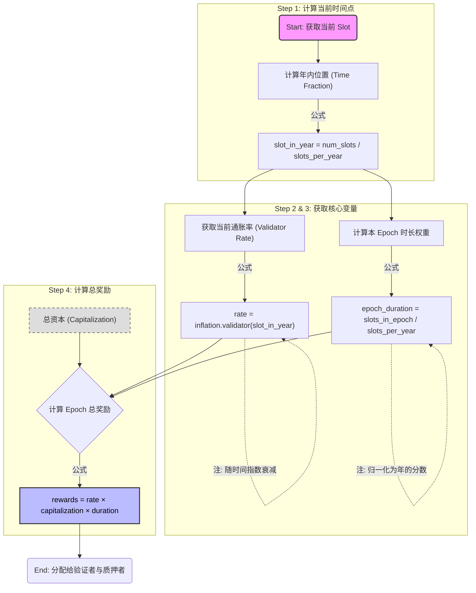
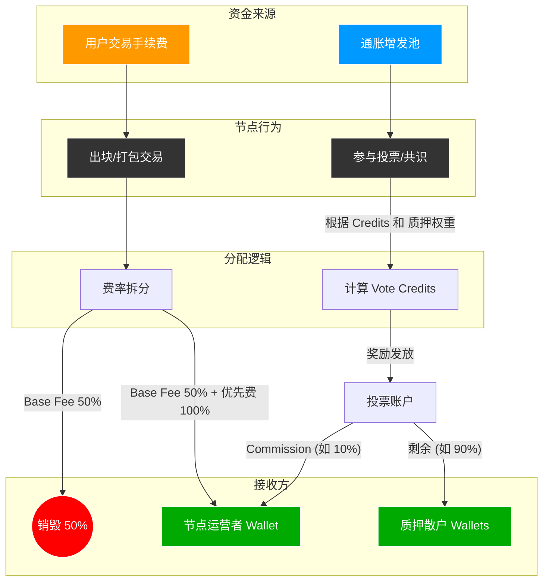

# SOLANA 经济模型

## 代币用途

## 供应机制

### 预先分配

创世分配: 5亿

### 当前供应

```shell
❯ solana supply --url https://api.mainnet-beta.solana.com

Total: 619177770.4652547 SOL
Circulating: 566068765.1470817 SOL
Non-Circulating: 53109005.31817291 SOL
```

### 通胀（供应）曲线

#### 通胀参数

```shell
pub struct Inflation {
    /// 初始通胀率百分比（从时间点 t=0 开始）
    /// 
    /// 这是网络启动时的通胀率，通常设置为较高的值以激励早期验证者。
    /// 默认值为 8% (0.08)
    pub initial: f64,

    /// 目标（终端）通胀率百分比（趋向于无穷大时间点）
    /// 
    /// 这是网络长期维持的通胀率下限，确保持续激励验证者。
    /// 默认值为 1.5% (0.015)
    pub terminal: f64,

    /// 年度通胀衰减率
    /// 
    /// 每年通胀率降低的速率，用于计算从初始通胀率逐步过渡到目标通胀率。
    /// 计算公式：inflation(year) == MAX(terminal, initial*((1-taper)^year))
    /// 默认值为 15% (0.15)，即每年通胀率按 85% 的速率递减
    pub taper: f64,

    /// 分配给基金会的通胀比例
    /// 
    /// 从总通胀中分配给基金会的百分比，用于支持网络开发和生态建设。
    /// 默认值为 5% (0.05)
    pub foundation: f64,
    
    /// 基金会通胀分配的持续期限（单位：年）
    /// 
    /// 基金会获得通胀分配的年限，超过此期限后，所有通胀奖励全部归验证者。
    /// 默认值为 7 年
    pub foundation_term: f64,
}
```

- 通胀曲线参数
  - initial
  - terminal
  - taper
  - foundation
  - foundation_term
  
  ```mermaid
  ```

- 指定年份的总通胀率

    ```python
    tapered = initial * (1 - taper)^year
    total = MAX(terminal, tapered)
    ```

    **注意：year为浮点数，实际计算的值为每个epoch的年份，精确到小数**

- 基金会通胀率
  - 如果 year < foundation_term：返回 total(year) * foundation
  - 如果 year >= foundation_term：返回 0.0

  ```python
  pub fn foundation(&self, year: f64) -> f64 {
        if year < self.foundation_term {
            self.total(year) * self.foundation
        } else {
            0.0
        }
    }
  ```

- 验证者通胀率
  - 验证者获得的通胀奖励 = 总通胀率 - 基金会分配

  ```python
  pub fn validator(&self, year: f64) -> f64 {
        self.total(year) - self.foundation(year)
    }
  ```

### 分配机制

### 委托分配机制

双轨佣金制是 Solana V4 投票状态引入的新特性（SIMD-0185 提案），将验证者的收益分为两个独立的轨道进行管理

**核心概念**
这两个佣金率都是给验证者/质押池运营者的，剩余部分才分配给委托者（Delegators）。

```
总收益 = 验证者佣金 + 委托者奖励

验证者佣金 = 总收益 × commission_bps / 10,000
委托者奖励 = 总收益 - 验证者佣金
```

```
┌─────────────────────────────────────────────────┐
│         验证者总收益                              │
├─────────────────────┬───────────────────────────┤
│   轨道 1: 通胀奖励   │   轨道 2: 区块收益         │
│  (Inflation Rewards)│  (Block Revenue)          │
├─────────────────────┼───────────────────────────┤
│ • 来源：网络通胀     │ • 来源：交易费用           │
│ • 可配置佣金率       │ • 可配置佣金率             │
│ • 独立接收账户       │ • 独立接收账户             │
└─────────────────────┴───────────────────────────┘
```

**默认配置**

```
pub fn new_with_defaults(vote_pubkey: &Pubkey, vote_init: &VoteInit, clock: &Clock) -> Self {
    Self {
        // 通胀奖励：转换旧佣金率（乘以100变为基点）
        inflation_rewards_commission_bps: (vote_init.commission as u16).saturating_mul(100),
        // 默认接收账户：投票账户本身
        inflation_rewards_collector: *vote_pubkey,
        
        // 区块收益：默认 100%（验证者全拿）
        block_revenue_commission_bps: 10_000,
        // 默认接收账户：验证者节点账户
        block_revenue_collector: vote_init.node_pubkey,
        
        // ... 其他字段
    }
}
```

## 燃烧机制

- 交易基础费用
- 交易优先级费用

## 矿工成本

```
┌─────────────────────────────────────────────────────────────┐
│              Epoch 通胀利率计算流程                          │
├─────────────────────────────────────────────────────────────┤
│                                                              │
│  1. 计算年内位置                                             │
│     slot_in_year = num_slots / slots_per_year               │
│     ↓                                                        │
│  2. 获取通胀率                                               │
│     validator_rate = inflation.validator(slot_in_year)      │
│     (动态计算，随时间递减)                                   │
│     ↓                                                        │
│  3. 计算epoch时长                                            │
│     epoch_duration = slots_in_epoch / slots_per_year        │
│     ↓                                                        │
│  4. 计算epoch奖励                                            │
│     rewards = validator_rate × capitalization ×             │
│               epoch_duration_in_years                       │
│                                                              │
└─────────────────────────────────────────────────────────────┘
```

```
┌─────────────────────────────────────────────────────────┐
│          Epoch 917 通胀率计算流程                        │
├─────────────────────────────────────────────────────────┤
│                                                          │
│  1. 获取通胀启动以来的时间                               │
│     num_slots = get_inflation_num_slots()               │
│     ↓                                                    │
│  2. 计算年数                                             │
│     years = num_slots / slots_per_year                  │
│     ≈ 5.83 years (自 2020-03 至 2026-01)               │
│     ↓                                                    │
│  3. 应用递减公式                                         │
│     rate = 8.00% × (0.85)^5.83                         │
│     = 8.00% × 0.5049                                   │
│     = 4.04%                                            │
│     ↓                                                    │
│  4. 确保不低于终端通胀率                                 │
│     final_rate = max(4.04%, 1.50%)                     │
│     = 4.04%                                            │
│                                                          │
└─────────────────────────────────────────────────────────┘
```

```
Step 1: 基础单位 (Slot)
Ticks per Slot: 64
Tick Duration: 0.00625s (6.25ms)
Slot Duration: 
64×0.00625=0.4s (400ms)

Step 2: 年度容量 (Year Capacity)
Seconds per Year: 31,557,600
Slots per Year: 
31,557,600/0.4=78,894,000 Slots

Step 3: 纪元换算 (Epoch Conversion)
Slots per Epoch: 432,000 (标准值)
Epochs per Year: 
78,894,000/432,000=182.625 Epochs
```



## SOL分配通胀奖励

重点：

Solana 的奖励机制将**通胀奖励 (Inflation)** 和 **执行收入 (Transaction Fees)** 区分得非常清楚。

简单来说：

通胀增发的 SOL：只分配给验证/投票行为（Staking Rewards）。
交易手续费 SOL：分配给出块/打包行为（Block Rewards）。

### 1. 资金来源的“双轨制”

| 奖励类型 | 来源 | 分配对象 | 依据 |  
| :--- | :--- | :--- | :--- |  
| **通胀奖励** | 协议自动增发 (如前述 4.04%) | **投票节点 (Validators)** & **质押者 (Stakers)** | **投票积分 (Credits)** & 质押权重 |  
| **区块奖励** | 用户支付的手续费 (Fees) | **出块节点 (Leaders)** | **当前 Slot 的领导权** |  

### 2. 通胀奖励分配逻辑

你计算出的那个巨大的通胀金额（例如一个 Epoch 增发 40,000 SOL），是完全基于“投票表现”分配的。

1. 积分计算 (Credits)：
验证节点每成功对一个 Block 投出一张“有效票”，就会获得 1 个 Credit。

   - 理想情况下，一个 Epoch 有 432,000 个 Slot，节点最多能投 432,000 票。
   - 如果节点离线或分叉，Credits 会变少。

1. 份额计算 (Point Value)：
系统计算全网所有节点的 (质押量 × Credits) 之和，算出每一点 Credit 对应多少 SOL。

1. 分配 (Distribution)：
通胀奖励直接打入每个验证者的 Vote Account (投票账户)。

    ```
    ValidatorReward=TotalInflation×
    (TotalStake×TotalCredits)/
    (ValidatorStake×ValidatorCredits)
    ```

1. 佣金切分 (Commission Split)：
钱进入 Vote Account 后，根据节点设置的佣金比例（Commission，例如 10%）自动分账：
节点运营者 (Operator): 拿走 10%。
质押者 (Delegators): 拿走剩余 90%，按质押比例分配。

### 3. 区块奖励分配逻辑 (手续费)

这是出块节点 (Leader) 独享的收入。

当轮到某个节点当 Leader（出块）时，它打包了该 Slot 内的所有交易。

1. 基础费 (Base Fee)：

   - 每笔签名 5000 Lamports。
   - 50% 销毁 (Burn)。
   - 50% 给 Leader。

2. 优先费 (Priority Fee)：
用户为了加速交易额外付的钱（Compute Budget）。
100% 给 Leader (全额归出块者)。

### 4. 资金流向



## 投票基于发送交易的理念

| 特性 | 传统 BFT (如 Cosmos) | Solana |  
| :--- | :--- | :--- |  
| **投票形式** | P2P 临时消息 (Ephemeral) | **持久化交易 (Persistent Tx)** |  
| **成本** | 免费 | **付费 (Gas Fee)** |  
| **存储** | 通常不存入区块体，只存聚合签名 | **每一票都完整存入区块历史** |  
| **优点** | 不占用账本空间，账本很小 | 极度安全，抗垃圾攻击，逻辑简单 |  
| **缺点** | 容易遭受消息泛滥攻击 | **账本极度膨胀** (数据爆炸) |  
