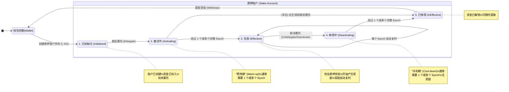

# SOLANA Token Economics

## 一、总览

## 二、供应概览

### 供应现状

```bash
❯ solana supply --url https://api.mainnet-beta.solana.com

Total: 619313003.637571 SOL
Circulating: 566189820.7461011 SOL
Non-Circulating: 53123182.8914698 SOL
```

### 创世分配

Solana 在创世区块（Genesis Block）时创建了 **500,000,000 SOL**（5亿 SOL）的初始供应量。

<https://github.com/anza-xyz/agave/blob/55a8987b420fffdf67272d0c33ff4670c727dc6e/genesis/src/genesis_accounts.rs#L4>

**创世时的 5亿 SOL 分配给**：

1. **创始人团队**（Creator Stakers）
   - 多个账户，总计约 50M+ SOL
   - 解锁计划：50% 在 9 个月后，剩余 50% 在 2 年内月度解锁

2. **基金会**（Foundation）
   - 用于生态系统发展
   - 立即解锁

3. **社区和奖励**（Community Pool - "one thanks"）
   - 剩余的所有 SOL
   - 用于未来的奖励分发

4. **服务提供商**（Service Providers）
   - 早期贡献者
   - 解锁计划：100% 在 9 个月后

----

## 三、通胀模型

**源码定义**

```shell
pub struct Inflation {
    /// 初始通胀率百分比（从时间点 t=0 开始）
    ///
    /// 这是网络启动时的通胀率，通常设置为较高的值以激励早期验证者。
    /// 默认值为 8% (0.08)
    pub initial: f64,

    /// 目标（终端）通胀率百分比（趋向于无穷大时间点）
    ///
    /// 这是网络长期维持的通胀率下限，确保持续激励验证者。
    /// 默认值为 1.5% (0.015)
    pub terminal: f64,

    /// 年度通胀衰减率
    ///
    /// 每年通胀率降低的速率，用于计算从初始通胀率逐步过渡到目标通胀率。
    /// 计算公式：inflation(year) == MAX(terminal, initial*((1-taper)^year))
    /// 默认值为 15% (0.15)，即每年通胀率按 85% 的速率递减
    pub taper: f64,

    /// 分配给基金会的通胀比例
    ///
    /// 从总通胀中分配给基金会的百分比，用于支持网络开发和生态建设。
    /// 默认值为 5% (0.05)
    pub foundation: f64,

    /// 基金会通胀分配的持续期限（单位：年）
    ///
    /// 基金会获得通胀分配的年限，超过此期限后，所有通胀奖励全部归验证者。
    /// 默认值为 7 年
    pub foundation_term: f64,
}
```

通胀参数定义了两组内容：

- 通胀模型曲线
- 质押者与基金会奖励分配比例

### 通胀曲线

**通胀模型**：Solana 使用**递减通胀模型**（Disinflationary Model）

```shell
┌──────────────────────────────────────────────────────┐
│           通胀曲线                              │
├──────────────────────────────────────────────────────┤
│                                                        │
│  通胀率 (%)                                            │
│    ↑                                                   │
│  8%│●                                                  │
│    │  ●                                                │
│    │    ●●                                             │
│  4%│       ●●●                                         │
│    │          ●●●●                                     │
│  2%│              ●●●●●●                              │
│    │                    ●●●●●●●●●──────────────      │
│  1.5%                              终端通胀率          │
│    │                                                   │
│  0%└────────────────────────────────────────→ 时间    │
│      Year 1  Year 2  Year 3  ... Year 10+            │
└──────────────────────────────────────────────────────┘

初始通胀率: 8%
年递减速率:  -15% 
长期通胀率: 1.5% (终端稳定率)
```

**实时通胀率计算公式**

```text
Iₜ=max(I₀×(1−r)ᵗ, Iₑ)
```

其中:

- Iₜ : 第 t 年的通胀率.
- I₀ : 初始通胀率(8%)
- Iₑ : 目标通胀率(1.5%)
- r : 年度递减率(15%)
- t : 时间(以年为单位, 从通胀机制启动(2020年3月，epoch为150)开始计算), 本身是浮点数，实际计算的值为每个epoch的年份

通胀分配:

- 基金会
  - 如果 year < foundation_term：返回 total(year) * foundation
  - 如果 year >= foundation_term：返回 0.0

  ```rust
  pub fn foundation(&self, year: f64) -> f64 {
        if year < self.foundation_term {
            self.total(year) * self.foundation
        } else {
            0.0
        }
    }
  ```

- 验证者
  - 验证者获得的通胀奖励 = 总通胀率 - 基金会分配

  ```rust
  pub fn validator(&self, year: f64) -> f64 {
        self.total(year) - self.foundation(year)
    }
  ```

**实时通胀参数查看**

```bash
❯ solana inflation --url https://api.mainnet-beta.solana.com

Inflation Governor:
Initial rate:             8.00%
Terminal rate:            1.50%
Rate reduction per year: 15.00%
* Rate reduction is derived using the target slot time in genesis config

Inflation for Epoch 918:
Total rate:               4.04%
Staking rate:             4.04%
```

**通胀奖励分配**

```rust
// 每个 epoch 新增的代币
new_tokens_per_epoch = validator_rate × total_supply × epoch_duration_in_years

// 分配给:
// 1. 验证者和质押者 (约 95%)
validator_rewards = validator_rate × total_supply × epoch_duration

// 2. 基金会 (约 5%，逐年递减直至为 0)
foundation_rewards = foundation_rate × total_supply × epoch_duration
```

**通胀对总供应量的影响**：

```bash
Year 1: 500M × (1 + 8%) = 540M SOL
Year 2: 540M × (1 + 8% × 0.85) = 576.7M SOL  (递减 15%)
Year 3: 576.7M × (1 + 8% × 0.85 × 0.85) = 610.1M SOL  (递减 15%)
...
Year 10+: 稳定在 ~1.5% 年通胀
```

### 验证者奖励机制

Solana 的验证者奖励系统基于**通胀模型 + 质押权重 + 投票参与**的机制，确保奖励分配的公平性和激励验证者的积极参与。

```text
Epoch 开始
    ↓
┌──────────────────────────────────────────────┐
│ 阶段 1: 验证者投票赚取 Credits                │
├──────────────────────────────────────────────┤
│ - 验证者对每个 slot 投票                      │
│ - 根据投票延迟获得 credits                    │
│ - credits 累积在 VoteState 中                │
└──────────────────────────────────────────────┘
    ↓
┌──────────────────────────────────────────────┐
│ 阶段 2: Epoch 结束，计算总奖励池              │
├──────────────────────────────────────────────┤
│ 1. 获取网络参数                               │
│    - capitalization（总供应量）              │
│    - validator_rate（验证者通胀率）          │
│    - epoch_duration_in_years                 │
│                                               │
│ 2. 计算 Epoch 总奖励                         │
│    total_rewards = validator_rate ×          │
│                    capitalization ×          │
│                    epoch_duration_in_years            │
└──────────────────────────────────────────────┘
    ↓
┌──────────────────────────────────────────────┐
│ 阶段 3: 计算每个质押者的积分                  │
├──────────────────────────────────────────────┤
│ For 每个 Stake Account:                      │
│   1. 获取质押金额（考虑预热Warmup/冷却Cooldown）            │
│   2. 获取验证者的 earned_credits             │
│   3. 计算积分:                                │
│      points = stake_amount × earned_credits  │
└──────────────────────────────────────────────┘
    ↓
┌──────────────────────────────────────────────┐
│ 阶段 4: 计算 Point Value                      │
├──────────────────────────────────────────────┤
│ 1. 汇总全网总积分 (total_points)             │
│ 2. 计算积分价值:                              │
│    point_value = total_rewards / total_points│
└──────────────────────────────────────────────┘
    ↓
┌──────────────────────────────────────────────┐
│ 阶段 5: 计算个人奖励                          │
├──────────────────────────────────────────────┤
│ For 每个质押者:                               │
│   1. 计算总奖励:                              │
│      rewards = points × point_value          │
│                                               │
│   2. 按佣金率分割:                            │
│      voter_rewards = rewards × commission    │
│      staker_rewards = rewards × (1-commission)│
└──────────────────────────────────────────────┘
    ↓
┌──────────────────────────────────────────────┐
│ 阶段 6: 分发奖励                              │
├──────────────────────────────────────────────┤
│ 1. 投票者奖励 → Vote Account                 │
│ 2. 质押者奖励 → Stake Account                │
│ 3. 更新 credits_observed                     │
└──────────────────────────────────────────────┘
    ↓
Epoch 结束
```

核心概念:

#### 1. Vote Credits（投票积分）

- **定义**：验证者通过正确投票获得的积分
- **获取条件**：
  - 对 slot 正确投票
  - 投票达到最大锁定期
  - 基于投票延迟获得不同数量的 credits

**及时投票积分（Timely Vote Credits）**：

```
延迟 (latency) = 投票 slot - 被投票的 slot
宽限期 (grace_period) = 2 slots
最大积分 (max_credits) = 16

获得的 credits = 
  if latency ≤ grace_period:
      16 credits (最大奖励)
  else:
      max(1, 16 - (latency - grace_period))
```

| 投票延迟 | 获得积分 | 说明 |
|---------|---------|------|
| 1-2 slots | 16 | 最快投票，最大奖励 |
| 3 slots | 15 | 开始衰减 |
| 5 slots | 13 | 持续衰减 |
| 10 slots | 8 | 奖励减半 |
| 18+ slots | 1 | 最低保底 |

#### 2. Points（积分）

- **定义**：质押者的奖励权重单位
- **计算公式**：

  ```
  points = stake_amount × earned_credits
  ```

- **作用**：确定质押者在奖励池中的份额

#### 3. Point Value（积分价值）

- **定义**：每个积分对应的 lamports 数量
- **计算公式**：

  ```
  point_value = epoch_total_rewards / network_total_points
  ```

- **特性**：
  - 网络参与度高 → 总积分多 → point_value 低
  - 网络参与度低 → 总积分少 → point_value 高
  - 自动平衡机制，激励参与

### 2.3 通胀模型

----

## 四、交易费用与燃烧机制

```text
┌─────────────────────────────────────────────┐
│          交易费用 (Transaction Fee)          │
├─────────────────────────────────────────────┤
│                                              │
│  基础费用 (Base Fee)                         │
│    ├─ 50% → 🔥 销毁 (Burn)                  │
│    └─ 50% → Leader 奖励                     │
│                                              │
│  优先费用 (Priority Fee)                     │
│    └─ 100% → Leader 奖励                    │
│                                              │
└─────────────────────────────────────────────┘

公式:
burned_amount = base_fee × 50%
leader_reward = base_fee × 50% + priority_fee
```

**费用跟踪**
<https://solscan.io/analysis/fee_tracker>
<https://solanacompass.com/statistics/fees>

### 总结

Solana 的验证者奖励机制是一个精心设计的系统，通过：

1. **通胀模型** - 提供可预测的奖励来源
2. **积分系统** - 确保公平的权重分配
3. **及时投票激励** - 提高网络活性和安全性
4. **佣金机制** - 平衡验证者和质押者利益
5. **预热/冷却** - 防止质押突变导致的网络不稳定

----

## 五、MEV费用

----

## 六、质押

----

### 关键特性

✅ **按比例分配**：保证所有用户公平地按比例激活质押  
✅ **平滑激活**：避免大量质押突然激活对网络造成冲击  
✅ **最小激活量**：每个 epoch 至少激活 1 lamport  

这个设计确保 Solana 网络中质押激活的去中心化和稳定性！

### 状态转换



## 核心流程

### 1. **激活速率常量**

- **旧速率**：25% - 每个 epoch 最多激活上一 epoch 有效质押的 25%
- **新速率**：9% - 每个 epoch 最多激活上一 epoch 有效质押的 9%

### 2. **份额计算逻辑**

**计算步骤：**

1. **计算用户权重（weight）**：

   ```bash
   weight = 用户剩余待激活质押 / 全网正在激活的质押总量
   ```

2. **计算该 epoch 全网新增有效质押**：

   ```bash
   newly_effective_cluster_stake = 上一 epoch 有效质押 × warmup_rate (25% 或 9%)
   ```

3. **计算用户该 epoch 可激活的份额**：

   ```bash
   newly_effective_stake = weight × newly_effective_cluster_stake
   ```

   最小值为 1 lamport

4. **累加更新**：

   ```rust
   current_effective_stake += newly_effective_stake
   ```

---

## 示例

### 📊 初始状态

**全网状态（Epoch 100）：**

- 有效质押（effective）：1,000,000 SOL
- 正在激活的质押（activating）：100,000 SOL
- 正在取消的质押（deactivating）：0 SOL

**用户 Alice：**

- 在 Epoch 100 开始质押委托
- 委托金额：10,000 SOL
- 激活速率：25%（使用旧速率）

### 🔄 逐 Epoch 计算过程

---

#### **Epoch 100（激活 epoch）**

- **Alice 状态**：
  - 当前有效质押：0 SOL
  - 正在激活：10,000 SOL
  - Alice 占全网激活比例：**10,000 / 100,000 = 10%**

---

#### **Epoch 101**

**步骤 1：计算 Alice 的权重**

```rust
remaining_activating_stake = 10,000 - 0 = 10,000 SOL
weight = 10,000 / 100,000 = 0.1 (10%)
```

**步骤 2：计算全网新增有效质押**

```rust
newly_effective_cluster_stake = 1,000,000 × 0.25 = 250,000 SOL
```

**步骤 3：计算 Alice 可激活的份额**

```rust
newly_effective_stake = 0.1 × 250,000 = 25,000 SOL
```

**但是**，Alice 总共只委托了 10,000 SOL！

所以实际激活：**min(25,000, 10,000) = 10,000 SOL**

- **Alice 状态**：
  - ✅ 当前有效质押：**10,000 SOL**（完全激活！）
  - 正在激活：0 SOL

---

### 📈 更复杂的例子

现在让我们看一个需要多个 epoch 才能完全激活的例子：

#### **Epoch 200 初始状态：**

**全网状态：**

- 有效质押：10,000,000 SOL
- 正在激活：1,000,000 SOL

**用户 Bob：**

- 委托金额：**100,000 SOL**
- 激活速率：**9%**（使用新速率）

---

#### **Epoch 201**

```rust
// Bob 的权重
weight = 100,000 / 1,000,000 = 0.1 (10%)

// 全网新增有效质押
newly_effective_cluster_stake = 10,000,000 × 0.09 = 900,000 SOL

// Bob 可激活的份额
newly_effective_stake = 0.1 × 900,000 = 90,000 SOL
```

- **Bob 状态**：
  - 有效质押：**90,000 SOL**
  - 剩余待激活：10,000 SOL

---

#### **Epoch 202**

假设全网状态更新为：

- 有效质押：10,900,000 SOL（增加了 900,000）
- 正在激活：110,000 SOL（只剩 Bob 的 10,000 + 其他人的）

```rust
// Bob 的权重（基于剩余待激活）
remaining = 100,000 - 90,000 = 10,000 SOL
weight = 10,000 / 110,000 = 0.0909 (约 9.09%)

// 全网新增有效质押
newly_effective_cluster_stake = 10,900,000 × 0.09 = 981,000 SOL

// Bob 可激活的份额
newly_effective_stake = 0.0909 × 981,000 ≈ 89,173 SOL
```

但 Bob 只剩 10,000 SOL 需要激活，所以：

- **Bob 状态**：
  - ✅ 有效质押：**100,000 SOL**（完全激活！）
  - 剩余待激活：0 SOL

---

### 📊 对比表格

| Epoch | Bob 有效质押 | Bob 待激活 | 激活百分比 |
|-------|-------------|-----------|----------|
| 200   | 0 SOL       | 100,000   | 0%       |
| 201   | 90,000 SOL  | 10,000    | 90%      |
| 202   | 100,000 SOL | 0         | 100% ✅  |

---

### 🔑 关键要点

1. **权重动态变化**：每个 epoch，用户的权重会根据剩余待激活金额和全网激活总量重新计算

2. **不保证固定时间**：激活速度取决于：
   - 全网有效质押的规模
   - 同时激活的质押总量
   - 采用的速率（25% 或 9%）

3. **至少激活 1 lamport**：即使计算结果很小，每个 epoch 也会至少激活 1 lamport

4. **速率差异影响巨大**：
   - 25% 速率：通常 2-5 个 epoch 完全激活
   - 9% 速率：通常需要更多 epoch

5. **按比例公平分配**：所有用户按照各自待激活金额的比例，公平地从全网新增有效质押中分配份额

这就是 Solana 质押激活的实际计算过程！

## 状态转换图

```text
                        Solana 质押账户状态转换图
                     ================================

┌─────────────────────────────────────────────────────────────────┐
│                                                                 │
│  ① Uninitialized (未初始化)                                     │
│  ━━━━━━━━━━━━━━━━━━━━━━━━━━━━━━━━━━━━━━━━━━━━━━━━━━━━━━━━━━━│
│  状态: 账户刚创建，未分配任何数据                                │
│  余额: 任意 SOL (未质押)                                         │
│  操作: 无                                                        │
│                                                                 │
└─────────────────────────────────────────────────────────────────┘
                              │
                              │ StakeInstruction::Initialize
                              │ (设置授权者和锁定信息)
                              ↓
┌─────────────────────────────────────────────────────────────────┐
│                                                                 │
│  ② Initialized (已初始化，未委托)                               │
│  ━━━━━━━━━━━━━━━━━━━━━━━━━━━━━━━━━━━━━━━━━━━━━━━━━━━━━━━━━━━│
│  状态: 账户已初始化，但未委托给任何验证者                        │
│  余额: 已存入 SOL                                               │
│  操作: ❌ 不获得奖励  ❌ 不承担风险  ⚠️ 部分可提取              │
│                                                                 │
└─────────────────────────────────────────────────────────────────┘
                              │
                              │ StakeInstruction::DelegateStake
                              │ (选择验证者，开始委托)
                              ↓
┌─────────────────────────────────────────────────────────────────┐
│                                                                 │
│  ③ Stake - Activating (预热期 / 激活中)                        │
│  ━━━━━━━━━━━━━━━━━━━━━━━━━━━━━━━━━━━━━━━━━━━━━━━━━━━━━━━━━━━│
│  状态: 质押正在逐步激活                                         │
│  分解:                                                          │
│    ├─ effective (有效部分):    [逐步增加]                       │
│    │    ✅ 获得奖励  ✅ 承担惩罚风险  ❌ 不可提取               │
│    └─ activating (激活中):     [逐步减少]                       │
│         ❌ 不获得奖励  ❌ 不承担风险  ❌ 不可提取               │
│                                                                 │
│  预热率: 默认 25% per epoch (新特性: 9%)                        │
│  示例 (1000 SOL, 25% 率):                                      │
│    Epoch N+0: effective=0,    activating=1000                   │
│    Epoch N+1: effective=250,  activating=750                    │
│    Epoch N+2: effective=625,  activating=375                    │
│    Epoch N+3: effective=1000, activating=0   ← 完全激活        │
│                                                                 │
└─────────────────────────────────────────────────────────────────┘
                              │
                              │ 每个 Epoch 边界
                              │ (自动计算，逐步激活)
                              ↓
┌─────────────────────────────────────────────────────────────────┐
│                                                                 │
│  ④ Stake - Fully Active (完全激活)                             │
│  ━━━━━━━━━━━━━━━━━━━━━━━━━━━━━━━━━━━━━━━━━━━━━━━━━━━━━━━━━━━│
│  状态: 质押完全生效                                             │
│  分解:                                                          │
│    └─ effective (100% 有效):                                    │
│         ✅ 获得全额奖励                                         │
│         ✅ 承担全部惩罚风险                                     │
│         ❌ 不可提取 (奖励自动复投)                              │
│                                                                 │
│  特点:                                                          │
│    • 每个 epoch 获得奖励                                        │
│    • 奖励自动添加到 stake 中 (复利)                            │
│    • 参与共识投票                                               │
│    • 可以随时发起 Deactivate                                   │
│                                                                 │
└─────────────────────────────────────────────────────────────────┘
         │                                       ↑
         │                                       │
         │ StakeInstruction::Deactivate          │ StakeInstruction::DelegateStake
         │ (发起停用)                            │ (重新委托，从完全停用)
         ↓                                       │
┌─────────────────────────────────────────────────────────────────┐
│                                                                 │
│  ⑤ Stake - Deactivating (冷却期 / 停用中)                      │
│  ━━━━━━━━━━━━━━━━━━━━━━━━━━━━━━━━━━━━━━━━━━━━━━━━━━━━━━━━━━━│
│  状态: 质押正在逐步停用                                         │
│  分解:                                                          │
│    ├─ effective (有效部分):    [逐步减少]                       │
│    │    ✅ 继续获得奖励  ✅ 继续承担惩罚风险  ❌ 不可提取       │
│    └─ deactivating (停用中):   [逐步增加]                       │
│         ❌ 不获得奖励  ❌ 不承担风险  ✅ 可以提取               │
│                                                                 │
│  冷却率: 默认 25% per epoch (新特性: 9%)                        │
│  示例 (1000 SOL, 25% 率):                                      │
│    Epoch M+0: effective=1000, deactivating=0                    │
│    Epoch M+1: effective=750,  deactivating=250                  │
│    Epoch M+2: effective=375,  deactivating=625                  │
│    Epoch M+3: effective=0,    deactivating=1000  ← 完全停用    │
│                                                                 │
└─────────────────────────────────────────────────────────────────┘
                              │
                              │ 每个 Epoch 边界
                              │ (自动计算，逐步停用)
                              ↓
┌─────────────────────────────────────────────────────────────────┐
│                                                                 │
│  ⑥ Fully Deactivated (完全停用)                                │
│  ━━━━━━━━━━━━━━━━━━━━━━━━━━━━━━━━━━━━━━━━━━━━━━━━━━━━━━━━━━━│
│  状态: 质押完全停用，可自由操作                                 │
│  分解:                                                          │
│    └─ deactivating (100% 可提取):                              │
│         ❌ 不获得奖励                                           │
│         ❌ 不承担惩罚风险                                       │
│         ✅ 全部可提取                                           │
│                                                                 │
│  可选操作:                                                      │
│    1. Withdraw       → 提取到钱包 → (关闭或 Initialized)       │
│    2. DelegateStake  → 重新委托 → 返回 Activating ③           │
│    3. Split          → 分割账户                                │
│    4. Merge          → 合并账户                                │
│                                                                 │
└─────────────────────────────────────────────────────────────────┘
         │
         │ StakeInstruction::Withdraw
         │ (提取 SOL)
         ↓
┌─────────────────────────────────────────────────────────────────┐
│                                                                 │
│  ⑦ Closed / Back to Initialized                                │
│  ━━━━━━━━━━━━━━━━━━━━━━━━━━━━━━━━━━━━━━━━━━━━━━━━━━━━━━━━━━━│
│  • 提取全部余额 → 账户关闭                                     │
│  • 提取部分余额 → 返回 Initialized 状态 ②                      │
│                                                                 │
└─────────────────────────────────────────────────────────────────┘
```

| 状态 | 有效质押 | 激活中 | 停用中 | 获得奖励 | 惩罚风险 | 可提取 |
|------|----------|--------|--------|----------|----------|--------|
| ① Uninitialized | - | - | - | ❌ | ❌ | - |
| ② Initialized | - | - | - | ❌ | ❌ | ⚠️ 部分 |
| ③ Activating | ✅ 部分 | ✅ 部分 | - | ⚠️ 部分 | ⚠️ 部分 | ❌ |
| ④ Fully Active | ✅ 100% | - | - | ✅ 100% | ✅ 100% | ❌ |
| ⑤ Deactivating | ✅ 部分 | - | ✅ 部分 | ⚠️ 部分 | ⚠️ 部分 | ⚠️ 部分 |
| ⑥ Fully Deactivated | - | - | ✅ 100% | ❌ | ❌ | ✅ 100% |

## 附录

<https://solscan.io/>
<https://solanacompass.com/>
