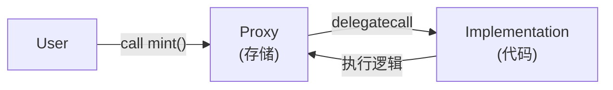

# Solidity 可升级合约学习笔记  
**Transparent Proxy & UUPS（EIP-1822）**

---

## 1. 为什么需要可升级合约？

以太坊合约一旦部署：

- ❌ 代码不可修改
- ✅ 状态永久存在

但真实业务中需要：
- 修复 Bug
- 增加功能
- 优化 Gas
- 升级治理逻辑

✅ **代理模式（Proxy Pattern）** 解决了这个问题。

---

## 2. Proxy 模式核心原理

### 2.1 一句话理解

> **代码在实现合约，数据在代理合约**

---

### 2.2 delegatecall 的作用

- 使用 **实现合约的代码**
- 操作 **代理合约的存储**
- `msg.sender` / `msg.value` 不变

```text
User → Proxy → delegatecall → Implementation
```

---

### 2.3 delegatecall 执行示意



---

## 3. 存储布局（Storage Layout）规则

### 3.1 核心铁律

✅ **只能追加变量**  
❌ **不能删除、重排、改类型**

---

### 3.2 错误示例（灾难级）

```solidity
// V1
uint256 a; // slot 0
uint256 b; // slot 1

// ❌ V2（错误）
uint256 b; // slot 0
uint256 a; // slot 1
```

👉 结果：数据错位，永久不可恢复。

---

### 3.3 正确示例

```solidity
// ✅ V2
uint256 a; // slot 0
uint256 b; // slot 1
uint256 c; // slot 2（新增）
```

---

## 4. Transparent Proxy（透明代理）

### 4.1 架构

```text
User
 │
 ▼
TransparentUpgradeableProxy
 │ delegatecall
 ▼
Implementation（无升级代码）
```

---

### 4.2 特点

✅ 升级逻辑在 **Proxy**  
✅ 实现合约非常干净  
✅ 升级不易出错  

❌ Proxy 稍复杂  
❌ 灵活性较低  

---

### 4.3 稳定币 V1（Transparent Proxy）

```solidity
contract StableUSD_V1 {
    string public name;
    string public symbol;
    uint8 public decimals;

    uint256 public totalSupply;
    address public owner;

    mapping(address => uint256) balances;

    function initialize(address _owner) external {
        require(owner == address(0), "initialized");
        name = "Stable USD";
        symbol = "sUSD";
        decimals = 18;
        owner = _owner;
    }

    modifier onlyOwner() {
        require(msg.sender == owner, "not owner");
        _;
    }

    function mint(address to, uint256 amount) external onlyOwner {
        balances[to] += amount;
        totalSupply += amount;
    }

    function burn(address from, uint256 amount) external onlyOwner {
        balances[from] -= amount;
        totalSupply -= amount;
    }
}
```

---

### 4.4 V2 升级（新增 Pause）

```solidity
// ✅ 新增变量只能追加
bool public paused; // 新 slot

modifier whenNotPaused() {
    require(!paused, "paused");
    _;
}
```

升级方式：

```text
ProxyAdmin.upgrade(proxy, newImplementation)
```

---

## 5. UUPS（EIP-1822）

### 5.1 架构

```text
User
 │
 ▼
ERC1967Proxy（极简）
 │ delegatecall
 ▼
Implementation（包含升级逻辑）
```

---

### 5.2 特点

✅ Proxy 极简  
✅ Gas 更低  
✅ 升级权限高度灵活  

❌ 极易因人为错误锁死升级  
❌ 对开发者要求高  

---

### 5.3 稳定币 V1（UUPS）

```solidity
contract StableUSD_UUPS_V1 is
    Initializable,
    UUPSUpgradeable,
    OwnableUpgradeable
{
    string public name;
    string public symbol;
    uint8 public decimals;

    uint256 public totalSupply;
    mapping(address => uint256) balances;

    /// 禁止实现合约被初始化
    constructor() {
        _disableInitializers();
    }

    function initialize(address owner) public initializer {
        __Ownable_init(owner);
        __UUPSUpgradeable_init();

        name = "Stable USD";
        symbol = "sUSD";
        decimals = 18;
    }

    function mint(address to, uint256 amount) external onlyOwner {
        balances[to] += amount;
        totalSupply += amount;
    }

    function burn(address from, uint256 amount) external onlyOwner {
        balances[from] -= amount;
        totalSupply -= amount;
    }

    function _authorizeUpgrade(address)
        internal
        override
        onlyOwner
    {}
}
```

---

### 5.4 V2 升级（新增 Pause）

```solidity
contract StableUSD_UUPS_V2 is StableUSD_UUPS_V1 {
    bool public paused;

    modifier whenNotPaused() {
        require(!paused, "paused");
        _;
    }

    function pause() external onlyOwner {
        paused = true;
    }

    function unpause() external onlyOwner {
        paused = false;
    }

    function _authorizeUpgrade(address)
        internal
        override
        onlyOwner
    {}
}
```

升级方式：

```solidity
StableUSD(proxy).upgradeTo(newImplementation);
```

⚠️ **V2 若忘记 `_authorizeUpgrade` → 永久不可升级**

---

## 6. delegatecall 存储真实效果

### 6.1 执行 mint 后的存储

```text
Proxy Storage
--------------------------------
slot 0 : name
slot 1 : symbol
slot 2 : decimals
slot 3 : totalSupply ✅
slot 4 : owner
slot 5 : balances[user] ✅
slot 6 : paused
```

```text
Implementation Storage
--------------------------------
未使用（垃圾值）
```

✅ **实现合约 storage 永远不会被用到**

---

## 7. Transparent Proxy vs UUPS 对比

| 维度 | Transparent | UUPS |
|----|----|----|
| 升级逻辑 | Proxy | Implementation |
| 实现合约复杂度 | 低 | 高 |
| 出错风险 | 低 | 极高 |
| Gas | 中 | 低 |
| 权限灵活性 | 低 | 高 |
| 新手友好 | ✅ | ❌ |

---

## 8. 安全最佳实践清单 ✅

- ✅ 使用 OpenZeppelin 库
- ✅ 实现合约构造函数调用 `_disableInitializers()`
- ✅ 初始化函数用 `initializer`
- ✅ 变量只追加
- ✅ 使用升级插件检查存储
- ✅ UUPS 中永远不要删除升级逻辑
- ✅ 写升级测试

---

## 9. 学习建议路线

1️⃣ 先掌握 **Transparent Proxy**  
2️⃣ 理解 delegatecall + storage  
3️⃣ 再使用 **UUPS**  
4️⃣ 最后研究真实 DeFi 项目

---

## 10. 一句话总结

> **升级 = 换代码，不换数据**  
> **delegatecall = 借代码，用自己存储**  
> **UUPS 很强，但必须非常小心**

---

