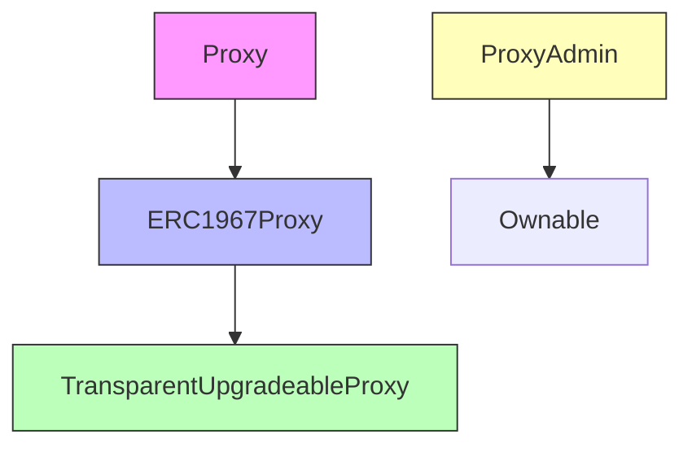
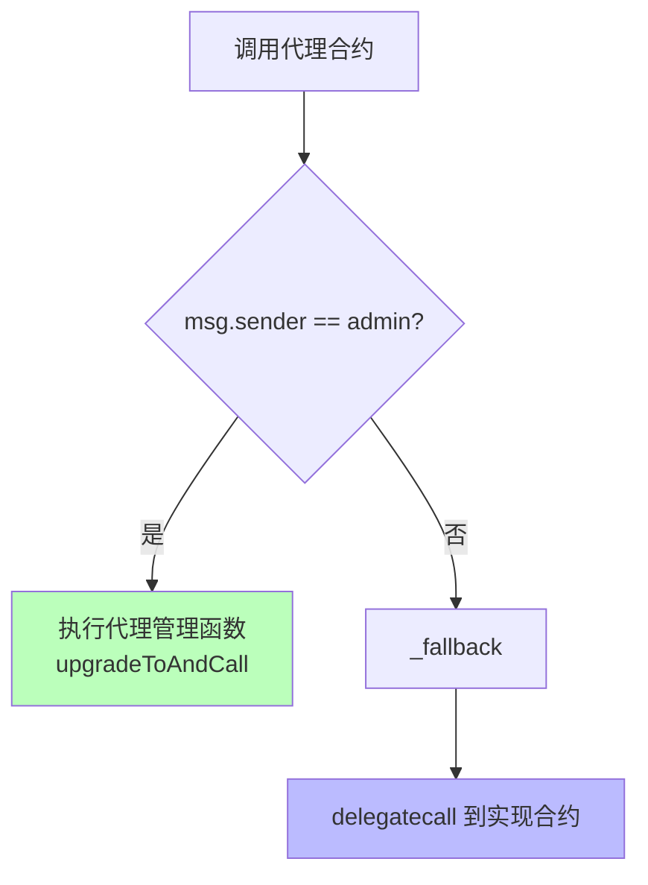
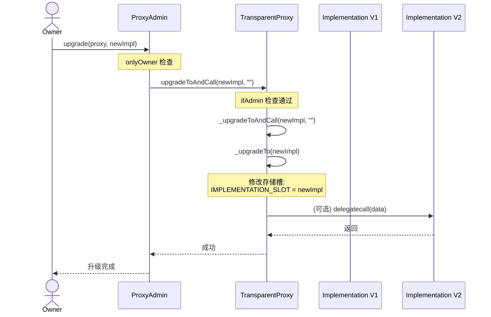

# Transparent Proxy 源码深度解析报告
**OpenZeppelin TransparentUpgradeableProxy 完整剖析**

---

## 📋 目录

1. [架构设计原理](#1-架构设计原理)
2. [核心合约继承关系](#2-核心合约继承关系)
3. [ERC1967 存储标准](#3-erc1967-存储标准)
4. [Proxy 合约源码解析](#4-proxy-合约源码解析)
5. [TransparentUpgradeableProxy 源码解析](#5-transparentupgradeableproxy-源码解析)
6. [ProxyAdmin 源码解析](#6-proxyadmin-源码解析)
7. [透明性机制实现](#7-透明性机制实现)
8. [升级流程完整追踪](#8-升级流程完整追踪)
9. [安全机制分析](#9-安全机制分析)
10. [常见攻击与防御](#10-常见攻击与防御)

---

## 1. 架构设计原理

### 1.1 核心思想

> **"透明性" = Admin 和 User 看到不同的接口**

```text
┌─────────────────────────────────────────┐
│         TransparentUpgradeableProxy     │
├─────────────────────────────────────────┤
│                                         │
│  if (msg.sender == admin) {             │
│      执行代理管理函数                    │
│  } else {                               │
│      delegatecall 到 implementation     │
│  }                                      │
│                                         │
└─────────────────────────────────────────┘
```

### 1.2 设计目标

- ✅ **防止函数选择器冲突**
- ✅ **隔离管理接口和业务接口**
- ✅ **确保升级安全性**

---

## 2. 核心合约继承关系



### 继承链

```text
Proxy (最底层 fallback)
  ↓
ERC1967Proxy (ERC1967 存储标准)
  ↓
TransparentUpgradeableProxy (透明性逻辑)

ProxyAdmin (独立合约，管理升级)
```

---

## 3. ERC1967 存储标准

### 3.1 为什么需要 ERC1967？

> **避免代理合约存储与实现合约冲突**

### 3.2 核心存储槽位

```solidity
/**
 * @dev Storage slot with the address of the current implementation.
 * This is the keccak-256 hash of "eip1967.proxy.implementation" subtracted by 1
 */
bytes32 internal constant _IMPLEMENTATION_SLOT = 
    0x360894a13ba1a3210667c828492db98dca3e2076cc3735a920a3ca505d382bbc;

/**
 * @dev Storage slot with the admin of the contract.
 * This is the keccak-256 hash of "eip1967.proxy.admin" subtracted by 1
 */
bytes32 internal constant _ADMIN_SLOT = 
    0xb53127684a568b3173ae13b9f8a6016e243e63b6e8ee1178d6a717850b5d6103;
```

### 3.3 槽位计算方法

```javascript
// JavaScript 计算示例
const { keccak256, toUtf8Bytes } = require('ethers');

const implSlot = BigInt(keccak256(toUtf8Bytes("eip1967.proxy.implementation"))) - 1n;
console.log("Implementation Slot:", "0x" + implSlot.toString(16));

const adminSlot = BigInt(keccak256(toUtf8Bytes("eip1967.proxy.admin"))) - 1n;
console.log("Admin Slot:", "0x" + adminSlot.toString(16));
```

### 3.4 存储布局图

```text
┌────────────────────────────────────────────┐
│         Proxy Storage Layout               │
├────────────────────────────────────────────┤
│ Slot 0-N         : 业务数据（delegatecall） │
│ ...                                        │
│ Slot 0x360894... : implementation address  │
│ Slot 0xb53127... : admin address           │
└────────────────────────────────────────────┘
```

---

## 4. Proxy 合约源码解析

### 4.1 完整源码（带注释）

```solidity
// SPDX-License-Identifier: MIT
pragma solidity ^0.8.20;

/**
 * @dev Proxy 是所有代理合约的基础
 * 核心功能：delegatecall 转发
 */
abstract contract Proxy {
    /**
     * @dev 将调用转发到 _implementation() 返回的地址
     * 
     * 这是一个 virtual 函数，应该由子类重写以返回后端地址
     */
    function _delegate(address implementation) internal virtual {
        assembly {
            // 1️⃣ 复制 calldata 到内存
            // calldatacopy(t, f, s): 从 calldata 位置 f 复制 s 字节到内存位置 t
            calldatacopy(0, 0, calldatasize())

            // 2️⃣ 执行 delegatecall
            // delegatecall(g, a, in, insize, out, outsize)
            // g: 剩余 gas
            // a: 目标地址
            // in: 输入数据内存位置
            // insize: 输入数据大小
            // out: 输出数据内存位置
            // outsize: 输出数据大小
            let result := delegatecall(gas(), implementation, 0, calldatasize(), 0, 0)

            // 3️⃣ 复制返回数据到内存
            // returndatacopy(t, f, s): 从 returndata 位置 f 复制 s 字节到内存位置 t
            returndatacopy(0, 0, returndatasize())

            // 4️⃣ 根据结果返回或 revert
            switch result
            case 0 {
                // delegatecall 失败
                revert(0, returndatasize())
            }
            default {
                // delegatecall 成功
                return(0, returndatasize())
            }
        }
    }

    /**
     * @dev 子类必须实现这个函数，返回当前实现合约地址
     */
    function _implementation() internal view virtual returns (address);

    /**
     * @dev 将当前调用委托给 _implementation() 返回的地址
     * 
     * 这个函数不会返回，它将把所有数据转发到实现合约
     */
    function _fallback() internal virtual {
        _delegate(_implementation());
    }

    /**
     * @dev fallback 函数，将调用委托给实现合约
     * 
     * 当调用的函数不存在时自动触发
     */
    fallback() external payable virtual {
        _fallback();
    }

    /**
     * @dev 允许合约接收 ETH
     */
    receive() external payable virtual {
        _fallback();
    }
}
```

### 4.2 关键点解析

#### delegatecall 的汇编实现

```solidity
assembly {
    // 步骤 1: 复制 calldata
    calldatacopy(0, 0, calldatasize())
    
    // 步骤 2: delegatecall
    let result := delegatecall(
        gas(),              // 转发所有剩余 gas
        implementation,     // 目标地址
        0,                  // 输入数据起始位置（内存）
        calldatasize(),     // 输入数据大小
        0,                  // 输出数据起始位置（内存）
        0                   // 输出数据大小（暂不知道）
    )
    
    // 步骤 3: 复制返回数据
    returndatacopy(0, 0, returndatasize())
    
    // 步骤 4: 返回或 revert
    switch result
    case 0 { revert(0, returndatasize()) }
    default { return(0, returndatasize()) }
}
```

#### 为什么用汇编？

- ✅ **效率**：避免 Solidity 函数调用开销
- ✅ **灵活性**：可以动态处理任意返回数据大小
- ✅ **透明性**：完全转发 gas 和 calldata

---

## 5. TransparentUpgradeableProxy 源码解析

### 5.1 完整源码（带详细注释）

```solidity
// SPDX-License-Identifier: MIT
pragma solidity ^0.8.20;

import "./ERC1967Proxy.sol";

/**
 * @dev TransparentUpgradeableProxy 实现"透明性"
 * 
 * 核心机制：
 * - Admin 调用时：执行代理管理函数
 * - 非 Admin 调用时：delegatecall 到实现合约
 * 
 * 这样可以防止函数选择器冲突
 */
contract TransparentUpgradeableProxy is ERC1967Proxy {
    /**
     * @dev 初始化代理
     * 
     * @param _logic 初始实现合约地址
     * @param initialOwner ProxyAdmin 的所有者
     * @param _data 初始化调用数据（通常是 initialize() 函数）
     */
    constructor(address _logic, address initialOwner, bytes memory _data) 
        payable 
        ERC1967Proxy(_logic, _data) 
    {
        // 部署一个新的 ProxyAdmin
        _proxyAdmin = new ProxyAdmin(initialOwner);
        
        // 设置 admin
        _changeAdmin(address(_proxyAdmin));
    }

    /**
     * @dev ProxyAdmin 合约实例
     * 存储在不可预测的存储槽位，避免冲突
     */
    ProxyAdmin private immutable _proxyAdmin;

    /**
     * @dev 返回当前 admin 地址
     * 
     * ⚠️ 这个函数只能被 admin 调用
     */
    function _proxyAdmin() external ifAdmin returns (address) {
        return _admin();
    }

    /**
     * @dev 升级实现合约并调用初始化函数
     * 
     * ⚠️ 只能由 admin 调用
     */
    function upgradeToAndCall(address newImplementation, bytes calldata data) 
        external 
        payable 
        ifAdmin 
    {
        _upgradeToAndCall(newImplementation, data);
    }

    /**
     * @dev 核心修饰符：实现"透明性"
     * 
     * 如果调用者是 admin，则不会 fallback 到实现合约
     */
    modifier ifAdmin() {
        if (msg.sender == _admin()) {
            _;
        } else {
            _fallback();
        }
    }

    /**
     * @dev 重写 _fallback，加入透明性检查
     */
    function _fallback() internal virtual override {
        // 如果是 admin 调用，但函数不存在，revert
        require(
            msg.sender != _admin(),
            "TransparentUpgradeableProxy: admin cannot fallback to proxy target"
        );
        
        super._fallback();
    }
}
```

### 5.2 透明性机制核心代码

```solidity
modifier ifAdmin() {
    if (msg.sender == _admin()) {
        _;  // 执行代理管理函数
    } else {
        _fallback();  // delegatecall 到实现合约
    }
}
```

#### 执行流程图



---

## 6. ProxyAdmin 源码解析

### 6.1 完整源码（带详细注释）

```solidity
// SPDX-License-Identifier: MIT
pragma solidity ^0.8.20;

import "@openzeppelin/contracts/access/Ownable.sol";

/**
 * @dev ProxyAdmin 是代理的管理合约
 * 
 * 设计目的：
 * 1. 集中管理多个代理的升级
 * 2. 提供权限控制（Ownable）
 * 3. 避免 admin 直接是 EOA（外部账户）
 */
contract ProxyAdmin is Ownable {
    /**
     * @dev 构造函数
     * @param initialOwner 初始所有者地址
     */
    constructor(address initialOwner) Ownable(initialOwner) {}

    /**
     * @dev 升级代理到新的实现合约
     * 
     * @param proxy 代理合约地址
     * @param implementation 新实现合约地址
     * 
     * ⚠️ 只能由 owner 调用
     */
    function upgrade(
        ITransparentUpgradeableProxy proxy,
        address implementation
    ) public virtual onlyOwner {
        proxy.upgradeToAndCall(implementation, "");
    }

    /**
     * @dev 升级并调用初始化函数
     * 
     * @param proxy 代理合约地址
     * @param implementation 新实现合约地址
     * @param data 调用数据（通常是 reinitialize 函数）
     */
    function upgradeAndCall(
        ITransparentUpgradeableProxy proxy,
        address implementation,
        bytes memory data
    ) public payable virtual onlyOwner {
        proxy.upgradeToAndCall{value: msg.value}(implementation, data);
    }

    /**
     * @dev 获取代理的实现合约地址
     */
    function getProxyImplementation(
        ITransparentUpgradeableProxy proxy
    ) public view virtual returns (address) {
        // 直接读取 ERC1967 标准存储槽
        (bool success, bytes memory returndata) = address(proxy).staticcall(
            hex"5c60da1b" // implementation() 的选择器
        );
        require(success);
        return abi.decode(returndata, (address));
    }

    /**
     * @dev 获取代理的 admin 地址
     */
    function getProxyAdmin(
        ITransparentUpgradeableProxy proxy
    ) public view virtual returns (address) {
        (bool success, bytes memory returndata) = address(proxy).staticcall(
            hex"f851a440" // admin() 的选择器
        );
        require(success);
        return abi.decode(returndata, (address));
    }

    /**
     * @dev 更改代理的 admin
     * 
     * ⚠️ 通常不建议使用，除非要转移管理权
     */
    function changeProxyAdmin(
        ITransparentUpgradeableProxy proxy,
        address newAdmin
    ) public virtual onlyOwner {
        proxy.changeAdmin(newAdmin);
    }
}
```

### 6.2 为什么需要 ProxyAdmin？

| 对比项 | 直接用 EOA 做 admin | 使用 ProxyAdmin |
|-------|-------------------|----------------|
| 安全性 | ❌ 私钥泄露风险大 | ✅ 合约控制 |
| 权限管理 | ❌ 单点故障 | ✅ 可用多签 |
| 批量操作 | ❌ 困难 | ✅ 方便 |
| 升级逻辑 | ❌ 需要手动调用 | ✅ 统一管理 |

---

## 7. 透明性机制实现

### 7.1 函数选择器冲突问题

#### 问题场景

```solidity
// 实现合约
contract Implementation {
    function upgradeTo(address newImpl) external {
        // 业务逻辑
    }
}

// 代理合约也有 upgradeTo
// 如果没有透明性机制，会产生冲突！
```

### 7.2 透明性解决方案

```solidity
// Admin 视角
admin.call(proxy, "upgradeTo(address)")
  → 执行代理的 upgradeTo
  
// User 视角  
user.call(proxy, "upgradeTo(address)")
  → delegatecall 到实现合约的 upgradeTo
```

### 7.3 实现细节

```solidity
modifier ifAdmin() {
    if (msg.sender == _admin()) {
        _;  // 执行代理函数
    } else {
        _fallback();  // 转发到实现合约
    }
}

function upgradeToAndCall(...) external payable ifAdmin {
    _upgradeToAndCall(...);
}
```

### 7.4 透明性测试用例

```solidity
// 测试代码
function testTransparency() public {
    // Admin 调用 - 执行代理升级
    vm.prank(admin);
    proxy.upgradeToAndCall(newImpl, "");
    
    // User 调用 - 如果实现合约有同名函数，执行实现合约的
    vm.prank(user);
    proxy.someFunction(); // delegatecall
}
```

---

## 8. 升级流程完整追踪

### 8.1 升级调用链



### 8.2 存储变化过程

#### 升级前

```text
Proxy Storage:
  Slot 0x360894... : 0xOldImpl
  Slot 0xb53127... : 0xProxyAdmin
  
  业务数据槽位:
  Slot 0 : count = 10
  Slot 1 : owner = 0xOwner
```

#### 升级后

```text
Proxy Storage:
  Slot 0x360894... : 0xNewImpl  ← 变化
  Slot 0xb53127... : 0xProxyAdmin
  
  业务数据槽位（保持不变）:
  Slot 0 : count = 10  ← 保留
  Slot 1 : owner = 0xOwner  ← 保留
```

### 8.3 升级核心函数

```solidity
function _upgradeTo(address newImplementation) internal {
    // 1. 设置新的实现合约地址
    _setImplementation(newImplementation);
    
    // 2. 触发升级事件
    emit Upgraded(newImplementation);
}

function _setImplementation(address newImplementation) private {
    require(
        newImplementation.code.length > 0,
        "ERC1967: new implementation is not a contract"
    );
    
    // 直接写入 ERC1967 标准槽位
    StorageSlot.getAddressSlot(_IMPLEMENTATION_SLOT).value = newImplementation;
}
```

---

## 9. 安全机制分析

### 9.1 存储槽位隔离

```solidity
// ✅ 使用 keccak256 哈希后的槽位，几乎不可能与业务数据冲突
bytes32 internal constant _IMPLEMENTATION_SLOT = 
    0x360894a13ba1a3210667c828492db98dca3e2076cc3735a920a3ca505d382bbc;
```

### 9.2 Admin 权限保护

```solidity
// ✅ 只有 admin 可以升级
modifier ifAdmin() {
    if (msg.sender == _admin()) {
        _;
    } else {
        _fallback();
    }
}
```

### 9.3 实现合约验证

```solidity
// ✅ 确保新实现是合约而不是 EOA
require(
    newImplementation.code.length > 0,
    "ERC1967: new implementation is not a contract"
);
```

### 9.4 初始化保护

```solidity
// 实现合约中
bool private initialized;

function initialize() external {
    require(!initialized, "Already initialized");
    initialized = true;
    // ...
}
```

---

## 10. 常见攻击与防御

### 10.1 选择器冲突攻击

#### 攻击场景

```solidity
// 恶意实现合约
contract MaliciousImpl {
    function upgradeTo(address evilImpl) external {
        // 尝试劫持升级
    }
}
```

#### 防御机制

✅ **透明性**：Admin 调用时不会 delegatecall

---

### 10.2 未初始化攻击

#### 攻击场景

```solidity
// 1. 部署代理，但不初始化
// 2. 攻击者抢先初始化
// 3. 攻击者成为 owner
```

#### 防御机制

```solidity
// ✅ 构造函数中自动初始化
constructor(address _logic, address admin, bytes memory _data) 
    payable 
    ERC1967Proxy(_logic, _data)  // 立即初始化
{
    // ...
}
```

---

### 10.3 存储冲突攻击

#### 攻击场景

```solidity
// V2 错误地改变存储布局
contract BadV2 {
    address public admin;  // 原来 slot 1
    uint256 public count;  // 原来 slot 0
}
```

#### 防御机制

```bash
# ✅ 使用 OpenZeppelin Upgrades 插件
npx hardhat verify-upgrade proxy V2

# 会检查:
# - 变量顺序
# - 类型不变
# - 只追加新变量
```

---

### 10.4 自毁攻击

#### 攻击场景

```solidity
contract SelfDestructImpl {
    function destroy() external {
        selfdestruct(payable(msg.sender));
    }
}
```

#### 防御机制

```solidity
// ✅ 严格的升级权限控制
function _authorizeUpgrade(address newImpl) internal view {
    require(msg.sender == owner, "Not authorized");
    
    // 可以添加额外检查
    require(!isBlacklisted(newImpl), "Blacklisted");
}
```

---

## 11. 完整示例：部署与升级

### 11.1 手动部署（不用插件）

```solidity
// 1. 部署实现合约
CounterV1 implV1 = new CounterV1();

// 2. 部署 ProxyAdmin
ProxyAdmin admin = new ProxyAdmin(msg.sender);

// 3. 编码初始化数据
bytes memory initData = abi.encodeWithSelector(
    CounterV1.initialize.selector,
    msg.sender
);

// 4. 部署代理
TransparentUpgradeableProxy proxy = new TransparentUpgradeableProxy(
    address(implV1),
    address(admin),
    initData
);

// 5. 创建代理接口
CounterV1 counter = CounterV1(address(proxy));

// 6. 调用业务函数
counter.increment();
```

### 11.2 升级

```solidity
// 1. 部署 V2
CounterV2 implV2 = new CounterV2();

// 2. 通过 ProxyAdmin 升级
admin.upgrade(
    ITransparentUpgradeableProxy(address(proxy)),
    address(implV2)
);

// 3. 使用 V2 功能
CounterV2 counterV2 = CounterV2(address(proxy));
counterV2.decrement(); // 新功能
```

---

## 12. 总结

### 核心要点

| 机制 | 作用 | 实现方式 |
|------|------|---------|
| ERC1967 | 存储隔离 | 特殊槽位 |
| 透明性 | 防止冲突 | ifAdmin 修饰符 |
| ProxyAdmin | 权限管理 | 独立合约 |
| delegatecall | 代码复用 | 汇编实现 |

---

### 优缺点

✅ **优点**
- 升级逻辑固定
- 实现合约简单
- 不易出错

❌ **缺点**
- 代理合约复杂
- Gas 成本略高
- 透明性机制增加复杂度

---

### 适用场景

- ✅ DeFi 核心合约
- ✅ 大资金合约
- ✅ 新手团队
- ✅ 需要最高安全级别

---

## 13. 深入学习资源

- 📖 [EIP-1967 标准](https://eips.ethereum.org/EIPS/eip-1967)
- 📖 [OpenZeppelin Proxy 文档](https://docs.openzeppelin.com/contracts/api/proxy)
- 📖 [代理模式安全分析](https://blog.openzeppelin.com/the-transparent-proxy-pattern)

---

