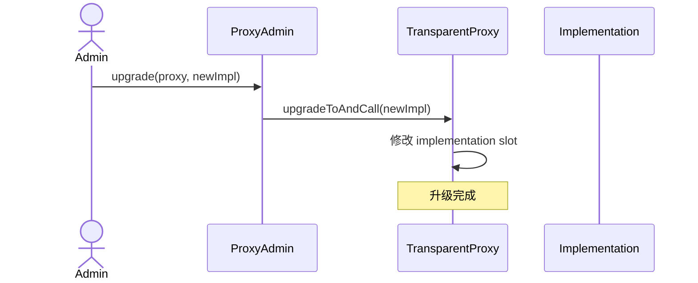
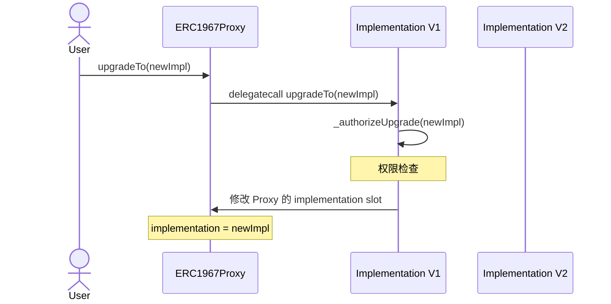
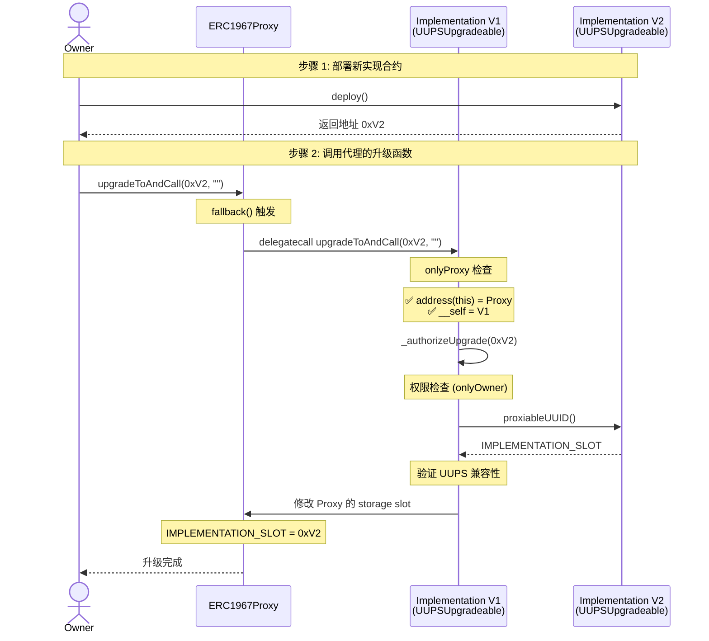
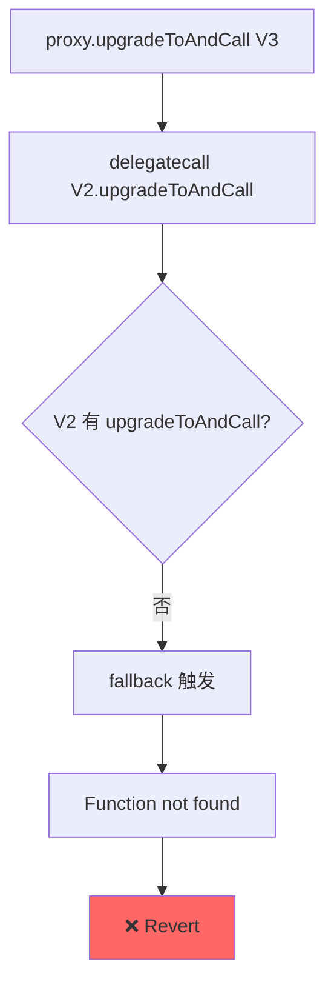

# UUPS (EIP-1822) 源码深度解析报告
**OpenZeppelin UUPSUpgradeable 完整剖析**

---

## 📋 目录

1. [UUPS 核心设计理念](#1-uups-核心设计理念)
2. [架构对比：UUPS vs Transparent](#2-架构对比uups-vs-transparent)
3. [ERC1967Proxy 源码解析](#3-erc1967proxy-源码解析)
4. [UUPSUpgradeable 源码解析](#4-uupsupgradeable-源码解析)
5. [升级流程完整追踪](#5-升级流程完整追踪)
6. [存储布局深度分析](#6-存储布局深度分析)
7. [初始化保护机制](#7-初始化保护机制)
8. [致命风险：升级能力锁死](#8-致命风险升级能力锁死)
9. [安全机制与最佳实践](#9-安全机制与最佳实践)
10. [真实攻击案例分析](#10-真实攻击案例分析)
11. [完整实现示例](#11-完整实现示例)

---

## 1. UUPS 核心设计理念

### 1.1 一句话理解

> **"升级逻辑在实现合约，代理只是一个极简转发器"**

```text
┌─────────────────────────────────────┐
│      ERC1967Proxy (极简)            │
│  - 只存储 implementation            │
│  - 只做 delegatecall 转发           │
│  - 没有任何升级逻辑                 │
└─────────────────────────────────────┘
              │ delegatecall
              ▼
┌─────────────────────────────────────┐
│    Implementation (UUPSUpgradeable) │
│  - 包含业务逻辑                     │
│  - 包含 upgradeTo() 函数            │
│  - 包含 _authorizeUpgrade() 权限    │
└─────────────────────────────────────┘
```

### 1.2 设计动机（为什么要 UUPS？）

| 问题 | Transparent Proxy | UUPS 解决方案 |
|-----|-------------------|---------------|
| 代理 Gas 成本 | 高（ifAdmin 检查） | 低（无检查） |
| 升级权限灵活性 | 低（固定 admin） | 高（自定义逻辑） |
| 代理复杂度 | 高 | 极简 |
| 实现合约复杂度 | 低 | 高 |

### 1.3 核心权衡

✅ **优势**
- 代理极简，Gas 更低
- 升级权限完全自定义（DAO、多签、时间锁）
- 每个代理独立部署成本低

❌ **风险**
- **一旦忘记升级逻辑，永久锁死**
- 实现合约必须非常小心
- 对开发者要求极高

---

## 2. 架构对比：UUPS vs Transparent

### 2.1 合约结构对比

#### Transparent Proxy

```text
TransparentUpgradeableProxy
├── ERC1967Proxy
│   └── Proxy
└── ProxyAdmin (独立合约)

实现合约：
└── MyContract (纯业务逻辑)
```

#### UUPS

```text
ERC1967Proxy
└── Proxy

实现合约：
└── MyContract
    ├── UUPSUpgradeable (升级逻辑)
    ├── Initializable
    └── 业务逻辑
```

### 2.2 升级调用路径对比

#### Transparent Proxy 升级



#### UUPS 升级



### 2.3 关键差异总结

| 特性 | Transparent Proxy | UUPS |
|------|-------------------|------|
| 升级函数位置 | 代理合约 | 实现合约 |
| 权限检查位置 | ProxyAdmin | 实现合约 |
| 代理复杂度 | 高 | 极低 |
| Gas 成本 | 高 | 低 |
| 出错后果 | 可恢复 | 可能永久锁死 |

---

## 3. ERC1967Proxy 源码解析

### 3.1 完整源码（带详细注释）

```solidity
// SPDX-License-Identifier: MIT
pragma solidity ^0.8.20;

import "./Proxy.sol";
import "./ERC1967Utils.sol";

/**
 * @dev ERC1967Proxy 是 UUPS 模式的代理合约
 * 
 * 特点：
 * - 极简设计，只做转发
 * - 使用 ERC1967 标准存储槽
 * - 没有任何升级逻辑
 */
contract ERC1967Proxy is Proxy {
    /**
     * @dev 构造函数
     * 
     * @param implementation 初始实现合约地址
     * @param _data 初始化调用数据（通常是 initialize() 编码）
     * 
     * 执行流程：
     * 1. 设置 implementation
     * 2. 如果 _data 非空，delegatecall 执行初始化
     */
    constructor(address implementation, bytes memory _data) payable {
        // 使用 ERC1967Utils 设置实现合约地址
        ERC1967Utils.upgradeToAndCall(implementation, _data);
    }

    /**
     * @dev 返回当前实现合约地址
     * 
     * 重写父类 Proxy 的虚函数
     */
    function _implementation() internal view virtual override returns (address) {
        return ERC1967Utils.getImplementation();
    }
}
```

### 3.2 ERC1967Utils 工具库

```solidity
/**
 * @dev ERC1967Utils 提供标准存储操作
 */
library ERC1967Utils {
    /**
     * @dev Implementation 存储槽位
     * keccak256("eip1967.proxy.implementation") - 1
     */
    bytes32 internal constant IMPLEMENTATION_SLOT =
        0x360894a13ba1a3210667c828492db98dca3e2076cc3735a920a3ca505d382bbc;

    /**
     * @dev 升级事件
     */
    event Upgraded(address indexed implementation);

    /**
     * @dev 获取当前实现合约地址
     */
    function getImplementation() internal view returns (address) {
        return StorageSlot.getAddressSlot(IMPLEMENTATION_SLOT).value;
    }

    /**
     * @dev 设置新的实现合约地址
     */
    function setImplementation(address newImplementation) private {
        require(
            newImplementation.code.length > 0,
            "ERC1967: new implementation is not a contract"
        );
        StorageSlot.getAddressSlot(IMPLEMENTATION_SLOT).value = newImplementation;
    }

    /**
     * @dev 升级并可选调用初始化函数
     * 
     * ⚠️ 这个函数会被 UUPSUpgradeable 通过 delegatecall 调用
     */
    function upgradeToAndCall(
        address newImplementation,
        bytes memory data
    ) internal {
        // 1. 设置新实现
        setImplementation(newImplementation);
        emit Upgraded(newImplementation);

        // 2. 如果有初始化数据，执行 delegatecall
        if (data.length > 0) {
            (bool success, ) = newImplementation.delegatecall(data);
            require(success, "ERC1967: delegatecall failed");
        }
    }
}
```

### 3.3 关键理解点

#### 为什么 ERC1967Proxy 如此简单？

```solidity
// 只有 20 行核心代码！
constructor(address implementation, bytes memory _data) payable {
    ERC1967Utils.upgradeToAndCall(implementation, _data);
}

function _implementation() internal view virtual override returns (address) {
    return ERC1967Utils.getImplementation();
}
```

✅ **原因**：所有升级逻辑都在实现合约的 `UUPSUpgradeable` 中

---

## 4. UUPSUpgradeable 源码解析

### 4.1 完整源码（OpenZeppelin 5.0）

```solidity
// SPDX-License-Identifier: MIT
pragma solidity ^0.8.20;

import "../interfaces/draft-IERC1822.sol";
import "./ERC1967Utils.sol";

/**
 * @dev UUPSUpgradeable 实现了 UUPS 升级模式
 * 
 * 核心思想：
 * - 升级函数在实现合约中
 * - 通过 delegatecall 修改代理的存储
 * - 必须实现 _authorizeUpgrade 进行权限控制
 */
abstract contract UUPSUpgradeable is IERC1822Proxiable {
    /**
     * @dev 代理合约的地址（用于检测）
     * 
     * 这个变量在实现合约中不会使用，
     * 但通过 delegatecall 执行时，会读取代理的 address(this)
     */
    address private immutable __self = address(this);

    /**
     * @dev 升级授权检查（抽象函数，必须实现）
     * 
     * 示例：
     * function _authorizeUpgrade(address) internal override onlyOwner {}
     */
    function _authorizeUpgrade(address newImplementation) internal virtual;

    /**
     * @dev 修饰符：确保只能通过代理调用
     * 
     * 实现合约不能直接调用升级函数
     */
    modifier onlyProxy() {
        _checkProxy();
        _;
    }

    /**
     * @dev 修饰符：确保不能通过代理调用
     * 
     * 某些函数只能在实现合约上直接调用
     */
    modifier notDelegated() {
        _checkNotDelegated();
        _;
    }

    /**
     * @dev 检查是否通过代理调用
     */
    function _checkProxy() internal view virtual {
        require(
            address(this) != __self,
            "UUPSUpgradeable: must not be called through delegatecall"
        );

        require(
            ERC1967Utils.getImplementation() == __self,
            "UUPSUpgradeable: must not be called through delegatecall"
        );
    }

    /**
     * @dev 检查不是通过 delegatecall
     */
    function _checkNotDelegated() internal view virtual {
        require(
            address(this) == __self,
            "UUPSUpgradeable: must not be called through delegatecall"
        );
    }

    /**
     * @dev 返回实现合约的 UUID（用于验证）
     * 
     * 实现 IERC1822Proxiable 接口
     */
    function proxiableUUID() external view virtual notDelegated returns (bytes32) {
        return ERC1967Utils.IMPLEMENTATION_SLOT;
    }

    /**
     * @dev 升级到新实现合约
     * 
     * ⚠️ 必须通过代理调用（delegatecall）
     */
    function upgradeToAndCall(address newImplementation, bytes memory data)
        public
        payable
        virtual
        onlyProxy
    {
        // 1. 权限检查（子类实现）
        _authorizeUpgrade(newImplementation);

        // 2. 验证新实现合约的兼容性
        _upgradeToAndCallUUPS(newImplementation, data);
    }

    /**
     * @dev 内部升级函数（包含兼容性检查）
     */
    function _upgradeToAndCallUUPS(
        address newImplementation,
        bytes memory data
    ) private {
        try IERC1822Proxiable(newImplementation).proxiableUUID() returns (
            bytes32 slot
        ) {
            // 检查新实现是否使用正确的存储槽
            require(
                slot == ERC1967Utils.IMPLEMENTATION_SLOT,
                "ERC1967Upgrade: unsupported proxiableUUID"
            );

            // 执行升级
            ERC1967Utils.upgradeToAndCall(newImplementation, data);
        } catch {
            revert("ERC1967Upgrade: new implementation is not UUPS");
        }
    }
}
```

### 4.2 核心机制详解

#### 4.2.1 `onlyProxy` 修饰符

```solidity
modifier onlyProxy() {
    // 检查 1: address(this) 必须不是实现合约地址
    require(address(this) != __self, "Must be called through proxy");
    
    // 检查 2: 当前 implementation 必须是实现合约地址
    require(
        ERC1967Utils.getImplementation() == __self,
        "Implementation mismatch"
    );
    _;
}
```

**执行场景分析：**

```text
场景 1: 通过代理调用
User → Proxy → delegatecall → Implementation.upgradeTo()
  - address(this) = Proxy 地址 ✅
  - __self = Implementation 地址 ✅
  - 检查通过 ✅

场景 2: 直接调用实现合约
User → Implementation.upgradeTo()
  - address(this) = Implementation 地址 ❌
  - __self = Implementation 地址 ❌
  - address(this) == __self → revert ✅
```

#### 4.2.2 `proxiableUUID()` 的作用

```solidity
function proxiableUUID() external view virtual notDelegated returns (bytes32) {
    return ERC1967Utils.IMPLEMENTATION_SLOT;
}
```

**用途：验证新实现合约是 UUPS 兼容的**

```solidity
// 升级时的检查
try IERC1822Proxiable(newImplementation).proxiableUUID() returns (bytes32 slot) {
    require(slot == IMPLEMENTATION_SLOT, "Not compatible");
} catch {
    revert("Not UUPS");
}
```

---

## 5. 升级流程完整追踪

### 5.1 升级调用链详解



### 5.2 关键代码执行路径

```solidity
// 用户调用
proxy.upgradeToAndCall(newImpl, "");

// ↓ Proxy fallback 触发

// ↓ delegatecall 到 V1

// ↓ V1.upgradeToAndCall 执行

function upgradeToAndCall(address newImpl, bytes memory data) 
    public payable virtual onlyProxy 
{
    // 步骤 1: 权限检查
    _authorizeUpgrade(newImpl); // 子类实现：require(msg.sender == owner)
    
    // 步骤 2: UUPS 兼容性检查
    bytes32 slot = IERC1822Proxiable(newImpl).proxiableUUID();
    require(slot == IMPLEMENTATION_SLOT, "Not UUPS");
    
    // 步骤 3: 修改 Proxy 的存储（重点！）
    StorageSlot.getAddressSlot(IMPLEMENTATION_SLOT).value = newImpl;
    
    // 步骤 4: 可选的初始化调用
    if (data.length > 0) {
        newImpl.delegatecall(data);
    }
}
```

### 5.3 存储修改的关键点

```text
执行上下文：
- msg.sender = Owner
- address(this) = Proxy 地址
- 代码来自 V1
- 存储在 Proxy

修改的是谁的存储？
StorageSlot.getAddressSlot(IMPLEMENTATION_SLOT).value = newImpl;
  ↓
修改的是 Proxy 的 storage slot
  ↓
因为 delegatecall 的特性！
```

---

## 6. 存储布局深度分析

### 6.1 UUPS 存储结构

```text
┌───────────────────────────────────────────────┐
│           Proxy Storage (实际数据)             │
├───────────────────────────────────────────────┤
│ Slot 0         : 业务变量（如 count）         │
│ Slot 1         : 业务变量（如 owner）         │
│ Slot 2         : 业务变量                     │
│ ...                                           │
│ Slot 0x360894...: implementation address      │
│                   (ERC1967 标准槽位)          │
└───────────────────────────────────────────────┘

┌───────────────────────────────────────────────┐
│      Implementation Storage (不使用)           │
├───────────────────────────────────────────────┤
│ immutable __self : 实现合约地址（字节码中）    │
│                                               │
│ 其他 storage 槽位永远不会被使用               │
└───────────────────────────────────────────────┘
```

### 6.2 delegatecall 执行时的存储访问

```solidity
// 实现合约代码
contract Implementation is UUPSUpgradeable {
    uint256 public count;
    
    function increment() external {
        count += 1;  // 访问哪个 storage？
    }
}

// 通过代理调用
proxy.increment();
  → delegatecall Implementation.increment()
  → count += 1
  → 修改的是 Proxy.storage[0]  ← 关键！
```

### 6.3 升级时的存储变化

#### 升级前

```text
Proxy Storage:
  Slot 0x360894... : 0xImplementation_V1
  Slot 0          : count = 10
  Slot 1          : owner = 0xOwner
```

#### 执行 upgradeToAndCall(V2, "")

```solidity
// 通过 delegatecall 执行 V1 的代码
StorageSlot.getAddressSlot(IMPLEMENTATION_SLOT).value = V2;
  ↓
修改 Proxy 的 Slot 0x360894...
```

#### 升级后

```text
Proxy Storage:
  Slot 0x360894... : 0xImplementation_V2  ← 变化
  Slot 0          : count = 10  ← 保持
  Slot 1          : owner = 0xOwner  ← 保持
```

---

## 7. 初始化保护机制

### 7.1 为什么需要 `_disableInitializers()`？

```text
问题：实现合约可以被独立初始化

部署流程：
1. 部署 Implementation → 地址 0xImpl
2. 部署 Proxy → 调用 initialize()

攻击场景：
攻击者直接调用 0xImpl.initialize()
  → 实现合约被初始化
  → 攻击者成为 owner
```

### 7.2 Initializable 合约源码

```solidity
abstract contract Initializable {
    /**
     * @dev 初始化状态
     * - 0: 未初始化
     * - 1: 已初始化
     * - 2+: 重新初始化版本号
     * - 255: 已禁用（构造函数设置）
     */
    uint8 private _initialized;
    
    bool private _initializing;

    /**
     * @dev 在构造函数中调用，防止初始化
     */
    function _disableInitializers() internal virtual {
        require(!_initializing, "Initializing");
        
        if (_initialized != type(uint8).max) {
            _initialized = type(uint8).max;
            emit Initialized(type(uint8).max);
        }
    }

    /**
     * @dev 初始化修饰符
     */
    modifier initializer() {
        bool isTopLevelCall = !_initializing;
        
        require(
            (isTopLevelCall && _initialized < 1) ||
            (!Address.isContract(address(this)) && _initialized == 1),
            "Already initialized"
        );
        
        _initialized = 1;
        if (isTopLevelCall) {
            _initializing = true;
        }
        
        _;
        
        if (isTopLevelCall) {
            _initializing = false;
            emit Initialized(1);
        }
    }
}
```

### 7.3 正确使用方式

```solidity
contract MyUUPS is UUPSUpgradeable, OwnableUpgradeable, Initializable {
    /// @custom:oz-upgrades-unsafe-allow constructor
    constructor() {
        _disableInitializers();  // ← 关键！
    }
    
    function initialize(address owner) public initializer {
        __Ownable_init(owner);
        __UUPSUpgradeable_init();
    }
    
    function _authorizeUpgrade(address) internal override onlyOwner {}
}
```

### 7.4 执行效果

```text
实现合约部署时：
constructor() 执行
  → _disableInitializers()
  → Implementation._initialized = 255
  → Implementation 永远不能被初始化

代理调用时：
proxy.initialize()
  → delegatecall Implementation.initialize()
  → 检查 Proxy._initialized (= 0)
  → 初始化成功
  → Proxy._initialized = 1
```

---

## 8. 致命风险：升级能力锁死

### 8.1 最危险的错误

```solidity
// ❌ V2 忘记继承 UUPSUpgradeable
contract MyContractV2 is MyContractV1 {
    // 忘记实现 _authorizeUpgrade
    
    function newFeature() external {
        // 新功能
    }
}

// 升级到 V2
proxy.upgradeToAndCall(address(v2), "");
  → 成功！✅

// 尝试再次升级到 V3
proxy.upgradeToAndCall(address(v3), "");
  → revert! ❌ "Function does not exist"
  → 合约永久锁死！🔒
```

### 8.2 为什么会锁死？



### 8.3 真实案例（教训）

```solidity
// 项目：某 DeFi 协议（已锁死 10M+ USD）

// V1: 正确实现
contract VaultV1 is UUPSUpgradeable {
    function _authorizeUpgrade(address) internal override onlyOwner {}
}

// V2: 灾难性错误
contract VaultV2 is VaultV1 {
    // ❌ 重写了 _authorizeUpgrade，但逻辑错误
    function _authorizeUpgrade(address) internal override {
        require(false, "Upgrade disabled");  // 永久禁用升级！
    }
}

// 结果：
// 1. 升级到 V2 成功
// 2. V2 有个严重 bug
// 3. 尝试升级到 V3 → 永久失败
// 4. 10M+ USD 锁在合约中
```

### 8.4 防御措施

```solidity
// ✅ 使用检查清单

contract SafeUUPSV2 is SafeUUPSV1 {
    // [ ] 1. 继承了 UUPSUpgradeable？
    // [ ] 2. 实现了 _authorizeUpgrade？
    // [ ] 3. 逻辑不会永久禁用升级？
    
    function _authorizeUpgrade(address newImpl) 
        internal 
        override 
        onlyOwner  // ✅ 确保有升级路径
    {
        // 可选：添加额外检查
        require(newImpl != address(0), "Invalid");
    }
}
```

---

## 9. 安全机制与最佳实践

### 9.1 OpenZeppelin Upgrades 插件检查

```bash
# Hardhat
npx hardhat verify-upgrade <PROXY> ContractV2

# 检查项：
# ✅ 存储布局兼容
# ✅ 包含 upgradeToAndCall
# ✅ 实现了 _authorizeUpgrade
# ✅ 构造函数调用了 _disableInitializers
```

### 9.2 完整的安全清单

```solidity
/**
 * ✅ UUPS 实现合约安全清单
 * 
 * [ ] 1. 继承 UUPSUpgradeable
 * [ ] 2. 继承 Initializable
 * [ ] 3. 构造函数调用 _disableInitializers()
 * [ ] 4. 有 initialize() 函数并使用 initializer 修饰符
 * [ ] 5. 实现了 _authorizeUpgrade()
 * [ ] 6. _authorizeUpgrade 逻辑不会永久禁用升级
 * [ ] 7. 变量只追加不修改
 * [ ] 8. 预留 __gap 存储空间（如果是库）
 * [ ] 9. 使用 OpenZeppelin 插件验证
 * [ ] 10. 写完整的升级测试
 */
```

### 9.3 测试模板

```solidity
// SPDX-License-Identifier: MIT
pragma solidity ^0.8.20;

import "forge-std/Test.sol";

contract UUPSUpgradeTest is Test {
    MyUUPS_V1 public implV1;
    MyUUPS_V2 public implV2;
    ERC1967Proxy public proxy;
    MyUUPS_V1 public proxied;
    
    address owner = address(1);
    address attacker = address(2);
    
    function setUp() public {
        // 1. 部署 V1
        implV1 = new MyUUPS_V1();
        
        // 2. 部署代理
        proxy = new ERC1967Proxy(
            address(implV1),
            abi.encodeCall(MyUUPS_V1.initialize, (owner))
        );
        
        proxied = MyUUPS_V1(address(proxy));
    }
    
    function testCannotInitializeImplementation() public {
        // ✅ 实现合约不能被初始化
        vm.expectRevert();
        implV1.initialize(attacker);
    }
    
    function testUpgrade() public {
        // ✅ 升级测试
        implV2 = new MyUUPS_V2();
        
        vm.prank(owner);
        proxied.upgradeToAndCall(address(implV2), "");
        
        // 验证升级成功
        assertEq(
            ERC1967Utils.getImplementation(address(proxy)),
            address(implV2)
        );
        
        // 验证数据保留
        assertEq(proxied.owner(), owner);
    }
    
    function testCannotUpgradeUnauthorized() public {
        // ✅ 非授权用户不能升级
        implV2 = new MyUUPS_V2();
        
        vm.prank(attacker);
        vm.expectRevert();
        proxied.upgradeToAndCall(address(implV2), "");
    }
    
    function testCanUpgradeMultipleTimes() public {
        // ✅ 确保不会锁死
        MyUUPS_V2 v2 = new MyUUPS_V2();
        MyUUPS_V3 v3 = new MyUUPS_V3();
        
        vm.startPrank(owner);
        proxied.upgradeToAndCall(address(v2), "");
        
        MyUUPS_V2(address(proxy)).upgradeToAndCall(address(v3), "");
        vm.stopPrank();
        
        // 验证最终版本
        assertEq(
            ERC1967Utils.getImplementation(address(proxy)),
            address(v3)
        );
    }
}
```

---

## 10. 真实攻击案例分析

### 10.1 案例 1：Audius 合约升级漏洞（2022）

#### 攻击场景

```solidity
// Audius 的实现合约
contract AudiusV1 is UUPSUpgradeable {
    function initialize() external initializer {
        // ...
    }
    
    function _authorizeUpgrade(address) internal override {
        require(msg.sender == governance, "Not authorized");
    }
}

// 问题：governance 是可变的
function setGovernance(address newGov) external {
    require(msg.sender == governance, "Not authorized");
    governance = newGov;
}
```

#### 攻击步骤

```text
1. 攻击者发现 governance 可以被修改
2. 通过某个漏洞成为 governance
3. 调用 upgradeToAndCall(maliciousImpl)
4. 部署恶意实现合约
5. 窃取资金
```

#### 修复方案

```solidity
// ✅ 使用不可变的治理地址
address public immutable GOVERNANCE;

constructor(address _governance) {
    GOVERNANCE = _governance;
    _disableInitializers();
}

function _authorizeUpgrade(address) internal override {
    require(msg.sender == GOVERNANCE, "Not authorized");
}
```

### 10.2 案例 2：实现合约初始化攻击

```solidity
// 脆弱的实现
contract VulnerableUUPS is UUPSUpgradeable {
    address public owner;
    
    // ❌ 没有禁用实现合约的初始化
    // constructor() { }
    
    function initialize(address _owner) external initializer {
        owner = _owner;
    }
    
    function _authorizeUpgrade(address) internal override {
        require(msg.sender == owner, "Not owner");
    }
}

// 攻击步骤：
// 1. 合约部署后，实现合约地址是 0xImpl
// 2. 代理已经初始化，owner = 0xLegitOwner
// 3. 攻击者直接调用 0xImpl.initialize(attacker)
// 4. 实现合约的 owner = attacker
// 5. 虽然代理不受影响，但某些边缘情况可能被利用
```

---

## 11. 完整实现示例

### 11.1 生产级 UUPS 合约模板

```solidity
// SPDX-License-Identifier: MIT
pragma solidity ^0.8.20;

import "@openzeppelin/contracts-upgradeable/proxy/utils/Initializable.sol";
import "@openzeppelin/contracts-upgradeable/proxy/utils/UUPSUpgradeable.sol";
import "@openzeppelin/contracts-upgradeable/access/OwnableUpgradeable.sol";
import "@openzeppelin/contracts-upgradeable/security/PausableUpgradeable.sol";
import "@openzeppelin/contracts-upgradeable/security/ReentrancyGuardUpgradeable.sol";

/**
 * @title ProductionUUPS
 * @notice 生产级 UUPS 实现模板
 */
contract ProductionUUPS is
    Initializable,
    UUPSUpgradeable,
    OwnableUpgradeable,
    PausableUpgradeable,
    ReentrancyGuardUpgradeable
{
    /*//////////////////////////////////////////////////////////////
                                STORAGE
    //////////////////////////////////////////////////////////////*/
    
    uint256 public value;
    mapping(address => uint256) public balances;
    
    // 预留存储空间（用于未来升级）
    uint256[48] private __gap;

    /*//////////////////////////////////////////////////////////////
                               EVENTS
    //////////////////////////////////////////////////////////////*/
    
    event ValueUpdated(uint256 oldValue, uint256 newValue);

    /*//////////////////////////////////////////////////////////////
                              CONSTRUCTOR
    //////////////////////////////////////////////////////////////*/
    
    /// @custom:oz-upgrades-unsafe-allow constructor
    constructor() {
        _disableInitializers();
    }

    /*//////////////////////////////////////////////////////////////
                              INITIALIZER
    //////////////////////////////////////////////////////////////*/
    
    function initialize(address initialOwner) public initializer {
        __Ownable_init(initialOwner);
        __UUPSUpgradeable_init();
        __Pausable_init();
        __ReentrancyGuard_init();
        
        value = 0;
    }

    /*//////////////////////////////////////////////////////////////
                            BUSINESS LOGIC
    //////////////////////////////////////////////////////////////*/
    
    function setValue(uint256 newValue) external onlyOwner whenNotPaused {
        uint256 oldValue = value;
        value = newValue;
        emit ValueUpdated(oldValue, newValue);
    }
    
    function deposit() external payable whenNotPaused nonReentrant {
        balances[msg.sender] += msg.value;
    }
    
    function withdraw(uint256 amount) external whenNotPaused nonReentrant {
        require(balances[msg.sender] >= amount, "Insufficient balance");
        balances[msg.sender] -= amount;
        payable(msg.sender).transfer(amount);
    }

    /*//////////////////////////////////////////////////////////////
                          EMERGENCY CONTROLS
    //////////////////////////////////////////////////////////////*/
    
    function pause() external onlyOwner {
        _pause();
    }
    
    function unpause() external onlyOwner {
        _unpause();
    }

    /*//////////////////////////////////////////////////////////////
                         UPGRADE AUTHORIZATION
    //////////////////////////////////////////////////////////////*/
    
    /**
     * @dev 升级授权逻辑
     * 
     * ⚠️ 这个函数决定了谁可以升级合约
     * 
     * 可以实现：
     * - 单一 owner
     * - 多签
     * - DAO 投票
     * - 时间锁
     */
    function _authorizeUpgrade(address newImplementation)
        internal
        override
        onlyOwner
    {
        // 可以添加额外的验证逻辑
        require(newImplementation != address(0), "Invalid implementation");
        
        // 示例：检查新实现是否在白名单
        // require(approvedImplementations[newImplementation], "Not approved");
    }

    /*//////////////////////////////////////////////////////////////
                              UTILITIES
    //////////////////////////////////////////////////////////////*/
    
    /**
     * @dev 返回合约版本
     */
    function version() external pure virtual returns (string memory) {
        return "1.0.0";
    }
}
```

### 11.2 V2 升级示例

```solidity
contract ProductionUUPS_V2 is ProductionUUPS {
    /*//////////////////////////////////////////////////////////////
                        新增存储（只能追加）
    //////////////////////////////////////////////////////////////*/
    
    uint256 public totalDeposits;
    
    // 更新预留空间
    uint256[47] private __gap;  // 48 - 1 = 47

    /*//////////////////////////////////////////////////////////////
                          重写/新增功能
    //////////////////////////////////////////////////////////////*/
    
    function deposit() external payable override whenNotPaused nonReentrant {
        balances[msg.sender] += msg.value;
        totalDeposits += msg.value;  // 新功能
    }
    
    function getTotalDeposits() external view returns (uint256) {
        return totalDeposits;
    }
    
    function version() external pure override returns (string memory) {
        return "2.0.0";
    }

    /*//////////////////////////////////////////////////////////////
                     升级授权（必须保留！）
    //////////////////////////////////////////////////////////////*/
    
    function _authorizeUpgrade(address newImplementation)
        internal
        override
        onlyOwner
    {
        require(newImplementation != address(0), "Invalid implementation");
    }
}
```

---

## 12. UUPS vs Transparent 最终对比

| 维度 | Transparent Proxy | UUPS |
|------|-------------------|------|
| **代理复杂度** | 高（透明性逻辑） | 极低（仅转发） |
| **实现合约复杂度** | 低 | 高（包含升级逻辑） |
| **Gas 成本（调用）** | 高（ifAdmin 检查） | 低 |
| **Gas 成本（部署）** | 高 | 低 |
| **升级权限** | 固定（ProxyAdmin） | 灵活（自定义） |
| **出错后果** | 可恢复 | 可能永久锁死 |
| **适用场景** | 高价值、低风险容忍 | Gas 敏感、高级团队 |
| **新手友好** | ⭐⭐⭐⭐⭐ | ⭐⭐ |
| **推荐度（DeFi）** | ⭐⭐⭐⭐⭐ | ⭐⭐⭐ |
| **推荐度（NFT）** | ⭐⭐⭐ | ⭐⭐⭐⭐ |

---

## 13. 总结与建议

### ✅ 何时使用 UUPS

- Gas 成本是关键因素
- 需要灵活的升级权限（DAO、多签）
- 团队经验丰富
- 有完善的测试和审计流程

### ❌ 何时避免 UUPS

- 高价值资产合约（>$10M）
- 团队经验不足
- 没有完整的测试覆盖
- 无法承受"锁死"风险

### 🔑 关键要点

1. **UUPS 的核心**：升级逻辑在实现合约
2. **最大风险**：忘记升级逻辑 → 永久锁死
3. **必须做的事**：
   - 构造函数调用 `_disableInitializers()`
   - 每个版本实现 `_authorizeUpgrade()`
   - 使用 OpenZeppelin 插件验证
   - 写完整的升级测试

---

